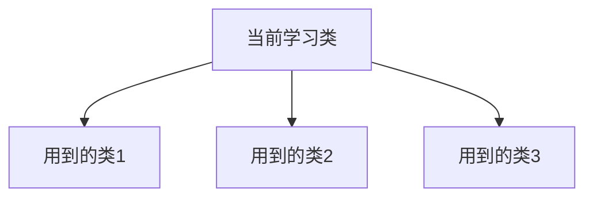

# MyBatis 学习总结

使用MyBatis的时间已经比较长了，最开始是照着范例写，然后测试。在需要各种功能的时候，本着这是一个成熟的框架，常用的功能都具备的思路，遇到想要的功能就去搜索怎么写。MyBatis果然不负期望，想要的各种功能都有。

MyBatis虽然号称轻量级的框架，但是想着手学习其源码，依然不是一件容易的事情，最初我选择了两个入手方向

- 从配置文件入手

配置文件是任何框架展示其功能的窗口，每个可配置的内容，都对应着相关的功能。还有Mapper中SQL的写法和对应的一些标签也都需要相应的实现。

- 从Spring中 MyBatis的注入过程

大体的思路和配置文件入手类似，在整个过程中，需要配置的各项东西也都是支撑MyBatis工作的关键

## 学习过程

在这一次源码阅读工作之前，我已经学习过一些入门知识，例如setting / mapper 的用法，还搜索了一些讲解文章，有一些印象是关于SqlSession的获取，各个类的生命周期等等内容。这些文章在我完成第一轮源码阅读之后就被视为无用而删除掉了。

这也让我反思一些事情，就如同我在之前写过的一样，如果你学习后记录下来的内容可以看为“新手入门攻略”，那么实际上学习的效果并不好，这次的源码阅读学习之后，我不由的想给“新手入门攻略”一个更高的门槛。即使是在网上看到的如：MyBatis架构分析，SqlSession原理之类的这些文章，也只不过是新手攻略中总结的比较好的，不过是从教你怎么用，变成了告诉你是什么。

而最重要的一点是：学会设计类似的架构，学会怎么写！

MyBatis源码中用了很多非常流行的被称为“设计模式”的内容。工厂模式，代理模式等等非常著名的编程方法。

**最初开始看源码的时候一定是非常痛苦的**，当你不了解作者的设计思路，不了解所用的技术，不了解执行过程，只能通过集成工具提供的定位功能在几十个甚至几百个类文件中跳来跳去的时候，一定很快就迷失在源码中。对于这种情况，我总结了下面三点内容，可以对于阅读源码有点帮助

- 搜索相关的架构图：即使我之前把架构图之类的内容成为新手攻略的一种，但是它仍然是帮助你阅读源码的有效工具
- 下载源码，查看package和类的组织结构与关系等：集成开发环境可以生成类图，但是我还是认为类图没有作者组织的包/类结构来的直接，他能帮助你快速对整个项目有初步的了解
- 查看类内部的成员（而不是方法）：所有的方法或者说所有的功能都依托于这个类所拥有的成员，当前类，要么服务于其成员（例如Builder），要么用于外界操作其成员（例如Wrapper）

我也如同预期的一样，在最初的时候挣扎在一个个类文件之中，知道我想起了我可以用一些方法把我的学习记录组织起来

> 目录 + mermaid图 

这是我在看了大概三分之一内容的时候最终确定的一个方法。所谓目录，一定是对代码有了一定了解之后，知道了哪些类组合在一起实现哪一部分功能。而大的功能又是如何配合完成一项工作（直至完成完整的工作体系）

mermaid图的用处在我的学习过程中不是总结而是记录：当我开始学习某个类，这个类引入了三个类，我不得不一个一个的类进行学习，不然总有一些地方理解困难。那么就会有这样的一个图

把这张图画好，然后进入类1 的学习，这样就不会陷入“我是谁，我在那里，我在干什么”这种尴尬的境地。

以上总结如此，最后强调：即使学习了，弄懂了，如果没有使用这些经验让自己的代码更加优秀，那么最终由很大的可能还是会忘记。

我已经参照MyBatis的结构体系，正在开发一个 参数预处理框架。开发完成之后再会过来翻看MyBatis的学习记录，相信会有更多的收获。·