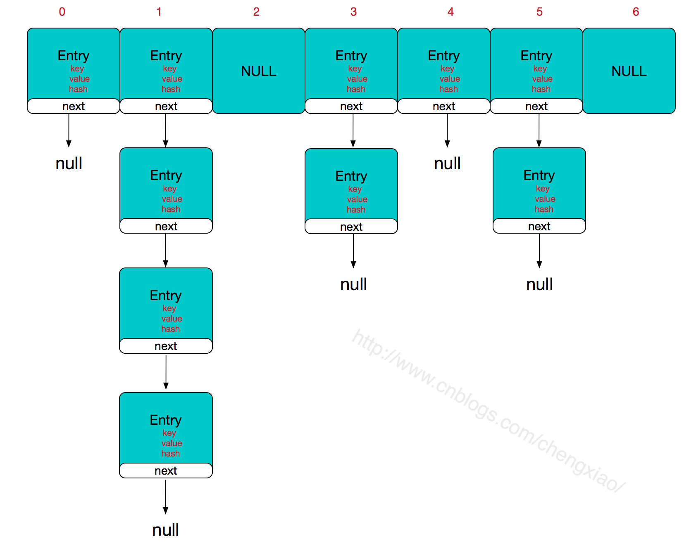

# 底层数据结构

学习java Collection的时候，一开始有一个误区。里面的 set list map 之类的就是数据结构，但是当我想要深入思考这些东西的时候，发现这些并不是数据结构，而是数据结构与实用方法的组合体。

那么，最底层的数据结构是什么呢

- 数组：使用连续内存存储数据
  - 制定下标查询 时间复杂度 O-1
  - 给定值查找，时间复杂度 O-n
- 线性链表
  - 指定节点 O-1
  - 定值查找 O-n
- 二叉树
  - 二叉树结构没有下标， 查询复杂度 O log n
- 哈希表
  - 不考虑冲突的情况 O-1

## 首先有这个限制

物理结构中只有两种存储结构：（内存是否连续）
- 顺序存储结构
- 链式存储结构

## 特别要说的哈希表

> 为什么Hash表如此高效

- ！Hash表的主干是数组 -》 一次定位就可以完成操作
- 哈希函数： 把元素的关键字 映射到数组的某个位置
- 从 HashMap开始分析
  - HashMap 的主干数组是一个 Entry数组。主干数组的长度一定是2的次幂
    - Entry是 HashMap 里的一个 静态内部类
      - Entry 主要有四个成员
        - key
        - value
        - next 指向下一个Entry
        - hash 一个hash值

- 内存中 HashMap 的结构

- 所谓： 数组 + 链表
  - 数组是主体
  - 链表是为了解决hash冲突（定位到非链表的位置，就可以省去一步二次查询）
- 那么，怎么使用 hash 函数，让数据存入这个 数组+链表的结构的呢
  - 首先我们可以拿到 K-V值
  - 取到K值，计算 hash(Object K) 得到要给 hash值
  - 使用 indexFor(int hash, int length) 得到实际的存储位置
    - h&(length - 1) 假如容量length 16， 我们得到的hash 就是与 1111做与运算，最终的到的结果，一定是在 0~1111之间，也就是 0~15，这个就是对应的下标 index
  - 把这个新的Entry放入 index位置
    - 此时需要先做一下扩容判断： 此时是否发生hash冲突（当前index已经有元素了），并且size超过临界值
    - 满足扩容，就做一个双倍的数组，把现在的元素放进去（重新计算元素应该放的位置，放到正确的位置里面）