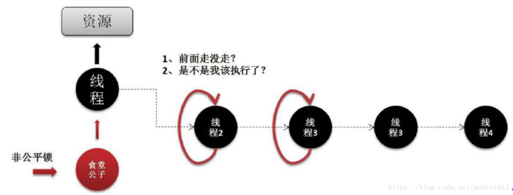

# 线程同步锁

参考：https://blog.csdn.net/androidsj/article/details/80239640 

> JUC锁机制

- 核心接口: Lock,ReadWriteLock;
- AQS抽象类（同步器）
  - AbstractOwnableSynchronizer
    - 可由线程专有的同步器
  - AbstractQueuedLongSychronizer
    - 64位清空的AbstractQueueSynchronizer
  - AbstractQueueSynchronizer
    - 提供一个框架，用于实现依赖于先进先出（FIFO）等待队列的阻塞锁和相关同步器（信号量，事件等）
- 工具类/接口
  - Lock 锁接口
    - 实现类：ReentrantLock 互斥锁  
  - LockSupprot 类，阻塞原语
    - 为创建锁和其他同步类的基本的线程阻塞机制
  - ReadWriteLock 读写锁接口
    - 实现类 ReentrantReadWriteLock
  - StampedLock 🔺
  - Condition 队列控制
  - Semaphore 信号量
  - CountDownLatch闭锁
  - CyclicBarrier栅栏
  - Exchanger交换机
  - CompletableFuture线程回调
  - 🔺 等等

## java.util.concurrent锁概览

- java.util.concurrent.lock提供锁的基础支持
- Lock接口：支持于一不同（冲入，公平）的锁规则
  - 所谓语义不同，是指锁可是有”公平机制的锁”、”非公平机制的锁”、”可重入的锁”等等；
    - “公平机制” :指 “不同线程获取锁的机制是公平的” ;
    -  “非公平机制” : 指 “不同线程获取锁的机制是非公平的” ;
    - “可重入的锁” : 指 同一个锁能够被一个线程多次获取，可重入锁最大的作用是避免死锁。
- ReadWriteLock接口和Lock类似的方式定义了
  - ⭐⭐ 读取者可以共享，而写入独占的锁
- Condition接口： 接口描述了可能会与锁有关联的条件变量（Object类中的wait()方法使用类似）

### 公平锁的核心概念
- public abstract class AbstractQueuedSynchronizer extends AbstractOwnableSynchronizer implements java.io.Serializable
  - 这两个主要abstract类由继承关系
  - AbstractownableSynchronizer 只是简单规定了与Thread的绑定关系
- AbstractQueuedSynchronizer：是java中管理“ 锁”的抽象类，锁的许多公共方法都是在这个类中实现。AbstractQueuedSynchronizer是独占锁（例如，ReentrantLock）
- AbstractQueuedSynchronizer类别：
  - 独占锁：锁在一个时间点只能被一个线程锁占有，根据锁的获取机制，它又划分为“公平锁”和“非公平锁”。
    - 公平锁，是按照通过CLH等待线程按照先来先得的规则，公平的获取锁
    - 非公平锁，则当线程要获取锁时，它会无视CLH等待队列而直接获取锁。
  - 共享锁：能被多个线程同时拥有，能被共享的锁；
- CLH队列（Craig,Landin,and Hagersten locks）：
  - CLH锁也是一种基于链表的可扩展、高性能、公平的自旋锁，申请线程只在本地变量上自旋，它不断轮训前驱的状态，如果发现前驱释放了锁就结束子旋。
- CAS方法（Compare And Swap）：比较并交换方法，它是原子操作方法；即，通过CAS操作的数据都是以原子方式进行的。

> CLH锁 解决死锁问题



> AbstractQueuedSynchronizer 分析

- 源码中的注释总结：
  - AbstractQueuedSynchronizer为 blocking locks 还有类似的 synchronizers提供了基础框架，实现FIFO等待队列。
  - 这个类为同类型的synchronizer提供了基础功能：用一个 atomic int value 来代表state，子类必须定义protected method来改变状态，并且定义那种状态代表acquired / released
  - 鉴于上面的内容，类中其他方法提供了完整的 队列与阻塞 机制。
  - 子类可以维护其他状态字段，但是仅有方法 getState / setState / compareAndSetState操作 跟踪同步
  - Subclasses 

[AbstractQueuedSynchronizer详解⭐⭐很重要](./11-Lock解析与AbstractQueuedSynchronizer使用.md)

### 【 独占锁：ReentrantLock 】
- ReentrantLock是一个可重入的互斥锁，又被称为”独占锁”。
- ReentrantLock锁在同一个时间点只能被一个线程锁持有；而可重入的意思是，  ReentrantLock锁，可以被单个线程多次获取。
- ReentrantLock分为”公平锁”和“非公平锁”。它们的区别体现在获取锁的机制上是否公平以及执行速度上。
- ReentrantLock是通过一个FIFO的等待队列来管理获取该锁所有线程的。   

ReentrantLock是一个独占锁，在获取锁的之后其所有的操作是线程独享的，其它的线程在没有获取到锁之前都需要进行等待。
```java
public class ReentrantLockclass Objectimplements Lock, Serializable   
```
ReentrantLock之中分为公平锁与非公平锁，而这两种锁的启用也是非常容易控制的，因为在这个类上提供的构造方法：    
- 无参构造（非公平锁, NonfairSync）：public ReentrantLock();    
- 有参构造：public ReentrantLock(Boolean fair); 
  - fair = true; 表示公平锁, FairSync ; 
  - fair = false; 表示非公平锁,NonfairSync ; 

范例：定义个多线程卖票的处理程序
```java

import java.util.concurrent.locks.Lock;
import java.util.concurrent.locks.ReentrantLock;
public class MLDNTestDemo {
    public static void main(String[] args) throws Exception {
        Ticket ticket = new Ticket() ; // 多个线程要共享同一个数据资源
        for (int x = 0 ; x < 6 ; x ++) {
            new Thread(() -> {
                while (true) {
                    ticket.sale();     // 卖票处理
                }
            }).start();
        }
    }
}
class Ticket {
    private Lock myLock = new ReentrantLock();
    private int count = 100; // 一共10张票
    public void sale() { // 进行卖票处理
        myLock.lock(); // 进入到阻塞状态，一直到unlock执行后解除阻塞
        try {
            if (this.count > 0) {
                System.out.println(
                        Thread.currentThread().getName()
                        + "卖票，ticket = " + this.count --);
            }
        } finally {
            myLock.unlock();   // 不管最终如何结果一定要进行解锁
        }
    }
}
```
当前的代码要比直接使用synchronized更加容易，而且锁的处理机制更加直观，通过源代码可发现，使用lock()进行锁定的时候会考虑两种情况：


在进行公平锁处理的时候每当锁定一个线程对象就会使用”acquire(1)”方法进行表示，在进行解锁的时候会使用一个”sync.release(1)”释放方法，1表示释放一个。

## 【 读写锁：ReadWriteLock 】

所谓的读写锁指的是有两把锁，在进行数据写入的时候有一把”写锁”，而在进行数据读取的时候有一把”读锁”，很明显写锁一定会实现线程安全同步处理操作，而读锁可以被多个对象读取获得。

- 分为读锁和写锁，多个读锁不互斥（共享锁），读锁与写锁互斥，这是由jvm自己控制的，开发者只要上好相应的锁即可；
- ReentrantReadWriteLock会使用两把锁来解决问题，一个读锁（多个线程可以同时读），一个写锁（单个线程写）。
- ReadLock可以被多个线程持有并且在作用时排斥任何的WriteLock，而WriteLock则是完全的互斥，这一特性最为重要，因为对 于高读取频率而相对较低写入的数据结构，使用此类锁同步机制则可以提高并发量；

下面编写一个银行存款程序，现在有10个人向你的银行账户存款，存放的一定要采用独占锁(写锁),而在读取的时候所有的线程都可以读取，应该使用共享锁(读锁)。

在ReadWriteLock接口里面可以发现有如下两个方法可以获得锁：
  - 获得写锁：public Lock writeLock();
  - 获得读锁：public Lock readLock();
  
范例：实现读写锁的处理操作
```java

import java.util.concurrent.TimeUnit;

import java.util.concurrent.locks.ReadWriteLock;

import java.util.concurrent.locks.ReentrantReadWriteLock;

 

public class MLDNTestDemo {
    public static void main(String[] args) throws Exception {
        Account account = new Account("小林子", 15.0);
        double money[] = new double[] { 5.0, 300.0, 5000.0, 50000.0, 1000.0 };
        for (int x = 0; x < 2; x++) { // 设置两个写线程
            new Thread(() -> {
                for (int y = 0; y < money.length; y++) {
                    account.saveMoney(money[y]);
                }
            }, "存款用户-" + x).start();
        }
        for (int x = 0; x < 10; x++) {
            new Thread(() -> {
                System.out.println(Thread.currentThread().getName()
                        + "、查账，账户名：" + account.getName() + "、资产总额："
                        + account.loadMoney());
            },"收款人-" + x).start();
        }
    }
}
class Account {
    private String name; // 开户名
    private double asset = 10.0; // 银行资产
    // 读写分离
    private ReadWriteLock rwLock = new ReentrantReadWriteLock();
    public Account(String name, double asset) {
        this.name = name;
        this.asset = asset;
    }
    // 进行存款处理
    public boolean saveMoney(double money) {
        this.rwLock.writeLock().lock(); // 对写入数据进行锁定处理
        try {
            System.out.println("【（"
                    + Thread.currentThread().getName()
                    + "）存款-BEFORE】存款金额：" + money);
            TimeUnit.SECONDS.sleep(1);
            if (money > 0.0) { // 如果要存款肯定是要有钱
                this.asset += money;
                return true; // 存款成功
            }
        } catch (Exception e) {
            e.printStackTrace();
        } finally {
            System.out.println("【（"
                    + Thread.currentThread().getName()
                    + "）存款-AFTER】总金额：" + this.asset);
            this.rwLock.writeLock().unlock(); // 进行解锁处理
        }
        return false;
    }
    public String getName() {  return this.name; }
    public double loadMoney() { // 返回当前的资金
        try {
            this.rwLock.readLock().lock();
            return this.asset;
        } finally { this.rwLock.readLock().unlock();  }
    }
}
```
独占锁处理的速度慢，但是可以保证线程数据的安全性，而共享锁处理速度快，是对多个线程进行的锁处理机制，而这个读写的处理关系可是重要的类集ConcurrentHashMap的核心实现思想。
## 【 锁的精确控制：Condition 】   

在之前已接触过了一些基础的锁，但在进行处理的时候还有一个接口Condition，这个接口可以由用户来自己进行锁的对象创建。

- Condition的作用是对锁进行更精确的控制。
  - Condition中的await()方法相当于Object的wait()方法，
  - Condition中的signal()方法相当于Object的notify()方法，
  - Condition中的signalAll()相当于Object的notifyAll()方法。
  - 不同的是，Object中的wait()、notify()、notifyAll()方法是和”同步锁”/“共享锁”捆绑使用的。
  
范例：观察Condition的基本使用
```java
import java.util.concurrent.locks.Condition;
import java.util.concurrent.locks.Lock;
import java.util.concurrent.locks.ReentrantLock;
public class MLDNTestDemo {
    public static String msg = null ;  // 设置一个字符串
    public static void main(String[] args) throws Exception {
        // 实例化Lock接口对象
        Lock myLock = new ReentrantLock();
        // 创建一个新的Condition接口对象
        Condition condition = myLock.newCondition();
        // 如果现在不进行锁定，那么Condition无法执行等待处理机制，会出现“IllegalMonitorStateException”
        myLock.lock(); // 现在是在主线程之中执行了一个lock()处理
        try {
            new Thread(()->{
                myLock.lock() ;
                try {
                    msg = "www.baidu.com" ;
                    condition.signal(); // 唤醒等待的Condition
                } finally {
                    myLock.unlock();
                }
            }) .start();
            condition.await(); // 线程等待
            System.out.println("****主线程执行完毕，msg = " +msg);
        } finally {
            myLock.unlock();   // 解除阻塞状态
        }
    }
}
```  

与之前Object相比，唯一的区别在于：现在看不见明确的synchronized关键字，而取代synchronized是Lock接口中的lock()、unlock()两个方法，而后在阻塞状态（同步状态）下可以使用Condition接口中的await()与signal()进行等待与唤醒的操作处理。      清

楚了Condition基本使用之后，那么下面实现一个稍微简单一点有意思的程序，对于数组操作类实际上它还有一个更大的作用，可以作为数据的缓冲操作使用。

范例：实现数据的缓冲控制
```java
import java.util.concurrent.TimeUnit;
import java.util.concurrent.locks.Condition;
import java.util.concurrent.locks.Lock;
import java.util.concurrent.locks.ReentrantLock;
public class MLDNTestDemo {
    public static void main(String[] args) throws Exception {
        DataBuffer<String> buffer = new DataBuffer<String>() ;
        for (int x = 0 ; x < 3 ; x ++) {   // 创建三个写线程
            new Thread(()->{
                for (int y = 0 ; y < 2 ; y ++) {
                    try {
                        TimeUnit.SECONDS.sleep(1);
                    } catch (InterruptedException e) {
                        e.printStackTrace();
                    }
                    buffer.put(Thread.currentThread().getName() + "写入数据，y = " + y);
                }
            },"生产者-" + x).start();
        }
        for (int x = 0 ; x < 5 ; x ++) {   // 创建五个读线程
            new Thread(()->{
                while(true) {
                    try {
                        TimeUnit.SECONDS.sleep(3);
                    } catch (InterruptedException e) {
                        e.printStackTrace();
                    }
                    System.out.println("【（"+Thread.currentThread().getName()+"）CONSUMER】" + buffer.get());
                }
            },"消费者-" + x).start();
        }
    }
}
// 进行数据的缓冲的操作控制，该缓冲可以保存各种数据类型
class DataBuffer<T> {
    // 该类之中保存的数组的长度个数为5
    private static final int MAX_LENGTH = 5 ;
    // 定义一个数组进行全部数据的保存控制
    private Object [] data = new Object [MAX_LENGTH] ;
    // 创建数据锁
    private Lock myLock = new ReentrantLock();
    // 数据保存的Condition控制
    private Condition putCondition = myLock.newCondition() ;
    // 数据取得的Condition控制
    private Condition getCondition = myLock.newCondition() ;   
    private int putIndex = 0 ; // 保存数据的索引
    private int getIndex = 0 ;     // 读取数据的索引
    private int count = 0 ;    // 当前保存的元素个数
    public T get() {   // 根据缓冲读取数据
        Object takeObject = null ;
        this.myLock.lock();
        try {
            if (this.count == 0) { // 没有写入
                // 读取的线程要进行等待
                this.getCondition.await(); 
            }
            // 读取指定索引数据
            takeObject = this.data[this.getIndex ++] ; 
            if (this.getIndex == MAX_LENGTH) {
                this.getIndex = 0 ;    // 重新开始读
            }
            // 因为读取了一个数据之后，现在需要减少个数
            this.count -- ;
            // 告诉写线程可以写入
            this.putCondition.signal(); 
        } catch (Exception e) {
            e.printStackTrace();
        } finally {
            this.myLock.unlock();
        }
        return (T) takeObject ;
    }
    // 进行缓冲数据的写入处理
    public void put(T t) {
        // 进入独占锁定状态
        this.myLock.lock(); 
        try {
            // 保存的数据量已经满了
            if (this.count == MAX_LENGTH) {    
                // 暂时先别进行数据保存了
                this.putCondition.await(); 
            }
            // 保存当前的数据
            this.data[this.putIndex ++] = t ;  
            // 现在索引已经写满
            if (this.putIndex == MAX_LENGTH) { 
                // 重置数组操作的索引脚标
                this.putIndex = 0 ;    
            }
            // 保存的个数需要做一个追加
            this.count ++ ;    
            this.getCondition.signal(); // 唤醒消费线程
            System.out.println("【（" + Thread.currentThread().getName() + "）写入缓冲-put()】" + t);
        } catch (Exception e) {
            e.printStackTrace();
        } finally {
            // 不管如何最终一定要进行解锁
            this.myLock.unlock(); 
        }
    }
}
```

对于生产者和消费者模型的实现，除了在讲解多线程基础实现的模型之外，也可以采用以上的模型利用Lock与Condition进行锁的精准控制。

## 【 阻塞原语：LockSupport 】
```java
java.util.concurrent.locks.LockSupport
```
这是一个独立的类，这个类的主要功能是用来解决Thread类里面提供的suspend()（挂起线程）、resume()(回复运行)方法，这两个方法本质上会存在有死锁的嫌疑，所以从JDK1.4开始将其就已经列为不建议使用的方法了，但在JDK开发JUC的架构之后，考虑到JUC架构之中的各种实现机制，于是开始试图还原之前被废弃的操作，于是有了LockSupport类，这个类里面有两个方法：
- 挂起：public static void park(Object blocker);
- 恢复：public static void unpark(Thread thread);

范例：观察挂起与恢复执行

```java
```
这些处理方法实际上都是针对于原始的线程模型的实现机制完善。使用这些类的好处是可以轻松简单的实现线程同步锁，并且可以避免死锁带来的问题。 
