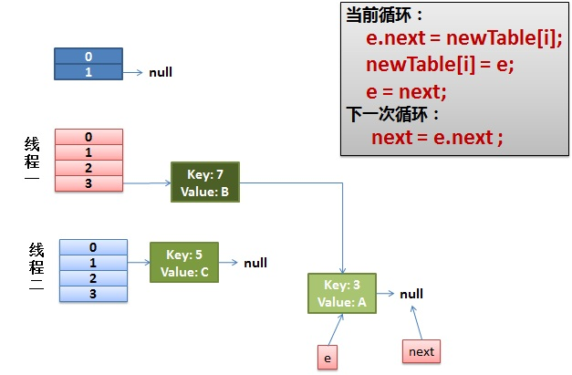

# 并发集合

- JUC提供的集合类型
- 例：ConcurrentHashMap原理
  - JDK1.7
  - JDK1.8
- 为什么HashMap多线程操作会有问题

> 常见j集合操作过程出现的错误 java.util.ConcurrentModificationException [特别是在删除元素的时候]

实际上上面这个错误在并发环境中也很容易出现，例如多个线程向同一个集合添加元素的时候。

## JUC提供了很多用于并发情况的 集合

- List和Set集合：
  - CopyOnWriteArrayList相当于线程安全的ArrayList，实现了List接口。
    - CopyOnWriteArrayList是支持高并发的；
  - CopyOnWriteArraySet相当于线程安全的HashSet，它继承了AbstractSet类，
    - CopyOnWriteArraySet内部包含一个CopyOnWriteArrayList对象，
    - 它是通过CopyOnWriteArrayList实现的。
- Map集合：
  - ConcurrentHashMap是线程安全的哈希表（相当于线程安全的HashMap）
    - 它继承于AbstractMap类，并且实现ConcurrentMap接口。
    - ConcurrentHashMap是通过“锁分段”来实现的，它支持并发；
  - ConcurrentSkipListMap是线程安全的有序的哈希表（相当于线程安全的TreeMap）；
    - 它继承于AbstactMap类，并且实现ConcurrentNavigableMap接口。
    - ConcurrentSkipListMap是通过“跳表”来实现的，它支持并发；
- ConcurrentSkipListSet是线程安全的有序的集合（相当于线程安全的TreeSet）;
  - 它继承于AbstractSet，并实现了NavigableSet接口。
  - ConcurrentSkipListSet是通过ConcurrentSkipListMap实现的，它也支持并发；
- Queue队列：
  - ArrayBlockingQueue是数组实现的线程安全的有界的阻塞队列；
  - LinkedBlockingQueue是单向链表实现的（指定大小）阻塞队列，该队列按FIFO（先进先出）排序元素；
  - LinkedBlockingDeque是双向链表实现的（指定大小）双向并发阻塞队列，该阻塞队列同时支持FIFO和FILO两种操作方式；
    - ConcurrentLinkedQueue是单向链表实现的无界队列，该队列按FIFO（先进先出）排序元素。
    - ConcurrentLinkedDeque是双向链表实现的无界队列，该队列同时支持FIFO和FILO两种操作方式。

## ConcurrentHashMap 详解

> 之前在集合部分，详细学习过HashMap的实现原理，这里也稍微复习一下要点

## 哈希表

1.介绍


哈希表就是一种以 键-值(key-indexed) 存储数据的结构，我们只要输入待查找的值即key，即可查找到其对应的值。

哈希的思路很简单，如果所有的键都是整数，那么就可以使用一个简单的无序数组来实现：将键作为索引，值即为其对应的值，这样就可以快速访问任意键的值。这是对于简单的键的情况，我们将其扩展到可以处理更加复杂的类型的键。


2.链式哈希表

链式哈希表从根本上说是由`一组链表`构成。每个链表都可以看做是一个“`桶`”，我们将所有的元素通过散列的方式放到具体的不同的桶中。插入元素时，首先将其键传入一个哈希函数（该过程称为哈希键），函数通过散列的方式告知元素属于哪个“桶”，然后在相应的链表头插入元素。查找或删除元素时，用同们的方式先找到元素的“桶”，然后遍历相应的链表，直到发现我们想要的元素。因为每个“桶”都是一个链表，所以链式哈希表并不限制包含元素的个数。然而，如果表变得太大，它的性能将会降低。


3.应用场景


我们熟知的缓存技术（比如redis、memcached）的核心其实就是在内存中维护一张巨大的哈希表，还有大家熟知的HashMap、CurrentHashMap等的应用。

## ConcurrentHashMap与HashMap等的区别

> HashMap

我们知道HashMap是线程不安全的，在多线程环境下，使用Hashmap进行put操作会引起死循环，导致CPU利用率接近100%，所以在并发情况下不能使用HashMap。


> HashTable

- HashTable和HashMap的实现原理几乎一样，差别无非是
  - HashTable不允许key和value为null
  - HashTable是线程安全的

但是HashTable线程安全的策略实现代价却太大了，简单粗暴，get/put所有相关操作都是synchronized的，这相当于给整个哈希表加了一把大锁。

多线程访问时候，只要有一个线程访问或操作该对象，那其他线程只能阻塞，相当于将所有的操作串行化，在竞争激烈的并发场景中性能就会非常差。


>ConcurrentHashMap

主要就是为了应对hashmap在并发环境下不安全而诞生的，ConcurrentHashMap的设计与实现非常精巧，大量的利用了volatile，final，CAS等`lock-free`技术来减少锁竞争对于性能的影响。

我们都知道Map一般都是数组+链表结构（JDK1.8该为数组+红黑树）。


ConcurrentHashMap避免了对全局加锁改成了局部加锁操作，这样就极大地提高了并发环境下的操作速度，由于ConcurrentHashMap在JDK1.7和1.8中的实现非常不同，接下来我们谈谈JDK在1.7和1.8中的区别。

- 这是1.7版本另一个比较清楚的图

## JDK1.7版本的CurrentHashMap的实现原理


在JDK1.7中ConcurrentHashMap采用了数组+Segment+分段锁的方式实现。


> Segment(分段锁)


ConcurrentHashMap中的分段锁称为Segment，它即类似于HashMap的结构，即内部拥有一个Entry数组，数组中的每个元素又是一个链表,同时又是一个`ReentrantLock`（Segment继承了ReentrantLock）。


>内部结构

ConcurrentHashMap使用分段锁技术，将数据分成一段一段的存储，然后给每一段数据配一把锁，当一个线程占用锁访问其中一个段数据的时候，其他段的数据也能被其他线程访问，能够实现真正的并发访问。如下图是ConcurrentHashMap的内部结构图：


从上面的结构我们可以了解到，ConcurrentHashMap定位一个元素的过程需要进行两次Hash操作。

第一次Hash定位到Segment，第二次Hash定位到元素所在的链表的头部。


>该结构的优劣势

- 坏处

这一种结构的带来的副作用是Hash的过程要比普通的HashMap要长


- 好处

写操作的时候可以只对元素所在的Segment进行加锁即可，不会影响到其他的Segment，这样，在最理想的情况下，ConcurrentHashMap可以最高同时支持Segment数量大小的写操作（刚好这些写操作都非常平均地分布在所有的Segment上）。


所以，通过这一种结构，ConcurrentHashMap的并发能力可以大大的提高。

## JDK1.8版本的CurrentHashMap的实现原理

JDK8中ConcurrentHashMap参考了JDK8 HashMap的实现，采用了`数组+链表+红黑树`的实现方式来设计，内部大量采用`CAS`操作，这里我简要介绍下CAS。

CAS是compare and swap的缩写，即我们所说的比较交换。cas是一种基于锁的操作，而且是乐观锁。在java中锁分为乐观锁和悲观锁。悲观锁是将资源锁住，等一个之前获得锁的线程释放锁之后，下一个线程才可以访问。而乐观锁采取了一种宽泛的态度，通过某种方式不加锁来处理资源，比如通过给记录加version来获取数据，性能较悲观锁有很大的提高。

CAS 操作包含三个操作数 —— `内存位置（V）、预期原值（A）和新值(B)`。如果内存地址里面的值和A的值是一样的，那么就将内存里面的值更新成B。CAS是通过无限循环来获取数据的，若果在第一轮循环中，a线程获取地址里面的值被b线程修改了，那么a线程需要自旋，到下次循环才有可能机会执行。


JDK8中彻底放弃了Segment转而采用的是`Node`，其设计思想也不再是JDK1.7中的分段锁思想。


Node：保存key，value及key的hash值的数据结构。其中value和next都用volatile修饰，保证并发的可见性。

```java
class Node<K,V> implements Map.Entry<K,V>{
    final int hash;
    final K key;
    volatile V val;
    volatile Node<K,V> next;
    //... 省略部分代码
```


Java8 ConcurrentHashMap结构基本上和Java8的HashMap一样，不过保证线程安全性。

在JDK8中ConcurrentHashMap的结构，由于引入了红黑树，使得ConcurrentHashMap的实现非常复杂，我们都知道，红黑树是一种性能非常好的二叉查找树，其查找性能为O（logN），但是其实现过程也非常复杂，而且可读性也非常差，DougLea的思维能力确实不是一般人能比的，早期完全采用链表结构时Map的查找时间复杂度为O（N），JDK8中ConcurrentHashMap在链表的长度大于某个阈值的时候会将链表转换成红黑树进一步提高其查找性能。


## 总结

其实可以看出JDK1.8版本的ConcurrentHashMap的数据结构已经接近HashMap，相对而言，ConcurrentHashMap只是增加了同步的操作来控制并发，从JDK1.7版本的`ReentrantLock+Segment+HashEntry`，到JDK1.8版本中`synchronized+CAS+HashEntry+红黑树`。

- 数据结构：取消了Segment分段锁的数据结构，取而代之的是数组+链表+红黑树的结构。- 保证线程安全机制：JDK1.7采用segment的分段锁机制实现线程安全，其中segment继承自ReentrantLock。JDK1.8采用CAS+Synchronized保证线程安全。
- 锁的粒度：原来是对需要进行数据操作的Segment加锁，现调整为对每个数组元素加锁（Node）。
- 链表转化为红黑树:定位结点的hash算法简化会带来弊端,Hash冲突加剧,因此在链表节点数量大于8时，会将链表转化为红黑树进行存储。
- 查询时间复杂度：从原来的遍历链表O(n)，变成遍历红黑树O(logN)。


## 为什么HashMap线程不安全

以下三个情况会导致错误（概率）（死循环问题）
- 多线程put操作后，get操作产生死循环
  - HashMap采用链接解决Hash冲突，链式结构容易形成闭合的链路
- 多线程put非null元素后，get得到null
- 多线程put操作导致元素丢失

### 为何产生死循环  https://coolshell.cn/articles/9606.html

> 问题的症状
从前我们的Java代码因为一些原因使用了HashMap这个东西，但是当时的程序是单线程的，一切都没有问题。后来，我们的程序性能有问题，所以需要变成多线程的，于是，变成多线程后到了线上，发现程序经常占了100%的CPU，查看堆栈，你会发现程序都Hang在了HashMap.get()这个方法上了，重启程序后问题消失。但是过段时间又会来。而且，这个问题在测试环境里可能很难重现。

我们简单的看一下我们自己的代码，我们就知道HashMap被多个线程操作。而Java的文档说HashMap是非线程安全的，应该用ConcurrentHashMap。

但是在这里我们可以来研究一下原因。


> Hash表数据结构

我需要简单地说一下HashMap这个经典的数据结构。

HashMap通常会用一个指针数组（假设为table[]）来做分散所有的key，当一个key被加入时，会通过Hash算法通过key算出这个数组的下标i，然后就把这个<key, value>插到table[i]中，如果有两个不同的key被算在了同一个i，那么就叫冲突，又叫碰撞，这样会在table[i]上形成一个链表。

我们知道，如果table[]的尺寸很小，比如只有2个，如果要放进10个keys的话，那么碰撞非常频繁，于是一个O(1)的查找算法，就变成了链表遍历，性能变成了O(n)，这是Hash表的缺陷（可参看《Hash Collision DoS 问题》）。

所以，Hash表的尺寸和容量非常的重要。一般来说，Hash表这个容器当有数据要插入时，都会检查容量有没有超过设定的thredhold，如果超过，需要增大Hash表的尺寸，但是这样一来，整个Hash表里的无素都需要被重算一遍。这叫rehash，这个成本相当的大。

相信大家对这个基础知识已经很熟悉了。

> HashMap的rehash源代码

下面，我们来看一下Java的HashMap的源代码。

Put一个Key,Value对到Hash表中：
```java
public V put(K key, V value)
{
    ......
    //算Hash值
    int hash = hash(key.hashCode());
    int i = indexFor(hash, table.length);
    //如果该key已被插入，则替换掉旧的value （链接操作）
    for (Entry<K,V> e = table[i]; e != null; e = e.next) {
        Object k;
        if (e.hash == hash && ((k = e.key) == key || key.equals(k))) {
            V oldValue = e.value;
            e.value = value;
            e.recordAccess(this);
            return oldValue;
        }
    }
    modCount++;
    //该key不存在，需要增加一个结点
    addEntry(hash, key, value, i);
    return null;
}
```
检查容量是否超标
```java
void addEntry(int hash, K key, V value, int bucketIndex)
{
    Entry<K,V> e = table[bucketIndex];
    table[bucketIndex] = new Entry<K,V>(hash, key, value, e);
    //查看当前的size是否超过了我们设定的阈值threshold，如果超过，需要resize
    if (size++ >= threshold)
        resize(2 * table.length);
}
```
新建一个更大尺寸的hash表，然后把数据从老的Hash表中迁移到新的Hash表中。
```java
void resize(int newCapacity)
{
    Entry[] oldTable = table;
    int oldCapacity = oldTable.length;
    ......
    //创建一个新的Hash Table
    Entry[] newTable = new Entry[newCapacity];
    //将Old Hash Table上的数据迁移到New Hash Table上
    transfer(newTable);
    table = newTable;
    threshold = (int)(newCapacity * loadFactor);
}
```
迁移的源代码，注意高亮处：
```java
void transfer(Entry[] newTable)
{
    Entry[] src = table;
    int newCapacity = newTable.length;
    //下面这段代码的意思是：
    //  从OldTable里摘一个元素出来，然后放到NewTable中
    for (int j = 0; j < src.length; j++) {
        Entry<K,V> e = src[j];
        if (e != null) {
            src[j] = null;
            do {
                Entry<K,V> next = e.next;
                int i = indexFor(e.hash, newCapacity);
                e.next = newTable[i];
                newTable[i] = e;
                e = next;
            } while (e != null);
        }
    }
}
```
好了，这个代码算是比较正常的。而且没有什么问题。

> 正常的ReHash的过程
画了个图做了个演示。

- 我假设了我们的hash算法就是简单的用key mod 一下表的大小（也就是数组的长度）。
- 最上面的是old hash 表，其中的Hash表的size=2, 所以key = 3, 7, 5，在mod 2以后都冲突在table[1]这里了。
- 接下来的三个步骤是Hash表 resize成4，然后所有的<key,value> 重新rehash的过程


并发下的Rehash
1）假设我们有两个线程。我用红色和浅蓝色标注了一下。

我们再回头看一下我们的 transfer代码中的这个细节：

```java
do {
    Entry<K,V> next = e.next; // <--假设线程一执行到这里就被调度挂起了
    int i = indexFor(e.hash, newCapacity);
    e.next = newTable[i];
    newTable[i] = e;
    e = next;
} while (e != null);
```
而我们的线程二执行完成了。于是我们有下面的这个样子。


注意，因为Thread1的 e 指向了key(3)，而next指向了key(7)，其在线程二rehash后，指向了线程二重组后的链表。我们可以看到链表的顺序被反转后。

2）线程一被调度回来执行。

- 先是执行 newTalbe[i] = e;
- 然后是e = next，导致了e指向了key(7)，
- 而下一次循环的next = e.next导致了next指向了key(3)


3）一切安好。

线程一接着工作。把key(7)摘下来，放到newTable[i]的第一个，然后把e和next往下移。



4）环形链接出现。

e.next = newTable[i] 导致  key(3).next 指向了 key(7)

注意：此时的key(7).next 已经指向了key(3)， 环形链表就这样出现了。


于是，当我们的线程一调用到，HashTable.get(11)时，悲剧就出现了——Infinite Loop。

其它
有人把这个问题报给了Sun，不过Sun不认为这个是一个问题。因为HashMap本来就不支持并发。要并发就用ConcurrentHashmap

> 多线程put导致元素丢失：两个相同hash不同key同时put，可能出现丢失值的情况

> put进的元素get出来为null : put的时候正好触发了 transfer，执行到了中间过程(把Entity[]的一个节点=null)丢失了cpu，另一个线程获得操作权进行了get