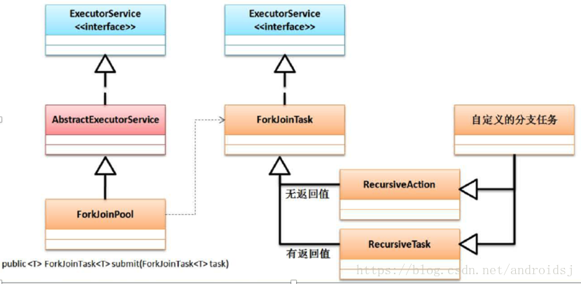

# ForkJoinTask

1.7版本后追加到java中

- 注意事项
  - 分支任务之中的数据的同步处理一定要有分支任务自己来完成，不要求进行额外的控制；
  - 在进行分支处理操作的时候不要进行IO操作；
  - 由于分支任务是捆绑一起执行的，如果出现了异常千万别抛出，会整体任务失败。
- 核心类
  - ForkJoinTask：进行分支合并任务的处理类
  - ForkJoinPool：分支合并池



> 有返回结果的任务：RecursiveTask / 无返结果的任务：RecursiveAction

## 例子 

- public abstract class RecursiveTask<V> extends ForkJoinTask<V>
- public abstract class ForkJoinTask<V> implements Future<V>, Serializable

```java
public class LearnForkJoinTask {
    // 有返回值的： RecursiveTask
    public static class SumTask extends RecursiveTask<Integer>{
        private int start;
        private int end;
        public SumTask(int start ,int end) {
            this.start = start;
            this.end = end;
        }

        @Override
        protected Integer compute() {
            int sum = 0;
            if(end - start<100){
                for (int x = sum;x<=end;x++){
                    sum+=x;
                }
                return sum;
            }else {
                // 在需要 fork/join的时候
                int middle = (start+end)/2;
                SumTask left = new SumTask(start,middle);
                SumTask right = new SumTask(middle+1,end);
                left.fork();
                right.fork();
                sum = left.join()+right.join();
                return sum;
            }
        }
    }
}
```
- ForkJoinTask.fork()
```java
   public final ForkJoinTask<V> fork() {
        Thread t;
        if ((t = Thread.currentThread()) instanceof ForkJoinWorkerThread)
            ((ForkJoinWorkerThread)t).workQueue.push(this);
        else
            ForkJoinPool.common.externalPush(this);
        return this;
    }
```
- ForkJoinTask.join()
```java
    public final V join() {
        int s;
        if ((s = doJoin() & DONE_MASK) != NORMAL)
            reportException(s);
        return getRawResult();
    }
    // ForkJoinTask.doJoin()
    private int doJoin() {
        int s; Thread t; ForkJoinWorkerThread wt; ForkJoinPool.WorkQueue w;
        return (s = status) < 0 ?
         s :

            ((t = Thread.currentThread()) instanceof ForkJoinWorkerThread) ?

            (w = (wt = (ForkJoinWorkerThread)t).workQueue).
            tryUnpush(this) && (s = doExec()) < 0 ? 
            s :
            wt.pool.awaitJoin(w, this, 0L) :

            externalAwaitDone();
    }
    // ForkJoinTask.doExec
        final int doExec() {
        int s; boolean completed;
        if ((s = status) >= 0) {
            try {
                completed = exec();
            } catch (Throwable rex) {
                return setExceptionalCompletion(rex);
            }
            if (completed) // 正常情况下 exec 会返回 true，所以下面 s= setCompletion 一定会执行
                s = setCompletion(NORMAL);
        }
        return s;
    }
    // RecursiveTask.exec
    protected final boolean exec() {
        result = compute(); // 这里的compute 是我们的computer
        return true;
    }
    // ForkJoinTask.setCompletion
    private int setCompletion(int completion) {
        for (int s;;) {
            if ((s = status) < 0)
                return s;

                                // 当前对象 的status 如果等于 s 就改为 s|completion
            if (U.compareAndSwapInt(this, STATUS, s, s | completion)) {
                if ((s >>> 16) != 0)
                    synchronized (this) { notifyAll(); }
                return completion;
            }
        }
    }
```