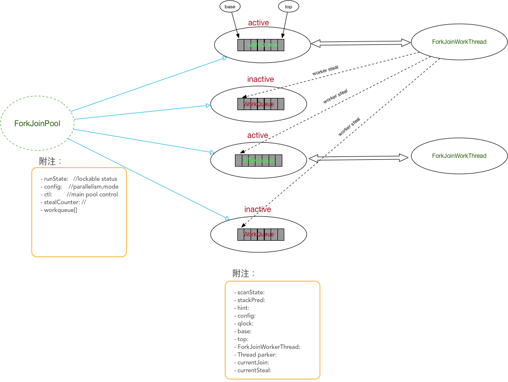

# jdk1.8-ForkJoin框架剖析

> 原文： https://www.jianshu.com/p/f777abb7b251


## 导读
@since 1.7 Doug Lea为我们带来了新的并发框架 - A Java Fork/Join Framework,在Lea老爷子发表的一篇papers中为我们描述了其设计理念,这个框架使用的场景就是将一个大任务按照意愿切分成N个小任务并行执行,并最终聚合结果,加快运算。比如我们想要计算1到1000的sum,就可以使用该框架实现一个二分算法的求和。如果你正在使用jdk8为我们带来的流式计算api的话,你可能也正在接触到该框架,因为流的parallel方法底层就是使用ForkJoinPool来处理。 

ForkJoin框架到了jdk1.8之后进一步做了优化,和jdk1.7的实现方法有很多不同,本文目的就是为了讲解jdk1.8的工程实现。

想要了解核心的设计思路,可以提前阅读Doug Lea的论文:
[《A Java Fork/Join Framework》](./ForkJoin作者论文.pdf)
[Java 并发编程笔记：如何使用 ForkJoinPool 以及原理](./16-ForkJoin解析-解析-解析.md)

## 概述



和传统的线程池使用AQS(AbstractQueuedSynchronizer)的实现逻辑不同,ForkJoin引入全新的结构来标识:

- ForkJoinPool: 用于执行ForkJoinTask任务的执行池,不再是传统执行池 `Worker+Queue` 的组合模式,而是维护了一个队列数组`WorkQueue`,这样在提交任务和线程任务的时候`大幅度的减少碰撞`。
- WorkQueue: 双向列表,用于任务的有序执行,如果`WorkQueue`用于自己的执行线程Thread,线程默认将会从top端选取任务用来执行 - `LIFO`。因为只有owner的Thread才能从top端取任务,所以在设置变量时, int top; 不需要使用 volatile。
- ForkJoinWorkThread: 用于执行任务的线程,用于区别使用非ForkJoinWorkThread线程提交的task;启动一个该Thread,会自动注册一个WorkQueue到Pool,`这里规定,拥有Thread的WorkQueue只能出现在WorkQueue数组的奇数位`
- ForkJoinTask: 任务, 它比传统的任务更加轻量，不再对是RUNNABLE的子类,提供fork/join方法用于分割任务以及聚合结果。
- 为了充分施展并行运算,该框架实现了复杂的 `worker steal`算法,当任务处于等待中,thread通过一定策略,不让自己挂起，充分利用资源，当然，它比其他语言的`协程`要重一些。(c语言go语言有携程，协程可以看作单线程多任务的工作方式，节省了多线程之间的互斥锁，信号量等，但是协程并非这么简单)
## ForkJoinPool变量基本说明

作为框架的提交入口,ForkJoinPool管理着线程池中线程和任务队列,标识线程池是否还接收任务，显示现在的线程运行状态。本节，对这些控制量进行解释。

如果读者看过 类似 `disrupter` 这种高效率队列的开源实现,大家肯定会对`cache line`记忆犹新,他们通常的做法自己设置伪变量来填充,jdk1.8�中官网为我们带来了sun.misc.Contended,所以你如果阅读ForkJoinPool源码可以发现该类也被`sun.misc.Contended`标识。
几个重要变量:

- runState: 标识Pool运行状态,使用bit位来标识不同状态,比如
```java
    // runState bits: SHUTDOWN must be negative, others arbitrary powers of two
  private static final int  RSLOCK     = 1;
  private static final int  RSIGNAL    = 1 << 1;
  private static final int  STARTED    = 1 << 2;
  private static final int  STOP       = 1 << 29;
  private static final int  TERMINATED = 1 << 30;
  private static final int  SHUTDOWN   = 1 << 31;
```
如果执行 runState & RSLOCK ==0 就能直接说明,目前的运行状态没有被锁住,其他情况一样。
- config：parallelism | mode
- parallelism: 这个变量不是内部定义的变量，但是需要各位注意一下它的界限，因为后面的处理需要注意
```java
static final int MAX_CAP      = 0x7fff;        // max #workers - 1
```
也就是说他最大就占16位

- ctl：ctl是Pool的控制变量,类型是long - 说明有64位,每个部分都有不同的作用。我们使用十六进制来标识ctl，依次说明不同部分的作用。
```java
long np = (long)(-parallelism); // offset ctl counts
this.ctl = ((np << AC_SHIFT) & AC_MASK) | ((np << TC_SHIFT) & TC_MASK);
//  0x xxxx-1  xxxx-2  xxxx-3  xxxx-4
```
我为每个部分使用了数字来标识 - 1,2,3,4。
- 编号为1的16位: AC 表示现在获取的线程数,这里的初始化比较有技巧,使用的是并行数的相反数,这样如果active的线程数,还没到达了我们设置的阈值的时候,ctl是个负数,我们可以根据ctl的正负直观的知道现在的并行数达到阈值了么。
- 编号为2的16位：TC 表示线程总量,初始值也是并行数的相反数。这里需要说明一下，这个编号1所表示的活跃的线程数的区别,我们虽然开启了并行数等量的线程,但是可能在某些条件下,运行的thread不得不wait或者park,原因我们后面会提到，这个时候，虽然我们开启的线程数量是和并行数相同，但是实际真正执行的却不是这么多。TC 记录了我们一共开启了多少线程，而AC则记录了没有挂起的线程。
- 编号为3的16位：后32位标识 idle workers 前面16位第一位标识是active的还是inactive的,其他为是版本标识。
- 编号为4的16位：标识idle workers 在WorkQueue[]数组中的index。这里需要说明的是,ctl的后32位其实只能表示一个idle workers，那么我们如果有很多个idle worker要怎么办呢？老爷子使用的是stack的概念来保存这些信息。后32位标识的是top的那个,我们能从top中的变量stackPred追踪到下一个idle worker
## WorkQueue变量基本说明
WorkQueue是一个双向列表,用于task的排队。
几个变量的定义说明:

- scanState:  // versioned, <0: inactive; odd:scanning 如果WorkQueue没有属于自己的owner(下标为偶数的都没有),该值为 inactive 也就是一个负数。如果有自己的owner，该值的初始值为其在WorkQueue[]数组中的下标，也肯定是个奇数。
如果这个值，变成了偶数，说明该队列所属的Thread正在执行Task
```java
    static final int SCANNING     = 1;             // false when running   tasks
    static final int INACTIVE     = 1 << 31;       // must be negative
```
- stackPred: 记录前任的 idle worker

- config：index | mode。 如果下标为偶数的WorkQueue,`则其mode是共享类型`。如果有自己的owner 默认是 `LIFO`

>什么时候应该设置成 FIFO,注释中这么给的建议：
establishes local first-in-first-out scheduling mode for forked
tasks that are never joined. This mode may be more appropriate
than default locally stack-based mode in applications in which
worker threads only process event-style asynchronous tasks.
For default value, use {@code false}

- qlock: 锁标识,在多线程往队列中添加数据，会有竞争，使用此标识抢占锁。

- base：worker steal的偏移量,因为其他的线程都可以偷该队列的任务,所有base使用volatile标识。

- top：owner执行任务的偏移量。

- parker：如果 owner 挂起，则使用该变量做记录。

- currentJoin: 当前正在join等待结果的任务。

- currentSteal：当前执行的任务是steal过来的任务，该变量做记录。

## ForkJoinTask变量基本说明
- status: 标识任务目前的状态,如果<0,表示任务处于结束状态。
((s >>> 16) != 0)表示需要signal其他线程
## 任务提交过程剖析
ForkJoinPool提供的提交接口很多,不管提交的是Callable、Runnable、ForkJoinTask最终都会转换成ForkJoinTask类型的任务,调用方法`externalPush(ForkJoinTask<?> task)`来进行提交逻辑。让我们来看看提交的过程:

- 如果第一次提交(或者是hash之后的队列还未初始化),调用externalSubmit
  - 第一遍循环: (runState不是开始状态): 1.lock; 2.创建数组WorkQueue[n]，这里的n是power of 2; 3. runState设置为开始状态。
  - 第二遍循环:(根据ThreadLocalRandom.getProbe()hash后的数组中相应位置的WorkQueue未初始化): 初始化WorkQueue,通过这种方式创立的WorkQueue均是SHARED_QUEUE,scanState为INACTIVE
  - 第三遍循环: 找到刚刚创建的WorkQueue,lock住队列,将数据塞到arraytop位置。如果添加成功，就用调用接下来要摊开讲的重要的方法signalWork。
- 如果hash之后的队列已经存在
  - lock住队列,将数据塞到top位置。如果该队列任务很少(n <= 1)也会调用signalWork
## signalWork
signalWork是fork/join框架中重要的方法之一,用于创建或者激活工作线程。本小节主要看它的源码实现,文章后面我们会总结它的使用场景。
```java
    final void signalWork(WorkQueue[] ws, WorkQueue q) {
        long c; int sp, i; WorkQueue v; Thread p;
        while ((c = ctl) < 0L) {                       // too few active
            if ((sp = (int)c) == 0) {                  // no idle workers
                if ((c & ADD_WORKER) != 0L)            // too few workers
                    tryAddWorker(c);
                break;
            }
            if (ws == null)                            // unstarted/terminated
                break;
            if (ws.length <= (i = sp & SMASK))         // terminated
                break;
            if ((v = ws[i]) == null)                   // terminating
                break;
            int vs = (sp + SS_SEQ) & ~INACTIVE;        // next scanState
            int d = sp - v.scanState;                  // screen CAS
            long nc = (UC_MASK & (c + AC_UNIT)) | (SP_MASK & v.stackPred);
            if (d == 0 && U.compareAndSwapLong(this, CTL, c, nc)) {
                v.scanState = vs;                      // activate v
                if ((p = v.parker) != null)
                    U.unpark(p);
                break;
            }
            if (q != null && q.base == q.top)          // no more work
                break;
        }
    }
```
在上面的章节我们已经具体的分析了ForkJoinPool中的ctl的标识含义，我们知道当ctl<0意味着active的线程还没有到达阈值，只有ctl<0我们才会去讨论要不要创建或者激活新的线程。(int)ctl很巧妙的拿到了ctl的低16位

- 我们知道ctl代表的是idle worker当低16位为0的时候，意味着此刻没有已经启动但是空闲的线程,如果在没有空闲的线程的情况下
```java
(c & ADD_WORKER) != 0L
private static final long ADD_WORKER = 0x0001L << (TC_SHIFT + 15); // sign
```
意味着我们再增加一个线程,也不能使ac为非负数(只要ctl的最高位为1,表明ac仍是负数) 。我们调用方法tryAddWorker来创建工作线程。

  - 我们首先需要使用ctl来记录我们增加的线程, ctl编号-1的16位和编号-2的16位均需要加1,表示active的worker加一，总的worker加一。成功后我们将调用createWorker。
  - 我们使用ForkJoinWorkerThreadFactory来产生一个ForkJoinWorkerThread类型的线程，该线程将会把自己注册到Pool上,怎么注册的呢？实现在方法registerWorker,前文我们已经提及,拥有线程的WorkQueue只能出现在数组的奇数下标处。所以线程 首先,创建一个新的WorkQueue，其次在数组WorkQueue[]寻找奇数下标尚未初始化的位置,如果循环的次数大于数组长度,还可能需要对数组进行扩容，然后，设置这个WorkQueue的 config 为 index | mode (下标和模式),scanState为 index (下标>0)。最后启动这个线程。线程的处理我们接下来的章节介绍。
- 当我们发现我们还有idle worker(即(int)ctl!=0L),我们需要active其中的一个。
  - 我们上文说过ctl的编号-3的16位,标记inactive和版本控制,我们将编号-3设置为激活状态并且版本加一。编号-4的16位我们之前也说过,放置了top的挂起的线程的index所以我们可以根据这个index拿到WorkQueue--- 意味着就是这个WorkQueue的Owner线程被挂起了。
  - 我们将要把top的挂起线程唤醒,意味着我们要讲下一个挂起的线程的信息记录到ctl上。前文也说在上一个挂起的线程的index信息在这个挂起的线程的stackPred
  ```java
       int vs = (sp + SS_SEQ) & ~INACTIVE;        // next scanState
       int d = sp - v.scanState;                  // screen CAS
       long nc = (UC_MASK & (c + AC_UNIT)) | (SP_MASK & v.stackPred);
       if (d == 0 && U.compareAndSwapLong(this, CTL, c, nc)) {
           v.scanState = vs;                      // activate v
           if ((p = v.parker) != null)
               U.unpark(p);
           break;
       }
    ```
更新完ctl后,我们将唤醒之前挂起的线程。
通过上述的简单介绍，用户的任务的提交所经历的步骤就介绍完了。

## ForkJoinWorkerThread运行过程剖析
ForkJoinWorkerThread启动之后会调用pool的runWorker来获取任务执行。
```java
    final void runWorker(WorkQueue w) {
        w.growArray();                   // allocate queue
        int seed = w.hint;               // initially holds randomization hint
        int r = (seed == 0) ? 1 : seed;  // avoid 0 for xorShift
        for (ForkJoinTask<?> t;;) {
            if ((t = scan(w, r)) != null)
                w.runTask(t);
            else if (!awaitWork(w, r))
                break;
            r ^= r << 13; r ^= r >>> 17; r ^= r << 5; // xorshift
        }
    }
```
代码很短，但是我们很容易读懂其中的意思。调用scan尝试去偷取一个任务,然后调用runTask或者awaitWork，这里的scan是框架的重要的实现，我们将详述上面的三个方法。

> scan
代码如下:
```java
    private ForkJoinTask<?> scan(WorkQueue w, int r) {
        WorkQueue[] ws; int m;
        if ((ws = workQueues) != null && (m = ws.length - 1) > 0 && w != null) {
            int ss = w.scanState;                     // initially non-negative
            for (int origin = r & m, k = origin, oldSum = 0, checkSum = 0;;) {
                WorkQueue q; ForkJoinTask<?>[] a; ForkJoinTask<?> t;
                int b, n; long c;
                if ((q = ws[k]) != null) {
                    if ((n = (b = q.base) - q.top) < 0 &&
                        (a = q.array) != null) {      // non-empty
                        long i = (((a.length - 1) & b) << ASHIFT) + ABASE;
                        if ((t = ((ForkJoinTask<?>)
                                  U.getObjectVolatile(a, i))) != null &&
                            q.base == b) {
                            if (ss >= 0) {
                                if (U.compareAndSwapObject(a, i, t, null)) {
                                    q.base = b + 1;
                                    if (n < -1)       // signal others
                                        signalWork(ws, q);
                                    return t;
                                }
                            }
                            else if (oldSum == 0 &&   // try to activate
                                     w.scanState < 0)
                                tryRelease(c = ctl, ws[m & (int)c], AC_UNIT);
                        }
                        if (ss < 0)                   // refresh
                            ss = w.scanState;
                        r ^= r << 1; r ^= r >>> 3; r ^= r << 10;
                        origin = k = r & m;           // move and rescan
                        oldSum = checkSum = 0;
                        continue;
                    }
                    checkSum += b;
                }
                if ((k = (k + 1) & m) == origin) {    // continue until stable
                    if ((ss >= 0 || (ss == (ss = w.scanState))) &&
                        oldSum == (oldSum = checkSum)) {
                        if (ss < 0 || w.qlock < 0)    // already inactive
                            break;
                        int ns = ss | INACTIVE;       // try to inactivate
                        long nc = ((SP_MASK & ns) |
                                   (UC_MASK & ((c = ctl) - AC_UNIT)));
                        w.stackPred = (int)c;         // hold prev stack top
                        U.putInt(w, QSCANSTATE, ns);
                        if (U.compareAndSwapLong(this, CTL, c, nc))
                            ss = ns;
                        else
                            w.scanState = ss;         // back out
                    }
                    checkSum = 0;
                }
            }
        }
        return null;
    }
```
因为我们的WorkQueue是有owner线程的队列，我们可以知道以下信息:

- config = index | mode
- scanState = index > 0

我们首先通过random的r来找到一个我们准备偷取的队列。

- 如果我们准备偷取的队列刚好有任务在排队(也有可能是owner自己的那个队列)；
  - 从队列的队尾即base位置取到任务返回
  - base + 1
- 如果我们遍历了一圈(((k = (k + 1) & m) == origin))都没有偷到,我们就认为当前的active 线程过剩了,我们准备将当前的线程(即owner)挂起,我们首先 index | INACTIVE 形成 ctl的后32位;并行将ac减一。其次，将原来的挂起的top的index记录到stackPred中。
- 继续遍历如果仍然一无所获,将跳出循环；如果偷到了一个任务,我们将使用tryRelease激活。
> runTask
如果我们通过scan偷到了任务,这个时候我们将进入执行状态:
```java
        final void runTask(ForkJoinTask<?> task) {
            if (task != null) {
                scanState &= ~SCANNING; // mark as busy
                (currentSteal = task).doExec();
                U.putOrderedObject(this, QCURRENTSTEAL, null); // release for GC
                execLocalTasks();
                ForkJoinWorkerThread thread = owner;
                if (++nsteals < 0)      // collect on overflow
                    transferStealCount(pool);
                scanState |= SCANNING;
                if (thread != null)
                    thread.afterTopLevelExec();
            }
        }
```
首先scanState &= ~SCANNING;标识该线程处于繁忙状态。

- 执行偷取的Task。
- 调用execLocalTasks对线程所属的WorkQueue内的任务进行LIFO执行。
> awaitWork
如果我们通过scan一无所获,这个时候我们将进入执行状态:
```java
    private boolean awaitWork(WorkQueue w, int r) {
        if (w == null || w.qlock < 0)                 // w is terminating
            return false;
        for (int pred = w.stackPred, spins = SPINS, ss;;) {
            if ((ss = w.scanState) >= 0)
                break;
            else if (spins > 0) {
                r ^= r << 6; r ^= r >>> 21; r ^= r << 7;
                if (r >= 0 && --spins == 0) {         // randomize spins
                    WorkQueue v; WorkQueue[] ws; int s, j; AtomicLong sc;
                    if (pred != 0 && (ws = workQueues) != null &&
                        (j = pred & SMASK) < ws.length &&
                        (v = ws[j]) != null &&        // see if pred parking
                        (v.parker == null || v.scanState >= 0))
                        spins = SPINS;                // continue spinning
                }
            }
            else if (w.qlock < 0)                     // recheck after spins
                return false;
            else if (!Thread.interrupted()) {
                long c, prevctl, parkTime, deadline;
                int ac = (int)((c = ctl) >> AC_SHIFT) + (config & SMASK);
                if ((ac <= 0 && tryTerminate(false, false)) ||
                    (runState & STOP) != 0)           // pool terminating
                    return false;
                if (ac <= 0 && ss == (int)c) {        // is last waiter
                    prevctl = (UC_MASK & (c + AC_UNIT)) | (SP_MASK & pred);
                    int t = (short)(c >>> TC_SHIFT);  // shrink excess spares
                    if (t > 2 && U.compareAndSwapLong(this, CTL, c, prevctl))
                        return false;                 // else use timed wait
                    parkTime = IDLE_TIMEOUT * ((t >= 0) ? 1 : 1 - t);
                    deadline = System.nanoTime() + parkTime - TIMEOUT_SLOP;
                }
                else
                    prevctl = parkTime = deadline = 0L;
                Thread wt = Thread.currentThread();
                U.putObject(wt, PARKBLOCKER, this);   // emulate LockSupport
                w.parker = wt;
                if (w.scanState < 0 && ctl == c)      // recheck before park
                    U.park(false, parkTime);
                U.putOrderedObject(w, QPARKER, null);
                U.putObject(wt, PARKBLOCKER, null);
                if (w.scanState >= 0)
                    break;
                if (parkTime != 0L && ctl == c &&
                    deadline - System.nanoTime() <= 0L &&
                    U.compareAndSwapLong(this, CTL, c, prevctl))
                    return false;                     // shrink pool
            }
        }
        return true;
    }
```
- 如果ac还没到达阈值,但是tc>2 说明现在仍然运行中的线程和挂起的线程加一起处于过剩状态,我们将放弃该线程的挂起,直接让它执行结束，不再循环执行任务。
- 否则，我们计算一个挂起的时间，等到了时间之后(或者被外部唤醒),线程醒了之后,如果发现自己状态是active状态(w.scanState >= 0),则线程继续回去scan任务，如果发现自己是因为时间到了自动醒来，但是自己还是inactive状态,也许，自己真的是多余的。线程也会执行结束，不再循环执行任务。
>ForkJoinTask执行过程剖析
从上节我们知道,我们获取任务之后，将调用任务的doExec来具体执行任务:
```java
    final int doExec() {
        int s; boolean completed;
        if ((s = status) >= 0) {
            try {
                completed = exec();
            } catch (Throwable rex) {
                return setExceptionalCompletion(rex);
            }
            if (completed)
                s = setCompletion(NORMAL);
        }
        return s;
    }
```
我们以RecursiveTask为例：
```java
   protected final boolean exec() {
        result = compute();
        return true;
    }
```
最终调用的是 compute，我们举个example来看。

>demo
求整数数组所有元素之和
```java
public class ForkJoinCalculator implements Calculator {
    private ForkJoinPool pool;

    private static class SumTask extends RecursiveTask<Long> {
        private long[] numbers;
        private int from;
        private int to;

        public SumTask(long[] numbers, int from, int to) {
            this.numbers = numbers;
            this.from = from;
            this.to = to;
        }

        @Override
        protected Long compute() {
            // 当需要计算的数字小于6时，直接计算结果
            if (to - from < 6) {
                long total = 0;
                for (int i = from; i <= to; i++) {
                    total += numbers[i];
                }
                return total;
            // 否则，把任务一分为二，递归计算
            } else {
                int middle = (from + to) / 2;
                SumTask taskLeft = new SumTask(numbers, from, middle);
                SumTask taskRight = new SumTask(numbers, middle+1, to);
                taskLeft.fork();
                taskRight.fork();
                return taskLeft.join() + taskRight.join();
            }
        }
    }

    public ForkJoinCalculator() {
        // 也可以使用公用的 ForkJoinPool：
        // pool = ForkJoinPool.commonPool()
        pool = new ForkJoinPool();
    }

    @Override
    public long sumUp(long[] numbers) {
        return pool.invoke(new SumTask(numbers, 0, numbers.length-1));
    }
}
```
这里需要注意的是其中的compute

- 如果任务很小,直接计算结果。
- 如果任务很大，一分为二，调用fork方法,获取join方法的返回值。

很明显，这里任务的 fork、join就是我们框架的核心，那么，它们都做了什么呢？

>fork
fork的逻辑很简单。
```java
   public final ForkJoinTask<V> fork() {
        Thread t;
        if ((t = Thread.currentThread()) instanceof ForkJoinWorkerThread)
            ((ForkJoinWorkerThread)t).workQueue.push(this);
        else
            ForkJoinPool.common.externalPush(this);
        return this;
    }
```

如果当前线程是工作线程,直接push到自己所拥有的队列的top位置。
如果是非工作线程,就是一个提交到Pool的过程。
>join
join是一个等待结果的方法：
```java
   public final V join() {
        int s;
        if ((s = doJoin() & DONE_MASK) != NORMAL)
            reportException(s);
        return getRawResult();
    }
```
如果得到的结果异常，则抛出异常；
如果得到的正常，则获取返回值。
那么,线程在doJoin做了什么呢？
```java
   private int doJoin() {
        int s; Thread t; ForkJoinWorkerThread wt; ForkJoinPool.WorkQueue w;
        return (s = status) < 0 ? s :
            ((t = Thread.currentThread()) instanceof ForkJoinWorkerThread) ?
            (w = (wt = (ForkJoinWorkerThread)t).workQueue).
            tryUnpush(this) && (s = doExec()) < 0 ? s :
            wt.pool.awaitJoin(w, this, 0L) :
            externalAwaitDone();
    }
```
- 如果当前线程不是工作线程,则调用externalAwaitDone，首先，设置任务的status为signal状态，这样该任务执行结束之后会调用notifyAll来唤醒自己；其次，阻塞自己，知道任务执行完成后把自己唤醒。
- 如果需要join的任务已经完成，直接返回运行结果；
- 如果需要join的任务刚刚好是当前线程所拥有的队列的top位置,这意味着当前工作线程下一个就将执行到它,则执行它。
- 如果该任务不在top位置,则调用awaitJoin方法：
  - 设置currentJoin表明自己正在等待该任务；
  - 如果发现 w.base == w.top 或者  tryRemoveAndExec返回 true说明自己所属的队列为空，也说明我们通过fork将本线程的任务已经被别的线程偷走，该线程也不会闲着，将会helpStealer帮助帮助自己执行任务的线程执行任务(互惠互利,你来我往)
  - 如果tryCompensate为 true,则阻塞本线程，等待任务执行结束的唤醒
> tryRemoveAndExec

如果join的任务还没有被执行，我们去自己的队列中去查找，看看任务是否不在top位置但是还是在队列中
```java
        while ((n = (s = top) - (b = base)) > 0) {
                    for (ForkJoinTask<?> t;;) {      // traverse from s to b
                        long j = ((--s & m) << ASHIFT) + ABASE;
                        if ((t = (ForkJoinTask<?>)U.getObject(a, j)) == null)
                            return s + 1 == top;     // shorter than expected
                        else if (t == task) {
                            boolean removed = false;
                            if (s + 1 == top) {      // pop
                                if (U.compareAndSwapObject(a, j, task, null)) {
                                    U.putOrderedInt(this, QTOP, s);
                                    removed = true;
                                }
                            }
                            else if (base == b)      // replace with proxy
                                removed = U.compareAndSwapObject(
                                    a, j, task, new EmptyTask());
                            if (removed)
                                task.doExec();
                            break;
                        }
                        else if (t.status < 0 && s + 1 == top) {
                            if (U.compareAndSwapObject(a, j, t, null))
                                U.putOrderedInt(this, QTOP, s);
                            break;                  // was cancelled
                        }
                        if (--n == 0)
                            return false;
                    }
                    if (task.status < 0)
                        return false;
                }
```
- 如果刚好在top位置，pop出来执行。
- 如果在队列中间,则使用EmptyTask来占位,将任务取出来执行。
- 如果执行的任务还没结束。则不进行helpStealer,
> helpStealer

helpStealer的原则是你帮助我执行任务,我也帮你执行任务。

- 遍历奇数下标,如果发现队列对象currentSteal放置的刚好是自己要找的任务,则说明自己的任务被该队列A的owner线程偷来执行
- 如果队列A队列中有任务，则从队尾(base)取出执行；
- 如果发现队列A队列为空，则根据它正在join的任务,在拓扑找到相关的队列B去偷取任务执行。
在执行的过程中要注意，我们应该完整的把任务完成
```java
  do {
      U.putOrderedObject(w, QCURRENTSTEAL, t);
      t.doExec();        // clear local tasks too
        } while (task.status >= 0 &&
                                         w.top != top &&
                                         (t = w.pop()) != null);
```

这是什么意思呢？ 因为你在执行这个任务的时候,这个任务也可能fork出什么子任务push到当前线程,我们应该记录原来队列top的位置,然后在执行结束后，还回到top原来的位置。

- 帮忙执行任务完成后，如果发现自己的队列有任务了(w.base != w.top)，在不再帮助执行任务了。
- 否则在等待自己的join的那个任务结束之前，可以不断的偷取任务执行。
> tryCompensate

如果自己等待的任务被偷走执行还没结束,自己的队列还有任务，我们需要做一些补偿
```java
    private boolean tryCompensate(WorkQueue w) {
        boolean canBlock;
        WorkQueue[] ws; long c; int m, pc, sp;
        if (w == null || w.qlock < 0 ||           // caller terminating
            (ws = workQueues) == null || (m = ws.length - 1) <= 0 ||
            (pc = config & SMASK) == 0)           // parallelism disabled
            canBlock = false;
        else if ((sp = (int)(c = ctl)) != 0)      // release idle worker
            canBlock = tryRelease(c, ws[sp & m], 0L);
        else {
            int ac = (int)(c >> AC_SHIFT) + pc;
            int tc = (short)(c >> TC_SHIFT) + pc;
            int nbusy = 0;                        // validate saturation
            for (int i = 0; i <= m; ++i) {        // two passes of odd indices
                WorkQueue v;
                if ((v = ws[((i << 1) | 1) & m]) != null) {
                    if ((v.scanState & SCANNING) != 0)
                        break;
                    ++nbusy;
                }
            }
            if (nbusy != (tc << 1) || ctl != c)
                canBlock = false;                 // unstable or stale
            else if (tc >= pc && ac > 1 && w.isEmpty()) {
                long nc = ((AC_MASK & (c - AC_UNIT)) |
                           (~AC_MASK & c));       // uncompensated
                canBlock = U.compareAndSwapLong(this, CTL, c, nc);
            }
            else if (tc >= MAX_CAP ||
                     (this == common && tc >= pc + commonMaxSpares))
                throw new RejectedExecutionException(
                    "Thread limit exceeded replacing blocked worker");
            else {                                // similar to tryAddWorker
                boolean add = false; int rs;      // CAS within lock
                long nc = ((AC_MASK & c) |
                           (TC_MASK & (c + TC_UNIT)));
                if (((rs = lockRunState()) & STOP) == 0)
                    add = U.compareAndSwapLong(this, CTL, c, nc);
                unlockRunState(rs, rs & ~RSLOCK);
                canBlock = add && createWorker(); // throws on exception
            }
        }
        return canBlock;
    }
```
- 如果 ((sp = (int)(c = ctl)) != 0) 说明还有 idle worker则可以选择唤醒一个线程替代自己,挂起自己等待任务来唤醒自己。
- 如果没有idle worker 则额外创建一个新的工作线程替代自己,挂起自己等待任务来唤醒自己。
## 总结
在了解了 Fork/Join Framework 的工作原理之后，相信很多使用上的注意事项就可以从原理中找到原因