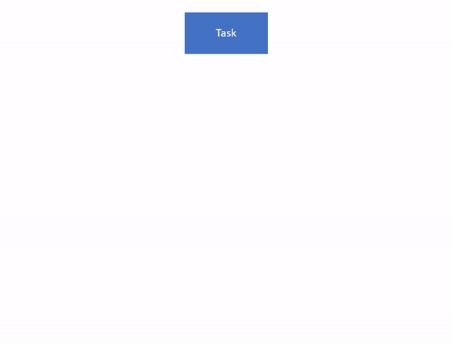

# ForkJoin

>原文地址:https://blog.csdn.net/TheLudlows/article/details/84312105

## 文章目录
- 1. 概述
  - 1.1 并行和并发
  - 1.2 Fork/Join工作流程
  - 1.3 什么是工作窃取？
  - 1.4 如何使用？
- 2. 原理分析
  - 2.1 ForkJoinPool的构造
  - 2.2 任务队列 WorkQueue类剖析
  - 2.3 任务的提交
  - 2.4 工作线程
  - 2.5 执行任务
- 3. 性能对比分析
- 4. 总结
## 1. 概述

Java 1.7 引入了一种新的并发框架—— Fork/Join Framework。这个框架使用的场景就是将一个大任务按照意愿切分成N个小任务并行执行,并最终聚合结果,加快运算。

### 1.1 并行和并发

这里的执行指的是多任务同时在多个线程中并行。这里说的是并行，而不是并发。并行是指系统内有多个任务同时执行，而并发是指系统内有多个任务同时存在，不同的任务按时间分片的方式切换执行，给人的感觉好像是在同时执行。

## 1.2 Fork/Join工作流程

Fork/Join采用的是分治法，Fork是将一个大任务拆分成若干个子任务，子任务分别去计算，而Join是获取到子任务的计算结果，然后合并，这个是递归的过程。子任务被分配到不同的核上执行时，效率最高。伪代码如下：
```java
Result solve(Problem problem) {
    if (problem is small)
        directly solve problem
    else {
        split problem into independent parts
        fork new subtasks to solve each part
        join all subtasks
        compose result from subresults
    }
}
```
主要有两个步骤，1. 任务拆分，递归调用，2. 合并结果，


- 第一步中递归地将任务划分为较小的子任务，直到达到给定的阈值。
- 第二步将独立处理子任务，如果它们返回结果，则将所有结果递归地组合成单个结果。

为了并行执行任务，Fork/Join使用一个线程池，`默认情况下，线程数等于Java虚拟机（JVM）可用的处理器数`。

任务添加到任务队列，这一点和ThreadPoolExecutor不同，ThreadPoolExecutor是所有线程公用一个工作队列，而在Fork/Join中每个线程都有自己的工作队列，并且使用工作窃取（work-stealing）充分的利用资源。

## 1.3 什么是工作窃取？

每一个工作线程维护自己的调度队列中的可运行任务。队列以双端队列的形式被维护。不仅支持后进先出 —— LIFO的push和pop操作，还支持先进先出 —— FIFO的take操作。

比如一个大任务在一个工作线程中，产生的子任务将会被放入到该线程自己的双端队列中，这个子任务不断的产生子任务，直到到达阈值。开始计算任务（最小的任务）-合并操作，合并操作是按照先进后出从队列中取出任务。

当一个工作线程的本地没有任务去运行的时候，它将使用先进先出 —— FIFO的规则尝试随机的从别的工作线程中拿一个任务去运行。

让窃取任务的线程从队列拥有者相反的方向进行操作会减少线程竞争，关于工作窃取讲到这里，后面会分析它的实现原理。

## 1.4 如何使用？

假设情况需要计算1-1kW的和，使用ForkJoin代码如下：
```java
public class ForkjoinCP {
  public static Long count(List<Long> data) {
    final long start = System.currentTimeMillis();
    ForkJoinPool pool = new ForkJoinPool();
    SumTask task = new SumTask(data);
    Long result = pool.invoke(task);
    System.out.println("Executed with fork/join in (ms): " + (System.currentTimeMillis() - start));
    return result;
  }
  //子任务需要继承RecursiveTask 
  static class SumTask extends RecursiveTask<Long> {
    private List<Long> data;
    public SumTask(List<Long> data) {
      this.data = data;
    }

    @Override
    protected Long compute() {// 递归方法
	  // 当需要计算的长度50000时，直接计算结果
      if (data.size() <= 50000) {
        return computeSumDirectly();
      } else {
        int mid = data.size() 
		// 拆分任务
        SumTask firstSubtask = new SumTask(data.subList(0, mid));
        SumTask secondSubtask = new SumTask(data.subList(mid, data.size()));
        // 提交子任务
		firstSubtask.fork();
        secondSubtask.fork();
		// 等待子任务执行，合并结果
        return firstSubtask.join() + secondSubtask.join();
      }
    }

    private long computeSumDirectly() {
      long sum = 0;
      for (Long l : data) sum += l;
      return sum;
    }
  }

}
```

启动代码如下：
```java
public class MainStart {

  public static void main(String[] args) {
    List<Long> data = LongStream
        .range(1, 10000000)
        .boxed()
        .collect(toList());
    System.out.println(ParallelCP.count(data));
  }
}
```
## 2. 原理分析
### 2.1 ForkJoinPool的构造

ForkJoinPool里三个重要的角色：

- ForkJoinWorkerThread（下文简称worker）：包装Thread；
- WorkQueue：任务队列，双向；
- ForkJoinTask：worker执行的对象，实现了Future。两种类型，一种叫submission，另一种就叫task

ForkJoinPool使用数组保存所有WorkQueue,每个worker有属于自己的WorkQueue，但不是每个WorkQueue都有对应的worker。

没有worker的WorkQueue：保存的是submission，来自外部提交，在WorkQueue[]的下标是偶数；
属于worker的WorkQueue：保存的是task，在WorkQueue[]的下标是奇数。

ForkJoin中的重要属性如下：
```java
    // Instance fields
    volatile long ctl;                   // main pool control
    volatile int runState;               // lockable status
    final int config;                    // parallelism, mode
    int indexSeed;                       // to generate worker index
    volatile WorkQueue[] workQueues;     // main registry
    final ForkJoinWorkerThreadFactory factory;
    final UncaughtExceptionHandler ueh;  // per-worker UEH
    final String workerNamePrefix;       // to create worker name string
    volatile AtomicLong stealCounter;    // also used as sync monitor
```
ForkJoinPool有两种获取方法，通过commonPool方法或者通过构造方法创建一个对象。前者是内部的一个静态变量，也就是说在一个进程中共享该ForkJoinPool。下面是构造方法：
```java
public ForkJoinPool() {
    this(Math.min(MAX_CAP, Runtime.getRuntime().availableProcessors()),
         defaultForkJoinWorkerThreadFactory, null, false);
}
public ForkJoinPool(int parallelism,
                    ForkJoinWorkerThreadFactory factory,
                    UncaughtExceptionHandler handler,
                    boolean asyncMode) {
    this(checkParallelism(parallelism),
         checkFactory(factory),
         handler,
         asyncMode ? FIFO_QUEUE : LIFO_QUEUE,
         "ForkJoinPool-" + nextPoolId() + "-worker-");
    checkPermission();
}
private ForkJoinPool(int parallelism,
                     ForkJoinWorkerThreadFactory factory,
                     UncaughtExceptionHandler handler,
                     int mode,
                     String workerNamePrefix) {
    this.workerNamePrefix = workerNamePrefix;
    this.factory = factory;
    this.ueh = handler;
    this.config = (parallelism & SMASK) | mode;
    long np = (long)(-parallelism); // offset ctl counts
    this.ctl = ((np << AC_SHIFT) & AC_MASK) | ((np << TC_SHIFT) & TC_MASK);
}
```

可以看到这里有三个构造方法的重载，parallelism默认是cpu核心数，factory是线程工厂，ctl是ForkJoinPool中最重要的控制字段，类型是long - 说明有64位,每个部分都有不同的作用。64位分为了四部分，每部分16位代表的值表示一个含义。从高到底以1,2,3,4表示。

- 1表示活动的线程数,常用AC代替
- 2表示线程总量，常用TC代替T
- 3表示工作队列的状态，active的还是inactive，其余十五位表示版本号，防止ABA问题。
- 4标识idle worker的WorkQueue 在WorkQueue[]数组中的index。这里需要说明的是,ctl的后32位其实只能表示一个idle workers，那么我们如果有很多个idle worker要怎么办呢？老爷子使用的是stack的概念来保存这些信息。后32位标识的是top的那个,我们能从top中的变量stackPred追踪到下一个idle worker。PS:workqueue中有一个workThread字段，用来和worker是关联的。

AC和TC初始化时取的是parallelism负数，后续代码可以直接判断正负，为负代表还没有达到目标数量。另外ctl低32位有个技巧可以直接用sp=(int)ctl取得，为负代表存在空闲worker。

config保存不变的参数，包括了parallelism和mode，线程池记录字段是runState，具体介绍在后面。

## 2.2 任务队列 WorkQueue类剖析
用于存放任务的队列，ForkJoin中用双端队列来实现。所谓双端，就是说队列中的元素（ForkJoinTask任务及其子任务）可以从一端入队出队，还可以从另一端入队出队。这个双端队列将用于支持ForkJoinPool的异步模型（asyncMode）：后进先出（LIFO_QUEUE）和先进先出（FIFO_QUEUE）。

下面是它的一些重要属性。
```java
 @sun.misc.Contended
static final class WorkQueue {
  //初始化容量
  static final int INITIAL_QUEUE_CAPACITY = 1 << 13;
  //最大容量
  static final int MAXIMUM_QUEUE_CAPACITY = 1 << 26; // 64M

  // 队列的状态 
  // 偶数表示RUNNING  
  // 奇数表示SCANNING 
  // 如果WorkQueue没有属于自己的owner(下标为偶数的都没有),该值为 inactive 也就是一个负数
  volatile int scanState;    
  int stackPred;             // pool stack (ctl) predecessor
  int nsteals;               // 窃取的个数
  int hint;                  // 
  int config;                // pool index and mode
  // 锁标识,在多线程往队列中添加数据会有竞争。 1: locked, < 0: terminate; else 0
  volatile int qlock;         
  // 下一个出队元素的索引位（主要是为线程窃取准备的索引位置）
  volatile int base;         
  // 为下一个入队元素准备的索引位
  int top;                   
  // 队列中使用数组存储任务
  ForkJoinTask<?>[] array;   
  // 队列所属的ForkJoinPool（可能为空）
  final ForkJoinPool pool;  
  // 这个队列所属的归并计算工作线程。注意：工作队列也可能不属于任何工作线程
  final ForkJoinWorkerThread owner; 
  volatile Thread parker;    // == owner during call to park; else null
  // 记录当前正在进行join等待的其它任务
  volatile ForkJoinTask<?> currentJoin;  // task being joined in awaitJoin
  // 当前正在偷取的任务
  volatile ForkJoinTask<?> currentSteal; // mainly used by helpStealer
}
```
下面看看放入任务的操作，push方法
```java
//array的初始化是在任务线程的初始化时完成的，因此这里array不会为空。
final void push(ForkJoinTask<?> task) {
  ForkJoinTask<?>[] a; ForkJoinPool p;
  int b = base, s = top, n;
  if ((a = array) != null) {    // ignore if queue removed
      int m = a.length - 1;     // fenced write for task visibility
      U.putOrderedObject(a, ((m & s) << ASHIFT) + ABASE, task);
      U.putOrderedInt(this, QTOP, s + 1);
      if ((n = s - b) <= 1) {
          if ((p = pool) != null)
              p.signalWork(p.workQueues, this);
      }
      else if (n >= m)
          growArray();
  }
}
```

U是Unsafe的实例，在这里用来操作数组。putOrderedObject方法在指定的对象a中，指定的内存偏移量的位置，赋予一个新的元素。这里是在队列的尾部添加一个元素。
putOrderedInt方法对当前指定的对象中的指定字段，进行赋值操作。这里的代码意义是将workQueue对象本身中的top标示的位置 + 1，s在当前活动的工作线程过少的情况下，通过调用signalWork创建新的工作线程。如果当队列的容量和数组的长度相等时，进行扩容。

ForkJoinPool中主要的工作线程，采用ForkJoinWorkerThread定义，其中有两个主要属性pool和workQueue:
```java
public class ForkJoinWorkerThread extends Thread {
  final ForkJoinPool pool;                // the pool this thread works in
  final ForkJoinPool.WorkQueue workQueue; // work-stealing mechanics
}
```

pool属性表示这个进行归并计算的线程所属的ForkJoinPool实例，workQueue属性是java.util.concurrent.ForkJoinPool.WorkQueue这个类的实例，它表示这个线程所使用的子任务待执行队列，而且可以被其它工作线程偷取任务。

## 2.3 任务的提交
ForkJoinPool提供execute和invoke、submit方法來提交任務：
- submit：提交任务并返回任务
- execute：只提交任务
- invoke：提交并返回任务结果(return task.join())

三者的內部實現基本一樣，以invoke為例：
```java
public <T> T invoke(ForkJoinTask<T> task) {
  externalPush(task);
  return task.join();
}
```
虽然这里调用的是externalPush，但是在外部提交的任务经过都会在externalPush内部调用externalSubmit方法。

```java
private void externalSubmit(ForkJoinTask<?> task) {
    int r;                                   
    if ((r = ThreadLocalRandom.getProbe()) == 0) {// 取得一个随机探查数
        ThreadLocalRandom.localInit();
        r = ThreadLocalRandom.getProbe();
    }
    for (;;) {
        WorkQueue[] ws; WorkQueue q; int rs, m, k;
        boolean move = false;
        if ((rs = runState) < 0) { // 如果已经结束
            tryTerminate(false, false);    
            throw new RejectedExecutionException();
        }
        // 如果条件成立，就说明当前ForkJoinPool类中，还没有任何队列，所以要进行队列初始化
        else if ((rs & STARTED) == 0 || ((ws = workQueues) == null || (m = ws.length - 1) < 0)) {//【A】
            int ns = 0;
            rs = lockRunState();
            try {
                if ((rs & STARTED) == 0) {
                    // 通过原子操作，完成“任务窃取次数”这个计数器的初始化
                    U.compareAndSwapObject(this, STEALCOUNTER, null, new AtomicLong());
                    // 创建workQueue 数组
                    int p = config & SMASK; // ensure at least 2 slots
                    int n = (p > 1) ? p - 1 : 1;
                    n |= n >>> 1; n |= n >>> 2;  n |= n >>> 4;
                    n |= n >>> 8; n |= n >>> 16; n = (n + 1) << 1;
                    workQueues = new WorkQueue[n];
                    ns = STARTED;
                }
            } finally {
                unlockRunState(rs, (rs & ~RSLOCK) | ns);//释放锁
            }
        }else if ((q = ws[k = r & m & SQMASK]) != null) {// 【C】
            if (q.qlock == 0 && U.compareAndSwapInt(q, QLOCK, 0, 1)) {
                ForkJoinTask<?>[] a = q.array;
                int s = q.top;
                boolean submitted = false; // initial submission or resizing
                try {                      // locked version of push
                    if ((a != null && a.length > s + 1 - q.base) ||
                        (a = q.growArray()) != null) {
                        int j = (((a.length - 1) & s) << ASHIFT) + ABASE;
                        U.putOrderedObject(a, j, task);
                        U.putOrderedInt(q, QTOP, s + 1);
                        submitted = true;
                    }
                } finally {
                    U.compareAndSwapInt(q, QLOCK, 1, 0);
                }
                if (submitted) {
                    signalWork(ws, q);
                    return;
                }
            }
            move = true;                   // move on failure
        } else if (((rs = runState) & RSLOCK) == 0) { // 创建workQueue数组中的元素，workQueue即对象 //【B】
            q = new WorkQueue(this, null);
            q.hint = r;
            q.config = k | SHARED_QUEUE;
            q.scanState = INACTIVE;
            rs = lockRunState();           // publish index
            if (rs > 0 &&  (ws = workQueues) != null && k < ws.length && ws[k] == null)
                ws[k] = q;                 // else terminated
            unlockRunState(rs, rs & ~RSLOCK);
        }
        else
            move = true;                   // move if busy
        if (move)
            r = ThreadLocalRandom.advanceProbe(r);
    }
}
```
首先检查运行状态是否已经进入SHUTDOWN，抛出拒收的异常。

- 第一次循环中，运行状态还没有STARTED，执行A】分支。进行初始化操作,设置原子对象stealCounter,按2的幂设置WorkQueue[]的长度,然后运行状态进入STARTED

- 第二次循环中，workQueues不为空，继续执行，先执行【C】分支的判断语句。随机取一个小于workQueues长度的偶数（不一定是0），赋值给k，然后判断workQueues[k]是否为空，显然第二次循环中为空，因此最终跳入【B】分支，创建第一个WorkQueue。

- 第三次循环中，执行【C】分支，会找到刚才创建的WorkQueue，从队列的top端加入任务，signalWork激活或者创建worker。

这个过程代码比较复杂，主要大神是把Unsafe操作和位操作玩的出神入化，多看几遍也就习惯了。

WorkQueue在WorkQueue[]的下标，取的是k = r & m & SQMASK。

r是线程的probe，来自随机数ThreadLocalRandom；m是WorkQueue[]的长度减一；

SQMASK是固定值0x007e，转为二进制是1111110，末尾是0，在&操作后，得出的k必定是小于数组长度的偶数。

所以创建的第一个WorkQueue没有对应worker，保存的任务是submission类型，scanState默认是INACTIVE。

还有一个比较重要的点就是数组长度n的计算。我们单独把它拉出来数。
```java
int p = config & SMASK; // SMASK是一个常量0xffff
int n = (p > 1) ? p - 1 : 1;
n |= n >>> 1; n |= n >>> 2;  n |= n >>> 4;
n |= n >>> 8; n |= n >>> 16; n = (n + 1) << 1;
 workQueues = new WorkQueue[n];
```
config是在ForkJoin的构造函数进行初始化的,`this.config = (parallelism & SMASK) | mode`;,其中`parallelism`是并发等级，`默认是cpu核心数`。比如我的机器是4，mode是构造函数中设定的`asyncMode`，如果为LIFO，则mode为0，否则为65536。默认是LIFO也就是0，因此config为4，第二行结束后n为3。进过一连串的位移操作后最后变成了8。

至于externalPush知识externalSubmit的简单版本。也是大部分的情况，即WorkQueue数组创建好了，并且随机取到的WorkQueue也不为空，将Task加入到WorkQueue中。和【C】分支流程基本一样。

## 2.4 工作线程
work线程的管理包括对线程的创建、唤醒、注册、撤销。

接着前面一小节，当创建第一个WorkQueue并加入第一个任务，调用了signalWork，入参是WorkQueue[]和当前操作的WorkQueue。
```java
final void signalWork(WorkQueue[] ws, WorkQueue q) {
    long c; int sp, i; WorkQueue v; Thread p;
    while ((c = ctl) < 0L) {                       // too few active
        if ((sp = (int)c) == 0) {                  // no idle workers
            if ((c & ADD_WORKER) != 0L)            // too few workers
                tryAddWorker(c);
            break;
        }
        if (ws == null)                            // unstarted/terminated
            break;
        if (ws.length <= (i = sp & SMASK))         // terminated
            break;
        if ((v = ws[i]) == null)                   // terminating
            break;
        int vs = (sp + SS_SEQ) & ~INACTIVE;        // next scanState
        int d = sp - v.scanState;                  // screen CAS
        long nc = (UC_MASK & (c + AC_UNIT)) | (SP_MASK & v.stackPred);
        if (d == 0 && U.compareAndSwapLong(this, CTL, c, nc)) {
            v.scanState = vs;                      // activate v
            if ((p = v.parker) != null)
                U.unpark(p);
            break;
        }
        if (q != null && q.base == q.top)          // no more work
            break;
    }
}
```

回忆下ctl的四个部分的含义，初始ctl为负数时（AC是parallelism的负数），线程还没有达到目标数量，因此进入循环。
接着取ctl的低32位，构造函数中只是初始化了高32位，低32位为0，继续往下走。ADD_WORKER是什么呢？这个常量其实就是用来辅助判断线程是否已经达到阈值。

接着进入创建线程的方法。
```java
private void tryAddWorker(long c) {
    boolean add = false;
    do {
        long nc = ((AC_MASK & (c + AC_UNIT)) |
                   (TC_MASK & (c + TC_UNIT)));
        if (ctl == c) {
            int rs, stop;                 // check if terminating
            if ((stop = (rs = lockRunState()) & STOP) == 0)
                add = U.compareAndSwapLong(this, CTL, c, nc);
            unlockRunState(rs, rs & ~RSLOCK);
            if (stop != 0)
                break;
            if (add) {
                createWorker();
                break;
            }
        }
    } while (((c = ctl) & ADD_WORKER) != 0L && (int)c == 0);
}
```

tryAddWork中讲AC和TC数量加1，如果操作成功，即add为true，然后才真正的创建工作线程。
这里也是比较直观的，通过工厂类来创建工作线程，如果创建成功，则启动线程。并返回。如果失败，则撤销，撤销的逻辑也就是删除工作线程的任务队列，将AC和TC减1.
```java
private boolean createWorker() {
    ForkJoinWorkerThreadFactory fac = factory;
    Throwable ex = null;
    ForkJoinWorkerThread wt = null;
    try {
        if (fac != null && (wt = fac.newThread(this)) != null) {
            wt.start();
            return true;
        }
    } catch (Throwable rex) {
        ex = rex;
    }
    deregisterWorker(wt, ex);
    return false;
}
```

我们着重分下工作线程的创建过程。也就是fac.newThread(this)，newThread方法内部调用了 ForkJoinWorkerThread的构造方法。

```java
protected ForkJoinWorkerThread(ForkJoinPool pool) {
    // Use a placeholder until a useful name can be set in registerWorker
    super("aForkJoinWorkerThread");
    this.pool = pool;
    this.workQueue = pool.registerWorker(this);
}
```

在ForkJoinWorkerThread的构造方法中进行了注册操作，那么到底注册什么呢？我们知道每一个线程都会有一个workQueue，并且workQueue在数组中下表为奇数。因此在这里是创建一个workQueue和该线程关联。

## 2.5 执行任务
当工作线程启动了之后会运行ForkJoinWorkerThread重写的run方法
```java
 public void run() {
  onStart(); //空实现
  pool.runWorker(workQueue);
  onTermination(exception);
}

final void runWorker(WorkQueue w) {
    w.growArray();                   // allocate queue
    int seed = w.hint;               // initially holds randomization hint
    int r = (seed == 0) ? 1 : seed;  // avoid 0 for xorShift
    for (ForkJoinTask<?> t;;) {
        if ((t = scan(w, r)) != null)
            w.runTask(t);
        else if (!awaitWork(w, r))
            break;
        r ^= r << 13; r ^= r >>> 17; r ^= r << 5; // xorshift
    }
}
```
这里有三个重点，scan：尝试获取一个任务，runTask：执行取得的任务，awaitWork：没有任务进入等待。如果awaitWork返回false，等不到任务，跳出runWorker的循环，回到run中执行finally，最后调用deregisterWorker撤销注册。

## 3. 性能对比分析
## 4. 总结
ForkJoinPool 最适合的是计算密集型的任务，如果存在 I/O，线程间同步，sleep() 等会造成线程长时间阻塞的情况时，最好配合使用 ManagedBlocker。
Fork/Join又和线程池（ExecutorService）有些类似，它可以看做是线程池的补充，只适用于特殊的场景。
