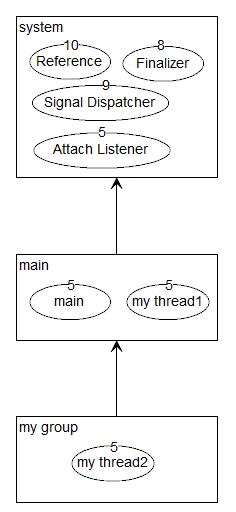

# Thread 与 ThreadGroup

在学习JUC中内容的时候看到了这部分的知识

Executor中实现了 DefaultThreadFactory，其中提供具体线程

参考文章： https://www.cnblogs.com/yiwangzhibujian/p/6212104.html
参考文章： https://www.jianshu.com/p/bcec38867695  |   https://www.jianshu.com/p/b27feca3b83b

## Thread和ThreadGroup的关系

ThradGroup之间的关系是树的关系，而Thread与ThradGroup的关系就像元素与集合的关系。关系图简单如下：



- ThreadGroup / Thread 关系
  - Thread 是 ThreadGroup的成员
  - ThreadGroup 之间是包含关系

- JVM自身会启用一个 system group作为系统线程（group）
```java
// ThreadGroup类中的一个构造
// ⭐ 这里明确写着 系统线程，并且是 C code来调用
    /**
     * Creates an empty Thread group that is not in any Thread group.
     * This method is used to create the system Thread group.
     */
    private ThreadGroup() {     // called from C code
        this.name = "system";
        this.maxPriority = Thread.MAX_PRIORITY;
        this.parent = null;
    }
```
- 主线程main（group）创建在system中
  - 在main里面查看当前group名称为 main
  - 当前group的parent为 system

通过jvm可视化工具查看线程，也可以看到主线程


## Thread 类

- 基本属性
  - name
  - id 线程ID，一个long值，创建线程时指定，终生不变，线程终结ID可以服用
  - priority： 线程优先级
  - state： 线程状态
    - ThreadState枚举类有
      - NEW
      - RUNNABLE
      - BLOCKED
      - WARNING
      - THMED_WAITING
      - TERMINATED
  - ThreadGroup：所属线程组 `一个线程必定属于某个线程组`
  - UncaughtExceptionHandler :未捕获时的异常处理器，默认没有，线程报错会立即中介当前线程
  - boolean single_step:此线程是否single_step
  - boolean daemon：测线程是否时daemon
  - 还有一些其他的，不一一列举了
  - 部分参数可以参考构造参数部分提到的
- 字段摘要（几个静态变量）
  - MIN_PRIORITY = 1
  - NORM_PRIORITY = 5
  - MAX_PRIORITY = 10
- 构造方法（全参数的）
  - 说明，Thread类的构造，都是调用了一个init方法
  - private void init(ThreadGroup g, Runnable target, String name, long stackSize, AccessControlContext acc, boolean inheritThreadLocals)
    - ThreadGroup 线程组
      - 如果没有设置线程组 首先尝试 获取 security.getThreadGroup作为线程组
      - 否则就获取 currentThread 作为线程组
      - 如果设置了，就直接用配置的
    - Runnable target 要在这个线程中运行的对象
    - name 新线程的名字
    - stackSize 想要设置的stack size，如果是0表示参数被忽略
    - acc 要继承的AccessControlContext，如果没有设置，会使用AccessController.getContext
    - inheritThreadLocals : 如果时true的话，会从创建线程继承initial values配置给 inheritable thread-locals 
    - 除了处理上面的参数，还会做什么
      - 设置当前线程是否daemon：与其parent相同
      - 设置priority：与其parent线程相同
      - 设置 contextClassLoader
      - 设置 tid ： threadId = nextThreadID()
        - 说明：Thread静态存储了一个 threadSeqNumber，每次++
- 一些重要方法介绍
  - 静态方法
    - currentThread 当前线程
    - activeCount 当前线程组中活动线程的数目
    - dumpStack：将当前线程的栈跟踪打印纸标准错误流
    - int enumerate(Thread[] tarray) 将当前线程的线程组及其子组中的每个活动线程复制到指定的数组中
      - 测试activeCount 和 tarray获取到的数量时有差别的（尝试获取的时main 和 system线程组，有些线程应该是不可见的）
      - 使用自己创建的线程组与线程就没有什么问题
    - Map<Thread,StackTraceElement[]> getAllStackTraces() 返回所有活动线程的栈跟踪的一个映射
    - boolean holdsLock(Object obj) : 当且仅当 当前线程在指定的对象上保持监视器锁时候，才返回true
    - Boolean interrupted() 测试当前线程是否已经终端
    - void setDefaultUncaughtExceptionHandler
    - void sleep 休眠时间
    - yield 暂停 
  - 普通方法
    - checkAccess 判断当前运行的线程是否有有权修改该线程
    - getContextClassLoader
    - getId
    - getName
    - getPriority
    - getStackTrace
    - getState
    - getThreadGroup
    - ⭐interrupt 中断线程
    - isAlive 
    - isDaemon
    - isInterrupted
    - join 等待该线程种植
    - ⭐join(long millis) 等待这个线程 millis时间
    - ⭐run 线程启动后执行的方法
    - setContextClassLoader
    - setDeamon
    - ⭐ start 线程开始执行（调用run）
    - toString
  - 作废方法/过期方法
    - countStackFrames
    - destroy 破坏线程，不释放锁
    - suspend 挂起线程
    - resume 回复线程
    - stop 停止线程释放锁
    - 为什么 这些方法过期了，以及如可处理 https://blog.csdn.net/loongshawn/article/details/53034176

### 关于UncaughtExceptionHandler

在run的时候可能会报错，一些运行时异常，我们可能在try-catch里面进行处理，UncaughtExceptionHandler可以在不影响代码结构的情况下，处理这些不被handler的错误

### interrupt interrupted isInterrupted 三个方法

stop方法已经不建议使用了，我们想要停止一个线程，思路变为： 让 run方法 return

这时候我们可以使用一个 变量，在run里面判断这个变量的状态，决定是否return

如果这个变量时外部传来的，那么我们就可以在外部控制run方法了

⭐⭐ 对于上面提到的这个思路， Thread类是由类似的功能的，就是 interrupt系列方法，我们只要在 run方法里面虚幻部分，判断 中断 状态就可以了

### yield 与 sleep(0)

给一个让出cpu的可能

### stop suspend resume 为什么废弃了

stop方法会立即中断线程，虽然会释放持有的锁，但是线程的运行到哪是未知的，假如在具有上下文语义的位置中断了，那么将会导致信息出现错误，比如：
```java
@Override
public void run(){
    try{
        //处理资源并插入数据库
    }catch(Exception e){
        //出现异常回滚
    }
}
```
　　如果在调用stop时，代码运行到捕获异常需要回滚的地方，那么将会因为没有回滚，保存了错误的信息。

　　而suspend会将当前线程挂起，但是并不会释放所持有的资源，如果恢复线程在调用resume也需要那个资源，那么就会形成死锁。当然可以通过你精湛的编程来避免死锁，但是这个方法具有固有的死锁倾向。所以不建议使用。其他暂停方法为什么可用：
- wait方法会释放锁，所以不会有死锁问题
- sleep方法虽然不释放锁，但是它不需要唤醒，在使用的时候已经指定想要的睡眠时间了。

　jdk的文章详细介绍了方法禁用的原因： https://docs.oracle.com/javase/8/docs/technotes/guides/concurrency/threadPrimitiveDeprecation.html

## ThreadGroup API

4.1 基本属性
　　name：当前线程的名称。
　　parent：当前线程组的父线程组。
　　MaxPriority：当前线程组的最高优先级，其中的线程优先级不能高于此。
4.2 构造方法
　　只介绍一个构造方法：
　　ThreadGroup(ThreadGroup parent, String name) ：
parent：父线程组，若为指定则是创建该线程组的线程所需的线程组。
name：线程组的名称，可重复。
4.3 常用方法摘要
　　API详解（中文，英文）。
int activeCount()：返回此线程组中活动线程的估计数。 
void interrupt()：中断此线程组中的所有线程。 
void uncaughtException(Thread t, Throwable e) ：设置当前线程组的异常处理器（只对没有异常处理器的线程有效）。
4.4 ThreadGroup作用
　　这个线程组可以用来管理一组线程，通过activeCount() 来查看活动线程的数量。其他没有什么大的用处。　