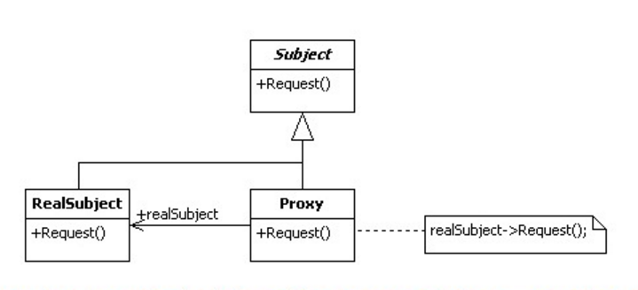

# 动态代理

> Proxy 与 InvocationHandler

## 代理的基本构成

- 抽象角色
  - 声明真实对象和代理对象的共同接口,这样可在任何使用真实对象的地方都可以使用代理对象。
- 代理角色
    - `代理对象内部含有真实对象的引用`，从而可以在任何时候操作真实对象。代理对象提供一个与真实对象相同的接口，以便可以在任何时候替代真实对象。`代理对象通常在客户端调用传递给真实对象之前或之后，执行某个操作`，而不是单纯地将调用传递给真实对象，同时，代理对象可以在执行真实对象操作时，附加其他的操作，相当于对真实对象进行封装。
- 真实角色
    - 即为代理对象所代表的目标对象，代理角色所代表的真实对象，是我们最终要引用的对象。

下图有三种角色：Subject抽象角色、RealSubject真实角色、Proxy代理角色。其中：Subject角色负责定义RealSubject和Proxy角色应该实现的接口；RealSubject角色用来真正完成业务服务功能；Proxy角色负责将自身的request请求，调用RealSubject对应的request功能来实现业务功能，自己不真正做业务。



-----------------------------------

### 静态代理（这里不是重点）

```java
interface Subject//抽象角色
{  
    public void doSomething();  
}
class RealSubject implements Subject//真实角色
{  
    public void doSomething()  
  {  
    System.out.println( "call doSomething()" );  
  }  
}
class SubjectProxy implements Subject//代理角色
{
  //代理模式的作用是：为其他对象提供一种代理以控制对这个对象的访问。
  Subject subimpl = new RealSubject();
  public void doSomething()
  {
     System.out.println("before"); //调用目标对象之前可以做相关操作
     subimpl.doSomething();
     System.out.println("after");//调用目标对象之后可以做相关操作
  }
}
 
public class Test
{
    public static void main(String[] args) throws Exception
    {
        Subject sub = new SubjectProxy();
        sub.doSomething();
    }
}
```
可以看到，SubjectProxy实现了Subject接口（和RealSubject实现相同接口），并持有的是Subject接口类型的引用。这样调用的依然是doSomething方法，只是实例化对象的过程改变了，结果来看，代理类SubjectProxy可以自动为我们加上了before和after等我们需要的动作。

　　如果将来需要实现一个新的接口，就需要在代理类里再写该接口的实现方法，对导致代理类的代码变得臃肿；另一方面，当需要改变抽象角色接口时，无疑真实角色和代理角色也需要改变。

-------------------------

### JDK 动态代理

```java
// 接口
interface Subject  
{  
    public void doSomething();  
}
// 被代理者
class RealSubject implements Subject  
{  
    public void doSomething()  
  {  
     System.out.println( "call doSomething()" );  
  }  
}
// 代理
class ProxyHandler implements InvocationHandler
{
    private Object tar;
    //绑定委托对象，并返回代理类
    public Object bind(Object tar)
    {
        this.tar = tar;
        //绑定该类实现的所有接口，取得代理类
        return Proxy.newProxyInstance(tar.getClass().getClassLoader(),
                                      tar.getClass().getInterfaces(),
                                      this);
    }   
    public Object invoke(Object proxy , Method method , Object[] args)throws Throwable//不依赖具体接口实现
    {
        Object result = null;//被代理的类型为Object基类
        //这里就可以进行所谓的AOP编程了
        //在调用具体函数方法前，执行功能处理
        result = method.invoke(tar,args);
        //在调用具体函数方法后，执行功能处理
        return result;
    }
}
public class Test
{
    public static void main(String args[])
    {
           ProxyHandler proxy = new ProxyHandler();
           //绑定该类实现的所有接口
           Subject sub = (Subject) proxy.bind(new RealSubject());
           sub.doSomething();
    }
}
```
- 在调用过程中使用了通用的代理类包装了RealSubject实例
- 然后调用了Jdk的代理工厂方法实例化了一个具体的代理类
- 最后调用代理的doSomething方法，还有附加的before、after方法可以被任意复用（只要我们在调用代码处使用这个通用代理类去包装任意想要需要包装的被代理类即可）
- 当接口改变的时候，虽然被代理类需要改变，但是我们的代理类却不用改变了
- 这个调用虽然足够灵活，可以动态生成一个具体的代理类，而不用自己显示的创建一个实现具体接口的代理类。

 