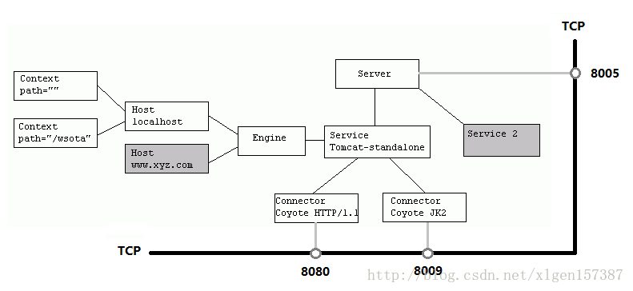
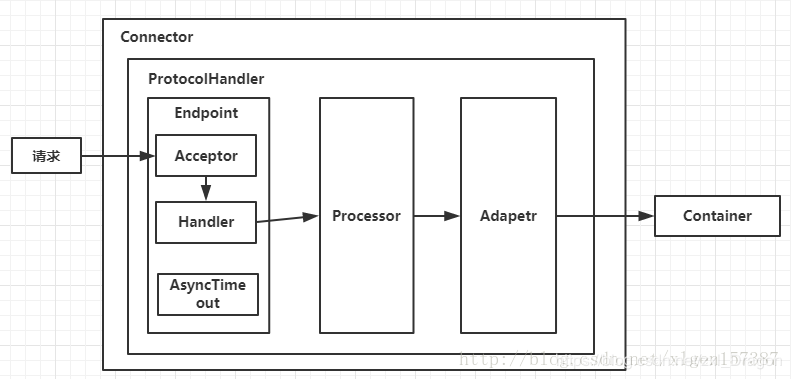
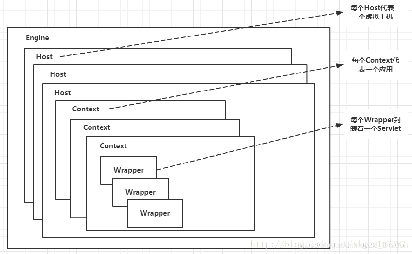
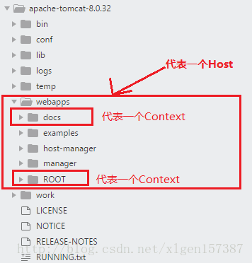
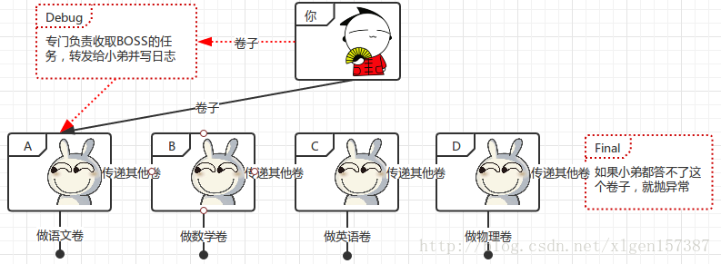

# Tomcat

> 原作 https://blog.csdn.net/zxl_dragon/article/details/83584667

> 原作2 https://blog.csdn.net/xlgen157387/article/details/79006434


Tomcat中最顶层的容器是Server，代表着整个服务器，从上图中可以看出，一个Server可以包含至少一个Service，用于具体提供服务。


一个Tomcat中只有一个Server，一个Server可以包含多个Service，一个Service只有一个Container，但是可以有多个Connectors，这是因为一个服务可以有多个连接，如同时提供Http和Https链接，也可以提供向相同协议不同端口的连接,如上图。

Service主要包含两个部分：`Connector`和`Container`。从上图中可以看出 Tomcat 的心脏就是这两个组件，他们的作用如下：

- Connector用于处理连接相关的事情，并提供Socket与Request和Response相关的转化;Connector最底层使用的是Socket来进行连接的，Request和Response是按照HTTP协议来封装的，所以Connector同时需要实现TCP/IP协议和HTTP协议
- Container用于封装和管理Servlet，以及具体处理Request请求；
Server标签设置的端口号为8005，shutdown=”SHUTDOWN” ，表示在8005端口监听“SHUTDOWN”命令，如果接收到了就会关闭Tomcat。上述的包含关系或者说是父子关系，都可以在tomcat的conf目录下的server.xml配置文件中看出：

```xml
<?xml version="1.0" encoding="UTF-8"?>
<Server port="8005" shutdown="SHUTDOWN">
  <Listener className="org.apache.catalina.startup.VersionLoggerListener" />
  <Listener className="org.apache.catalina.core.AprLifecycleListener" SSLEngine="on" />
  <Listener className="org.apache.catalina.core.JreMemoryLeakPreventionListener" />
  <Listener className="org.apache.catalina.mbeans.GlobalResourcesLifecycleListener" />
  <Listener className="org.apache.catalina.core.ThreadLocalLeakPreventionListener" />
  <GlobalNamingResources>
    <Resource name="UserDatabase" auth="Container"
              type="org.apache.catalina.UserDatabase"
              description="User database that can be updated and saved"
              factory="org.apache.catalina.users.MemoryUserDatabaseFactory"
              pathname="conf/tomcat-users.xml" />
  </GlobalNamingResources>
  <!-- Service配置 -->
  <Service name="Catalina">
    <!--  connector 处理链接 -->
    <Connector port="8080" protocol="HTTP/1.1"
               connectionTimeout="20000"
               redirectPort="8443" />
    <Connector port="8009" protocol="AJP/1.3" redirectPort="8443" />
    <!-- Container 配置唯一的Engine -->
    <Engine name="Catalina" defaultHost="localhost">
      <Realm className="org.apache.catalina.realm.LockOutRealm">
        <Realm className="org.apache.catalina.realm.UserDatabaseRealm"
               resourceName="UserDatabase"/>
      </Realm>

      <Host name="localhost"  appBase="webapps"
            unpackWARs="true" autoDeploy="true">
        <Valve className="org.apache.catalina.valves.AccessLogValve" directory="logs"
               prefix="localhost_access_log" suffix=".txt"
               pattern="%h %l %u %t &quot;%r&quot; %s %b" />

      </Host>
    </Engine>
  </Service>
</Server>

```


### Tomcat顶层架构小结：
- （1）Tomcat中只有一个Server，一个Server可以有多个Service，一个Service可以有多个Connector和一个Container； 
- （2） Server掌管着整个Tomcat的生死大权； 
- （4）Service 是对外提供服务的； 
- （5）Connector用于接受请求并将请求封装成Request和Response来具体处理； 
- （6）Container用于封装和管理Servlet，以及具体处理request请求；

知道了整个Tomcat顶层的分层架构和各个组件之间的关系以及作用，对于绝大多数的开发人员来说Server和Service对我们来说确实很远，而我们开发中绝大部分进行配置的内容是属于Connector和Container的，所以接下来介绍一下Connector和Container。


## Connector和Container的微妙关系

由上述内容我们大致可以知道一个请求发送到Tomcat之后，首先经过Service然后会交给我们的Connector，Connector用于接收请求并将接收的请求封装为Request和Response来具体处理，Request和Response封装完之后再交由Container进行处理，Container处理完请求之后再返回给Connector，最后在由Connector通过Socket将处理的结果返回给客户端，这样整个请求的就处理完了！

Connector最底层使用的是Socket来进行连接的，Request和Response是按照HTTP协议来封装的，所以Connector同时需要实现TCP/IP协议和HTTP协议！

Tomcat既然处理请求，那么肯定需要先接收到这个请求，接收请求这个东西我们首先就需要看一下Connector！

## Connector

Connector用于接受请求并将请求封装成Request和Response，然后交给Container进行处理，Container处理完之后在交给Connector返回给客户端。

因此，我们可以把Connector分为四个方面进行理解：

- （1）Connector如何接受请求的？ 
- （2）如何将请求封装成Request和Response的？ 
- （3）封装完之后的Request和Response如何交给Container进行处理的？ 
- （4）Container处理完之后如何交给Connector并返回给客户端的？




Connector就是使用ProtocolHandler来处理请求的，不同的ProtocolHandler代表不同的连接类型，比如：Http11Protocol使用的是普通Socket来连接的，Http11NioProtocol使用的是NioSocket来连接的。

其中ProtocolHandler由包含了三个部件：Endpoint、Processor、Adapter。

- Endpoint用来处理底层Socket的网络连接，Processor用于将Endpoint接收到的Socket封装成Request，Adapter用于将Request交给Container进行具体的处理
- Endpoint由于是处理底层的Socket网络连接，因此Endpoint是用来实现TCP/IP协议的，而Processor用来实现HTTP协议的，Adapter将请求适配到Servlet容器进行具体的处理
- Endpoint的抽象实现AbstractEndpoint里面定义的Acceptor和AsyncTimeout两个内部类和一个Handler接口。Acceptor用于监听请求，AsyncTimeout用于检查异步Request的超时，Handler用于处理接收到的Socket，在内部调用Processor进行处理。

- Connector在处理HTTP请求时，会使用不同的protocol。不同的Tomcat版本支持的protocol不同，其中最典型的protocol包括BIO、NIO和APR
- `BIO、NIO`：在accept队列中接收连接（当客户端向服务器发送请求时，如果客户端与OS完成三次握手建立了连接，则OS将该连接放入accept队列）；在连接中获取请求的数据，生成request；调用servlet容器处理请求；返回response。为了便于后面的说明，首先明确一下连接与请求的关系：连接是TCP层面的（传输层），对应socket；请求是HTTP层面的（应用层），必须依赖于TCP的连接实现；一个TCP连接中可能传输多个HTTP请求。
- `BIO`：Acceptor接收socket，然后从Worker线程池中找出空闲的线程处理socket，如果worker线程池没有空闲线程，则Acceptor将阻塞
- `NIO`(IO多路复用)：Acceptor接收socket后，不是直接使用Worker中的线程处理请求，而是先将请求发送给了Poller，而Poller是实现NIO的关键。Acceptor向Poller发送请求通过队列实现，使用了典型的生产者-消费者模式。在Poller中，维护了一个Selector对象；当Poller从队列中取出socket后，注册到该Selector中；然后通过遍历Selector，找出其中可读的socket，并使用Worker中的线程处理相应请求。`但在“读取socket并交给Worker中的线程”的这个过程中，使用非阻塞的NIO实现，这是NIO模式与BIO模式的最主要区别`
- acceptCount：accept队列的长度；当accept队列中连接的个数达到acceptCount时，队列满，进来的请求一律被拒绝。默认值是100。
- maxConnections：Tomcat在任意时刻接收和处理的最大连接数，当Tomcat接收的连接数达到maxConnections时，Acceptor线程不会读取accept队列中的连接；这时accept队列中的线程会一直阻塞着，直到Tomcat接收的连接数小于maxConnections
- maxThreads：请求处理线程的最大数量。默认值是200（Tomcat7和8都是的


## Connector的优化：
- 指定protocol -- BIO、NIO、NIO2，APR，如果没有指定protocol，则使用默认值HTTP/1.1，其含义如下：
- 优化3个参数：acceptCount、maxConnections、maxThreads
```xml
<Connector port="8080" protocol="org.apache.coyote.http11.Http11NioProtocol" acceptCount="2" maxConnections="10" maxThreads="2"
           connectionTimeout="20000"
           redirectPort="8443" />
```

- 使用线程池Executor
```xml
<Executor name="tomcatThreadPool" namePrefix ="catalina-exec-" maxThreads="150" minSpareThreads="4" />
 
<Connector executor="tomcatThreadPool" port="8080" protocol="HTTP/1.1" connectionTimeout="20000" redirectPort="8443" acceptCount="1000" />
```

- 在Tomcat7中，自动选取使用BIO或APR（如果找到APR需要的本地库，则使用APR，否则使用BIO）；
- 在Tomcat8中，自动选取使用NIO或APR（如果找到APR需要的本地库，则使用APR，否则使用NIO）。

## Container 



Container用于封装和管理Servlet，以及具体处理Request请求。Container处理请求是使用Pipeline-Valve管道来处理的，Pipeline-Valve是责任链模式

- Engine：引擎，用来管理多个站点，一个Service最多只能有一个Engine；
- Host：代表一个站点，也可以叫虚拟主机，通过配置Host就可以添加站点；
- Context：代表一个应用程序，对应着平时开发的一套程序，或者一个WEB-INF目录以及下面的web.xml文件；
- Wrapper：每一Wrapper封装着一个Servlet；

对比tomcat文件目录



Context和Host的区别是Context表示一个应用，我们的Tomcat中默认的配置下webapps下的每一个文件夹目录都是一个Context，其中ROOT目录中存放着主应用，其他目录存放着子应用，而整个webapps就是一个Host站点。

我们访问应用Context的时候，如果是ROOT下的则直接使用域名就可以访问，例如：www.ledouit.com,如果是Host（webapps）下的其他应用，则可以使用www.ledouit.com/docs进行访问，当然默认指定的根应用（ROOT）是可以进行设定的，只不过Host站点下默认的主营用是ROOT目录下的。

看到这里我们知道Container是什么，但是还是不知道Container是如何进行处理的以及处理完之后是如何将处理完的结果返回给Connector的？别急！下边就开始探讨一下Container是如何进行处理的！

六、Container如何处理请求的
Container处理请求是使用Pipeline-Valve管道来处理的！（Valve是阀门之意）

Pipeline-Valve是责任链模式，责任链模式是指在一个请求处理的过程中有很多处理者依次对请求进行处理，每个处理者负责做自己相应的处理，处理完之后将处理后的请求返回，再让下一个处理着继续处理。




但是！Pipeline-Valve使用的责任链模式和普通的责任链模式有些不同！区别主要有以下两点：

（1）每个Pipeline都有特定的Valve，而且是在管道的最后一个执行，这个Valve叫做BaseValve，BaseValve是不可删除的；

（2）在上层容器的管道的BaseValve中会调用下层容器的管道。

我们知道Container包含四个子容器，而这四个子容器对应的BaseValve分别在：StandardEngineValve、StandardHostValve、StandardContextValve、StandardWrapperValve。

Pipeline的处理流程图如下（图D）：


（1）Connector在接收到请求后会首先调用最顶层容器的Pipeline来处理，这里的最顶层容器的Pipeline就是EnginePipeline（Engine的管道）；

（2）在Engine的管道中依次会执行EngineValve1、EngineValve2等等，最后会执行StandardEngineValve，在StandardEngineValve中会调用Host管道，然后再依次执行Host的HostValve1、HostValve2等，最后在执行StandardHostValve，然后再依次调用Context的管道和Wrapper的管道，最后执行到StandardWrapperValve。

（3）当执行到StandardWrapperValve的时候，会在StandardWrapperValve中创建FilterChain，并调用其doFilter方法来处理请求，这个FilterChain包含着我们配置的与请求相匹配的Filter和Servlet，其doFilter方法会依次调用所有的Filter的doFilter方法和Servlet的service方法，这样请求就得到了处理！

（4）当所有的Pipeline-Valve都执行完之后，并且处理完了具体的请求，这个时候就可以将返回的结果交给Connector了，Connector在通过Socket的方式将结果返回给客户端。

## 总结
至此，我们已经对Tomcat的整体架构有了大致的了解，从图A、B、C、D可以看出来每一个组件的基本要素和作用。我们在脑海里应该有一个大概的轮廓了！如果你面试的时候，让你简单的聊一下Tomcat，上面的内容你能脱口而出吗？当你能够脱口而出的时候，这位面试官一定会对你刮目相看的！
