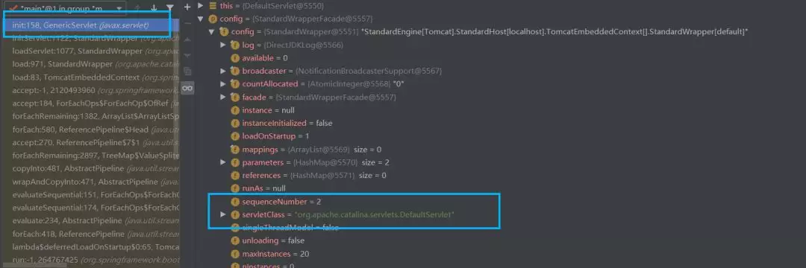
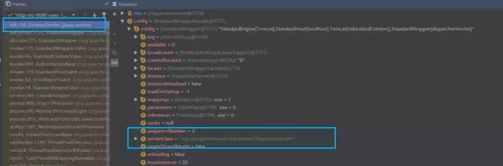
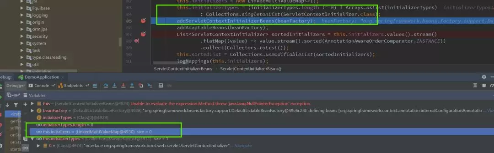
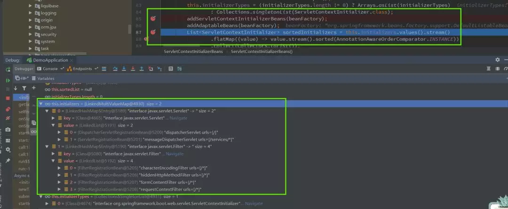
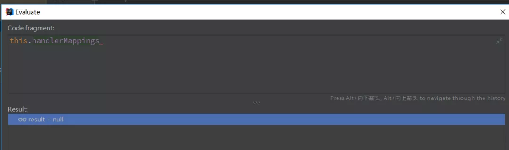
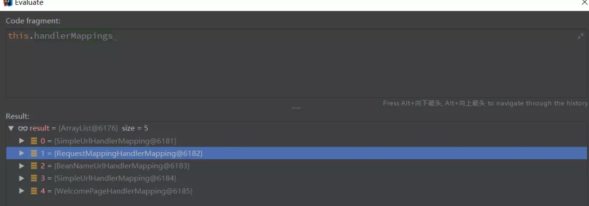
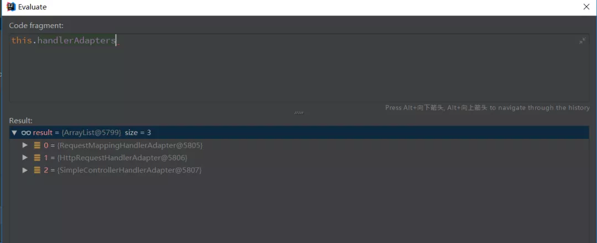
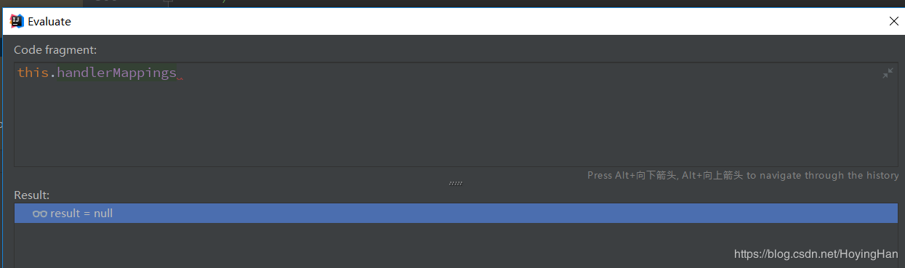
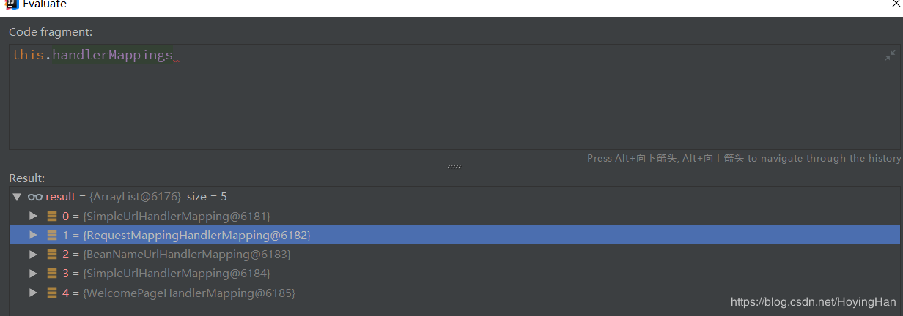
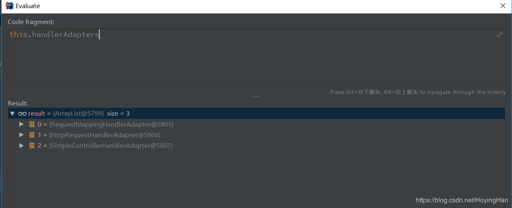

作者：陌北有棵树，Java人，架构师社区合伙人！

##【一】总述

SpringBoot的诞生，极大的简化了Spring框架的使用过程，提升了开发效率，可以把它理解为一个整合包，使用了SpringBoot，就可以不用自己去进行繁琐的配置，通过几个简单的注解，就可以构建一个基于REST的服务。同时，SpringBoot的快速构建部署的特性，为当下大热的微服务落地提供了极大的便利，可以说是构建微服务的理想框架。

归纳来说SpringBoot的特性有如下几点：

- 自动配置

- 内置tomcat、jetty、undertow 三大web容器

- 将Web应用打成jar包启动

那么SpringBoot是怎样做到上述三个特性的呢？是我接下来的研究方向，本篇主要研究的是后两个特点，如何内嵌了Web容易，将应用打成jar包，怎么还能像Web程序一样运行。

本文是笔者患难与共的好兄弟Dewey Ding及笔者Debug了若干天的成果，谨以此篇留作纪念。

##【二】问题引出和总体思路
- 按照常规的Web容器的启动方式，明显是无法和SpringBoot这种jar包的运行方式兼容的，那么他们之间是如何做到无缝衔接的合作呢？

- 最终运行的依然是SpringMVC框架，那么SpringBoot又是如何做到在内置了Tomcat的同时，又和SpringMVC无缝衔接的呢？

- 综上所述，整个系列需要研究的技术点如下（本文并未完全覆盖）：
  - SpringBoot启动Tomcat
  - SpringMVC初始化DispatcherServlet
  - Tomcat的两种启动方式
  - Tomcat在SpringBoot中如何拿到配置

# 【三】SpringBoot启动过程具体分析
在SpringBoot中，一个Web应用从启动到接收请求，我粗略将它分为四步：

- SpringBoot初始化
  - 初始化SpringApplication：包括环境变量、资源、构造器、监听器
  - 开始启动：启动监听（listeners）、加载配置（environment）、创建上下文（applicationContext）
  - 自动化配置：这个部分等到后面单独研究
- Tomcat初始化
- Tomcat接收请求
- SpringMVC初始化

这一部分的学习真可谓一波三折，每次Debug SpringApplication的run方法，都会迷失在茫茫的源码之中，看书和博客也都是云里雾里，所以这次决定换一种学法，先从宏观上了解都要做什么，至于具体细节，等到需要的时候再去分析。比如今天要了解的是和Tomcat启动相关的部分，那么就先只了解这个模块。

> 关于SpringBoot和Tomcat是如何合作的，在实际Debug之前，我们先抛出如下几个问题：

- SpringBoot有main()方法，可以直接打成jar包运行；SpringMVC没有main方法，所以无法自己启动，要依赖Tomcat，Tomcat本质是个容器，所以Tomcat中一定有main方法或者线程的start()方法来启动Spring程序
- /WEB-INF是Web应用需要的，SpringMVC配置了这个，是为了Tomcat读取，从而启动Web容器
- 项目要部署到webapp目录下，才能被Tomcat运行
- 那么问题来了，SpringBoot没有做这些配置，是怎么做到内置Tomcat容器，并让Tomcat启动的呢？

## 【SpringBoot和Tomcat的初始化】
我们先来看Tomcat的启动时在SpringBoot启动的哪一步？这里只列举比较关键的几步:

- 1 SpringApplication的run方法
```java
org.springframework.boot.SpringApplication#run(java.lang.String...)
```
- 2 刷新IOC容器（Bean的实例化）
```java
org.springframework.boot.SpringApplication#refreshContext()
org.springframework.boot.web.servlet.context.ServletWebServerApplicationContext#onRefresh()
```
- 3 创建WebServer

在org.springframework.boot.web.servlet.context.ServletWebServerApplicationContext#onRefresh调用了createWebServer
```java
org.springframework.boot.web.servlet.context.ServletWebServerApplicationContext#createWebServer()
private void createWebServer() {
    WebServer webServer = this.webServer;
    ServletContext servletContext = getServletContext();
    if (webServer == null && servletContext == null) {
           // 重点：这时初始化了dispatcherServlet
        ServletWebServerFactory factory = getWebServerFactory();
        // 创建
        this.webServer = factory.getWebServer(getSelfInitializer());
    }
    else if (servletContext != null) {
        try {
           // 启动
            getSelfInitializer().onStartup(servletContext);
        }
        catch (ServletException ex) {
            throw new ApplicationContextException("Cannot initialize servlet context", ex);
        }
    }
    initPropertySources();
}
```
这里就是Tomcat的创建和启动过程了，关于下面这两行代码中，蕴含着我们尚未去发现的秘密，后面会继续分析（蕴含着的秘密真的坑苦了我们，竟然与它擦肩而过，然后绕了一大圈才回来，泪奔中~~）：
```java
this.webServer = factory.getWebServer(getSelfInitializer());
······
getSelfInitializer().onStartup(servletContext);
```
在这里创建了Tomcat，Connector，Host，Engine并且设置一些属性，关于Tomcat的具体内容，由于内容比较多，就不在此篇详细展开，后续会专门研究。这里我们发现，在Tomcat启动的时候，servletClass还没有获取到dispatcherServlet，而在第一次收到请求时，servletClass就变成了dispatcherServlet，这里就对我们形成了一定误导，以为是第一次收到请求时Tomcat才加载了默认的wrapper，后来才发现出现了偏差，经历了无数次断点后，才回到正确的路上。






这里不得不提到，一个最开始被我们忽略，后来才发现是个重要的地方：getSelfInitializer() 。关于SpringBoot是如何把“/”和“dispatcherServlet”的关联给到Tomcat这件事，就蕴含在下面这段代码之中：
```java
//注意 selfInitialize
private org.springframework.boot.web.servlet.ServletContextInitializer getSelfInitializer() {
    return this::selfInitialize;
}

//注意 getServletContextInitializerBeans()
private void selfInitialize(ServletContext servletContext) throws ServletException {
    prepareWebApplicationContext(servletContext);
    registerApplicationScope(servletContext);
    WebApplicationContextUtils.registerEnvironmentBeans(getBeanFactory(), servletContext);
    for (ServletContextInitializer beans : getServletContextInitializerBeans()) {
        beans.onStartup(servletContext);
    }
}

//注意 ServletContextInitializerBeans()
protected Collection<ServletContextInitializer> getServletContextInitializerBeans() {
    return new ServletContextInitializerBeans(getBeanFactory());
}

// 注意 this.initializers 和 addServletContextInitializerBeans
public ServletContextInitializerBeans(ListableBeanFactory beanFactory,
        Class<? extends ServletContextInitializer>... initializerTypes) {
    this.initializers = new LinkedMultiValueMap<>();
    this.initializerTypes = (initializerTypes.length != 0) ? Arrays.asList(initializerTypes)
            : Collections.singletonList(ServletContextInitializer.class);
    addServletContextInitializerBeans(beanFactory);
    addAdaptableBeans(beanFactory);
    List<ServletContextInitializer> sortedInitializers = this.initializers.values().stream()
            .flatMap((value) -> value.stream().sorted(AnnotationAwareOrderComparator.INSTANCE))
            .collect(Collectors.toList());
    this.sortedList = Collections.unmodifiableList(sortedInitializers);
    logMappings(this.initializers);
}
```
让我们来看两张对比图：






- 5 通过上面两个Debug的断点图，我们可以看到，在执行了addServletContextInitializerBeans(beanFactory)和addAdaptableBeans(beanFactory)方法之后，this.initializers的赋值发生了变化，两个Servlet，四个Filter都被赋到里面，至于这两个方法中的处理逻辑，此时已经心累到不想去看，暂记jira。

接下来的onStartup()方法，调用了接口org.springframework.boot.web.servlet.ServletContextInitializeronStartup()方法。

> 这里有下面几点需要注意：

- SpringBoot创建Tomcat时，会先创建一个根上下文，webapplicationcontext传给tomcat
- 启动web容器，要先getWebserver，会创建tomcat的Webserver - 这里会把根上下文作为参数给org.springframework.boot.web.embedded.tomcat.TomcatServletWebServerFactory#getWebServer，这里和tomcat的context进行merge
- 初始化servletcontext - 会把root上下文放进去，后面初始化dispatcherServlet时，会通过servletcontext拿到根上下文
- 启动tomcat：调用Tomcat中Host、Engine的启动方法

##【DIspatcherServlet的初始化】

> 初始化DispatcherServlet，是在第一次发起Web请求的时候（AbstractAnnotationConfigDispatcherServletInitializer）

- AbstractAnnotationConfigDispatcherServletInitializer
  - 初始化ContextLoaderListener：创建ApplicationContext（根上下文）
  - 初始化DispatcherServlet - 这时需要用ApplicationContext
  - ApplicationContext是ServletContext的父上下文（WebApplicationContext是Spring为web应用提供的接口） 
  - 可以创建多个DispatcherServlet，每个可以创建自己内部的子上下文（每个Servlet都会有一个上下文）
  - DispatcherServlet建立上下文是为了持有Spring MVC的Bean对象

> 具体调用过程如下：

- javax.servlet.GenericServlet#init(javax.servlet.ServletConfig)
  - GenericServlet实现了Servlet接口
  - 这个方法启动SpringBoot时会调用一次，初始化dispatcherServlet时还会调用一次，不过两次的config中的serviceClass不一样，第二次是dispatcherServlet


- org.springframework.web.servlet.HttpServletBean#init
- org.springframework.web.servlet.FrameworkServlet#initServletBean
```java
protected WebApplicationContext initWebApplicationContext() {
        WebApplicationContext rootContext =
                WebApplicationContextUtils.getWebApplicationContext(getServletContext());
        WebApplicationContext wac = null;

        if (this.webApplicationContext != null) {
            // A context instance was injected at construction time -> use it
            wac = this.webApplicationContext;
            if (wac instanceof ConfigurableWebApplicationContext) {
                ConfigurableWebApplicationContext cwac = (ConfigurableWebApplicationContext) wac;
                if (!cwac.isActive()) {
                    // The context has not yet been refreshed -> provide services such as
                    // setting the parent context, setting the application context id, etc
                    if (cwac.getParent() == null) {
                        // The context instance was injected without an explicit parent -> set
                        // the root application context (if any; may be null) as the parent
                        cwac.setParent(rootContext);
                    }
                    configureAndRefreshWebApplicationContext(cwac);
                }
            }
        }
        if (wac == null) {
            // No context instance was injected at construction time -> see if one
            // has been registered in the servlet context. If one exists, it is assumed
            // that the parent context (if any) has already been set and that the
            // user has performed any initialization such as setting the context id
            wac = findWebApplicationContext();
        }
        if (wac == null) {
            // No context instance is defined for this servlet -> create a local one
            wac = createWebApplicationContext(rootContext);
        }

        if (!this.refreshEventReceived) {
            // Either the context is not a ConfigurableApplicationContext with refresh
            // support or the context injected at construction time had already been
            // refreshed -> trigger initial onRefresh manually here.
            synchronized (this.onRefreshMonitor) {
                //重要的刷新上下文操作
                onRefresh(wac);
            }
        }

        if (this.publishContext) {
            // Publish the context as a servlet context attribute.
            String attrName = getServletContextAttributeName();
            getServletContext().setAttribute(attrName, wac);
        }

        return wac;
    }
```
- 获取根上下文（这时根上下文已经在SpringBoot启动时初始化好了）
- 然后把根上下文给webApplicationContext
- org.springframework.web.servlet.DispatcherServlet#onRefresh - 这时就要刷新子上下文了，刷新上下文要刷新HandlerMapping，HandlerAdapter这些
```java
protected void initStrategies(ApplicationContext context) {
    initMultipartResolver(context);
    initLocaleResolver(context);
    initThemeResolver(context);
    initHandlerMappings(context);
    initHandlerAdapters(context);
    initHandlerExceptionResolvers(context);
    initRequestToViewNameTranslator(context);
    initViewResolvers(context);
    initFlashMapManager(context);
}
```
这里记录几个重要的时间点：





- 这时会打印“Initializing Servlet 'dispatcherServlet'”日志，
- org.springframework.web.servlet.FrameworkServlet#initWebApplicationContext
  - 这部分比较重要，附上代码：
  ```java
  protected WebApplicationContext initWebApplicationContext() {
		WebApplicationContext rootContext =
				WebApplicationContextUtils.getWebApplicationContext(getServletContext());
		WebApplicationContext wac = null;

		if (this.webApplicationContext != null) {
			// A context instance was injected at construction time -> use it
			wac = this.webApplicationContext;
			if (wac instanceof ConfigurableWebApplicationContext) {
				ConfigurableWebApplicationContext cwac = (ConfigurableWebApplicationContext) wac;
				if (!cwac.isActive()) {
					// The context has not yet been refreshed -> provide services such as
					// setting the parent context, setting the application context id, etc
					if (cwac.getParent() == null) {
						// The context instance was injected without an explicit parent -> set
						// the root application context (if any; may be null) as the parent
						cwac.setParent(rootContext);
					}
					configureAndRefreshWebApplicationContext(cwac);
				}
			}
		}
		if (wac == null) {
			// No context instance was injected at construction time -> see if one
			// has been registered in the servlet context. If one exists, it is assumed
			// that the parent context (if any) has already been set and that the
			// user has performed any initialization such as setting the context id
			wac = findWebApplicationContext();
		}
		if (wac == null) {
			// No context instance is defined for this servlet -> create a local one
			wac = createWebApplicationContext(rootContext);
		}

		if (!this.refreshEventReceived) {
			// Either the context is not a ConfigurableApplicationContext with refresh
			// support or the context injected at construction time had already been
			// refreshed -> trigger initial onRefresh manually here.
			synchronized (this.onRefreshMonitor) {
                //重要的刷新上下文操作
				onRefresh(wac);
			}
		}

		if (this.publishContext) {
			// Publish the context as a servlet context attribute.
			String attrName = getServletContextAttributeName();
			getServletContext().setAttribute(attrName, wac);
		}

		return wac;
	}
  ```
  - 获取根上下文（这时根上下文已经在SpringBoot启动时初始化好了）
  - 然后把根上下文给webApplicationContext
  - org.springframework.web.servlet.DispatcherServlet#onRefresh - 这时就要刷新子上下文了，刷新上下文要刷新HandlerMapping，HandlerAdapter这些
  ```java
  	protected void initStrategies(ApplicationContext context) {
		initMultipartResolver(context);
		initLocaleResolver(context);
		initThemeResolver(context);
		initHandlerMappings(context);
		initHandlerAdapters(context);
		initHandlerExceptionResolvers(context);
		initRequestToViewNameTranslator(context);
		initViewResolvers(context);
		initFlashMapManager(context);
	}
  ```
这里记录几个重要的时间点：





## 【四】SpringMVC和SpringBoot在启动过程中不同点归纳
关于SpringMVC、SpringBoot与Tomcat合作中，启动方式不同点的总结如下

- SpringMVC
  - 先启动tomcat，tomcat会去找web.xml,找到的是DispatcherServlet
  - 初始化DispatcherServlet的上下文，要从ServletContext中找根上下文，这时是没有的
  - 创建根上下文
- Springboot
  - 在启动过程中，SpringBoot会将DispatcherServlet给到Tomcat的Service的defaultWrapper中（如何给到的后面会说明）
  - Tomcat启动时，就会把“/”路径和DispatcherServlet匹配
  - 当第一次发起Web请求时，初始化DispatcherServlet，包括HandlerMapping，HandlerAdapter