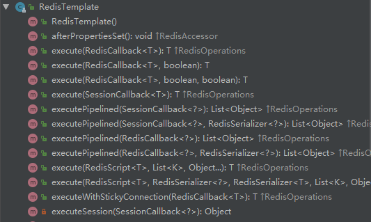

# 批量处理

> 先上代码  注意：如果配置了非默认序列化工具，存入的步骤需要自己对数据进行序列化（redisTemplate里面已经预留了获取序列化工具的方法）

> 注意 pipelined 模式下，回掉方法必须返回null
```java
// 这个方法是： 把参数 List里面所有的 Map放入Redis
// 其中    redisSession  是我之前封装的一个Redis工具， redisSession.getRedisTemplate 获取的就是 Spring中的 RedisTemplate
    private void loadFunction(String prefix, String key, List<Map<String, Object>> list) {
        redisSession.getRedisTemplate().executePipelined(new RedisCallback<Object>() {
            @Override
            public Object doInRedis(RedisConnection connection) throws DataAccessException {

                for (Map<String, Object> map : list) {
                    // 在这里 应该用 与 RedisConfig相同的方式序列化相关值
                    // 如果序列化工具不同，那么RedisTemplate封装好的方法就无法正确的反序列化
                    // 获取序列化工具的方法，例： redisTemplate.getHashValueSerializer() 获取hash数据类型中值得序列化工具，然后用其中方法对数据进行预处理
                    connection.hMSet((prefix + map.get(key)).getBytes(), map2ByteMap(map));

                }
                // 返回值必须为 null ，这是 RedisClallBack 在 pipeline情况下的要求
                return null;
            }
        });
    }
```
> executePipelined 为我们封装了 RedisConnection.openPipeline()/closePipeline() 两个方法，并且进行了容错处理

- redisTemplate 直接提供的方法是基于单次操作的，底层都是使用其中的 execute方法
- 我们在这里使用的是 executePipelined 这个方法，这个方法从外面看和 execute方法一样，接受一个 RedisCallBack 作为参数，其实在最底层还是使用了 execute方法


- 下面看一下 executePipelined 方法的实现

> executePipelined() 能够传入的那个序列化工具是用来序列化返回值的，也就是批量获取的时候能够用到，如果不传递会用默认的
```java
	@Override
	public List<Object> executePipelined(RedisCallback<?> action, @Nullable RedisSerializer<?> resultSerializer) {
        // 依然是调用了 execute 方法
		return execute((RedisCallback<List<Object>>) connection -> {
            //  开启 pipeline
			connection.openPipeline();
			boolean pipelinedClosed = false;
			try {
                // 执行 我们传递的 RedisClallback
                // 我们可以在这 放一堆 redis操作
                // ！！！ 从这里也可以看到，程序直接执行了回掉函数，没有使用已经配置好的序列化工具
				Object result = action.doInRedis(connection);
                // 批量动作要求 必须返回值为 null
				if (result != null) {
					throw new InvalidDataAccessApiUsageException(
							"Callback cannot return a non-null value as it gets overwritten by the pipeline");
				}
                // 关闭 pipeline 获取返回的 List
				List<Object> closePipeline = connection.closePipeline();
				pipelinedClosed = true;
                // 把pipeline返回内容 反序列化，然后返回
				return deserializeMixedResults(closePipeline, resultSerializer, hashKeySerializer, hashValueSerializer);
			} finally {
                // 如果出现了意外，这里也会安全的关闭pipeline
				if (!pipelinedClosed) {
					connection.closePipeline();
				}
			}
		});
	}
```