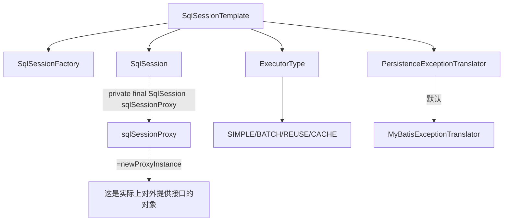

# SqlSessionTemplate

- 在最前面总结
    - SqlSessionTempalte最重要的作用是可以为当前操作动态选择一个`没有执行其他事务`的SqlSession实例，来执行我们需要的操作
        - 其中使用了 JDK动态代理的方法，并在拦截器中执行`选择合适的SqlSession`这个操作
    - 这能够帮助理解，在方法上面进行了`事务注解`之后，如何在这个层面上进行事务操作。
    - 


---------------------------

- 以下内容包括
    - SqlSessionProxy 对于SqlSession的动态代理：获取合适的SqlSession
    - MyBatis Executor Type 简述（会在Mybatis篇章详细学习）
    - SqlSessionFactory 这个不在此处说明了
    - PersistenceExceptionTranslator


## SqlSessionTemplate 中 对于SqlSession的动态代理：执行过程中获取合适的SqlSession

```java
// 在 SqlSessionTemplate 的最上方，静态加载了一些内容
import static java.lang.reflect.Proxy.newProxyInstance;
import static org.apache.ibatis.reflection.ExceptionUtil.unwrapThrowable;
import static org.mybatis.spring.SqlSessionUtils.closeSqlSession;
import static org.mybatis.spring.SqlSessionUtils.getSqlSession;
import static org.mybatis.spring.SqlSessionUtils.isSqlSessionTransactional;
import static org.springframework.util.Assert.notNull;
// 1. 使用代理模式获取 SqlSession 
    this.sqlSessionProxy = (SqlSession) newProxyInstance(
        SqlSessionFactory.class.getClassLoader(),
        new Class[] { SqlSession.class },
        new SqlSessionInterceptor());
// 2.此处传入了 SqlSessionInterceptor
```
> 这里传入了一个SqlSessionInterceptor，SqlSession代理从 Spring Transaction Manager (Spring 事物管理器)中获取合适的SqlSession（没有执行其他事物的SqlSession），以此代理MyBatis的方法调用。

[SqlSessionInteceptor 源码简单学习](./002-SqlSessionInterceptor.md)

--------------------------------------
## MyBatis ExecutorType

simple ： 该模式下它为每个语句的执行创建一个新的预处理语句，单条提交sql，所有的数据库操作均委托给StatementHandler处理

batch ： 批量更新的Executor，使用jdbc的batchupdate方法，使用此Executor，需要手动执行SqlSession的flushStatements，真正出发sql的执行

reuse ： 大体上与SimpleExecutor相同，只是根据sql缓存了jdbc的statement，遇到相同的sql时，省去了statement的创建，提高效率，但需要手动执行SqlSession的flushStatements，清除缓存

CachingExecutor ： 在mapper中配置cache，对查询结果做缓存，其中缓存的key根据以下代码存数生成，建议最好不要用mybatis这个层次的缓存，一般业务层的缓存更实用，而且更容易控制