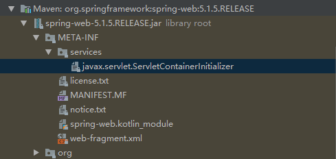

# WebApplicationInitializer

WebApplicationInitializer 是Spring中用于实现使用java config 取代web.xml的类

> javax.servlet下面有一个接口`ServletContainerInitializer`，这个接口就是用于实现剥离web.xml的，通过SPI机制，当web容器启动的时候，自动到（每个）jar包下面找到META-INF/services下以ServletContinerInitializer的全路径名称命名的文件，讲其内容作为（实际上就是）ServletContainerInitializer的实现类，并且实例化

> 在spring-web包里面我们可以找到符合上面所说要求的文件



里面的内容为： `org.springframework.web.SpringServletContainerInitializer`

也就是，web容器启动时候，所有所有jar包，会找到上面的内容，然后实例化
`SpringServletContainerInitializer`

SpringServletContainerInitializer上有一个注解 @HandlesTypes

- @HandlesTypes
  - 这是一个来自 javax.servlet.annotation的注解
  - 用于定义一个类的数组，这些类会被传递给 ServletContainerInitializer
- SpringServletContainerInitializer 的 @HandlesTypes写着一个类
  - WebApplicationInitializer.class
  - 扫描这个类的所有实现类作为一个数组，传递给SpringServletContainerInitializer
- SpringServletContainerInitializer会做如下工作
  - 检查上面一步传来的数组里面的每一个类，如果确认是一个实现类
  - 调用其 onStart方法
- 由此 我们可以自己写一个 WebApplicationInitializer 的实现类，在实现类中完成原本需要在 web.xml里面的方法
  - 例如： 在这个方法里面创建一个 DispatcherServlet 添加到 ServletContext里面
  - ⭐⭐  之前看过spring mvc框架下 web.xml配置也是只需要简单配置 DispatcherServlet就能够让Spring框架处理剩下的事情了

## 下面是源码

```java
@Target(ElementType.TYPE)
@Retention(RetentionPolicy.RUNTIME)
public @interface HandlesTypes {

    /**
     * @return array of classes ⭐ 返回一个class的数组
     */
    Class<?>[] value();

}
```

```java
@HandlesTypes(WebApplicationInitializer.class)
public class SpringServletContainerInitializer implements ServletContainerInitializer {

	/**
	 * Delegate the {@code ServletContext} to any {@link WebApplicationInitializer}
	 * implementations present on the application classpath.
	 * <p>Because this class declares @{@code HandlesTypes(WebApplicationInitializer.class)},
	 * Servlet 3.0+ containers will automatically scan the classpath for implementations
	 * of Spring's {@code WebApplicationInitializer} interface and provide the set of all
	 * such types to the {@code webAppInitializerClasses} parameter of this method.
	 * <p>If no {@code WebApplicationInitializer} implementations are found on the classpath,
	 * this method is effectively a no-op. An INFO-level log message will be issued notifying
	 * the user that the {@code ServletContainerInitializer} has indeed been invoked but that
	 * no {@code WebApplicationInitializer} implementations were found.
	 * <p>Assuming that one or more {@code WebApplicationInitializer} types are detected,
	 * they will be instantiated (and <em>sorted</em> if the @{@link
	 * org.springframework.core.annotation.Order @Order} annotation is present or
	 * the {@link org.springframework.core.Ordered Ordered} interface has been
	 * implemented). Then the {@link WebApplicationInitializer#onStartup(ServletContext)}
	 * method will be invoked on each instance, delegating the {@code ServletContext} such
	 * that each instance may register and configure servlets such as Spring's
	 * {@code DispatcherServlet}, listeners such as Spring's {@code ContextLoaderListener},
	 * or any other Servlet API componentry such as filters.
	 * @param webAppInitializerClasses all implementations of
	 * {@link WebApplicationInitializer} found on the application classpath
	 * @param servletContext the servlet context to be initialized
	 * @see WebApplicationInitializer#onStartup(ServletContext)
	 * @see AnnotationAwareOrderComparator
	 */
	@Override
	public void onStartup(@Nullable Set<Class<?>> webAppInitializerClasses, ServletContext servletContext)
			throws ServletException {

		List<WebApplicationInitializer> initializers = new LinkedList<>();

		if (webAppInitializerClasses != null) {
			for (Class<?> waiClass : webAppInitializerClasses) {
				// Be defensive: Some servlet containers provide us with invalid classes,
				// no matter what @HandlesTypes says...
				if (!waiClass.isInterface() && !Modifier.isAbstract(waiClass.getModifiers()) &&
						WebApplicationInitializer.class.isAssignableFrom(waiClass)) {
					try {
						initializers.add((WebApplicationInitializer)
								ReflectionUtils.accessibleConstructor(waiClass).newInstance());
					}
					catch (Throwable ex) {
						throw new ServletException("Failed to instantiate WebApplicationInitializer class", ex);
					}
				}
			}
		}

		if (initializers.isEmpty()) {
			servletContext.log("No Spring WebApplicationInitializer types detected on classpath");
			return;
		}

		servletContext.log(initializers.size() + " Spring WebApplicationInitializers detected on classpath");
		AnnotationAwareOrderComparator.sort(initializers);
		for (WebApplicationInitializer initializer : initializers) {
			initializer.onStartup(servletContext);
		}
	}

}
```