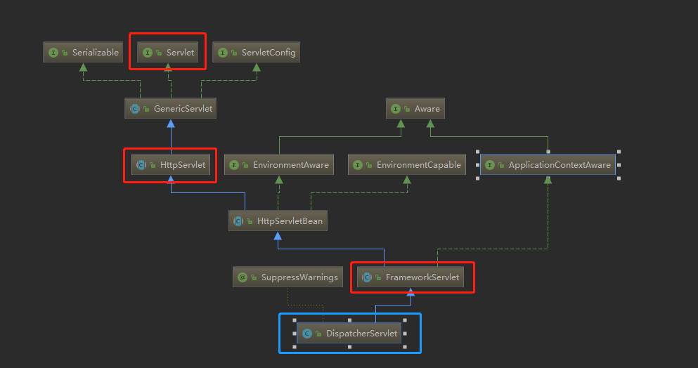

# DispatcherServlet   5.0+版本

> DispatcherServlet 首先是个Servlet



从DispatcherServlet的结构可以看到它提供的两个重要功能
- Servlet
  - 作为一个Servlet收到ServletContainer管理
  - 在init调用的时候，完成自身的初始化
    - init方法在 HttpServlet里面Override
      - 这里会获取当前Servlet的初始化参数
      - 我们会在这里配置：
        - contextConfigLoaction
    - 之后经过一些重写，最终创建DispatcherServlet的 ApplicationContext是通过 FrameworkServlet.initWebApplicationContext
      - 如果构造DispatcherServlet构造的时候传入了 WebApplicationContext首先用这个
      - 这个过程中，如果ServletContext配置了 ROOT webapplicationContext，会把他设置为当前WebApplciationContext的父级别
- ApplicationContextAware
  - 就是ApplicaitonContext的处理功能


> ⭐ 下面按照初始化执行链 看一下初始过程
> 第一步 HttpServleBean.init()
```java
public final void init() throws ServletException {

		// Set bean properties from init parameters.
		// 从 init paramters 里面获取参数，通常我们在这里配置 dispatcher-servlet的 配置文件地址
		PropertyValues pvs = new ServletConfigPropertyValues(getServletConfig(), this.requiredProperties);
		if (!pvs.isEmpty()) {
			try {
				BeanWrapper bw = PropertyAccessorFactory.forBeanPropertyAccess(this);
				ResourceLoader resourceLoader = new ServletContextResourceLoader(getServletContext());
				bw.registerCustomEditor(Resource.class, new ResourceEditor(resourceLoader, getEnvironment()));
				initBeanWrapper(bw);
				bw.setPropertyValues(pvs, true);
			}
			catch (BeansException ex) {
				if (logger.isErrorEnabled()) {
					logger.error("Failed to set bean properties on servlet '" + getServletName() + "'", ex);
				}
				throw ex;
			}
		}

		// Let subclasses do whatever initialization they like.
		initServletBean();
	}
```

> FrameworkServlet.initServletBean() & FrameworkServlet.initWebApplicationContext()
```java
	/**
	 * Overridden method of {@link HttpServletBean}, invoked after any bean properties
	 * have been set. Creates this servlet's WebApplicationContext.
	 */
	@Override
	protected final void initServletBean() throws ServletException {
		getServletContext().log("Initializing Spring " + getClass().getSimpleName() + " '" + getServletName() + "'");
		if (logger.isInfoEnabled()) {
			logger.info("Initializing Servlet '" + getServletName() + "'");
		}
		long startTime = System.currentTimeMillis();

		try {
			this.webApplicationContext = initWebApplicationContext();
			initFrameworkServlet();
		}
		catch (ServletException | RuntimeException ex) {
			logger.error("Context initialization failed", ex);
			throw ex;
		}

		if (logger.isDebugEnabled()) {
			String value = this.enableLoggingRequestDetails ?
					"shown which may lead to unsafe logging of potentially sensitive data" :
					"masked to prevent unsafe logging of potentially sensitive data";
			logger.debug("enableLoggingRequestDetails='" + this.enableLoggingRequestDetails +
					"': request parameters and headers will be " + value);
		}

		if (logger.isInfoEnabled()) {
			logger.info("Completed initialization in " + (System.currentTimeMillis() - startTime) + " ms");
		}
	}


protected WebApplicationContext initWebApplicationContext() {
		WebApplicationContext rootContext =
				WebApplicationContextUtils.getWebApplicationContext(getServletContext());
		WebApplicationContext wac = null;

		if (this.webApplicationContext != null) {
			// A context instance was injected at construction time -> use it
			wac = this.webApplicationContext;
			if (wac instanceof ConfigurableWebApplicationContext) {
				ConfigurableWebApplicationContext cwac = (ConfigurableWebApplicationContext) wac;
				if (!cwac.isActive()) {
					// The context has not yet been refreshed -> provide services such as
					// setting the parent context, setting the application context id, etc
					if (cwac.getParent() == null) {
						// The context instance was injected without an explicit parent -> set
						// the root application context (if any; may be null) as the parent
						cwac.setParent(rootContext);
					}
					configureAndRefreshWebApplicationContext(cwac);
				}
			}
		}
		if (wac == null) {
			// No context instance was injected at construction time -> see if one
			// has been registered in the servlet context. If one exists, it is assumed
			// that the parent context (if any) has already been set and that the
			// user has performed any initialization such as setting the context id
			wac = findWebApplicationContext();
		}
		if (wac == null) {
			// No context instance is defined for this servlet -> create a local one
			wac = createWebApplicationContext(rootContext);
		}

		if (!this.refreshEventReceived) {
			// Either the context is not a ConfigurableApplicationContext with refresh
			// support or the context injected at construction time had already been
			// refreshed -> trigger initial onRefresh manually here.
			synchronized (this.onRefreshMonitor) {
				onRefresh(wac);
			}
		}

		if (this.publishContext) {
			// Publish the context as a servlet context attribute.
			String attrName = getServletContextAttributeName();
			getServletContext().setAttribute(attrName, wac);
		}

		return wac;
	}
```

> DispatcherServlet.onRefresh & DispatcherServlet.initStrategies

```java

	/**
	 * This implementation calls {@link #initStrategies}.
	 */
	@Override
	protected void onRefresh(ApplicationContext context) {
		initStrategies(context);
	}

	/**
	 * Initialize the strategy objects that this servlet uses.
	 * <p>May be overridden in subclasses in order to initialize further strategy objects.
	 */
	protected void initStrategies(ApplicationContext context) {
		initMultipartResolver(context);
		initLocaleResolver(context);
		initThemeResolver(context);
		initHandlerMappings(context);
		initHandlerAdapters(context);
		initHandlerExceptionResolvers(context);
		initRequestToViewNameTranslator(context);
		initViewResolvers(context);
		initFlashMapManager(context);
	}
```