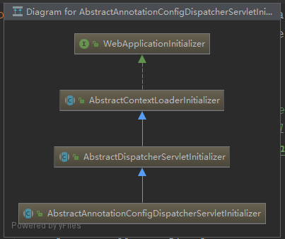
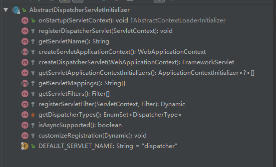

# DispatcherServlet

> Dispatcher : 调度/发报机/收发

- DispatcherServlet（调度Servlet）和普通的Servlet一样，需要在web.xml里面声明/映射。
- DispatcherServlet 通过Spring自身的配置对下面的组件进行管理（包括 请求映射，视图处理，错误处理等等）

## 使用 类/xml 文件配置 DispatcherServlet的方法

- 这是一个使用java配置注册和初始化DispatcherServlet的例子
  - [原理在这里，挺有意思的](../../WebApplicationInitializer.md)
- WebApplicationInitializer 是 web
```java
// 
public class MyWebApplicationInitializer implements WebApplicationInitializer {

    @Override
    public void onStartup(ServletContext servletCxt) {

        // Load Spring web application configuration
        AnnotationConfigWebApplicationContext ac = new AnnotationConfigWebApplicationContext();
        ac.register(AppConfig.class);
        ac.refresh();

        // Create and register the DispatcherServlet
        DispatcherServlet servlet = new DispatcherServlet(ac);
        ServletRegistration.Dynamic registration = servletCxt.addServlet("app", servlet);
        registration.setLoadOnStartup(1);
        registration.addMapping("/app/*");
    }
}
```

```xml
<web-app>

    <listener>
        <listener-class>org.springframework.web.context.ContextLoaderListener</listener-class>
    </listener>

    <context-param>
        <param-name>contextConfigLocation</param-name>
        <param-value>/WEB-INF/app-context.xml</param-value>
    </context-param>

    <servlet>
        <servlet-name>app</servlet-name>
        <servlet-class>org.springframework.web.servlet.DispatcherServlet</servlet-class>
        <init-param>
            <param-name>contextConfigLocation</param-name>
            <param-value></param-value>
        </init-param>
        <load-on-startup>1</load-on-startup>
    </servlet>

    <servlet-mapping>
        <servlet-name>app</servlet-name>
        <url-pattern>/app/*</url-pattern>
    </servlet-mapping>

</web-app>
```

## Context Hierarchy 上下文层级

- 配置 DispatcherServlet需要一个 WebApplicationContext （applicationContext扩展）来完成自己的配置
  - `WebApplicationContext` WebApplicationContext有一个指向ServletContext的链接以及与之关联的Servlet。 它还绑定到ServletContext，以便应用程序可以在RequestContextUtils上使用静态方法，以便在需要访问WebApplicationContext时查找它。

对于很多应用，只有一个 WebApplicationContext是相对简单便捷的，但是也有可能存在一个 root WebApplicationContext 被多个DispatcherServlet（或Servlet）公用。

root层级通常放一些基础bean，例如数据库，事务服务之类的。


> 下面是配置 带有层级的 上下文的方法

- 代码配置
```java
public class MyWebAppInitializer extends AbstractAnnotationConfigDispatcherServletInitializer {

    @Override
    protected Class<?>[] getRootConfigClasses() {
        return new Class<?>[] { RootConfig.class };
    }

    @Override
    protected Class<?>[] getServletConfigClasses() {
        return new Class<?>[] { App1Config.class };
    }

    @Override
    protected String[] getServletMappings() {
        return new String[] { "/app1/*" };
    }
}
```

- xml配置方法
```xml
<web-app>

    <listener>
        <listener-class>org.springframework.web.context.ContextLoaderListener</listener-class>
    </listener>

    <context-param>
        <param-name>contextConfigLocation</param-name>
        <param-value>/WEB-INF/root-context.xml</param-value>
    </context-param>

    <servlet>
        <servlet-name>app1</servlet-name>
        <servlet-class>org.springframework.web.servlet.DispatcherServlet</servlet-class>
        <init-param>
            <param-name>contextConfigLocation</param-name>
            <param-value>/WEB-INF/app1-context.xml</param-value>
        </init-param>
        <load-on-startup>1</load-on-startup>
    </servlet>

    <servlet-mapping>
        <servlet-name>app1</servlet-name>
        <url-pattern>/app1/*</url-pattern>
    </servlet-mapping>

</web-app>
```

## Special Bean Types

DispatcherServlet 需要委托（代表？）几个特定的bean来处理请求/返回。

这里所说的特殊的bean都是Spring框架下的Bean。这些Bean一般有默认实现，不过我们可以设置其参数，或者 extend/replace


- HandlerMapping

把请求映射到处理器上，同时完成 interceptor操作。映射操作基于一些规则（根据不同的实现，有一些差距）

两个主要实现：

> RequestMappingHandlerMapping( 通过 @RequestMapping 注解方法来实现)

> SimpleUrlHandlerMapping （不怎么用）
Map a request to a handler along with a list of interceptors for pre- and post-processing. The mapping is based on some criteria, the details of which vary by HandlerMapping implementation.

The two main HandlerMapping implementations are RequestMappingHandlerMapping (which supports @RequestMapping annotated methods) and SimpleUrlHandlerMapping (which maintains explicit registrations of URI path patterns to handlers).

- HandlerAdapter

帮助DispatcherServlet调用映射到 request上的handler（代理执行，不用在乎handler具体是怎么调用的）

例如：处理注解开发的Controller的时候，要去解析注解，DispatcherServlet不用知道具体怎么解析的

Help the DispatcherServlet to invoke a handler mapped to a request, regardless of how the handler is actually invoked. For example, invoking an annotated controller requires resolving annotations. The main purpose of a HandlerAdapter is to shield the DispatcherServlet from such details.

- HandlerExceptionResolver

处理错误的解决方案，可能把他们映射到Handler，或者错误页面html views，或者其他什么

Strategy to resolve exceptions, possibly mapping them to handlers, to HTML error views, or other targets. See Exceptions.

- ViewResolver

Resolve logical String-based view names returned from a handler to an actual View with which to render to the response. See View Resolution and View Technologies.

- LocaleResolver, LocaleContextResolver

Resolve the Locale a client is using and possibly their time zone, in order to be able to offer internationalized views. See Locale.

- ThemeResolver

Resolve themes your web application can use — for example, to offer personalized layouts. See Themes.

- MultipartResolver

处理一些Multi-part相关的工作，比如上传文件

Abstraction for parsing a multi-part request (for example, browser form file upload) with the help of some multipart parsing library. See Multipart Resolver.

- FlashMapManager

Store and retrieve the “input” and the “output” FlashMap that can be used to pass attributes from one request to another, usually across a redirect. See Flash Attributes.

## Web MVC Config

Application 可以声明上面介绍的基础bean （Special bean ）。DispatcherServlet 会在WebApplicatoinContext里面寻找这些bean，如果没有匹配的选项，会使用默认值 DispatcherServlet.properties

> 这个配置文件和 DispatcherServlet在同一个包里面

```conf
# Default implementation classes for DispatcherServlet's strategy interfaces.
# Used as fallback when no matching beans are found in the DispatcherServlet context.
# Not meant to be customized by application developers.

org.springframework.web.servlet.LocaleResolver=org.springframework.web.servlet.i18n.AcceptHeaderLocaleResolver

org.springframework.web.servlet.ThemeResolver=org.springframework.web.servlet.theme.FixedThemeResolver

org.springframework.web.servlet.HandlerMapping=org.springframework.web.servlet.handler.BeanNameUrlHandlerMapping,\
	org.springframework.web.servlet.mvc.method.annotation.RequestMappingHandlerMapping,\
	org.springframework.web.servlet.function.support.RouterFunctionMapping

org.springframework.web.servlet.HandlerAdapter=org.springframework.web.servlet.mvc.HttpRequestHandlerAdapter,\
	org.springframework.web.servlet.mvc.SimpleControllerHandlerAdapter,\
	org.springframework.web.servlet.mvc.method.annotation.RequestMappingHandlerAdapter,\
	org.springframework.web.servlet.function.support.HandlerFunctionAdapter


org.springframework.web.servlet.HandlerExceptionResolver=org.springframework.web.servlet.mvc.method.annotation.ExceptionHandlerExceptionResolver,\
	org.springframework.web.servlet.mvc.annotation.ResponseStatusExceptionResolver,\
	org.springframework.web.servlet.mvc.support.DefaultHandlerExceptionResolver

org.springframework.web.servlet.RequestToViewNameTranslator=org.springframework.web.servlet.view.DefaultRequestToViewNameTranslator

org.springframework.web.servlet.ViewResolver=org.springframework.web.servlet.view.InternalResourceViewResolver

org.springframework.web.servlet.FlashMapManager=org.springframework.web.servlet.support.SessionFlashMapManager
```
## Servlet Config

⭐ 直接看这里可能不明白原理，我整理了另一篇文章
- 003.JavaWebTech\01.SpringSeries\SpringMVC\WebApplicationInitializer.md


在 Servlet 3.0+ 版本中，可以使用代码来配置 Servlet container （在这之前我们需要使用 web.xml）

```java
import org.springframework.web.WebApplicationInitializer;

public class MyWebApplicationInitializer implements WebApplicationInitializer {

    @Override
    public void onStartup(ServletContext container) {
        XmlWebApplicationContext appContext = new XmlWebApplicationContext();
        appContext.setConfigLocation("/WEB-INF/spring/dispatcher-config.xml");

        ServletRegistration.Dynamic registration = container.addServlet("dispatcher", new DispatcherServlet(appContext));
        registration.setLoadOnStartup(1);
        registration.addMapping("/");
    }
}
```

WebApplicationInitializer

## Servlet Config

在 Servlet 3.0+ 版本，可以通过代码或者 web.xml配置 Servlet Container

```java
import org.springframework.web.WebApplicationInitializer;

public class MyWebApplicationInitializer implements WebApplicationInitializer {

    @Override
    public void onStartup(ServletContext container) {
        XmlWebApplicationContext appContext = new XmlWebApplicationContext();
        appContext.setConfigLocation("/WEB-INF/spring/dispatcher-config.xml");

        ServletRegistration.Dynamic registration = container.addServlet("dispatcher", new DispatcherServlet(appContext));
        registration.setLoadOnStartup(1);
        registration.addMapping("/");
    }
}
```

WebApplicationInitializer是 Spring MVC提供的接口，保证实现类可以被识别并且被自动用于配置Servlet 3 容器。

Spring还提供了 AbstractDispatcherServletInitializer来简化配置DispatcherServlet的代码（）

> 如果使用注解形式，那么可以使用 AbstractAnnotationConfigDispatcherServletInitializer

> 如果xml配置可以在代码里面载入



下面是两种形的代码

```java
public class MyWebAppInitializer extends AbstractAnnotationConfigDispatcherServletInitializer {

    @Override
    protected Class<?>[] getRootConfigClasses() {
        return null;
    }

    @Override
    protected Class<?>[] getServletConfigClasses() {
        return new Class<?>[] { MyWebConfig.class };
    }

    @Override
    protected String[] getServletMappings() {
        return new String[] { "/" };
    }
}
```

```java
public class MyWebAppInitializer extends AbstractDispatcherServletInitializer {

    @Override
    protected WebApplicationContext createRootApplicationContext() {
        return null;
    }

    @Override
    protected WebApplicationContext createServletApplicationContext() {
        XmlWebApplicationContext cxt = new XmlWebApplicationContext();
        cxt.setConfigLocation("/WEB-INF/spring/dispatcher-config.xml");
        return cxt;
    }

    @Override
    protected String[] getServletMappings() {
        return new String[] { "/" };
    }
}
```

> ⭐⭐ ServletFileter也可以配置，看看代码结构就明白了



## Processing ⭐⭐⭐

> DispatcherServlet 处理请求的运行过程如下

- WebApplicationContext被绑定为 request的一个属性，controller或者其他元素在执行过程中可以使用它，默认以 DispatcherServlet.WEB_APPLICATION_CONTEXT_ATTRIBUT 为KEY
```java
// WebApplicationContext 可以直接从静态方法获取
WebApplicationContext context=ContextLoader.getCurrentWebApplicationContext();
// 可以借助 requet 获取  
ServletContext servletContext=request.getSession().getServletContext();
// 容ROOT 关键字获取ROOT 用 DispatcherServlet的关键字也可以获取对应的
WebApplicationContext webApplicationContext = (WebApplicationContext)servletContext.getAttribute(WebApplicationContext.ROOT_WEB_APPLICATION_CONTEXT_ATTRIBUTE);

```

- The locale resolver is bound to the request to let elements in the process resolve the locale to use when processing the request (rendering the view, preparing data, and so on). If you do not need locale resolving, you do not need the locale resolver
- The theme resolver is bound to the request to let elements such as views determine which theme to use. If you do not use themes, you can ignore it.
- If you specify a multipart file resolver, the request is inspected for multiparts. If multiparts are found, the request is wrapped in a MultipartHttpServletRequest for further processing by other elements in the process. See Multipart Resolver for further information about multipart handling.
- 搜索请求对应的handler，如果找到了，执行链执行（preprocessors，postprocessors，controllers），从而准备模型或者呈现， 或者如果是注解controller，可以呈现相应而不返回view
- 如果返回模型，则呈现视图。 如果没有返回模型（可能是由于预处理器或后处理器拦截请求，可能是出于安全原因），则不会呈现任何视图，因为该请求可能已经完成。

> HandlerExceptionResolver 这个bean在 用于处理 request处理过程中的异常，这些异常解析器允许自定义逻辑以解决异常。

> Spring DispatcherServlet还支持返回最后修改日期，如Servlet API所指定。 确定特定请求的最后修改日期的过程很简单：DispatcherServlet查找适当的处理程序映射并测试找到的处理程序是否实现LastModified接口。 如果是这样，LastModified接口的long getLastModified（request）方法的值将返回给客户端。

您可以通过将Servlet初始化参数（init-param元素）添加到web.xml文件中的Servlet声明来自定义各个DispatcherServlet实例。 下表列出了支持的参数：

- contextClass / 一个实现了 ConfigurableWebApplicationContext的类

Class that implements ConfigurableWebApplicationContext, to be instantiated and locally configured by this Servlet. By default, XmlWebApplicationContext is used.

- contextConfigLocation / 

传递给上下文实例（由contextClass指定）的字符串，用于指示可以在何处找到上下文。 该字符串可能包含多个字符串（使用逗号作为分隔符）以支持多个上下文。 对于具有两次定义的bean的多个上下文位置，最新位置优先
String that is passed to the context instance (specified by contextClass) to indicate where contexts can be found. The string consists potentially of multiple strings (using a comma as a delimiter) to support multiple contexts. In the case of multiple context locations with beans that are defined twice, the latest location takes precedence.

- namespace

Namespace of the WebApplicationContext. Defaults to [servlet-name]-servlet.

- throwExceptionIfNoHandlerFound / 当没有对应的handler的时候抛出一个错误，这个错误可以被我们配置的 ExceptionHandler捕捉到

Whether to throw a NoHandlerFoundException when no handler was found for a request. The exception can then be caught with a HandlerExceptionResolver (for example, by using an @ExceptionHandler controller method) and handled as any others. 
By default, this is set to false, in which case the DispatcherServlet sets the response status to 404 (NOT_FOUND) without raising an exception. 
Note that, if default servlet handling is also configured, unresolved requests are always forwarded to the default servlet and a 404 is never raised.

## Interception

所有 HandlerMapping 实现 都支持 handler 拦截器

拦截器实现： HandlerInterceptor

- preHandle(..): Before the actual handler is executed
- postHandle(..): After the handler is executed
- afterCompletion(..): After the complete request has finished

> 注意： postHandler 在使用@ResponseBody and ResponseEntity 方法（response在 HandlerAdaptor中被written / commited），这发生在postHandle 之前。 这意味着想要使用 posthandler来改变response太晚了。这种场景下，你可以实现 ResponseBodyAdvice 或者 声明为 Controller Advice 或者直接配置到 RequestMappingHandlerAdaptor

## Exceptions

请求处理过程中报错，DispatcherServlet会调用一个由 handlerExceptionResolver 组成的调用链来解决错误

可用的 HandlerExceptionResolver 有这些实例

- SimpleMappingExceptionResolver

错误和error view name 映射
A mapping between exception class names and error view names. Useful for rendering error pages in a browser application.

- DefaultHandlerExceptionResolver

默认处理器，标准HTTP错误代码
Resolves exceptions raised by Spring MVC and maps them to HTTP status codes. See also alternative ResponseEntityExceptionHandler and REST API exceptions.

- ResponseStatusExceptionResolver


Resolves exceptions with the @ResponseStatus annotation and maps them to HTTP status codes based on the value in the annotation.

- ExceptionHandlerExceptionResolver
Resolves exceptions by invoking an @ExceptionHandler method in a @Controller or a @ControllerAdvice class. See @ExceptionHandler methods.

> Chain of Resolvers 处理器执行链

通过声明多个HandlerExceptionResolver，可以组成一个错误处理链，声明的时候可以指定 order，调用的时候会按照 order 从小到大的顺序执行

The contract of HandlerExceptionResolver specifies that it can return:

- a ModelAndView that points to an error view.

- An empty ModelAndView if the exception was handled within the resolver.

- null if the exception remains unresolved, for subsequent resolvers to try, and, if the exception remains at the end, it is allowed to bubble up to the Servlet container.

MVC Config自动声明内置的解析器，用于默认的Spring MVC异常，@ ResponseStatus注释异常，以及对@ExceptionHandler方法的支持。 您可以自定义该列表或替换它。

> Container Error page

如果错误没有被任何一个HandlerExceptionResovler处理，这种情况就要返回 一个错误状态 4xx，5xx

Servlet container可以配置一个 默认的错误HTML。通过在 web.xml里面配置
```xml
<error-page>
    <location>/error</location>
</error-page>
```

```java
@RestController
public class ErrorController {

    @RequestMapping(path = "/error")
    public Map<String, Object> handle(HttpServletRequest request) {
        Map<String, Object> map = new HashMap<String, Object>();
        map.put("status", request.getAttribute("javax.servlet.error.status_code"));
        map.put("reason", request.getAttribute("javax.servlet.error.message"));
        return map;
    }
}
```

## View 章节此处不总结

## Local

## Themes

## Multipar Resovler

MultipartResovler 用于处理带有文件上传的请求。有一个基于 Commons FileUpload的实现（Servlet 3.0+）

- 在DispatcherServlet里面声明一个 MultipartResovler
- DispatcherServlet发现这个bean，会把它配置到request里面
- 当一个POST请求的content-type 为 multipart/form-data的时候，resovler会解析内容，然后讲 HttpServletRequest 包装成MultipartHttpServletRequst

> Apache Commons FileUpload

要使用这个组件，需要配置一个类型为 CommonsMultipartResolver的bean，我们可以命名为 multipartResolver（别忘了添加dependency）

> Servlet 3.0

multipart parsing不是默认的，需要我们配置一下
- 在java代码里面： set a MultipartConfigElement on the Servlet registration.
- 在 web.xml里面：add a "<multipart-config>" section to the servlet declaration.

java代码配置的例子
```java
public class AppInitializer extends AbstractAnnotationConfigDispatcherServletInitializer {

    // ...

    @Override
    protected void customizeRegistration(ServletRegistration.Dynamic registration) {

        // Optionally also set maxFileSize, maxRequestSize, fileSizeThreshold
        registration.setMultipartConfig(new MultipartConfigElement("/tmp"));
    }

}
```

## Logging