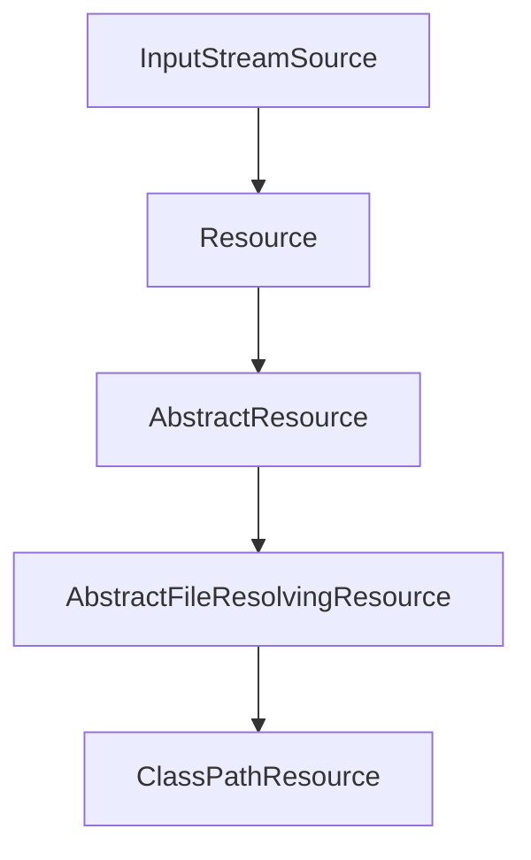

# Spring IO / ClassPathRsource

## 层级结构



## 层级讲解

最低层InputStreamSource
  - MissionLee：设计思路应该是把所有的资源作为InputStream读取，所以在Resource接口层级下还有这个更深层次的接口
  - 接口只有一个方法：`InputStream getInputStream()`

Resource
 - 资源基类，定义了通用的方法，来描述一个资源
 - 实现类
   - WritableResource
   - ContextResource
   - UrlResource
   - FileUrlResource
   - FileSystemResource
   - ClassPathResource
   - ByteArrayResource
   - InputStreamResource

AbstractResource
 - Resource部分接口方法的通用实现在这里提供
 - 例如 exists 等等
 - 注意：isOpen isFile在这个层级直接return false

AbstractFileResolvingResource
  - 把资源Urls解析为File references时候，此处提供进一步的通用方法实现
  - 服务于
    - UrlResource
    - ClassPathResource

ClassPathResource
  - 用户操作class path resources

## 从ClassPathResource学习

```java
	/**
	 * Create a new {@code ClassPathResource} for {@code ClassLoader} usage.
	 * A leading slash will be removed, as the ClassLoader resource access
	 * methods will not accept it.
	 * @param path the absolute path within the classpath
	 * @param classLoader the class loader to load the resource with,
	 * or {@code null} for the thread context class loader
	 * @see ClassLoader#getResourceAsStream(String)
	 */
	public ClassPathResource(String path, @Nullable ClassLoader classLoader) {
		Assert.notNull(path, "Path must not be null");
		String pathToUse = StringUtils.cleanPath(path);
		if (pathToUse.startsWith("/")) {
			pathToUse = pathToUse.substring(1);
		}
		this.path = pathToUse;
		this.classLoader = (classLoader != null ? classLoader : ClassUtils.getDefaultClassLoader());
	}

	/**
	 * Create a new {@code ClassPathResource} for {@code Class} usage.
	 * The path can be relative to the given class, or absolute within
	 * the classpath via a leading slash.
	 * @param path relative or absolute path within the class path
	 * @param clazz the class to load resources with
	 * @see java.lang.Class#getResourceAsStream
	 */
	public ClassPathResource(String path, @Nullable Class<?> clazz) {
		Assert.notNull(path, "Path must not be null");
		this.path = StringUtils.cleanPath(path);
		this.clazz = clazz;
	}
```

> 获取标准的，干净的path
```java
	public static String cleanPath(String path) {
		if (!hasLength(path)) {
			return path;
		}
		String pathToUse = replace(path, WINDOWS_FOLDER_SEPARATOR, FOLDER_SEPARATOR);

		// Strip prefix from path to analyze, to not treat it as part of the
		// first path element. This is necessary to correctly parse paths like
		// "file:core/../core/io/Resource.class", where the ".." should just
		// strip the first "core" directory while keeping the "file:" prefix.
		int prefixIndex = pathToUse.indexOf(':');
		String prefix = "";
		if (prefixIndex != -1) {
			prefix = pathToUse.substring(0, prefixIndex + 1);
			if (prefix.contains(FOLDER_SEPARATOR)) { // FOLDER_SEPARATOR = "/"
				prefix = "";
			}
			else {
				pathToUse = pathToUse.substring(prefixIndex + 1);
			}
		}
		if (pathToUse.startsWith(FOLDER_SEPARATOR)) {
			prefix = prefix + FOLDER_SEPARATOR;
			pathToUse = pathToUse.substring(1);
		}

		String[] pathArray = delimitedListToStringArray(pathToUse, FOLDER_SEPARATOR);
		LinkedList<String> pathElements = new LinkedList<>();
		int tops = 0;
        // 把 pathArray里面的元素 倒叙插入 LinkedList
		for (int i = pathArray.length - 1; i >= 0; i--) {
			String element = pathArray[i];
			if (CURRENT_PATH.equals(element)) {
				// Points to current directory - drop it.
                // 如果当前路径元素是  . (表示当前路径) ， 舍弃这个层级
			}
			else if (TOP_PATH.equals(element)) {
				// Registering top path found.
                // 如果是 .. 表示上一级，那么 tops ++ 
				tops++;
			}
			else {
				if (tops > 0) {
                    // 如果当前是普通路径，此时 tops > 0  例如这种 file:core/../core/io/Resource.class  实际上  .. 和 前面一个core 抵消了
                    // ⭐⭐  注意： 这里也是 倒叙遍历的原因和用处
					// Merging path element with element corresponding to top path.
					tops--;
				}
				else {
                    // 正常情况
					// Normal path element found.
					pathElements.add(0, element);
				}
			}
		}
        // 计算以下最终要 向上级目录找基层
		// Remaining top paths need to be retained.
		for (int i = 0; i < tops; i++) {
			pathElements.add(0, TOP_PATH);
		}
		// If nothing else left, at least explicitly point to current path.
		if (pathElements.size() == 1 && "".equals(pathElements.getLast()) && !prefix.endsWith(FOLDER_SEPARATOR)) {
			pathElements.add(0, CURRENT_PATH);
		}

		return prefix + collectionToDelimitedString(pathElements, FOLDER_SEPARATOR);
	}
```

> 核心方法 getInputStream

```java
	public InputStream getInputStream() throws IOException {
		InputStream is;
		if (this.clazz != null) { 
            // 如果构造的时候传递了 用于加载资源的class，那么用这个clazz
            // Class.java里面定义了， 一个加载资源的方法，优先用Class对象创建时候的JVM classloader来加载，如果为null，用 ClassLoader对象提供的 加载资源的方法
			is = this.clazz.getResourceAsStream(this.path);
		}
		else if (this.classLoader != null) {
			// 如果构造的时候床底了 classLoader 那么使用 classLoader加载
			is = this.classLoader.getResourceAsStream(this.path);
		}
		else {
			// 如果上面两个都不存在，那么使用 ClassLoader类中的方法读取资源
			is = ClassLoader.getSystemResourceAsStream(this.path);
		}
		if (is == null) {
			throw new FileNotFoundException(getDescription() + " cannot be opened because it does not exist");
		}
		return is;
	}
```

## 我们来看一下 Class类里面的 getResourceAsStream 并追寻其根源

```java
     public InputStream getResourceAsStream(String name) {
        name = resolveName(name); 
        ClassLoader cl = getClassLoader0();
        if (cl==null) {
            // A system class.
            return ClassLoader.getSystemResourceAsStream(name);
        }
        return cl.getResourceAsStream(name);
    }

    public InputStream getResourceAsStream(String name) {
        URL url = getResource(name);
        try {
            return url != null ? url.openStream() : null;
        } catch (IOException e) {
            return null;
        }
    }
```

> 从这里可以看到，实际上是使用 URL.openStream 方法来获取 InputStream


## 我们来换一个 FileSystemResource

```java
// FileSystemResource 里面的 getInputStream 方法
	@Override
	public InputStream getInputStream() throws IOException {
		try {
			return Files.newInputStream(this.filePath);
		}
		catch (NoSuchFileException ex) {
			throw new FileNotFoundException(ex.getMessage());
		}
	}
```

> 这里使用Files中提供的方法获取InputStream，底层用的是 nio包里面的获取InputStream方法