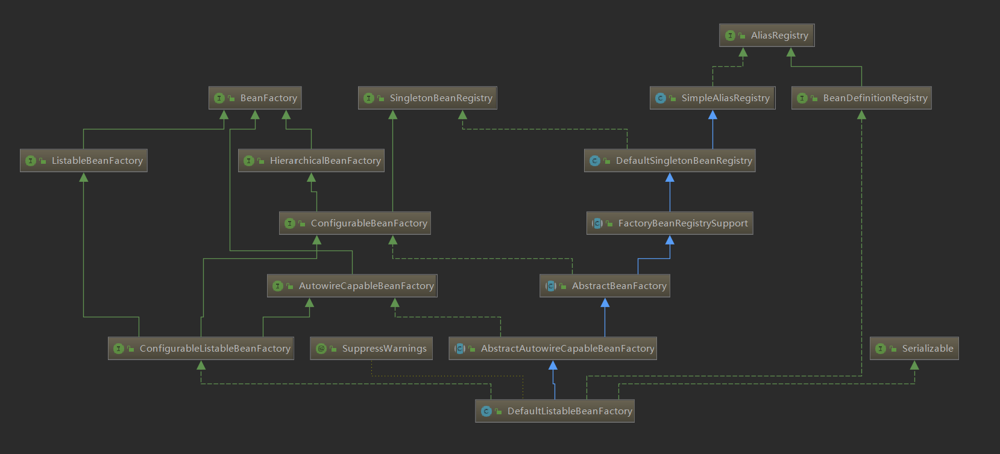
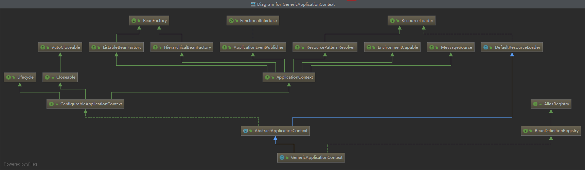

# Bean

> MissionLee : Bean包作为Spring核心之一，相比其中代码一定非常优秀

## 一个BeanFactory

## 一个ApplicationContext

## 简单介绍
> 上面可以看到，不管是BeanFactory 还是 Application ，主要都是提供BeanFactory功能和各种用于支撑实际使用的方法

> ApplicationContext 是BeanFactory的增强，ApplicationEventPublisher / MessageSource / ResourcePatternResolver / EnvironmentCapabe 之类的

### BeanFactory
它是Spring中Bean容器的顶级接口。里面有获取bean，判断是否包含bean，是否单例，获取别名等基本方法

### ListableBeanFactory
根据条件获取Bean的配置清单。 
如String[] getBeanDefinitionNames();返回bean在工厂中定义的名称。 
Bean在工厂中定义的次数。是否某个名称被定义在这个Bean中

### HierarchicalBeanFactory
BeanFactory getParentBeanFactory();//获取父类Bean Factory

### SingletonBeanRegistry
定义单例的注册及获取

### ConfigurableBeanFactory
提供了配置Bean的各种方法

### AutowireCapableBeanFactory
提供了创建Bean，自动注入Bean，初始化前后执行的方法

### ConfigurableListableBeanFactory
提供分析和修改Bean的定义，指定忽略类型和接口等

### AliasRegistry
对别名的增删改查

### BeanDefinitionRegistry
BeanDefinition的增删改查

### SimpleAliasRegistry
使用ConcurrentHashMap对alisa做对应的实现

### DefaultSingletonBeanRegistry
使用各种集合存储，对接口SingletonBeanRegistry进行实现

### FactoryBeanRegistrySupport
增加了对FactoryBean的特殊处理

### AbstractBeanFactory
额外提供ConfigurableBeanFactory的一些功能

### AbstractAutowireCapableBeanFactory
主要对接口AutowireCapableBeanFactory进行实现

## 
