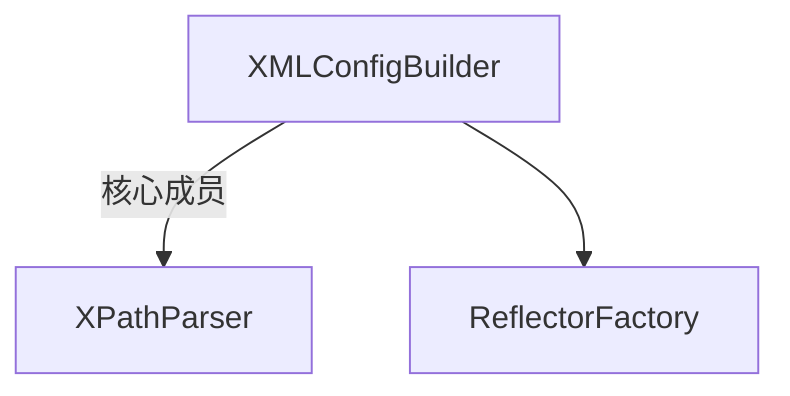

# Mybatis 源码

> 真正解析配置的是 XMLConfigBuilder （当然也有根据注解的builder）

- XPathParser 有个重要的方法parser.evalNode(String expression),用来把xml指定标签，解析为 一个 XNode类，之后可以使用 XNode，可以继续使用 .evalNode 获取其中的字配置
- 内部调用解析方法，最终把所有的配置好的内容，放在一个 org.apache.ibatis.session.Configuration 里面，这个累包含了我们使用的各种属性，各种参数，很多有初始值
> 另外有：关于 [Spring中SqlSessionTemplate](..\01.SpringSeries\SpringDataSQL\001-SqlSessionTemplate.md) 的学习,主要可以学习其代理模式，和通过代理模式实现的事务管理

> 个人解读Mybatis

- [DefaultSqlSessionFactory](003.JavaWebTech\02.MyBatis\005-1-DefaultSqlSessionFactory.md)