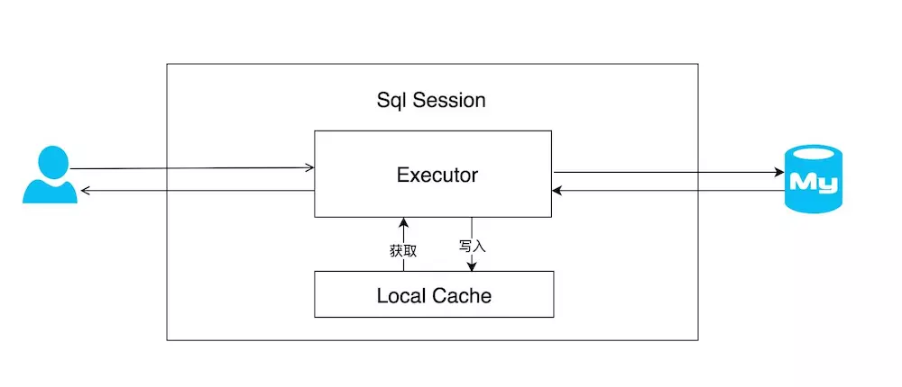
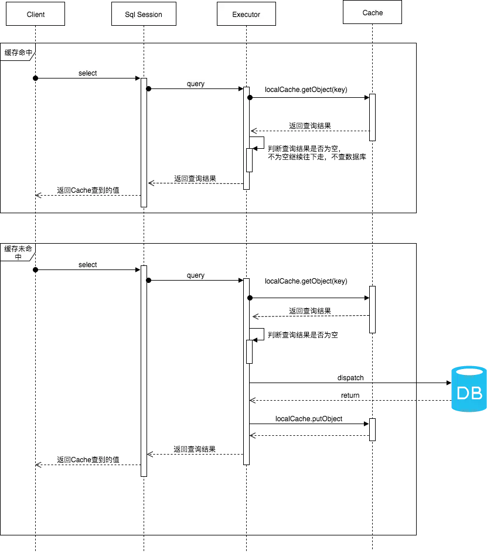
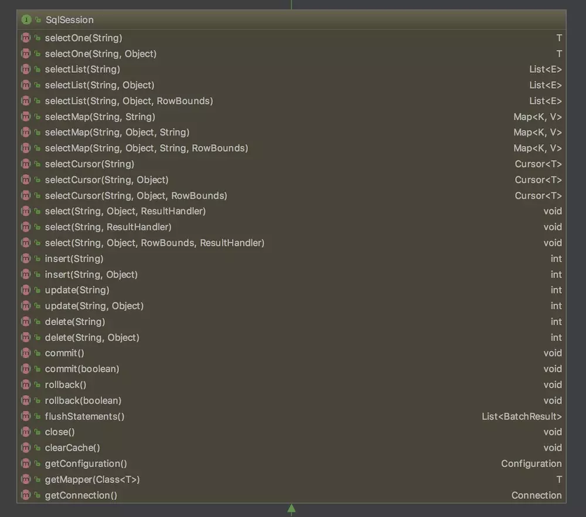
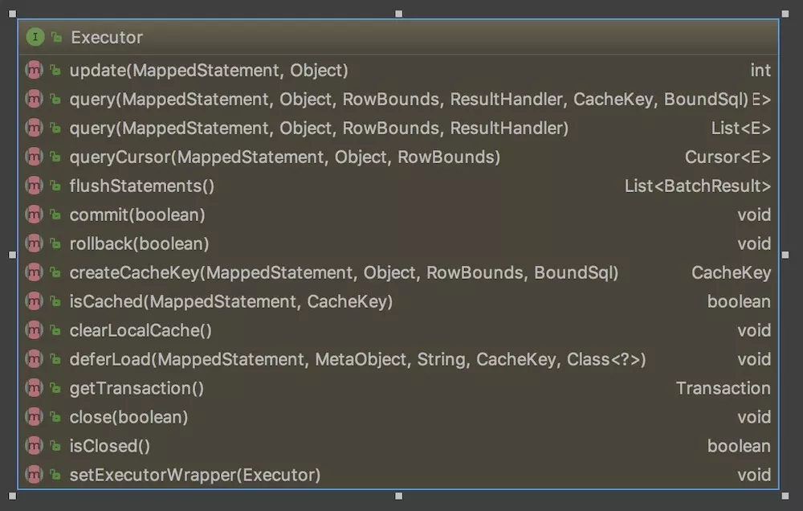
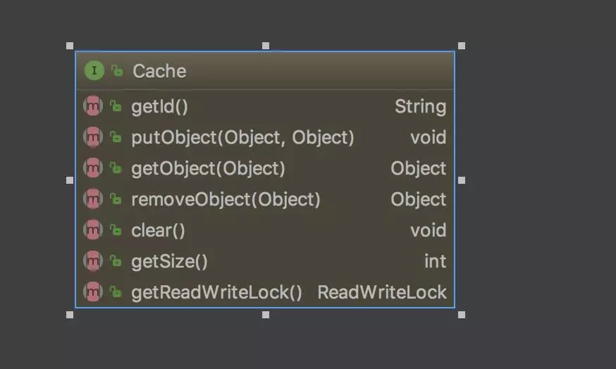
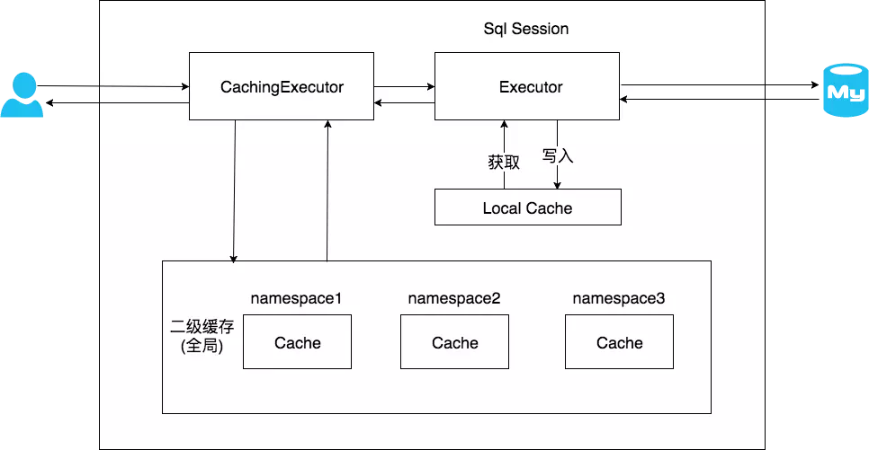

# MyBatis 缓存

MissionLee：

|缓存|配置|存放位置|影响范围|
|-|-|-|-|
|一级|默认开启 localCacheScope：SESSION/STATEMENT|SqlSession|SqlSession|
|二级|cacheEnabled：true|MappedStatement|同一个namespace|

- 开启二级缓存的时候，使用 CachingExecutor取代普通的Executor
- cache存储在mappedStatement 里面，Configuration里面保存了 一个 Map 存放所有的 mappedStatements ⭐⭐ 每个 mapper.xml文件会存为一个MappedStatement类

-------------------------------

> 以下原文

原文链接 https://www.jianshu.com/p/c553169c5921

本文已授权Gitchat独家发布，未经Gitchat许可，不得转载。

```note
[原文作者]
我，后端Java工程师，现在美团点评工作。
爱健身，爱技术，也喜欢写点文字。
个人网站: http://kailuncen.me
公众号: KailunTalk (凯伦说)
```
>前言
基于个人的兴趣，开了这场chat，主题是Mybatis一级和二级缓存的应用及源码分析。希望在本场chat结束后，能够帮助读者朋友明白以下三点。

- Mybatis是什么。
- Mybatis一级和二级缓存如何配置使用。
- Mybatis一级和二级缓存的工作流程及源码分析。

本次分析中涉及到的代码和数据库表均放在Github上，地址: https://github.com/kailuncen/mybatis-cache-demo
- 目录
  - Mybatis的基础概念。
  - 一级缓存介绍及相关配置。
  - 一级缓存工作流程及源码分析。
  - 一级缓存总结。
  - 二级缓存介绍及相关配置。
  - 二级缓存源码分析。
  - 二级缓存总结。
  - 全文总结。

## Mybatis的基础概念

本章节会对Mybatis进行大体的介绍，分为官方定义和核心组件介绍。
首先是Mybatis官方定义，如下所示。

> MyBatis是支持定制化SQL、存储过程以及高级映射的优秀的持久层框架。MyBatis避免了几乎所有的JDBC代码和手动设置参数以及获取结果集。MyBatis可以对配置和原生Map使用简单的XML或注解，将接口和Java 的POJOs(Plain Old Java Objects,普通的 Java对象)映射成数据库中的记录。

其次是Mybatis的几个核心概念。

- SqlSession : 代表和数据库的一次会话，向用户提供了操作数据库的方法。
- MappedStatement: 代表要发往数据库执行的指令，可以理解为是Sql的抽象表示。
- Executor: 具体用来和数据库交互的执行器，接受MappedStatement作为参数。
- 映射接口: 在接口中会要执行的Sql用一个方法来表示，具体的Sql写在映射文件中。
- 映射文件: 可以理解为是Mybatis编写Sql的地方，通常来说每一张单表都会对应着一个映射文件，在该文件中会定义Sql语句入参和出参的形式。

下图就是一个针对Student表操作的接口文件StudentMapper，在StudentMapper中，我们可以若干方法，这个方法背后就是代表着要执行的Sql的意义。

```java
package mapper;

import org.apache.ibatis.annotations.Param;

import entity.StudentEntity;

import java.util.Set;

public interface StudentMapper {

	public StudentEntity getStudentById(int id);

	public int addStudent(StudentEntity student);

	public int updateStudentName(@Param("name") String name, @Param("id") int id);

	public StudentEntity getStudentByIdWithClassInfo(int id);
}
```


通常也可以把涉及多表查询的方法定义在StudentMapper中，如果查询的主体仍然是Student表的信息。也可以将涉及多表查询的语句单独抽出一个独立的接口文件。
在定义完接口文件后，我们会开发一个Sql映射文件，主要由mapper元素和select|insert|update|delete元素构成，如下图所示。
```xml
<?xml version="1.0" encoding="UTF-8" ?>
<!DOCTYPE mapper PUBLIC "-//mybatis.org//DTD Mapper 3.0//EN" "http://mybatis.org/dtd/mybatis-3-mapper.dtd" >
<mapper namespace="mapper.StudentMapper">
    <cache/>

    <select id="getStudentById" parameterType="int" resultType="entity.StudentEntity">
        SELECT id,name,age FROM student WHERE id = #{id}
    </select>

    <select id="getStudentByIdWithClassInfo" parameterType="int" resultType="entity.StudentEntity">
        SELECT  s.id,s.name,s.age,class.name as className
        FROM classroom c
        JOIN student s ON c.student_id = s.id
        JOIN class ON c.class_id = class.id
        WHERE s.id = #{id};
    </select>

    <insert id="addStudent" parameterType="entity.StudentEntity" useGeneratedKeys="true" keyProperty="id">
        INSERT INTO student(name,age) VALUES(#{name}, #{age})
    </insert>

    <update id="updateStudentName">
        UPDATE student SET name = #{name} WHERE id = #{id}
    </update>
</mapper>

```

mapper元素代表这个文件是一个映射文件，使用namespace和具体的映射接口绑定起来，namespace的值就是这个接口的全限定类名。select|insert|update|delete代表的是Sql语句，映射接口中定义的每一个方法也会和映射文件中的语句通过id的方式绑定起来，方法名就是语句的id，同时会定义语句的入参和出参，用于完成和Java对象之间的转换。
在Mybatis初始化的时候，每一个语句都会使用对应的MappedStatement代表，使用namespace+语句本身的id来代表这个语句。如下代码所示，使用mapper.StudentMapper.getStudentById代表其对应的Sql。
```sql
SELECT id,name,age FROM student WHERE id = #{id}
```
在Mybatis执行时，会进入对应接口的方法，通过类名加上方法名的组合生成id，找到需要的MappedStatement，交给执行器使用。
至此，Mybatis的基础概念介绍完毕。
## 一级缓存
### 一级缓存介绍
在系统代码的运行中，我们可能会在一个数据库会话中，执行多次查询条件完全相同的Sql，鉴于日常应用的大部分场景都是读多写少，这重复的查询会带来一定的网络开销，同时select查询的量比较大的话，对数据库的性能是有比较大的影响的。
如果是Mysql数据库的话，在服务端和Jdbc端都开启预编译支持的话，可以在本地JVM端缓存Statement,可以在Mysql服务端直接执行Sql，省去编译Sql的步骤，但也无法避免和数据库之间的重复交互。关于Jdbc和Mysql预编译缓存的事情，可以看我的这篇博客JDBC和Mysql那些事。
Mybatis提供了一级缓存的方案来优化在数据库会话间重复查询的问题。实现的方式是每一个SqlSession中都持有了自己的缓存，一种是`SESSION级别`，即在一个Mybatis会话中执行的所有语句，都会共享这一个缓存。一种是`STATEMENT级别`，可以理解为缓存只对当前执行的这一个statement有效。如果用一张图来代表一级查询的查询过程的话，可以用下图表示。



每一个SqlSession中持有了自己的Executor，每一个Executor中有一个Local Cache。当用户发起查询时，Mybatis会根据当前执行的MappedStatement生成一个key，去Local Cache中查询，如果缓存命中的话，返回。如果缓存没有命中的话，则写入Local Cache，最后返回结果给用户。

### 一级缓存配置
上文介绍了一级缓存的实现方式，解决了什么问题。在这个章节，我们学习如何使用Mybatis的一级缓存。只需要在Mybatis的配置文件中，添加如下语句，就可以使用一级缓存。共有两个选项，SESSION或者STATEMENT，默认是SESSION级别。
```xml
<setting name="localCacheScope" value="SESSION"/>
```
### 一级缓存实验

配置完毕后，通过实验的方式了解Mybatis一级缓存的效果。每一个单元测试后都请恢复被修改的数据。
首先是创建了一个示例表student,为其创建了对应的POJO类和增改的方法，具体可以在entity包和Mapper包中查看。
```sql
CREATE TABLE `student` (
  `id` int(11) unsigned NOT NULL AUTO_INCREMENT,
  `name` varchar(200) COLLATE utf8_bin DEFAULT NULL,
  `age` tinyint(3) unsigned DEFAULT NULL,
  PRIMARY KEY (`id`)
) ENGINE=InnoDB AUTO_INCREMENT=4 DEFAULT CHARSET=utf8 COLLATE=utf8_bin;
```
在以下实验中，id为1的学生名称是凯伦。
实验1
开启一级缓存，范围为会话级别，调用三次getStudentById，代码如下所示:
```java
public void getStudentById() throws Exception {
        SqlSession sqlSession = factory.openSession(true); // 自动提交事务
        StudentMapper studentMapper = sqlSession.getMapper(StudentMapper.class);
        System.out.println(studentMapper.getStudentById(1));
        System.out.println(studentMapper.getStudentById(1));
        System.out.println(studentMapper.getStudentById(1));
    }
```
执行结果:


我们可以看到，只有第一次真正查询了数据库,后续的查询使用了一级缓存。

实验2

在这次的试验中，我们增加了对数据库的修改操作，验证在一次数据库会话中，对数据库发生了修改操作，一级缓存是否会失效。
```java
@Test
public void addStudent() throws Exception {
        SqlSession sqlSession = factory.openSession(true); // 自动提交事务
        StudentMapper studentMapper = sqlSession.getMapper(StudentMapper.class);
        System.out.println(studentMapper.getStudentById(1));
        System.out.println("增加了" + studentMapper.addStudent(buildStudent()) + "个学生");
        System.out.println(studentMapper.getStudentById(1));
        sqlSession.close();
}
```
执行结果:


我们可以看到，在修改操作后执行的相同查询，查询了数据库，一级缓存失效。

实验3

开启两个SqlSession，在sqlSession1中查询数据，使一级缓存生效，在sqlSession2中更新数据库，验证一级缓存只在数据库会话内部共享。
```java
@Test
public void testLocalCacheScope() throws Exception {
        SqlSession sqlSession1 = factory.openSession(true); 
        SqlSession sqlSession2 = factory.openSession(true); 

       StudentMapper studentMapper = sqlSession1.getMapper(StudentMapper.class);
       StudentMapper studentMapper2 = sqlSession2.getMapper(StudentMapper.class);

        System.out.println("studentMapper读取数据: " + studentMapper.getStudentById(1));
        System.out.println("studentMapper读取数据: " + studentMapper.getStudentById(1));
        System.out.println("studentMapper2更新了" + studentMapper2.updateStudentName("小岑",1) + "个学生的数据");
        System.out.println("studentMapper读取数据: " + studentMapper.getStudentById(1));
        System.out.println("studentMapper2读取数据: " + studentMapper2.getStudentById(1));
}
```


我们可以看到，sqlSession2更新了id为1的学生的姓名，从凯伦改为了小岑，但session1之后的查询中，id为1的学生的名字还是凯伦，出现了脏数据，也证明了我们之前就得到的结论，一级缓存只存在于只在数据库会话内部共享。

### 一级缓存工作流程&源码分析
这一章节主要从一级缓存的工作流程和源码层面对一级缓存进行学习。
#### 工作流程
根据一级缓存的工作流程，我们绘制出一级缓存执行的时序图，如下图所示。




主要步骤如下:


- 对于某个Select Statement，根据该Statement生成key。
- 判断在Local Cache中,该key是否用对应的数据存在。
- 如果命中，则跳过查询数据库，继续往下走。
- 如果没命中：
  - 去数据库中查询数据，得到查询结果；
  - 将key和查询到的结果作为key和value，放入Local Cache中。
  - 将查询结果返回；
- 判断缓存级别是否为STATEMENT级别，如果是的话，清空本地缓存。

源码分析
了解具体的工作流程后，我们队Mybatis查询相关的核心类和一级缓存的源码进行走读。这对于之后学习二级缓存时也有帮助。
SqlSession:  对外提供了用户和数据库之间交互需要的所有方法，隐藏了底层的细节。它的一个默认实现类是DefaultSqlSession。





Executor: SqlSession向用户提供操作数据库的方法，但和数据库操作有关的职责都会委托给Executor。

 



如下图所示，Executor有若干个实现类，为Executor赋予了不同的能力，大家可以根据类名，自行私下学习每个类的基本作用。


在一级缓存章节，我们主要学习BaseExecutor。
BaseExecutor: BaseExecutor是一个实现了Executor接口的抽象类，定义若干抽象方法，在执行的时候，把具体的操作委托给子类进行执行。
```java
protected abstract int doUpdate(MappedStatement ms, Object parameter) throws SQLException;
protected abstract List<BatchResult> doFlushStatements(boolean isRollback) throws SQLException;
protected abstract <E> List<E> doQuery(MappedStatement ms, Object parameter, RowBounds rowBounds, ResultHandler resultHandler, BoundSql boundSql) throws SQLException;
protected abstract <E> Cursor<E> doQueryCursor(MappedStatement ms, Object parameter, RowBounds rowBounds, BoundSql boundSql) throws SQLException;
```
在一级缓存的介绍中，我们提到对Local Cache的查询和写入是在Executor内部完成的。在阅读BaseExecutor的代码后，我们也发现Local Cache就是它内部的一个成员变量，如下代码所示。
```java
public abstract class BaseExecutor implements Executor {
protected ConcurrentLinkedQueue<DeferredLoad> deferredLoads;
protected PerpetualCache localCache;
```
Cache: Mybatis中的Cache接口，提供了和缓存相关的最基本的操作，有若干个实现类，使用装饰器模式互相组装，提供丰富的操控缓存的能力。





BaseExecutor成员变量之一的PerpetualCache，就是对Cache接口最基本的实现，其实现非常的简内部持有了hashmap，对一级缓存的操作其实就是对这个hashmap的操作。如下代码所示。
```java
public class PerpetualCache implements Cache {
  private String id;
  private Map<Object, Object> cache = new HashMap<Object, Object>();
}
```
在阅读相关核心类代码后，从源代码层面对一级缓存工作中涉及到的相关代码，出于篇幅的考虑，对源码做适当删减，读者朋友可以结合本文，后续进行更详细的学习。
为了执行和数据库的交互，首先会通过DefaultSqlSessionFactory开启一个SqlSession，在创建SqlSession的过程中，会通过Configuration类创建一个全新的Executor，作为DefaultSqlSession构造函数的参数，代码如下所示。
```java
private SqlSession openSessionFromDataSource(ExecutorType execType, TransactionIsolationLevel level, boolean autoCommit) {
      ............
    final Executor executor = configuration.newExecutor(tx, execType);     
    return new DefaultSqlSession(configuration, executor, autoCommit);
}
```
如果用户不进行制定的话，Configuration在创建Executor时，默认创建的类型就是SimpleExecutor,它是一个简单的执行类，只是单纯执行Sql。以下是具体用来创建的代码。
```java
public Executor newExecutor(Transaction transaction, ExecutorType executorType) {
    executorType = executorType == null ? defaultExecutorType : executorType;
    executorType = executorType == null ? ExecutorType.SIMPLE : executorType;
    Executor executor;
    if (ExecutorType.BATCH == executorType) {
      executor = new BatchExecutor(this, transaction);
    } else if (ExecutorType.REUSE == executorType) {
      executor = new ReuseExecutor(this, transaction);
    } else {
      executor = new SimpleExecutor(this, transaction);
    }
    // 尤其可以注意这里，如果二级缓存开关开启的话，是使用CahingExecutor装饰BaseExecutor的子类
    if (cacheEnabled) {
      executor = new CachingExecutor(executor);                      
    }
    executor = (Executor) interceptorChain.pluginAll(executor);
    return executor;
}
```
在SqlSession创建完毕后，根据Statment的不同类型，会进入SqlSession的不同方法中，如果是Select语句的话，最后会执行到SqlSession的selectList，代码如下所示。
```java
@Override
public <E> List<E> selectList(String statement, Object parameter, RowBounds rowBounds) {
      MappedStatement ms = configuration.getMappedStatement(statement);
      return executor.query(ms, wrapCollection(parameter), rowBounds, Executor.NO_RESULT_HANDLER);
}
```
在上文的代码中，SqlSession把具体的查询职责委托给了Executor。如果只开启了一级缓存的话，首先会进入BaseExecutor的query方法。代码如下所示。
```java
@Override
public <E> List<E> query(MappedStatement ms, Object parameter, RowBounds rowBounds, ResultHandler resultHandler) throws SQLException {
    BoundSql boundSql = ms.getBoundSql(parameter);
    CacheKey key = createCacheKey(ms, parameter, rowBounds, boundSql);
    return query(ms, parameter, rowBounds, resultHandler, key, boundSql);
}
```
在上述代码中，会先根据传入的参数生成CacheKey，进入该方法查看CacheKey是如何生成的，代码如下所示。
```java
CacheKey cacheKey = new CacheKey();
cacheKey.update(ms.getId());
cacheKey.update(rowBounds.getOffset());
cacheKey.update(rowBounds.getLimit());
cacheKey.update(boundSql.getSql());
//后面是update了sql中带的参数
cacheKey.update(value);
```
在上述的代码中，我们可以看到它将MappedStatement的Id、sql的offset、Sql的limit、Sql本身以及Sql中的参数传入了CacheKey这个类，最终生成了CacheKey。我们看一下这个类的结构。
```java
private static final int DEFAULT_MULTIPLYER = 37;
private static final int DEFAULT_HASHCODE = 17;

private int multiplier;
private int hashcode;
private long checksum;
private int count;
private List<Object> updateList;

public CacheKey() {
    this.hashcode = DEFAULT_HASHCODE;
    this.multiplier = DEFAULT_MULTIPLYER;
    this.count = 0;
    this.updateList = new ArrayList<Object>();
}
```
首先是它的成员变量和构造函数，有一个初始的hachcode和乘数，同时维护了一个内部的updatelist。在CacheKey的update方法中，会进行一个hashcode和checksum的计算，同时把传入的参数添加进updatelist中。如下代码所示。
```java
public void update(Object object) {
    int baseHashCode = object == null ? 1 : ArrayUtil.hashCode(object); 
    count++;
    checksum += baseHashCode;
    baseHashCode *= count;
    hashcode = multiplier * hashcode + baseHashCode;
    
    updateList.add(object);
}
```
我们是如何判断CacheKey相等的呢，在CacheKey的equals方法中给了我们答案，代码如下所示。
```java
@Override
public boolean equals(Object object) {
    .............
    for (int i = 0; i < updateList.size(); i++) {
      Object thisObject = updateList.get(i);
      Object thatObject = cacheKey.updateList.get(i);
      if (!ArrayUtil.equals(thisObject, thatObject)) {
        return false;
      }
    }
    return true;
}
```
除去hashcode，checksum和count的比较外，只要updatelist中的元素一一对应相等，那么就可以认为是CacheKey相等。只要两条Sql的下列五个值相同，即可以认为是相同的Sql。
```note
Statement Id + Offset + Limmit + Sql + Params
```
BaseExecutor的query方法继续往下走，代码如下所示。
```java
list = resultHandler == null ? (List<E>) localCache.getObject(key) : null;
if (list != null) {
    // 这个主要是处理存储过程用的。
    handleLocallyCachedOutputParameters(ms, key, parameter, boundSql);
    } else {
    list = queryFromDatabase(ms, parameter, rowBounds, resultHandler, key, boundSql);
}
```
如果查不到的话，就从数据库查，在queryFromDatabase中，会对localcache进行写入。
在query方法执行的最后，会判断一级缓存级别是否是STATEMENT级别，如果是的话，就清空缓存，这也就是STATEMENT级别的一级缓存无法共享localCache的原因。代码如下所示。
```java
if (configuration.getLocalCacheScope() == LocalCacheScope.STATEMENT) {
        clearLocalCache();
}
```
在源码分析的最后，我们确认一下，如果是insert/delete/update方法，缓存就会刷新的原因。
SqlSession的insert方法和delete方法，都会统一走update的流程，代码如下所示。
```java
@Override
public int insert(String statement, Object parameter) {
    return update(statement, parameter);
  }
   @Override
  public int delete(String statement) {
    return update(statement, null);
}
```
update方法也是委托给了Executor执行。BaseExecutor的执行方法如下所示。
```java
@Override
public int update(MappedStatement ms, Object parameter) throws SQLException {
    ErrorContext.instance().resource(ms.getResource()).activity("executing an update").object(ms.getId());
    if (closed) {
      throw new ExecutorException("Executor was closed.");
    }
    clearLocalCache();
    return doUpdate(ms, parameter);
}
```
每次执行update前都会清空localCache。
至此，一级缓存的工作流程讲解以及源码分析完毕。
### 总结

Mybatis一级缓存的生命周期和SqlSession一致。
Mybatis的缓存是一个粗粒度的缓存，没有更新缓存和缓存过期的概念，同时只是使用了默认的hashmap，也没有做容量上的限定。
Mybatis的一级缓存最大范围是SqlSession内部，有多个SqlSession或者分布式的环境下，有操作数据库写的话，会引起脏数据，建议是把一级缓存的默认级别设定为Statement，即不使用一级缓存。

## 二级缓存
### 二级缓存介绍
在上文中提到的一级缓存中，其最大的共享范围就是一个SqlSession内部，那么如何让多个SqlSession之间也可以共享缓存呢，答案是二级缓存。
当开启二级缓存后，会使用CachingExecutor装饰Executor，在进入后续执行前，先在CachingExecutor进行二级缓存的查询，具体的工作流程如下所示。





在二级缓存的使用中，一个namespace下的所有操作语句，都影响着同一个Cache，即二级缓存是被多个SqlSession共享着的，是一个全局的变量。
当开启缓存后，数据的查询执行的流程就是 二级缓存 -> 一级缓存 -> 数据库。

### 二级缓存配置

要正确的使用二级缓存，需完成如下配置的。
1  在Mybatis的配置文件中开启二级缓存。
```xml
<setting name="cacheEnabled" value="true"/>
```
2  在Mybatis的映射XML中配置cache或者 cache-ref 。
```xml
<cache/>   
```
cache标签用于声明这个namespace使用二级缓存，并且可以自定义配置。

- type:   cache使用的类型，默认是PerpetualCache，这在一级缓存中提到过。
- eviction:  定义回收的策略，常见的有FIFO，LRU。
- flushInterval:  配置一定时间自动刷新缓存，单位是毫秒
- size:   最多缓存对象的个数
- readOnly:   是否只读，若配置可读写，则需要对应的实体类能够序列化。
- blocking:    若缓存中找不到对应的key，是否会一直blocking，直到有对应的数据进入缓存。
```xml
<cache-ref namespace="mapper.StudentMapper"/>
```

cache-ref代表引用别的命名空间的Cache配置，两个命名空间的操作使用的是同一个Cache。
### 二级缓存实验

在本章节，通过实验，了解Mybatis二级缓存在使用上的一些特点。
在本实验中，id为1的学生名称初始化为点点。
### 实验1
测试二级缓存效果，不提交事务，sqlSession1查询完数据后，sqlSession2相同的查询是否会从缓存中获取数据。
```java
@Test
public void testCacheWithoutCommitOrClose() throws Exception {
        SqlSession sqlSession1 = factory.openSession(true); 
        SqlSession sqlSession2 = factory.openSession(true); 
        
        StudentMapper studentMapper = sqlSession1.getMapper(StudentMapper.class);
        StudentMapper studentMapper2 = sqlSession2.getMapper(StudentMapper.class);

        System.out.println("studentMapper读取数据: " + studentMapper.getStudentById(1));
        System.out.println("studentMapper2读取数据: " + studentMapper2.getStudentById(1));
}
```
执行结果:


我们可以看到，当sqlsession没有调用commit()方法时，二级缓存并没有起到作用。

实验2

测试二级缓存效果，当提交事务时，sqlSession1查询完数据后，sqlSession2相同的查询是否会从缓存中获取数据。
```java
@Test
public void testCacheWithCommitOrClose() throws Exception {
        SqlSession sqlSession1 = factory.openSession(true); 
        SqlSession sqlSession2 = factory.openSession(true); 
        
        StudentMapper studentMapper = sqlSession1.getMapper(StudentMapper.class);
        StudentMapper studentMapper2 = sqlSession2.getMapper(StudentMapper.class);

        System.out.println("studentMapper读取数据: " + studentMapper.getStudentById(1));
        sqlSession1.commit();
        System.out.println("studentMapper2读取数据: " + studentMapper2.getStudentById(1));
}

```


从图上可知，sqlsession2的查询，使用了缓存，缓存的命中率是0.5。

实验3

测试update操作是否会刷新该namespace下的二级缓存。
```java
@Test
public void testCacheWithUpdate() throws Exception {
        SqlSession sqlSession1 = factory.openSession(true); 
        SqlSession sqlSession2 = factory.openSession(true); 
        SqlSession sqlSession3 = factory.openSession(true); 
        
        StudentMapper studentMapper = sqlSession1.getMapper(StudentMapper.class);
        StudentMapper studentMapper2 = sqlSession2.getMapper(StudentMapper.class);
        StudentMapper studentMapper3 = sqlSession3.getMapper(StudentMapper.class);
        
        System.out.println("studentMapper读取数据: " + studentMapper.getStudentById(1));
        sqlSession1.commit();
        System.out.println("studentMapper2读取数据: " + studentMapper2.getStudentById(1));
        
        studentMapper3.updateStudentName("方方",1);
        sqlSession3.commit();
        System.out.println("studentMapper2读取数据: " + studentMapper2.getStudentById(1));
}
```


我们可以看到，在sqlSession3更新数据库，并提交事务后，sqlsession2的StudentMapper namespace下的查询走了数据库，没有走Cache。

实验4

验证Mybatis的二级缓存不适应用于映射文件中存在多表查询的情况。一般来说，我们会为每一个单表创建一个单独的映射文件，如果存在涉及多个表的查询的话，由于Mybatis的二级缓存是基于namespace的，多表查询语句所在的namspace无法感应到其他namespace中的语句对多表查询中涉及的表进行了修改，引发脏数据问题。
```java
@Test
public void testCacheWithDiffererntNamespace() throws Exception {
        SqlSession sqlSession1 = factory.openSession(true); 
        SqlSession sqlSession2 = factory.openSession(true); 
        SqlSession sqlSession3 = factory.openSession(true); 
    
        StudentMapper studentMapper = sqlSession1.getMapper(StudentMapper.class);
        StudentMapper studentMapper2 = sqlSession2.getMapper(StudentMapper.class);
        ClassMapper classMapper = sqlSession3.getMapper(ClassMapper.class);
        
        System.out.println("studentMapper读取数据: " + studentMapper.getStudentByIdWithClassInfo(1));
        sqlSession1.close();
        System.out.println("studentMapper2读取数据: " + studentMapper2.getStudentByIdWithClassInfo(1));

        classMapper.updateClassName("特色一班",1);
        sqlSession3.commit();
        System.out.println("studentMapper2读取数据: " + studentMapper2.getStudentByIdWithClassInfo(1));
}
```
执行结果:


在这个实验中，我们引入了两张新的表，一张class，一张classroom。class中保存了班级的id和班级名，classroom中保存了班级id和学生id。我们在StudentMapper中增加了一个查询方法getStudentByIdWithClassInfo，用于查询学生所在的班级，涉及到多表查询。在ClassMapper中添加了updateClassName，根据班级id更新班级名的操作。
当sqlsession1的studentmapper查询数据后，二级缓存生效。保存在StudentMapper的namespace下的cache中。当sqlSession3的classMapper的updateClassName方法对class表进行更新时，updateClassName不属于StudentMapper的namespace，所以StudentMapper下的cache没有感应到变化，没有刷新缓存。当StudentMapper中同样的查询再次发起时，从缓存中读取了脏数据。

实验5

为了解决实验4的问题呢，可以使用Cache ref，让ClassMapper引用StudenMapper命名空间，这样两个映射文件对应的Sql操作都使用的是同一块缓存了。
执行结果:


不过这样做的后果是，缓存的粒度变粗了，多个Mapper namespace下的所有操作都会对缓存使用造成影响，其实这个缓存存在的意义已经不大了。

## 二级缓存源码分析
Mybatis二级缓存的工作流程和前文提到的一级缓存类似，只是在一级缓存处理前，用CachingExecutor装饰了BaseExecutor的子类，实现了缓存的查询和写入功能，所以二级缓存直接从源码开始分析。
源码分析
源码分析从CachingExecutor的query方法展开，源代码走读过程中涉及到的知识点较多，不能一一详细讲解，可以在文后留言，我会在交流环节更详细的表示出来。
CachingExecutor的query方法，首先会从`MappedStatement中获得在配置初始化时赋予的cache`。
```java
Cache cache = ms.getCache();
```
本质上是装饰器模式的使用，具体的执行链是
SynchronizedCache -> LoggingCache -> SerializedCache -> LruCache -> PerpetualCache。


以下是具体这些Cache实现类的介绍，他们的组合为Cache赋予了不同的能力。


- SynchronizedCache: 同步Cache，实现比较简单，直接使用synchronized修饰方法。
- LoggingCache: 日志功能，装饰类，用于记录缓存的命中率，如果开启了DEBUG模式，则会输出命中率日志。
- SerializedCache: 序列化功能，将值序列化后存到缓存中。该功能用于缓存返回一份实例的Copy，用于保存线程安全。
- LruCache:  采用了Lru算法的Cache实现，移除最近最少使用的key/value。
- PerpetualCache: 作为为最基础的缓存类，底层实现比较简单，直接使用了HashMap。

然后是判断是否需要刷新缓存，代码如下所示。
```java
flushCacheIfRequired(ms);
```
在默认的设置中SELECT语句不会刷新缓存，insert/update/delte会刷新缓存。进入该方法。代码如下所示。
```java
private void flushCacheIfRequired(MappedStatement ms) {
    Cache cache = ms.getCache();
    if (cache != null && ms.isFlushCacheRequired()) {      
      tcm.clear(cache);
    }
}
```
Mybatis的CachingExecutor持有了TransactionalCacheManager，即上述代码中的tcm。
TransactionalCacheManager中持有了一个Map，代码如下所示。
```java
private Map<Cache, TransactionalCache> transactionalCaches = new HashMap<Cache, TransactionalCache>();
```
这个Map保存了Cache和用TransactionalCache包装后的Cache的映射关系。
TransactionalCache实现了Cache接口，CachingExecutor会默认使用他包装初始生成的Cache，作用是如果事务提交，对缓存的操作才会生效，如果事务回滚或者不提交事务，则不对缓存产生影响。
在TransactionalCache的clear，有以下两句。清空了需要在提交时加入缓存的列表，同时设定提交时清空缓存，代码如下所示。
```java
@Override
public void clear() {
    clearOnCommit = true;
    entriesToAddOnCommit.clear();
}
```
CachingExecutor继续往下走，ensureNoOutParams主要是用来处理存储过程的，暂时不用考虑。
```java
if (ms.isUseCache() && resultHandler == null) {
    ensureNoOutParams(ms, parameterObject, boundSql);
```
之后会尝试从tcm中获取缓存的列表。
```java
List<E> list = (List<E>) tcm.getObject(cache, key);
```
在getObject方法中，会把获取值的职责一路向后传，最终到PerpetualCache。如果没有查到，会把key加入Miss集合，这个主要是为了统计命中率。
```java
Object object = delegate.getObject(key);
if (object == null) {
    entriesMissedInCache.add(key);
}
```
CachingExecutor继续往下走，如果查询到数据，则调用tcm.putObject方法，往缓存中放入值。
```java
if (list == null) {
    list = delegate.<E> query(ms, parameterObject, rowBounds, resultHandler, key, boundSql);
    tcm.putObject(cache, key, list); // issue #578 and #116
}
```
tcm的put方法也不是直接操作缓存，只是在把这次的数据和key放入待提交的Map中。
```java
@Override
public void putObject(Object key, Object object) {
    entriesToAddOnCommit.put(key, object);
}
```
从以上的代码分析中，我们可以明白，如果不调用commit方法的话，由于TranscationalCache的作用，并不会对二级缓存造成直接的影响。因此我们看看Sqlsession的commit方法中做了什么。代码如下所示。
```java
@Override
public void commit(boolean force) {
    try {
      executor.commit(isCommitOrRollbackRequired(force));
```
因为我们使用了CachingExecutor，首先会进入CachingExecutor实现的commit方法。
```java
@Override
public void commit(boolean required) throws SQLException {
    delegate.commit(required);
    tcm.commit();
}
```
会把具体commit的职责委托给包装的Executor。主要是看下tcm.commit()，tcm最终又会调用到TrancationalCache。
```java
public void commit() {
    if (clearOnCommit) {
      delegate.clear();
    }
    flushPendingEntries();
    reset();
}
```
看到这里的clearOnCommit就想起刚才TrancationalCache的clear方法设置的标志位，真正的清理Cache是放到这里来进行的。具体清理的职责委托给了包装的Cache类。之后进入flushPendingEntries方法。代码如下所示。
```java
private void flushPendingEntries() {
    for (Map.Entry<Object, Object> entry : entriesToAddOnCommit.entrySet()) {
      delegate.putObject(entry.getKey(), entry.getValue());
    }
    ................
}
```
在flushPendingEntries中，就把待提交的Map循环后，委托给包装的Cache类，进行putObject的操作。
后续的查询操作会重复执行这套流程。如果是insert|update|delete的话，会统一进入CachingExecutor的update方法，其中调用了这个函数，代码如下所示，因此不再赘述。
private void flushCacheIfRequired(MappedStatement ms) 

### 总结

Mybatis的二级缓存相对于一级缓存来说，实现了SqlSession之间缓存数据的共享，同时粒度更加的细，能够到Mapper级别，通过Cache接口实现类不同的组合，对Cache的可控性也更强。
Mybatis在多表查询时，极大可能会出现脏数据，有设计上的缺陷，安全使用的条件比较苛刻。
在分布式环境下，由于默认的Mybatis Cache实现都是基于本地的，分布式环境下必然会出现读取到脏数据，需要使用集中式缓存将Mybatis的Cache接口实现，有一定的开发成本，不如直接用Redis，Memcache实现业务上的缓存就好了。

## 全文总结

本文介绍了Mybatis的基础概念，Mybatis一二级缓存的使用及源码分析，并对于一二级缓存进行了一定程度上的总结。
最终的结论是Mybatis的缓存机制设计的不是很完善，在使用上容易引起脏数据问题，个人建议不要使用Mybatis缓存，在业务层面上使用其他机制实现需要的缓存功能，让Mybatis老老实实做它的ORM框架就好了哈哈。


image.png


欢迎多多留言，点赞，收藏哈~~~~

          
        
    

    

    

    
      
        小礼物走一走，来简书关注我 赞赏支持    

      
        
          
          日记本
        
          © 著作权归作者所有
        
        
          举报文章
        
      

      
        
          
            
              
            关注
            凯伦说
              
          写了 23557 字，被 146 人关注，获得了 137 个喜欢
            美团点评-后端工程师，个人公众号 凯伦说(KailunTalk)，欢迎关注。
        

    
      喜欢 108 
      
        
          
        
        
          
        
        
            
             
             下载app生成长微博图片
             
          
        
        更多分享
      
    
      
    
     登录 后发表评论

作者：凯伦说
链接：https://www.jianshu.com/p/c553169c5921
來源：简书
简书著作权归作者所有，任何形式的转载都请联系作者获得授权并注明出处。