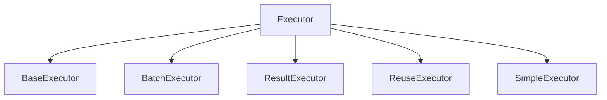
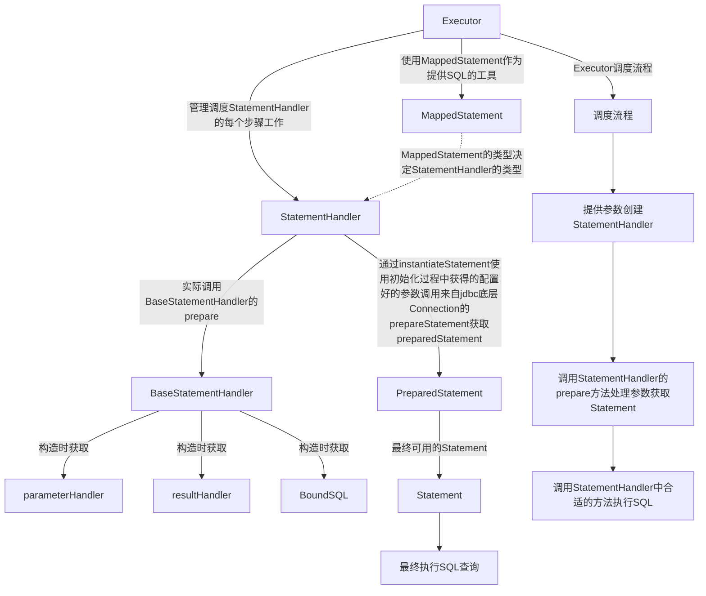

# Executor 

> Executor  ： Executor实际上完成的主要工作就是按照需要的模式，调用StatmentHandler中的方法，最终完成SQL的执行


--------------------------------------
> 先看一下 Configuration 里面的 方法 :  根据不同的类型返回不同的Executor，并且把 this（Configuraion）作为参数传入
```java
  public Executor newExecutor(Transaction transaction, ExecutorType executorType) {
    executorType = executorType == null ? defaultExecutorType : executorType;
    executorType = executorType == null ? ExecutorType.SIMPLE : executorType;
    Executor executor;
    if (ExecutorType.BATCH == executorType) {
      executor = new BatchExecutor(this, transaction);
    } else if (ExecutorType.REUSE == executorType) {
      executor = new ReuseExecutor(this, transaction);
    } else {
      executor = new SimpleExecutor(this, transaction);
    }
    if (cacheEnabled) {
      executor = new CachingExecutor(executor);
    }
    executor = (Executor) interceptorChain.pluginAll(executor);
    return executor;
  }
```
> ExecutorFactory在创建Executor的时候，会根据配置传入 Transcation

- Executor 
   - SqlSession提供的增删改查操作在内部都是由Executor来完成
   - Executor接口仅规定了少数几个功能
     - query 查询
     - queryCursor 查询cursor
     - commit / rollBack 事务
     - cache 相关功能
    - [BaseExecutor](\executor\00-BaseExecutor.md)
      - 抽象基类，自身实现了缓存控制，安全保证等内容，具体执行交由实现类完成
      - 实现类
        - [SimpleExecutor](./executor/01-simpleExecutor.md)
          - 用来处理没有参数的SQL
        - PreparedExecutor
          - 相较于SimpleExecutor，这里会使用 parameterHandler处理参数
        - 还有Batch模式的等等需要了解以下其中的实现 🔺🔺🔺🔺🔺
```java
public interface Executor {

  ResultHandler NO_RESULT_HANDLER = null;

  int update(MappedStatement ms, Object parameter) throws SQLException;

  <E> List<E> query(MappedStatement ms, Object parameter, RowBounds rowBounds, ResultHandler resultHandler, CacheKey cacheKey, BoundSql boundSql) throws SQLException;

  <E> List<E> query(MappedStatement ms, Object parameter, RowBounds rowBounds, ResultHandler resultHandler) throws SQLException;

  <E> Cursor<E> queryCursor(MappedStatement ms, Object parameter, RowBounds rowBounds) throws SQLException;

  List<BatchResult> flushStatements() throws SQLException;

  void commit(boolean required) throws SQLException;

  void rollback(boolean required) throws SQLException;

  CacheKey createCacheKey(MappedStatement ms, Object parameterObject, RowBounds rowBounds, BoundSql boundSql);

  boolean isCached(MappedStatement ms, CacheKey key);

  void clearLocalCache();

  void deferLoad(MappedStatement ms, MetaObject resultObject, String property, CacheKey key, Class<?> targetType);

  Transaction getTransaction();

  void close(boolean forceRollback);

  boolean isClosed();

  void setExecutorWrapper(Executor executor);

}
```