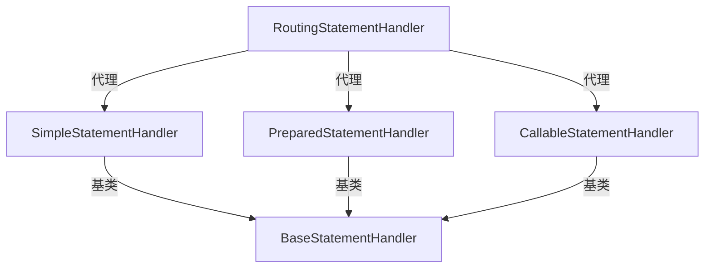

# StatementHander

> StatementHandler 具体实在 某个 Executor里面使用的（例：SimpleExecutor）

> 完成整个操作流程，还要与 Executor里面的 prepareStatment方法配合

> Configuration中的 newStatementHandler方法 使用的是 RoutingStatementHandler,这个类代理了三种具体的StatementHandler


```java
  private final StatementHandler delegate;

  public RoutingStatementHandler(Executor executor, MappedStatement ms, Object parameter, RowBounds rowBounds, ResultHandler resultHandler, BoundSql boundSql) {

    switch (ms.getStatementType()) {
      case STATEMENT:
        delegate = new SimpleStatementHandler(executor, ms, parameter, rowBounds, resultHandler, boundSql);
        break;
      case PREPARED:
        delegate = new PreparedStatementHandler(executor, ms, parameter, rowBounds, resultHandler, boundSql);
        break;
      case CALLABLE:
        delegate = new CallableStatementHandler(executor, ms, parameter, rowBounds, resultHandler, boundSql);
        break;
      default:
        throw new ExecutorException("Unknown statement type: " + ms.getStatementType());
    }

  }
```
> 这里看一下 SimpleExecutorHandler 与其 基类 BaseStatementHandler
```java
package org.apache.ibatis.executor.statement;

/**
 * @author Clinton Begin
 */
public class SimpleStatementHandler extends BaseStatementHandler {

  public SimpleStatementHandler(Executor executor, MappedStatement mappedStatement, Object parameter, RowBounds rowBounds, ResultHandler resultHandler, BoundSql boundSql) {
    super(executor, mappedStatement, parameter, rowBounds, resultHandler, boundSql);
  }

  @Override
  public int update(Statement statement) throws SQLException {
    String sql = boundSql.getSql();
    Object parameterObject = boundSql.getParameterObject();
    KeyGenerator keyGenerator = mappedStatement.getKeyGenerator();
    int rows;
    if (keyGenerator instanceof Jdbc3KeyGenerator) {
      statement.execute(sql, Statement.RETURN_GENERATED_KEYS);
      rows = statement.getUpdateCount();
      keyGenerator.processAfter(executor, mappedStatement, statement, parameterObject);
    } else if (keyGenerator instanceof SelectKeyGenerator) {
      statement.execute(sql);
      rows = statement.getUpdateCount();
      keyGenerator.processAfter(executor, mappedStatement, statement, parameterObject);
    } else {
      statement.execute(sql);
      rows = statement.getUpdateCount();
    }
    return rows;
  }

  @Override
  public void batch(Statement statement) throws SQLException {
    String sql = boundSql.getSql();
    statement.addBatch(sql);
  }

  @Override
  public <E> List<E> query(Statement statement, ResultHandler resultHandler) throws SQLException {
    String sql = boundSql.getSql();
    statement.execute(sql);
    return resultSetHandler.<E>handleResultSets(statement);
  }

  @Override
  public <E> Cursor<E> queryCursor(Statement statement) throws SQLException {
    String sql = boundSql.getSql();
    statement.execute(sql);
    return resultSetHandler.<E>handleCursorResultSets(statement);
  }

  @Override
  protected Statement instantiateStatement(Connection connection) throws SQLException {
    if (mappedStatement.getResultSetType() != null) {
      return connection.createStatement(mappedStatement.getResultSetType().getValue(), ResultSet.CONCUR_READ_ONLY);
    } else {
      return connection.createStatement();
    }
  }

  @Override
  public void parameterize(Statement statement) throws SQLException {
    // N/A
  }

}

```
> 基础类
```java
package org.apache.ibatis.executor.statement;
/**
 * @author Clinton Begin
 */
public abstract class BaseStatementHandler implements StatementHandler {

  protected final Configuration configuration;
  protected final ObjectFactory objectFactory;
  protected final TypeHandlerRegistry typeHandlerRegistry;
  protected final ResultSetHandler resultSetHandler;
  protected final ParameterHandler parameterHandler;

  protected final Executor executor;
  protected final MappedStatement mappedStatement;
  protected final RowBounds rowBounds;

  protected BoundSql boundSql;

  protected BaseStatementHandler(Executor executor, MappedStatement mappedStatement, Object parameterObject, RowBounds rowBounds, ResultHandler resultHandler, BoundSql boundSql) {
    this.configuration = mappedStatement.getConfiguration();
    this.executor = executor;
    this.mappedStatement = mappedStatement;
    this.rowBounds = rowBounds;

    this.typeHandlerRegistry = configuration.getTypeHandlerRegistry();
    this.objectFactory = configuration.getObjectFactory();

    if (boundSql == null) { // issue #435, get the key before calculating the statement
      generateKeys(parameterObject);
      boundSql = mappedStatement.getBoundSql(parameterObject);
    }

    this.boundSql = boundSql;

    this.parameterHandler = configuration.newParameterHandler(mappedStatement, parameterObject, boundSql);
    this.resultSetHandler = configuration.newResultSetHandler(executor, mappedStatement, rowBounds, parameterHandler, resultHandler, boundSql);
  }

  @Override
  public BoundSql getBoundSql() {
    return boundSql;
  }

  @Override
  public ParameterHandler getParameterHandler() {
    return parameterHandler;
  }

  @Override
  public Statement prepare(Connection connection, Integer transactionTimeout) throws SQLException {
    ErrorContext.instance().sql(boundSql.getSql());
    Statement statement = null;
    try {
      statement = instantiateStatement(connection);
      setStatementTimeout(statement, transactionTimeout);
      setFetchSize(statement);
      return statement;
    } catch (SQLException e) {
      closeStatement(statement);
      throw e;
    } catch (Exception e) {
      closeStatement(statement);
      throw new ExecutorException("Error preparing statement.  Cause: " + e, e);
    }
  }

  protected abstract Statement instantiateStatement(Connection connection) throws SQLException;

  protected void setStatementTimeout(Statement stmt, Integer transactionTimeout) throws SQLException {
    Integer queryTimeout = null;
    if (mappedStatement.getTimeout() != null) {
      queryTimeout = mappedStatement.getTimeout();
    } else if (configuration.getDefaultStatementTimeout() != null) {
      queryTimeout = configuration.getDefaultStatementTimeout();
    }
    if (queryTimeout != null) {
      stmt.setQueryTimeout(queryTimeout);
    }
    StatementUtil.applyTransactionTimeout(stmt, queryTimeout, transactionTimeout);
  }

  protected void setFetchSize(Statement stmt) throws SQLException {
    Integer fetchSize = mappedStatement.getFetchSize();
    if (fetchSize != null) {
      stmt.setFetchSize(fetchSize);
      return;
    }
    Integer defaultFetchSize = configuration.getDefaultFetchSize();
    if (defaultFetchSize != null) {
      stmt.setFetchSize(defaultFetchSize);
    }
  }

  protected void closeStatement(Statement statement) {
    try {
      if (statement != null) {
        statement.close();
      }
    } catch (SQLException e) {
      //ignore
    }
  }

  protected void generateKeys(Object parameter) {
    KeyGenerator keyGenerator = mappedStatement.getKeyGenerator();
    ErrorContext.instance().store();
    keyGenerator.processBefore(executor, mappedStatement, null, parameter);
    ErrorContext.instance().recall();
  }

}

```
```java
// ⭐ 这是 SimpleExecutor中的 prepareStatement 方法
  private Statement prepareStatement(StatementHandler handler, Log statementLog) throws SQLException {
    Statement stmt;
    Connection connection = getConnection(statementLog);
    stmt = handler.prepare(connection, transaction.getTimeout());
    handler.parameterize(stmt);
    return stmt;
  }
  //  ⭐ 下面是 StatementHandler 方法
```