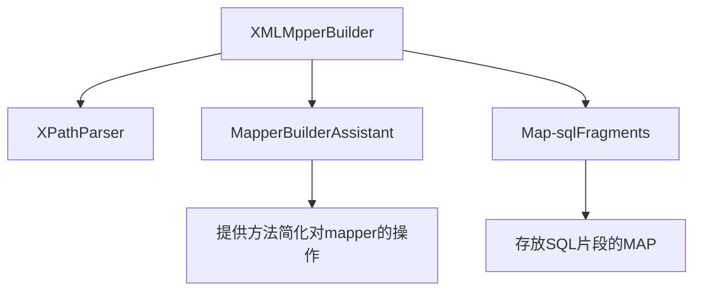

# 解析Mapper


> 在MyBatis解读我们配置的 config.xml配置文件的过程中，有一个重要步骤是解析配置文件中的 mappers 配置

- 判断配置的类型
  - 文件类型的配置：读取文件，创建XMLMapperBuilder作为 mapperParser对文件进行解析，并配置
    - 每次加载一个文件都会创建一个XMLMapperBuilder，他们都 extends BaseBuilder，解析过程中都会把解析结果放到BaseBuilder里面
  - Java类配置：使用反射（？）创建这个类，并配置

```java
  private void mapperElement(XNode parent) throws Exception {
    if (parent != null) {
      // ⭐⭐⭐⭐⭐  遍历所有的子节点
      for (XNode child : parent.getChildren()) {
        if ("package".equals(child.getName())) {
          String mapperPackage = child.getStringAttribute("name");
          configuration.addMappers(mapperPackage);
        } else {
          String resource = child.getStringAttribute("resource");
          String url = child.getStringAttribute("url");
          String mapperClass = child.getStringAttribute("class");
          if (resource != null && url == null && mapperClass == null) {
            ErrorContext.instance().resource(resource);
            InputStream inputStream = Resources.getResourceAsStream(resource);
            // ⭐⭐⭐⭐⭐  使用XMLMapperBuilder 作为mapperParser解析这个文件
            XMLMapperBuilder mapperParser = new XMLMapperBuilder(inputStream, configuration, resource, configuration.getSqlFragments());
            mapperParser.parse();
          } else if (resource == null && url != null && mapperClass == null) {
            ErrorContext.instance().resource(url);
            InputStream inputStream = Resources.getUrlAsStream(url);
            XMLMapperBuilder mapperParser = new XMLMapperBuilder(inputStream, configuration, url, configuration.getSqlFragments());
            mapperParser.parse();
          } else if (resource == null && url == null && mapperClass != null) {
            Class<?> mapperInterface = Resources.classForName(mapperClass);
            configuration.addMapper(mapperInterface);
          } else {
            throw new BuilderException("A mapper element may only specify a url, resource or class, but not more than one.");
          }
        }
      }
    }
  }
```

- 这里最主要就是调用了 .parse 方法

```java
  public void parse() {
    if (!configuration.isResourceLoaded(resource)) {
      // ⭐⭐⭐⭐ 如果当前文件还么有被解析过
      // ⭐⭐ 1.解析文件
      configurationElement(parser.evalNode("/mapper"));
      // ⭐⭐ 2.解析后标记为已加载
      configuration.addLoadedResource(resource);
      // ⭐⭐ 3.把Mapper和 namespace对应的类绑定顶起来，
      //         但是实际上并不要求这个类一定存在，这种情况下namespace就是要标志位
      bindMapperForNamespace();
    }
    // ⭐⭐  加载一个新的文件后，会有一些新的内容出现，下面就是把新的文件中的配置的各种内容管理起来
    parsePendingResultMaps();
    parsePendingCacheRefs();
    parsePendingStatements();
  }
    private void configurationElement(XNode context) {
    try {
      // ⭐⭐ 配置根节点上必须有namespace属性
      String namespace = context.getStringAttribute("namespace");
      if (namespace == null || namespace.equals("")) {
        throw new BuilderException("Mapper's namespace cannot be empty");
      }
      // ⭐⭐ 解析当前mapper文件配置
      builderAssistant.setCurrentNamespace(namespace);
      cacheRefElement(context.evalNode("cache-ref"));
      cacheElement(context.evalNode("cache"));
      parameterMapElement(context.evalNodes("/mapper/parameterMap"));
      resultMapElements(context.evalNodes("/mapper/resultMap"));
      sqlElement(context.evalNodes("/mapper/sql"));
      // ⭐⭐ 这里底层使用一个 XMLStatementBuilder 解析一个具体的SQL语句节点
      buildStatementFromContext(context.evalNodes("select|insert|update|delete"));
    } catch (Exception e) {
      throw new BuilderException("Error parsing Mapper XML. The XML location is '" + resource + "'. Cause: " + e, e);
    }
  }

```

