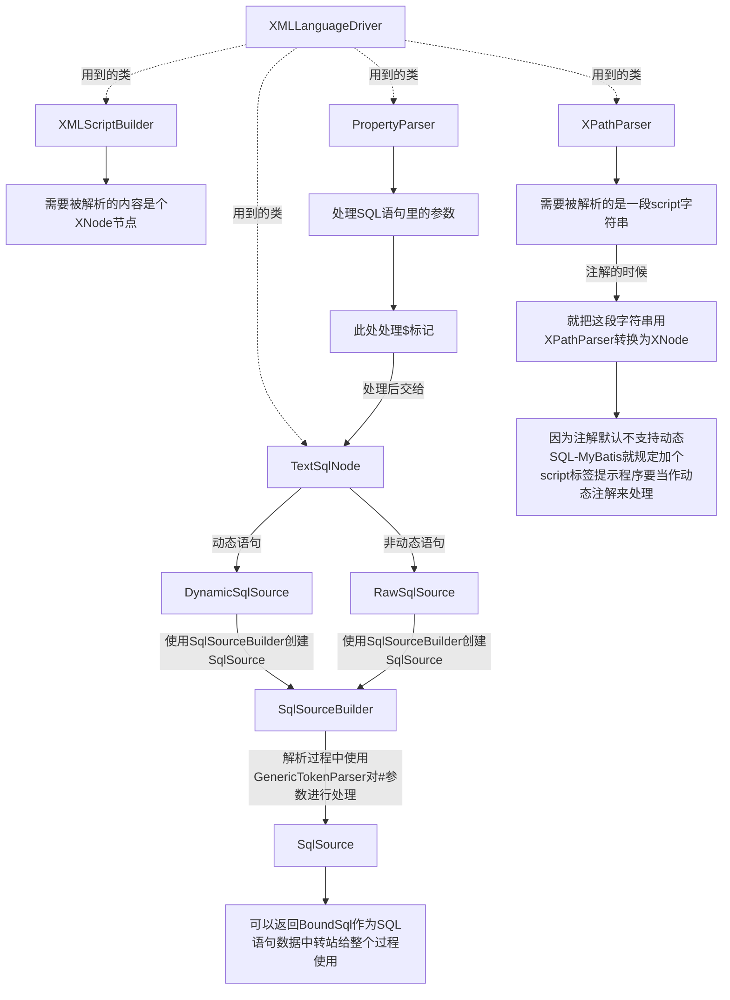

# XMLLanguageDriver

```mermaid
graph TD;
XMLLanguageDriver-.->|用到的类|XMLScriptBuilder
XMLLanguageDriver-.->|用到的类|XPathParser
XMLLanguageDriver-.->|用到的类|PropertyParser
XMLLanguageDriver-.->|用到的类|TextSqlNode
XMLScriptBuilder-->需要被解析的内容是个XNode节点
XPathParser-->需要被解析的是一段script字符串
需要被解析的是一段script字符串-->|注解的时候|就把这段字符串用XPathParser转换为XNode
就把这段字符串用XPathParser转换为XNode-->因为注解默认不支持动态SQL-MyBatis就规定加个script标签提示程序要当作动态注解来处理
PropertyParser-->处理SQL语句里的参数
处理SQL语句里的参数-->此处处理$标记
此处处理$标记-->|处理后交给|TextSqlNode
TextSqlNode-->|动态语句|DynamicSqlSource
TextSqlNode-->|非动态语句|RawSqlSource
DynamicSqlSource-->|使用SqlSourceBuilder创建SqlSource|SqlSourceBuilder
RawSqlSource-->|使用SqlSourceBuilder创建SqlSource|SqlSourceBuilder
SqlSourceBuilder-->|解析过程中使用GenericTokenParser对#参数进行处理|SqlSource
SqlSource-->可以返回BoundSql作为SQL语句数据中转站给整个过程使用
```

- SqlSource
  - DynamicSqlSource
  - RawSqlSource
  - StaticSqlSource

> PropertyParser使用了[GenericTokenParser]()处理${参数}