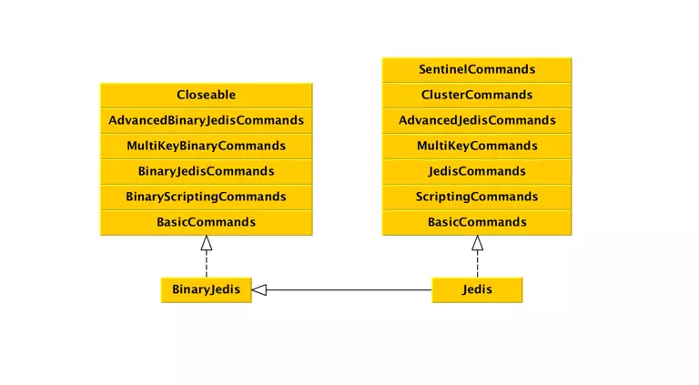

# Jedis 基础

> 原文链接 ： https://www.jianshu.com/p/7913f9984765

> 大量增改

## Redis操作工具

- Jedis 完整便捷的工具
- Redisson 更多分布式的容器实现（未确认）

## 使用Jedis客户端

- 引入依赖
- 使用范例

```java
// Jedis
Jedis jedis = new Jedis("localhost", 6379);
jedis.set("singleJedis", "hello jedis!");
System.out.println(jedis.get("singleJedis"));
jedis.close();
// 使用 jedis pool
JedisPoolConfig jedisPoolConfig = new JedisPoolConfig();
jedisPoolConfig.setMaxTotal(10);
JedisPool pool = new JedisPool(jedisPoolConfig, "localhost", 6379);
Jedis jedis = null;
try{
    jedis = pool.getResource();
    jedis.set("pooledJedis", "hello jedis pool!");
    System.out.println(jedis.get("pooledJedis"));
}catch(Exception e){
    e.printStackTrace();
}finally {
    //还回pool中
    if(jedis != null){
        jedis.close();
    }
}
pool.close();
/************ jedis 的 close 方法***************/
public void close() {
    //如果使用了连接池，检查客户端状态，归还到池中
    if (dataSource != null) {
      if (client.isBroken()) {
        this.dataSource.returnBrokenResource(this);
      } else {
        this.dataSource.returnResource(this);
      }
    } else {
      //未使用连接池，直接关闭
      client.close();
    }
  }
```

## Jedis代码分析

> 从类结构，启动，执行命令三分方面分析Jedis客户端

### Jedis类结构



每一个接口都代表了一类Redis命令，例如JedisCommands中包含了SET GET等命令，MultiKeyCommands中包含了针对多个Key的MSET MGET等命令。一部分命令有两个版本的接口，如JedisCommands和BinaryJedisCommands。JedisCommands是字符串参数版本命令，会在Jedis内部将参数转换成UTF-8编码的字节数组。BinaryJedisCommands提供的是字节参数版本，允许用户自己决定编码等细节。ClusterCommands和SentinelCommands与集群、高可用等相关的命令只有一个版本。

### Jedis初始化

> Jedis / JedisPool 提供了很多构造函数。有直接提供Redis相关参数的，也有封装成了 GenericObjectPoolConfig（org.apache.commons.pool2.impl） 的。但是核心是设置了那些参数。

```java
// ================ 其中一个 构造为例
public JedisPool(/** Commons Pool的参数 **/ final GenericObjectPoolConfig poolConfig,
                   /** Redis Server地址 **/ final URI uri,
                   /** 连接Redis Server超时时间**/ final int connectionTimeout,
                   /** 等待Response超时时间 **/ final int soTimeout) {
    super(poolConfig, new JedisFactory(uri, connectionTimeout, soTimeout, null));
  }
// ================ Jedis 里面有个极其简单的 pool
public class JedisPoolConfig extends GenericObjectPoolConfig {
  public JedisPoolConfig() {
    // defaults to make your life with connection pool easier :)
    setTestWhileIdle(true);
    setMinEvictableIdleTimeMillis(60000);
    setTimeBetweenEvictionRunsMillis(30000);
    setNumTestsPerEvictionRun(-1);
  }
}
// =============== 我们找个比较齐全的 构造来看一下
  public JedisPool(final GenericObjectPoolConfig poolConfig, final String host, int port,
      final int connectionTimeout, final int soTimeout, final String password, final int database,
      final String clientName) {
    super(poolConfig, new JedisFactory(host, port, connectionTimeout, soTimeout, password,
        database, clientName));
  }
```
- 这个齐全的Pool需要哪些参数
    - poolConfig common-pool2里面的配置，主要是 pool的参数
        - 连接数之类的参数
        - 参考[common-pool2](../../001.ProgrammingLanguage/Java/08-org.apache.common-pool2/common-pool2基础介绍.md)
    - 以下是 Redis的参数，有了这些参数，工厂就可以工作了
        - host 地址
        - port 端口
        - connectionTimeout 链接超时时间
        - soTimeout 读取超时时间
        - password 密码
        - database 库index
        - clientName 客户端名称
- JedisFactory 也是common-pool2的接口实现的
    - [JedisFactory](./JedisFactory.md)

- （JedisPool）pool.getResource 获取实例
    - 源码
  ```java
  // 从 pool 中获取 jedis
    @Override
  public Jedis getResource() {
    Jedis jedis = super.getResource();
    jedis.setDataSource(this);
    return jedis;
  }
  // super.getResource 调用的是上层的方法，上层在创建的时候会使用 工厂和相关参数初始化一个 pool
  // jedis.setDataSource this => 把当前 jedispool传给 jedis实例，主要是服务于连接关闭 ： 不是真的关闭，而是把链接还给 连接池。
  ```
    - 这样就获得了一个Jedis实例。
  
### Jedis执行命令

> 同样以一个 set 方法为例
```java
// Jedis里面
  public String set(final String key, String value) {
    checkIsInMultiOrPipeline();
    client.set(key, value);
    return client.getStatusCodeReply();
  }
  // 其他方法都类似，实际使用 内部的 client 进行操作
  // 这是 client的set方法
  set(SafeEncoder.encode(key), SafeEncoder.encode(value));
  // 这个client 里面实际上就是 把 string 转换成 byte[] ，或者反过来，然后里面基本涵盖了所有的 基础操作。
  // ===========  一个 client 里面的比较底层的方法 ===========
    public void set(final byte[] key, final byte[] value, final byte[] nxxx, final byte[] expx,
      final long time) {
    sendCommand(Command.SET, key, value, nxxx, expx, toByteArray(time));
  }
  // 再向底层 的 sendCommand 就已经到了 将命令转换为 与 Redis之间的协议了
```

> sendCommand

```java
sendCommand(Command.SET, key, value);

protected Connection sendCommand(final Command cmd, final byte[]... args) {
    try {
      connect();
      Protocol.sendCommand(outputStream, cmd, args);
      ...
    } catch (JedisConnectionException ex) {
      ...
    }
}
```
省略了一部分异常处理的代码，在sendCommand方法中，建立了与Server的连接，并发送命令。connect方法会按照JedisPool构造函数中的参数，初始化Socket：
```java
socket = new Socket();
    //TIME_WAIT状态下可以复用端口
    socket.setReuseAddress(true);
    //空闲时发送数据包，确认服务端状态
    socket.setKeepAlive(true);
    //关闭Nagle算法，尽快发送
    socket.setTcpNoDelay(true);
    //调用close方法立即关闭socket，丢弃所有未发送的数据包
    socket.setSoLinger(true, 0);
    //连接server
    socket.connect(new InetSocketAddress(host, port), connectionTimeout);
    //设置读取时超时时间
    socket.setSoTimeout(soTimeout);
```
sendCommand方法，按照Redis协议，发送命令：
```java
private static void sendCommand(final RedisOutputStream os, final byte[] command,
      final byte[]... args) {
    try {
      os.write(ASTERISK_BYTE);
      os.writeIntCrLf(args.length + 1);
      os.write(DOLLAR_BYTE);
      os.writeIntCrLf(command.length);
      os.write(command);
      os.writeCrLf();

      for (final byte[] arg : args) {
        os.write(DOLLAR_BYTE);
        os.writeIntCrLf(arg.length);
        os.write(arg);
        os.writeCrLf();
      }
    } catch (IOException e) {
      throw new JedisConnectionException(e);
    }
  }
```