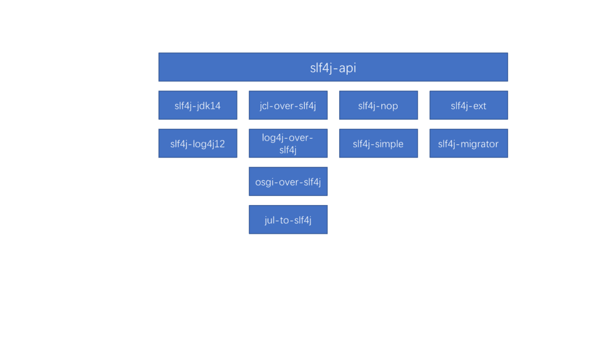

# slf4j
> 原文信息放在上面

作者：冰火人生
链接：https://www.jianshu.com/p/ce995868dd4a
來源：简书
简书著作权归作者所有，任何形式的转载都请联系作者获得授权并注明出处。

## slf4j简介
slf4j主要是为了给Java日志访问提供一个标准、规范的API框架，其主要意义在于提供接口，具体的实现可以交由其他日志框架，例如log4j和logback等。当然slf4j自己也提供了功能较为简单的实现，但是一般很少用到。对于一般的Java项目而言，日志框架会选择slf4j-api作为门面，配上具体的实现框架（log4j、logback等），中间使用桥接器完成桥接。本文侧重分析slf4j，也会解释门面+桥接器+实现的原理。
## slf4j项目
项目Github地址：https://github.com/qos-ch/slf4j
slfj4j项目组成图




- slf4j-api为项目基础
- slf4j-jdk14和slf4j-log4j12分别为jdk日志框架和log4j日志框架的桥接器，负责将slf4j-api和具体的实现框架连接起来
- jcl-over-slf4j, log4j-over-slf4j, osgi-over-slf4j和jul-to-slf4j分别将对应的其他框架的日志桥接到slf4j上来
- slf4j-nop和slf4j-simple是slf4j提供的日志实现类，一般很少用到
- slf4j-ext和slf4j-migrator为工具模块

## slf4j-api
slf4j-api是slf4j的api模块，提供了日志输出的API，值得一提的是从slf4j 1.8起，slf4j使用SPI的方式寻找日志实现框架，而在此之前则是通过寻找指定类的方式发现并绑定实现框架。
本文以slf4j 1.8为例进行讲解。

先来看看平时我们是如何使用slf4j-api进行日志输出的
```java
private Logger logger = LoggerFactory.getLogger(TestController.class);
...
logger.info("some message")
```
重点看看第一行代码，看似很简单，其实做了不少事情。
```java
public static Logger getLogger(String name) {
        ILoggerFactory iLoggerFactory = getILoggerFactory();
        return iLoggerFactory.getLogger(name);
    }
```
其中ILoggerFactory是slf4j提供的一个接口，因此我们可以猜测getILoggerFactory方法应该是拿到了其实现类.
```java
public static ILoggerFactory getILoggerFactory() {
        return getProvider().getLoggerFactory();
    }

static SLF4JServiceProvider getProvider() {
        if (INITIALIZATION_STATE == UNINITIALIZED) {
            synchronized (LoggerFactory.class) {
                if (INITIALIZATION_STATE == UNINITIALIZED) {
                    INITIALIZATION_STATE = ONGOING_INITIALIZATION;
                    performInitialization();
                }
            }
        }
        switch (INITIALIZATION_STATE) {
        case SUCCESSFUL_INITIALIZATION:
            return PROVIDER;
        case NOP_FALLBACK_INITIALIZATION:
            return NOP_FALLBACK_FACTORY;
        case FAILED_INITIALIZATION:
            throw new IllegalStateException(UNSUCCESSFUL_INIT_MSG);
        case ONGOING_INITIALIZATION:
            // support re-entrant behavior.
            // See also http://jira.qos.ch/browse/SLF4J-97
            return SUBST_PROVIDER;
        }
        throw new IllegalStateException("Unreachable code");
    }
```
其中SLF4JServiceProvider同样是slf4j-api中提供的一个接口，那么getProvider肯定是通过某种方法拿到了该接口的实现类。
```java
private final static void performInitialization() {
        bind();
        if (INITIALIZATION_STATE == SUCCESSFUL_INITIALIZATION) {
            versionSanityCheck();
        }
    }

    private final static void bind() {
        try {
            List<SLF4JServiceProvider> providersList = findServiceProviders();
            reportMultipleBindingAmbiguity(providersList);
            if (providersList != null && !providersList.isEmpty()) {
                PROVIDER = providersList.get(0);
                PROVIDER.initialize();
                INITIALIZATION_STATE = SUCCESSFUL_INITIALIZATION;
                reportActualBinding(providersList);
                fixSubstituteLoggers();
                replayEvents();
                // release all resources in SUBST_FACTORY
                SUBST_PROVIDER.getSubstituteLoggerFactory().clear();
            } else {
                INITIALIZATION_STATE = NOP_FALLBACK_INITIALIZATION;
                Util.report("No SLF4J providers were found.");
                Util.report("Defaulting to no-operation (NOP) logger implementation");
                Util.report("See " + NO_PROVIDERS_URL + " for further details.");

                Set<URL> staticLoggerBinderPathSet = findPossibleStaticLoggerBinderPathSet();
                reportIgnoredStaticLoggerBinders(staticLoggerBinderPathSet);
            }
        } catch (Exception e) {
            failedBinding(e);
            throw new IllegalStateException("Unexpected initialization failure", e);
        }
    }
```
注意其中一行代码
```java
List<SLF4JServiceProvider> providersList = findServiceProviders();

private static List<SLF4JServiceProvider> findServiceProviders() {
        ServiceLoader<SLF4JServiceProvider> serviceLoader = ServiceLoader.load(SLF4JServiceProvider.class);
        List<SLF4JServiceProvider> providerList = new ArrayList<SLF4JServiceProvider>();
        for (SLF4JServiceProvider provider : serviceLoader) {
            providerList.add(provider);
        }
        return providerList;
    }
```
终于露出庐山真面目：原来是通过SPI的方式寻找SLF4JServiceProvider的实现类.
接下来看看SLF4JServiceProvider这个接口提供的方法(只贴了两个最重要的方法)
```java
public interface SLF4JServiceProvider {
    // 返回ILoggerFactory的实现类
    public ILoggerFactory getLoggerFactory();
    
    // 初始化，实现类中一般用于初始化ILoggerFactory
    public void initialize();
}
```
先不着急看SLF4JServiceProvider的实现类长什么样子，先思考一个问题：如果找不到实现类或者是找到了多个实现类怎么办？

- 还是看bind方法。

找不到实现类：会在classpath下寻找org/slf4j/impl/StaticLoggerBinder.class类，这个类就是1.8之前slf4j寻找的Binder类，因此匹配1.8版本之前的slf4j-api的桥接器都会包含一个该类.1.8及之后的版本中即便是找到了该类，slf4j也不会使用该类完成实现框架的绑定，而是忽略，使用自带的实现类NOPLogger。该类其实啥都没做，所有的方法都是空的。因此，如果找不到SLF4JServiceProvider的实现类，系统不会报错，而是不会输出任何日志
找到多个实现类：会取第一个，但是谁是第一个呢？看官方解释：

```note
The warning emitted by SLF4J is just that, a warning. Even when multiple bindings are present, SLF4J will pick one logging framework/implementation and bind with it. The way SLF4J picks a binding is determined by the JVM and for all practical purposes should be considered random. As of version 1.6.6, SLF4J will name the framework/implementation class it is actually bound to
```
答案就是：取决于JVM，你可以认为是随机的。

## 桥接器

主要讲讲如何slf4j-api+桥接器+实现框架（以log4j为例）的工作原理
我们不妨思考下，我们希望利用这三件套做什么？我们想做的是编码中使用的是slf4j-api提供的方法，而实际运作的是log4j。也就是说我们希望使用Logger(slf4j提供)，而实际运行的是Logger(log4j)，其实很好办，那就是将Logger(slf4j)接收到的命令全部委托给Logger(log4j)去完成，悄悄的完成偷天换日。我们接下来去翻翻slf4j-log4j12这个桥接器的源码，看看它是怎么做的。
首先，它肯定有个SLF4JServiceProvider的实现类
```java
public class Log4j12ServiceProvider implements SLF4JServiceProvider {

    /**
     * Declare the version of the SLF4J API this implementation is compiled against. 
     * The value of this field is modified with each major release. 
     */
    // to avoid constant folding by the compiler, this field must *not* be final
    public static String REQUESTED_API_VERSION = "1.8.99"; // !final

    private ILoggerFactory loggerFactory; 
    private IMarkerFactory markerFactory; 
    private MDCAdapter mdcAdapter;
    
    public Log4j12ServiceProvider() {
        try {
            @SuppressWarnings("unused")
            Level level = Level.TRACE;
        } catch (NoSuchFieldError nsfe) {
            Util.report("This version of SLF4J requires log4j version 1.2.12 or later. See also http://www.slf4j.org/codes.html#log4j_version");
        }
    }

    @Override
    public void initialize() {
        loggerFactory = new Log4jLoggerFactory();
        markerFactory = new BasicMarkerFactory();
        mdcAdapter = new Log4jMDCAdapter();
    }
    
    public ILoggerFactory getLoggerFactory() {
        return loggerFactory;
    }

    public IMarkerFactory getMarkerFactory() {
        return markerFactory;
    }

    public MDCAdapter getMDCAdapter() {
        return mdcAdapter;
    }

    public String getRequesteApiVersion() {
        return REQUESTED_API_VERSION;
    }
}
```
看看它的getLoggerFactory返回的实现类
```java
public class Log4jLoggerFactory implements ILoggerFactory {

    private static final String LOG4J_DELEGATION_LOOP_URL = "http://www.slf4j.org/codes.html#log4jDelegationLoop";

    // check for delegation loops
    static {
        try {
            Class.forName("org.apache.log4j.Log4jLoggerFactory");
            String part1 = "Detected both log4j-over-slf4j.jar AND bound slf4j-log4j12.jar on the class path, preempting StackOverflowError. ";
            String part2 = "See also " + LOG4J_DELEGATION_LOOP_URL + " for more details.";

            Util.report(part1);
            Util.report(part2);
            throw new IllegalStateException(part1 + part2);
        } catch (ClassNotFoundException e) {
            // this is the good case
        }
    }

    // key: name (String), value: a Log4jLoggerAdapter;
    ConcurrentMap<String, Logger> loggerMap;

    public Log4jLoggerFactory() {
        loggerMap = new ConcurrentHashMap<String, Logger>();
        // force log4j to initialize
        org.apache.log4j.LogManager.getRootLogger();
    }

    /*
     * (non-Javadoc)
     * 
     * @see org.slf4j.ILoggerFactory#getLogger(java.lang.String)
     */
    public Logger getLogger(String name) {
        // 从缓存中获取Logger
        Logger slf4jLogger = loggerMap.get(name);
        if (slf4jLogger != null) {
            return slf4jLogger;
        } else {
          // 如果没有就构造一个log4j的Logger
            org.apache.log4j.Logger log4jLogger;
            if (name.equalsIgnoreCase(Logger.ROOT_LOGGER_NAME))
                log4jLogger = LogManager.getRootLogger();
            else
                log4jLogger = LogManager.getLogger(name);
            // 利用构造的log4j的Logger 构造出一个Log4jLoggerAdapter
            Logger newInstance = new Log4jLoggerAdapter(log4jLogger);
            Logger oldInstance = loggerMap.putIfAbsent(name, newInstance);
            return oldInstance == null ? newInstance : oldInstance;
        }
    }
}
```
注意Log4jLoggerAdapter这个类，它内部持有了一个log4j的Logger对象，自身又实现了slf4j的Logger接口，这是一个典型的适配器模式。其提供了slf4j-api的方法，但是具体事情全交给持有的log4j Logger去执行。这样就达到了连接slf4j-api和log4j的目的。而log4j Logger的具体实现则是交由log4j去完成的，slf4j-api无感知也不关心。
## 简单实现类

NOPLogger，什么都不做，在slf4j-api中

SimpleLogger，slf4j-simple提供的简单实现类，有兴趣的同学可以去看看，因为slf4j的定位是提供标准的API，而不是实现，因此其实现类算是个鸡肋，聊胜于无

## 反向桥接器

我之所以称之为反向桥接器是为了区分前文中提到的桥接器，前文提到的桥接器作用是将slf4j-api导到具体的实现框架上，而这部分的桥接器则是将实现框架提供的API调用导到slf4j-api上来。例如当前项目中使用log4j的Logger打印日志，想要切换到logback上来又不想改代码，怎么办呢？这时反向桥接器就能大展拳脚了。

将log4j的jar包从项目中拿掉，此时项目编译肯定没法通过，别急，到第二步

引入log4j-over-slf4j.jar，该jar包中包含了log4j中主要的类，连名字都一样，这样编译不再报错

引入logback-classic和logback-core，大功告成

反向桥接器的原理就是自己写了一堆桥接来源相关jar中一样的类，偷天换日，悄悄的来了个狸猫换太子。

值得注意的是不要乱引入桥接器和反向桥接器，避免形成环，导致栈溢出。
## 工具
slf4j-ext
该模块中提供了一个比较好玩的功能，利用java instrument做到无代码侵入的日志输出。该模块提供了一个名为LogTransformer的类，该类会动态在类中增加一个Logger（slf4j）静态私有对象，在该类方法调用前后加上日志输出。可以通过命令行来指定日志级别，哪些类不被动态修改等。个人感觉在大型项目中实用性不太高，原因有

指定哪些类不被动态修改太繁琐，大于大型项目而言引入的类可能上千个，如果需要一一排除，实在是繁琐
不能做到方法级别的排除，不够灵活
大型项目一般在建立初期就势必会考虑日志的输出，不太可能靠这种方式输出日志

不过个人感觉如果能将其稍微修改下，倒是可以用来临时排查线上问题

将指定排除类改为指定类进行字节码修改
精细到方法级别的指定

假设需要现在需要排查线上问题，但是已经在运行的代码日志输出不够详细，无法分析某个方法的调用信息（次数、时长），又不想重启，这时可以将修改后的agent.jar动态attach到指定的JVM上，以达到日志输出的目的。待问题排查完毕后，detach下来即可（注意：动态attach和detach需要java 1.6+）
## slf4j-migrator
迁移工具，暂时没有仔细研究
