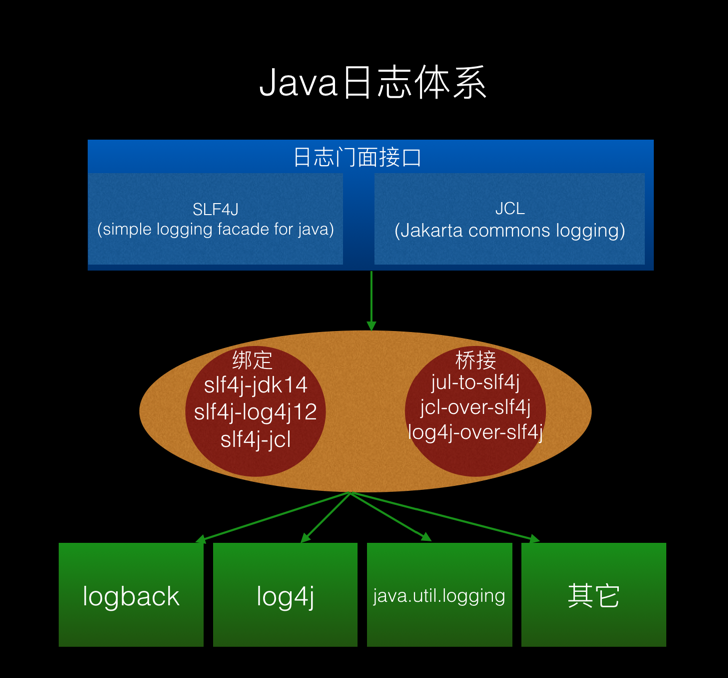
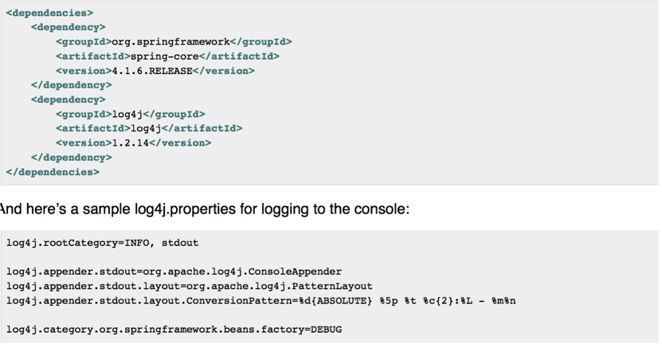
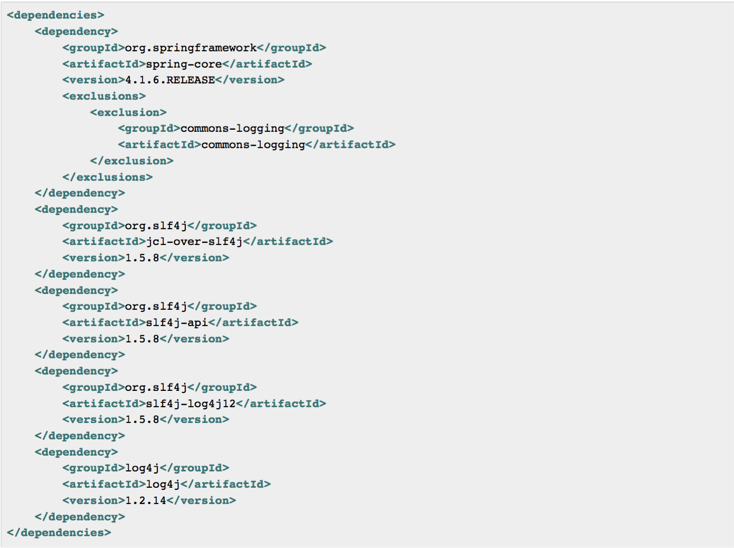
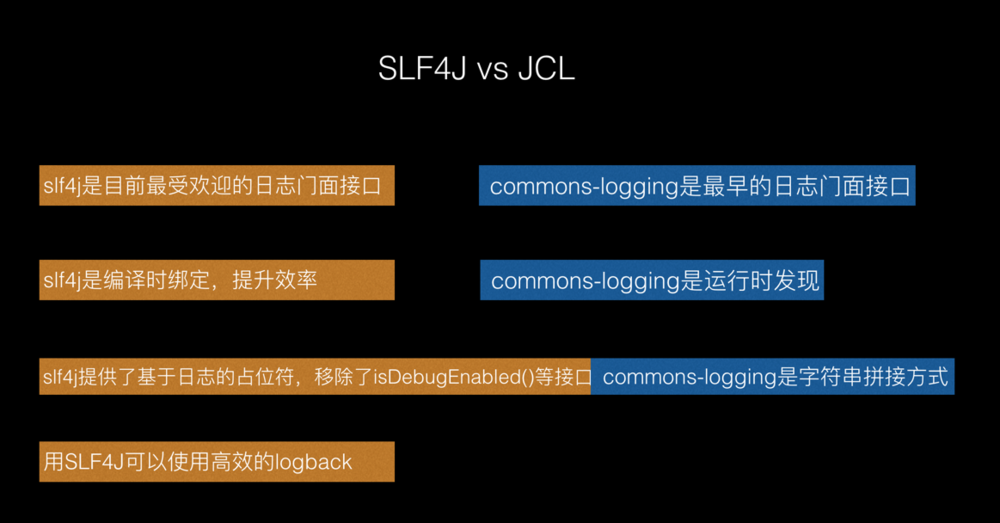
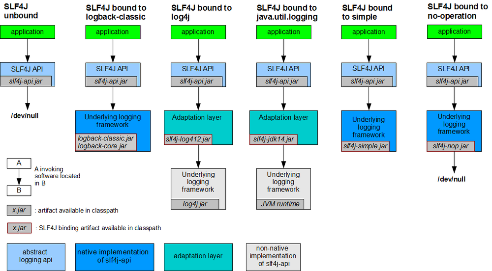
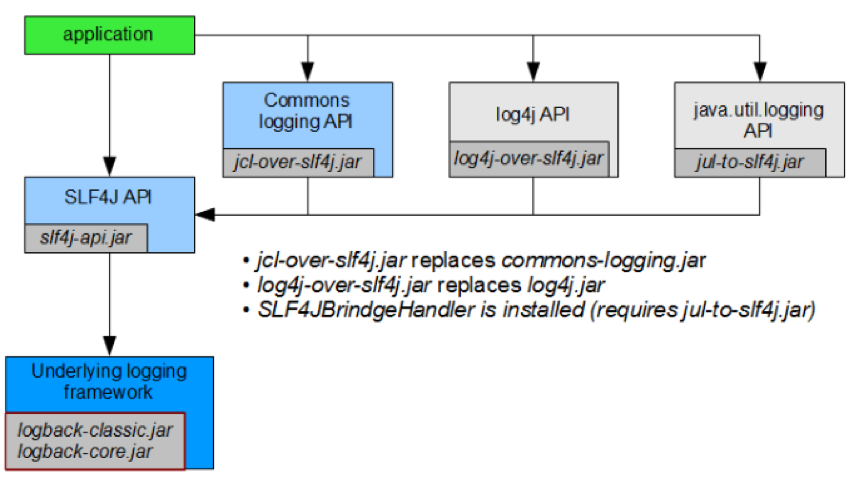
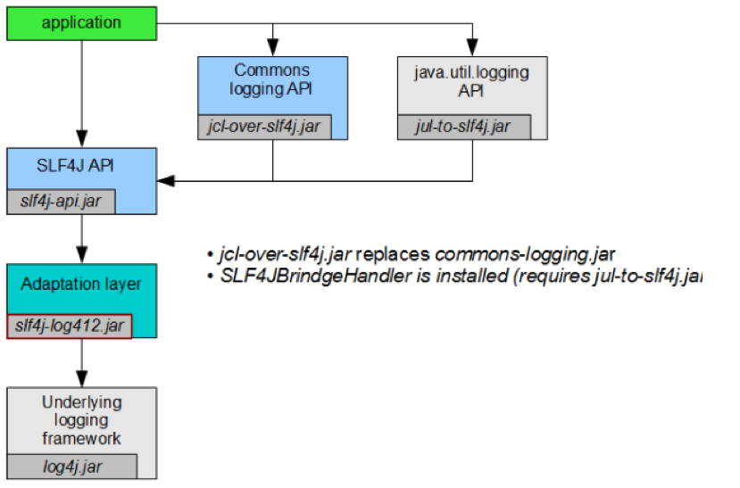
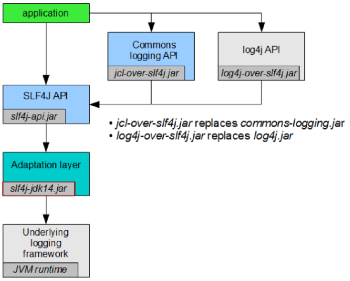

# Hello SLF4J

一、Java日志体系概述





图1-1 Java日志体系概况

图1-1 展示了Java日志体系的三个主要部分：


- 日志门面接口（SLF4J、JCL）
- 一系列绑定和桥接
- 具体的日志实现

先来两个例子：


Spring项目中通过Commons Logging直接使用log4j





图1-2 通过Commons Logging使用log4j


本例中由于spring-core中原生依赖commons-logging，所以只需要添加log4j和log4j的配置文件就能work（当然引入其它依赖还会有解冲突的工作要做）。


Spring项目中通过SLF4J使用log4j





图1-3 Spring中通过SLF4J使用log4j


此例中比之前多引入了3个jar包并且还排除了commons-logging依赖。如果对此有疑问，请看后面的详细解说。


二、为什么要使用SLF4J





图2-1 列举几点简单的原因

三、SLF4J的最佳实践
现在越来越多项目使用SLF4J （为什么要使用SLF4j）作为一个日志门面，而不是使用古老的Commons Logging。这给复杂的Maven构建带来了新的挑战，因为SLF4J仅当依赖被正确配置时才能正常工作。为了搞清楚为什么如此，让我们来看看组成SLF4J中不同的组件。

- slf4j-api 包含了SLF4J API，比如，使用SLF4J的一个应用或者库直接依赖的所有classes。
- 一系列绑定，它们（slf4j-log4j12,slf4j-jdk14和slf4j-jcl）基于一个已存在的日志框架来实现了SLF4J API,或者为SLF4J开发原生实现(slf4j-nop和slf4j-simple)。
`绑定的原理是因为slf4j-api中的LogFactory通过StaticLoggerBinder.getSingleton()获取具体实现logger，一个绑定包实现了org/slf4j/impl/StaticLoggerBinder.class，所以它们在编译时刻就绑定在一起，而绑定包中的StaticLoggerBinder类会绑定对应的实现。这部分看看源码就一目了然了。`

- 一系列桥接，它们把已存在的日志门面适配到SLF4J(jul-to-slf4j)。或者仿效已存在的日志门面或者实现(jcl-over-slf4j和log4j-over-slf4j)。
桥接的原理是把对应的门面日志接口重新实现了一遍，包名、类名、接口都一样，只是具体实现它委托给SLF4J了。


> SLF4J要在一个Maven构建的项目中正确工作，下列条件必须满足：

- 项目必须依赖slf4j-api。如果项目本身使用SLF4J，而且并不依赖任何绑定或者桥接，那么这应该是一个直接依赖。如果SLF4J被项目中的一个或者多个依赖使用，但是并不被项目本身使用，那么可以优先让Maven的依赖管理(dependency management)系统把它作为一个传递依赖给包含进来。
- 如果一个项目生成一个可执行的构建(有Main-Class的JAR，WAR，EAR或者二进制distribution)，那么它必须有一个依赖，并且和仅一个绑定。一个binding在运行时总是必须的，但是多个bindings将会导致不可预期的行为。
- 项目可以有任意个SLF4J桥接依赖，这不包括被binding使用的API的桥接。比如，如果slf4j-log4j12被作为一个binding，那么项目不能依赖log4j-over-slf4j。否则应用可能因为无限循环而崩溃。
- 如果项目依赖一个桥接，emulate一个已存在的日志API，那么它一定不能同时依赖你这个API。比如，如果jcl-over-slf4j被使用，那么项目一定不能依赖commons-logging。否则行为将不可预测。
- 依赖不能混用SLF4J 1.4.x的构建和1.5.x的构建，因为它们相互不兼容。
应当注意规则2仅适用可执行构建。一个生成一个库构建的项目不应该依赖任何SLF4J binding，除了在test scope。原因是在编译或者运行scope依赖一个指定的SLF4J binding将会在下游项目中impose一个特殊的日志实现。在每个库都遵循这个实践的完美世界里，将会非常容易地验证以上5个条件：在从SLF4J 1.5.x到每一个生成可执行构建的Maven项目中，期望的binding（任何必要的桥接）上简单添加一个依赖就足够了。但是世界并不完美，并且有很多第三方库并没有依赖特定的SLF4J bindings和日志实现。如果一个项目开始依赖这种库的依赖，如果没有采取对策，事情很容易失控。对于有很多依赖的项目这尤其明显，它几乎总会让以上5条规则不再被满足。

> Maven并没有一些必要的特性，这些特性强制这些条件实现校验，并且强制它们具备一些准则和人工干预。另一方面，当系统地应用时有一个非常简单和高效的策略：

- 确保在你控制下的项目中，总是遵循上诉描述的策略。
- 对于不遵循这些最佳实践的第三方库，在对应的依赖声明上排除依赖来移除对SLF4J binding上的传递依赖。需要注意，如果在一个库在多模块Maven项目的多种模块中被使用，那么在父POM中的dependency management section里声明这些排除会很方便，这就不需要再依赖中重复排除。

四、SLF4J官方说明


- SLF4J与每种具体日志框架的绑定规则。




图4-1 slf4j官方逻辑图


把Commons logging,log4j和java.util.logging桥接到SLF4J，底层使用logback的case。





图4-2 桥接到SLF4J，并使用logback日志框架


比如我们项目中依赖了spring-core，因为它原生依赖commons-logging，所以需要用jcl-over-slf4j.jar桥接包来代替commons-logging把具体实现委托给slf4j。jcl-over-slf4j和commons-logging拥有相同的包名、类名、接口，所以项目中要排除掉commons-logging。


把commons-logging和java.util.logging桥接到SLF4J，底层用log4j





图4-3 桥接到SLF4J，底层用log4j


把commons-logging和log4j桥接到SLF4J，底层用java.util.logging


图4-4 桥接到SLF4J，底层用java.util.logging




总结：

在Spring中，我们通常会依赖很多jar，它们使用不同的日志门面接口或者不同的日志框架，只要遵循第三节中的5点规则，加上排除冲突的依赖就能正常使用日志啦。
附录，推荐排除冲突的两种方式：

如果有多个子模块依赖相同的包，那么放在<dependencyManagement> 中来管理：
```xml
<dependencyManagement>
<dependency>
<groupid>com.acme</groupid>
<artifactid>java-coffee-machine</artifactid>
<version>7.5.194.3</version>
<exclusions>
<exclusion>
<groupid>org.slf4j</groupid>
<artifactid>slf4j-log4j12</artifactid>
</exclusion>
</exclusions>
</dependency>
</dependencyManagement>
```
在自己公司的maven仓库中放一个空包，scope=provided，这样可以全局排除依赖：
```xml
<dependency>
<groupId>commons-logging</groupId>
<artifactId>commons-logging</artifactId>
<version>${empty.version}</version>
<scope>provided</scope>
</dependency>
```

参考资料：


复杂Maven项目中管理SLF4J依赖 http://veithen.io/2009/10/16/maven-manage-slf4j-deps.html

java日志工具之SLF4J https://link.jianshu.com/?t=http://www.oseye.net/user/kevin/blog/239
slf4J官网 https://link.jianshu.com/?t=http://www.slf4j.org/
slf4j在maven仓库中的相关包 https://link.jianshu.com/?t=http://search.maven.org/#search%7Cga%7C1%7Cg%3a%22org.slf4j%22

How to use log4j 2.0 and slf4j and Commons Logging together https://link.jianshu.com/?t=http://stackoverflow.com/questions/15095877/how-to-use-log4j-2-0-and-slf4j-and-commons-logging-together

log4j-over-slf4j与slf4j-log4j12共存stack overflow异常分析 https://link.jianshu.com/?t=http://blog.csdn.net/kxcfzyk/article/details/38613861?utm_source=tuicool&utm_medium=referral

作者：Lucky_Micky
链接：https://www.jianshu.com/p/da1c9e1e13ea
來源：简书
简书著作权归作者所有，任何形式的转载都请联系作者获得授权并注明出处。