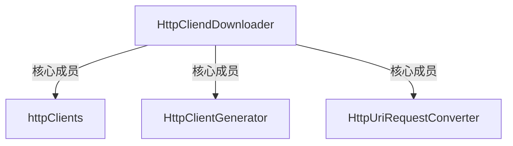

> HttpClientGenerator

## 核心方法 download

- 检测任务正常
- 获取一个CloseableHttpClient
  - 如果Site == null
    -  使用HttpClientGenerator生成一个新的CloseableHttpCliend
  - 如果 Site != null
    - 从httpClients里面取出demain相同的 httpClient
      - 如果取出为null，那么用当前site创建一个，并且把这个放到httpClients里面
- 尝试获取Proxy，没有就为null
- 使用httpUriRequestConverter获取一个HttpClientRequestContext
  - 新建一个HttpClientRequestContext
  - setHttpUriRequest
    - [设置requestmethod]从Request里面获取 method 并且判断method是那种请求，返回一个对应的 RequestBuilder
      - 如果是get没什么特别的处理
      - 如果是post等，获取对应的RequestBuilder之后，把requestBody里面的参数设置到RequestBuilder里面
    - [设置uri]设置的时候会把url里面的错误处理掉
      - 如果site里面传入了 headers，会把所有的header设置到 requestBuilder里面
      - 把site里面设置的超时时间之类的配置到一个 RequestConfig里面并传递给requestBuilder
    - 调用requestBuilder.build 方法 获取HttpUriRequest
      - 把参数 request的haders设置到这个 httpUriRequest
  - setHttpClientContext
    - 创建一个HttpClientContext
      - 如果由proxy调用其setAttribute方法配置以下相关内容
      - 如果request里面由cookies 配置这些cookies
  - 以上步骤，成功获取一个HttpClientRequestContext
- 使用之前的CloseableHttpClient 执行 request
  - httpClient.execute(requestContext.getHttpUriRequest(), requestContext.getHttpClientContext())
  - 最终获取httpResponse
- 把httpReponse封装成一个page
  - 以上执行结束

访问工作的执行者是[HttpClient]

https://blog.csdn.net/yi_master/article/details/79358920