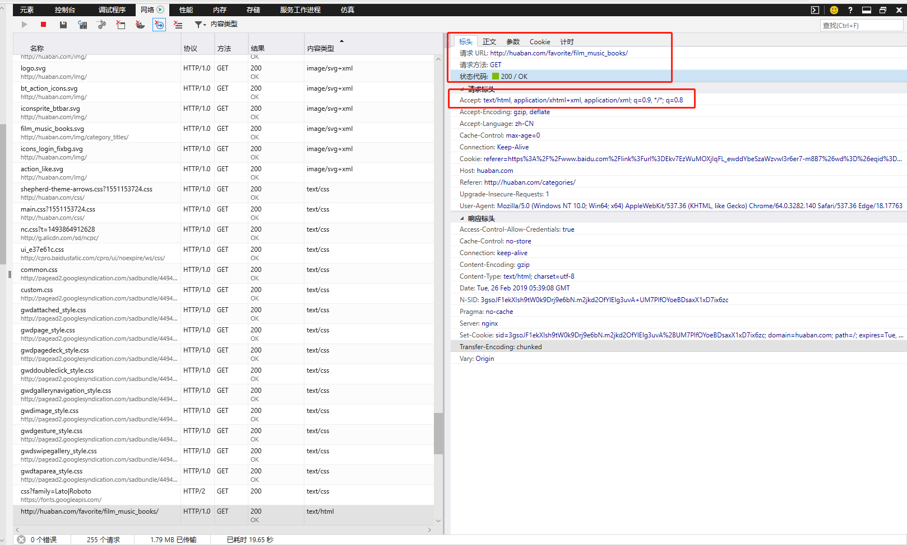
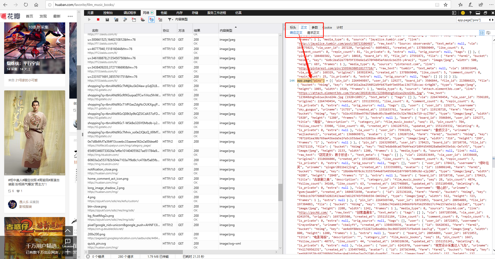

# 花瓣

- 总结写在最前面
  - 首先把页面当成后端渲染尝试了一下，结果证明不是这样
  - 那么考虑前端渲染
    - 优先考虑：前端渲染至少有ajax请求对应数据，找到对应的ajax请求，能直接解析最好
    - 其次考虑：后台使用chromedriver触发页面的js代码执行，然后把执行后的页面当成静态页面分析
  - 但是实际上这个页面还是解析了静态页面里面的内容
    - 因为我只是尝试解析首页第一版的内容
    - 花瓣的第一版居然是动态生成了 html里面的js代码，js代码里面写入了 图片数据的相关json格式数据
  - 以下记录摸索的全过程

http://huaban.com/favorite/film_music_books/

目标，解析页面，爬取页面所有图片的大图

## 分析html页面


```html
<div class="pin wfc " style="left: 252px; top: 734px; position: absolute;" data-id="2262225571"
    data-created-at="1551074182" data-source="weibo.com" data-seq="2262225571">
    <div class="hidden"><a href="/zhouxu/">Memory_旭</a>采集到<a href="/boards/16321919">丶电影海报</a></div>
    <div class="actions">
        <div class="right"><a title="喜欢" class="like btn-with-icon btn btn14" onclick="return false;" href="#"
                data-id="2262225571"><i class="heart"></i><span class="text"> </span></a></div>
        <div class="left"><a class="repin pin-default btn btn14 rbtn"
                onclick="app.requireLogin(function(){ app.showDialogBox('repin', {pin_id:'2262225571'});});return false;"
                href="#"><span class="text"> 采集</span></a><a class="repin pin-quick btn btn14 rbtn"
                onmouseover="showTips(this)" onmouseout="hideTips(this)"
                onclick="if(app.requireLogin()){quickPin(this);return false;}" href="#"></a></div>
    </div>
    <!-- 可以定位到，这里的这个 a标签存放着我们的目标图片的缩略图
    进一步解析：点击这个图片 下面 href="/pins/2262225571/"  会被路由到标题栏
    1- 当我们在列表页面点击的时候，网站弹出了一个layer并把大图放到了layer里面
    2- 如果我们直接在网址栏输入这个地址，网站会使用一个单独页面展示这些内容-->
        <a class="img x layer-view loaded" href="/pins/2262225571/" target="_self" rel="">
        <div class="default-bg">weibo.com</div><span class="stop" style="display: none"></span>
        <div class="cover"></div>
    </a>
    <p class="description" data-raw="广告文案-的微博_微博">广告文案-的微博_微博</p>
    <p class="stats less"><span title="转采" class="repin"><i></i>3</span></p>
    <div class="convo attribution clearfix"><a title="Memory_旭" class="img x" href="/zhouxu/" rel="nofollow"></a>
        <div class="text">
            <div class="inner">
                <div class="line"><a class="author x" href="/zhouxu/" rel="">Memory_旭</a>&nbsp;采集到</div>
                <div class="line"><a class="x" href="/boards/16321919/" rel="">丶电影海报</a></div><a title="评论"
                    class="replyButton"></a>
            </div>
        </div>
    </div>
    <div class="comments muted" style="display:none;"></div>
    <div class="write convo clearfix" style="display: none;">
    <a title="" class="img x" href="//">
    
    </a>
        <form action="/pins/2262225571/comments/" method="POST"><textarea class="clear-input GridComment"
                placeholder="添加评论或把采集@给好友"></textarea><a class="grid_comment_button btn" onclick="return false;"
                href="#"><span class="text"> 添加评论</span></a></form>
    </div>
</div>
```

- 可以定位到，这里的这个 a标签存放着我们的目标图片的缩略图， 进一步解析：点击这个图片 下面 href="/pins/2262225571/"  会被路由到标题栏
- 1- 当我们在列表页面点击的时候，网站弹出了一个layer并把大图放到了layer里面
- 2- 如果我们直接在网址栏输入这个地址，网站会使用一个单独页面展示这些内容


> 我们来看一下弹出层layer里面的图片标签 与缩略图里面的图片标签

```html
<!--  这个是缩略图的 -->

<!--  这个是大图的 -->

```

这里可以看到，图片后缀 _fwXXX 表示的是图片的宽度，前缀是相同的

- 尝试把图片地址放到浏览器里面，当然可以正常访问
- 我们来看看其他图片是否遵循相同的逻辑

```html
<!-- 缩略图 -->

<!-- 弹出层 -->

```

- 此时我们也该注意到一点，这张图片并不是原图，图片外面div里面的路径是原图所在网页的图片地址，但是图片的来源不同，原图站点所需要的解析方法也不同，所以我们就拿到弹出层的图片即可

## 假设当前页面是后端渲染

```java
package us.codecraft.webmagic.model.samples.missionlee;

import us.codecraft.webmagic.Page;
import us.codecraft.webmagic.Site;
import us.codecraft.webmagic.Spider;
import us.codecraft.webmagic.processor.PageProcessor;

/**
 * @description:
 * @author: Mission Lee
 * @create: 2019-02-24 21:55
 */
public class HuaBanMeiNv implements PageProcessor {
    Site site = Site.me();

    @Override
    public void process(Page page) {
        System.out.println(page.getHtml()
                .$(".wfc")
                .$(".layer-view")
                .$("img","src").all());

    }

    @Override
    public Site getSite() {
        return site;
    }

    public static void main(String[] args) {
        Spider.create(new HuaBanMeiNv()).addUrl("http://huaban.com/favorite/beauty/").thread(3).run();
    }
}
```

> 但是实际上，用这段代码根本拿不到什么内容

- 由此不难分析出，这些图片都是后续 ajax获取的
- 我们引入 chromedirver 来让ajax代码执行起来
- 首先我们去查找那个请求访问到了真实数据
  - 最初的思路是先查询application/json格式的请求，然后发现没有目标数据
  - 然后找了 text/html请求发现数据的来源
  - 
  - 路径请求 URL: http://huaban.com/favorite/film_music_books/
    - 这个路径恰好是当前页面的路径
    - 也就是其实这部分的js（script）是后端动态生成的，其中有一段数据
      - app.page["pins"] = [] 里面是我们的目标数据
      - 


- 经过一通分析，用这一段代码解析出来了 json数据
```java
        List<String> scriptLists= page.getHtml().$("script").all();
        String target = scriptLists.get(21)
                .replace("&lt;","")
                .replace("&gt;","")
                .replace("&amp;","")
                .split(";")[6]
                .substring("app.page[\"pins\"] = ".length()+1);
        List<Object> lists = (List)JSON.parse(target);
        System.out.println(lists.get(5));
        System.out.println(lists.get(10));
```
- 我们可以下json 里面地第十个数据
```json
{
    "raw_text": "图片-小浪子br/ #我在用【率叶插件】，一个让花瓣网更好用的浏览器插件，真心不错，你也来吧！#",
    "comment_count": 0,
    "is_private": 0,
    "original": 2215408644,
    "like_count": 9,
    "link": "",
    "created_at": 1551107341,
    "via_user": {
        "user_id": 59048,
        "extra": {
            "is_museuser": true
        },
        "created_at": 1327903296,
        "avatar": {
            "bucket": "hbimg",
            "frames": 1,
            "width": 1122,
            "farm": "farm1",
            "id": 186281525,
            "type": "image/jpeg",
            "key": "72006236a5accdd39b6762cedf074d1f4b161db812b7b-6vMUlR",
            "height": 1125
        },
        "urlname": "relaxjoy",
        "username": "RelaxJoy"
    },
    "via": 2263552863,
    "tags": [],
    "orig_source": "http://imglf1.ph.126.net/zZK6GjWoDMgUmIEDLnHY_w==/6631486679633996896.jpg",
    "file": {
        "bucket": "hbimg",
        "frames": 1,
        "width": 1680,
        "type": "image/jpeg",
        "key": "f003a0380df28bb9a5b9b858d53b7e9f528c4193130f1f-oGz14T",
        "height": 2520
    },
    "text_meta": {
        "tags": []
    },
    "user_id": 143674,
    "media_type": 0,
    "board_id": 413624,
    "file_id": 230292011,
    "pin_id": 2263767241,
    "via_user_id": 59048,
    "repin_count": 24,
    "user": {
        "user_id": 143674,
        "created_at": 1332226419,
        "avatar": {
            "bucket": "hbimg",
            "frames": "1",
            "width": "920",
            "farm": "farm1",
            "id": 166372978,
            "type": "image/jpeg",
            "key": "15a82ff5148a072a040a78e1082588f66eba82df3221c-JQY8Z5",
            "height": "614"
        },
        "urlname": "cyningchan",
        "username": "木木夕的青春"
    },
    "board": {
        "is_private": 0,
        "like_count": 256,
        "description": "一点人物摄影，当然主要是美女咯...   希望自己也能拍摄出精品清新.    自拍角度的图很少。\n-持续更新-",
        "created_at": 1332226474,
        "title": "小清新の女",
        "deleting": 0,
        "category_id": "beauty",
        "updated_at": 1551107341,
        "user_id": 143674,
        "board_id": 413624,
        "follow_count": 332625,
        "pin_count": 1103,
        "seq": 3
    }
}
```
- 对应这份数据生成的html
```html
<div data-id="2263767241" data-original="2215408644" data-seq="2263767241" data-source="null"
    data-created-at="1551107341" class="pin wfc wft" style="position: absolute; left: 504px; top: 1879px;">
    <div class="hidden"><a href="/cyningchan/">木木夕的青春</a>采集到<a href="/boards/413624">小清新の女</a></div>
    <div class="actions">
        <div class="right"><a data-id="2263767241" title="喜欢" href="#" onclick="return false;"
                class="like btn-with-icon btn btn14"><i class="heart"></i><span class="text"> 9</span></a></div>
        <div class="left"><a
                onclick="app.requireLogin(function(){ app.showDialogBox('repin', {pin_id:'2263767241'});});return false;"
                href="#" class="repin pin-default btn btn14 rbtn"><span class="text"> 采集</span></a><a
                onmouseover="showTips(this)" onmouseout="hideTips(this)"
                onclick="if(app.requireLogin()){quickPin(this);return false;}" href="#"
                class="repin pin-quick btn btn14 rbtn"></a>
        </div>
    </div><a href="/pins/2263767241/" target="_self" rel="" class="img x layer-view loaded">
        <div class="default-bg"></div><span style="display: none"
            class="stop"></span>
        <div class="cover"></div>
    </a>
    <p data-raw="图片-小浪子<br/> #我在用【率叶插件】，一个让花瓣网更好用的浏览器插件，真心不错，你也来吧！#" class="description">图片-小浪子&lt;br/&gt;
        #我在用【率叶插件】，一个让花瓣网更好用的浏览器插件，<a class="show-more">...</a></p>
    <p class="stats less"><span title="转采" class="repin"><i></i>24</span><span title="喜欢" class="like"><i></i>9</span>
    </p>
    <div class="convo attribution clearfix"><a href="/cyningchan/" title="木木夕的青春" rel="nofollow" class="img x"></a>
        <div class="text">
            <div class="inner">
                <div class="line"><a href="/cyningchan/" rel="" class="author x">木木夕的青春</a>&nbsp;采集到</div>
                <div class="line"><a href="/boards/413624/" rel="" class="x">小清新の女</a></div><a title="评论"
                    class="replyButton"></a>
            </div>
        </div>
    </div>
    <div style="display:none;" class="comments muted"></div>
    <div style="display: none;" class="write convo clearfix"><a href="//" title="" class="img x"></a>
        <form action="/pins/2263767241/comments/" method="POST"><textarea placeholder="添加评论或把采集@给好友"
                class="clear-input GridComment"></textarea><a href="#" onclick="return false;"
                class="grid_comment_button btn"><span class="text"> 添加评论</span></a></form>
    </div>
</div>
```

- 对比之下我们可以看到
  - 目标图片 关键信息为 f003a0380df28bb9a5b9b858d53b7e9f528c4193130f1f-oGz14T
  - 在json中 json.file.key
  - 在html中 src  地址为：  img.hb.aicdn.com/f003a0380df28bb9a5b9b858d53b7e9f528c4193130f1f-oGz14T_fw236
  - 鉴于上面分析出来 _fw表示宽度
  - 尝试在浏览器中输入  img.hb.aicdn.com/f003a0380df28bb9a5b9b858d53b7e9f528c4193130f1f-oGz14T 果然拿到了原图片，由此我们已经可以简单的爬出这个页面里面的图片了

> 根据以上的分析，做种代码携程这个样子
```java
package us.codecraft.webmagic.model.samples.missionlee;

import com.alibaba.fastjson.JSON;
import us.codecraft.webmagic.Page;
import us.codecraft.webmagic.Site;
import us.codecraft.webmagic.Spider;
import us.codecraft.webmagic.processor.PageProcessor;

import java.io.*;
import java.net.HttpURLConnection;
import java.net.URL;
import java.util.List;
import java.util.Map;

/**
 * @description:
 * @author: Mission Lee
 * @create: 2019-02-24 21:55
 */
public class HuaBanMeiNv implements PageProcessor {
    Site site = Site.me();
    public static void download(String urlStr,String filename,String savePath) throws IOException {

        URL url = new URL(urlStr);
        //打开url连接  可以用普通的URLConnection,但是根据后台的不同，有些后台回对普通的URLConnection返回500错误
        //            更保险的形式，我们把Connection换成HttpURLConnection，因为浏览器使用这种方式来创建链接
        //            “GET/POST” 的设置是否恰当会从 405错误看出来
        HttpURLConnection connection = (HttpURLConnection)url.openConnection();
        //请求超时时间
        connection.setConnectTimeout(50000);
        connection.setRequestMethod("GET");
        connection.setRequestProperty("accept","text/html,application/xhtml+xml,application/xml;q=0.9,image/webp,image/apng,*/*;q=0.8");
        connection.setRequestProperty("accept-encoding","gzip, deflate, br");
        connection.setRequestProperty("accept-language","zh-CN,zh;q=0.9");
        connection.setRequestProperty("cache-control","no-cache");
        connection.setRequestProperty("pragma","no-cache");
        connection.setRequestProperty("upgrade-insecure-requests","1");
        connection.setRequestProperty("user-agent","Mozilla/5.0 (Windows NT 10.0; Win64; x64) AppleWebKit/537.36 (KHTML, like Gecko) Chrome/72.0.3626.119 Safari/537.36");

        System.out.println(connection.getRequestMethod());

        //输入流
        InputStream in = connection.getInputStream();
        //缓冲数据
        byte [] bytes = new byte[1024];
        //数据长度
        int len;
        //文件
        File file = new File(savePath);
        if(!file.exists())
            file.mkdirs();

        OutputStream out  = new FileOutputStream(file.getPath()+"\\"+filename);
        //先读到bytes中
        while ((len=in.read(bytes))!=-1){
            //再从bytes中写入文件
            out.write(bytes,0,len);
        }
        //关闭IO
        out.close();
        in.close();

    }

    @Override
    public void process(Page page) {
        List<String> scriptLists= page.getHtml().$("script").all();
        String target = scriptLists.get(21)
                .replace("&lt;","")
                .replace("&gt;","")
                .replace("&amp;","")
                .split(";")[6]
                .substring("app.page[\"pins\"] = ".length()+1);
        List<Object> lists = (List)JSON.parse(target);
        int i =0;
        for (Object th:lists
             ) {
            System.out.println("download"+ i++);
            Map map = (Map)JSON.parse(th.toString());
            Map fileMap = (Map)JSON.parse(map.get("file").toString());

            try {
                download("http://img.hb.aicdn.com/"+fileMap.get("key"),fileMap.get("key")+".jpg","C:\\Users\\MissionLee\\Desktop\\表格");
            } catch (IOException e) {
                e.printStackTrace();
            }
            try {
                Thread.sleep(10000L);
            } catch (InterruptedException e) {
                e.printStackTrace();
            }
        }
    }

    @Override
    public Site getSite() {
        return site;
    }

    public static void main(String[] args) {
        Spider.create(new HuaBanMeiNv()).addUrl("http://huaban.com/favorite/beauty/").thread(1).run();
    }
}

```