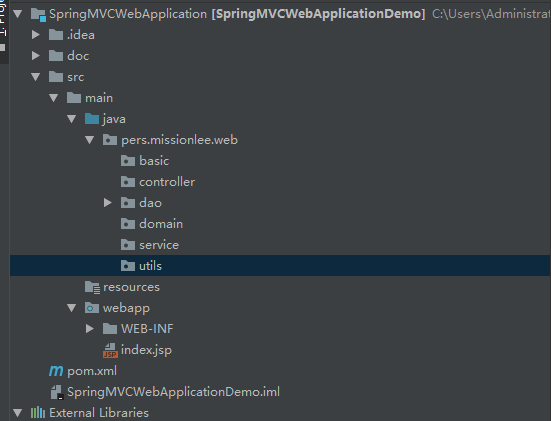

# 新建项目
```info
IDE : IDEA
模板 : maven - archtype-webapp 项目
```

- pom中添加 SpringMVC依赖
- 创建MVC形式的后端项目结构



- 修改web.xml,让SpringMVC代理项目

```xml
<?xml version="1.0" encoding="UTF-8"?>
<web-app xmlns="http://xmlns.jcp.org/xml/ns/javaee"
         xmlns:xsi="http://www.w3.org/2001/XMLSchema-instance"
         xsi:schemaLocation="http://xmlns.jcp.org/xml/ns/javaee http://xmlns.jcp.org/xml/ns/javaee/web-app_4_0.xsd"
         version="4.0">
  <context-param>
    <param-name>contextConfigLocation</param-name>
    <param-value>/WEB-INF/applicationContext.xml</param-value>
  </context-param>
  <listener>
    <listener-class>org.springframework.web.context.ContextLoaderListener</listener-class>
  </listener>
  <!--<servlet>-->
    <!--<servlet-name>dispatcher</servlet-name>-->
    <!--<servlet-class>org.springframework.web.servlet.DispatcherServlet</servlet-class>-->
    <!--<load-on-startup>1</load-on-startup>-->
  <!--</servlet>-->
  <!--<servlet-mapping>-->
    <!--<servlet-name>dispatcher</servlet-name>-->
    <!--<url-pattern>*.form</url-pattern>-->
    <!--<url-pattern>/a/*</url-pattern>-->
  <!--</servlet-mapping>-->
  <servlet>
    <servlet-name>basic-dispatcher</servlet-name>
    <servlet-class>org.springframework.web.servlet.DispatcherServlet</servlet-class>
    <init-param>
      <param-name>contextConfigLocation</param-name>
      <param-value>/WEB-INF/basic-dispatcher-servlet.xml</param-value>
    </init-param>
    <load-on-startup>1</load-on-startup>
  </servlet>
  <servlet-mapping>
    <servlet-name>basic-dispatcher</servlet-name>
    <url-pattern>/basic/*</url-pattern>
  </servlet-mapping>
</web-app>
```

> applicationContext.xml 是不部分配置，部分注解配置的形式，这里配置的东西比较少
```xml
<?xml version="1.0" encoding="UTF-8"?>
<beans xmlns="http://www.springframework.org/schema/beans"
       xmlns:xsi="http://www.w3.org/2001/XMLSchema-instance"
       xmlns:context="http://www.springframework.org/schema/context"
       xmlns:mvc="http://www.springframework.org/schema/mvc"
       xsi:schemaLocation="http://www.springframework.org/schema/beans http://www.springframework.org/schema/beans/spring-beans.xsd http://www.springframework.org/schema/context http://www.springframework.org/schema/context/spring-context.xsd http://www.springframework.org/schema/mvc http://www.springframework.org/schema/mvc/spring-mvc.xsd">
    <!-- 使 @Resource @PostConstruct @PreDestroy 生效需要：CommonAnnotationBeanPostProcessor -->
    <!-- 使 @PersistenceContext 需要 PersistenceAnnotationBeanPostProcessor的Bean-->
    <!-- @Required 必须声明RequiredAnnotationBeanPostProcessor的Bean。-->
    <!--@Autowired注解，那么就必须事先在 Spring 容器中声明 AutowiredAnnotationBeanPostProcessor Bean。-->
    <!-- annotation-config 隐式的想Spring容器注册上述四个BeanPostProcessor -->
    <!-- 如果使用了 component-scan 那么这个注解就不需要了 -->
    <!--<context:annotation-config/>-->
    <!-- ============================================================================ -->

    <!-- component-scan 完成所有annotation-config 的工作，并且额外支持 @Component，@Repository，@Service，@Controller @RestController,@ControllerAdvice, and @Configuration-->
    <!-- 注意：扫描并注册，也就是可以不用在配置文件里面配置，可以直接用 @Resource注入 -->
    <context:component-scan base-package="pers.missionlee.web.basic" />
    <context:component-scan base-package="pers.missionlee.web.controller"/>
    <context:component-scan base-package="pers.missionlee.web.service"/>
    <!-- ================================================================================ -->

    <!-- mvc:annotation-driven 实现类是org.springframework.web.servlet.config.AnnotationDrivenBeanDefinitionParser-->
    <!-- 主要作用是注册一些里MVC时候使用的内容 -->
    <!-- 在这里配置了 annotation-driven，也可以在 dispatcher-servlet里面配置 -->
    <mvc:annotation-driven/>
    <!-- ================================================================================= -->

    <!-- 加载jdbc配置文件 -->
    <context:property-placeholder location="classpath:jdbc-config.properties"/>
    <bean id="dataSource" class="com.alibaba.druid.pool.DruidDataSource" init-method="init" destroy-method="close">
        <!-- 这里选择使用配置文件配置 dataSource 使用注解 配置 SqlSession -->
        <property name="driverClassName" value="${jdbc.driver.class}"/>
        <property name="url" value="${jdbc.url}"/>
        <property name="username" value="${jdbc.username}"/>
        <property name="password" value="${jdbc.password}"/>

        <property name="initialSize" value="1"/>
        <property name="minIdle" value="1"/>
        <property name="maxActive" value="20"/>

        <!--配置获取连接等待超时的时间 -->
        <property name="maxWait" value="30000"/>

        <!--配置间隔多久才进行一次检测，检测需要关闭的空闲连接，单位是毫秒-->
        <property name="minEvictableIdleTimeMillis" value="300000"/>

        <property name="validationQuery" value="SELECT 1"/>
        <property name="testWhileIdle" value="true" />
        <property name="testOnBorrow" value="false"/>
        <property name="testOnReturn" value="false"/>

        <!--打开PSCache,并且置顶每个连接上的PSCache的大小 -->
        <property name="poolPreparedStatements" value="true"/>
        <property name="maxPoolPreparedStatementPerConnectionSize" value="20"/>
    </bean>
</beans>
```

> basic-dispatcher-servlet.xml 就是简单陪一下这个 dispatcher监听的内容

```xml
<?xml version="1.0" encoding="UTF-8"?>
<beans xmlns="http://www.springframework.org/schema/beans"
       xmlns:xsi="http://www.w3.org/2001/XMLSchema-instance"
       xmlns:context="http://www.springframework.org/schema/context"
       xmlns:mvc="http://www.springframework.org/schema/mvc"
       xsi:schemaLocation="http://www.springframework.org/schema/beans http://www.springframework.org/schema/beans/spring-beans.xsd http://www.springframework.org/schema/context http://www.springframework.org/schema/context/spring-context.xsd http://www.springframework.org/schema/mvc http://www.springframework.org/schema/mvc/spring-mvc.xsd">
    <!-- 默认情况下，DispatcherServlet使用这个配置文件 -->

    <!-- context:component-scan 表示扫描这个包下面所有的标记为 @Controller的类 -->
    <context:component-scan base-package="pers.missionlee.web.controller.basic"/>

    <!-- 用于支持在类上使用 @RestController  @ResponseBody 等注解，如果没有的话，只能在方法上使用 @ResponseBody -->
    <mvc:annotation-driven/>
</beans>
```

以上，一个非常简陋的框架就建好了