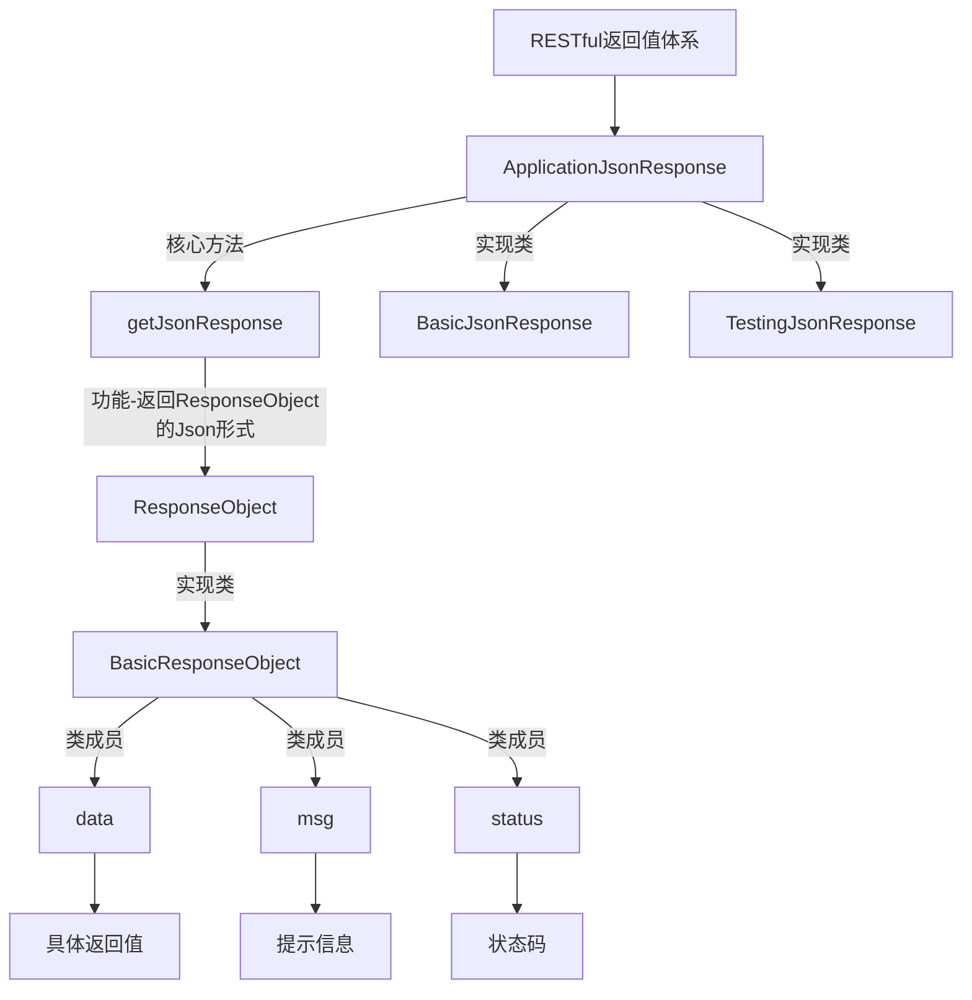
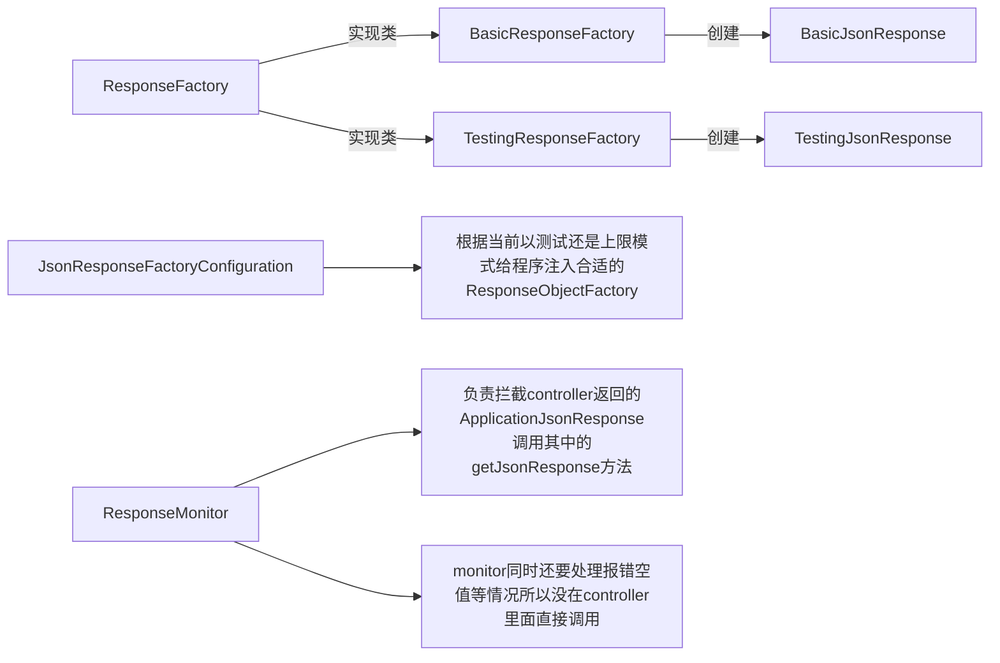

# 返回值处理体系

- 约定
  - 接口返回值有2种
    - ApplicationJsonResponse
    - ApplicationJsonResponse.StandardResponse.XX
- 实现功能
  - 上线情况下屏蔽测试返回信息，并转换为通用返回信息
  - 错误/特殊情况拦截处理
    - 空返回值
    - 集合/类集合对象大小为零
    - 键值对类型中值为null
    - 运行时错误
  - 返回统一格式的 json字符串

>返回体系设计

> 关于为什么要设计这样一个体系来处理 测试/上线 状态，而不是简单的用一个标志位，如果用一个参数表示当前是否测试，然后根据是否测试判断返回值如何处理，那么系统在每一次请求的时候，都必须做一次判断，设计成 根据是否测试，给项目配置不同的 factory，factory返回当前模式下需要的返回值，就只需要在项目启动的时候进行一次判断，因为factory只获取一次。

- RESTful



> 返回值标准模板

```json
{
    "data":{},
    "status":0,
    "msg":"正常"
}
```