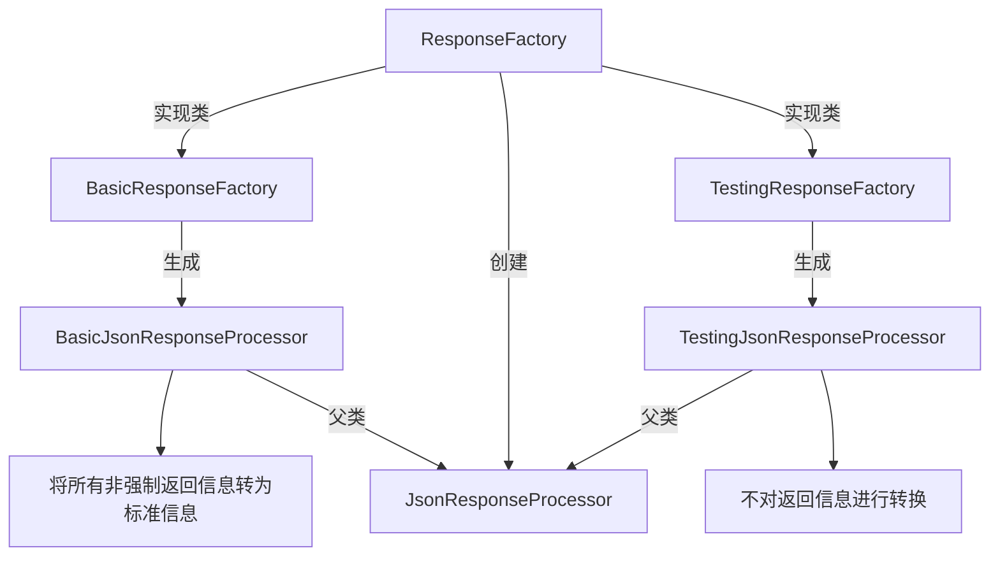
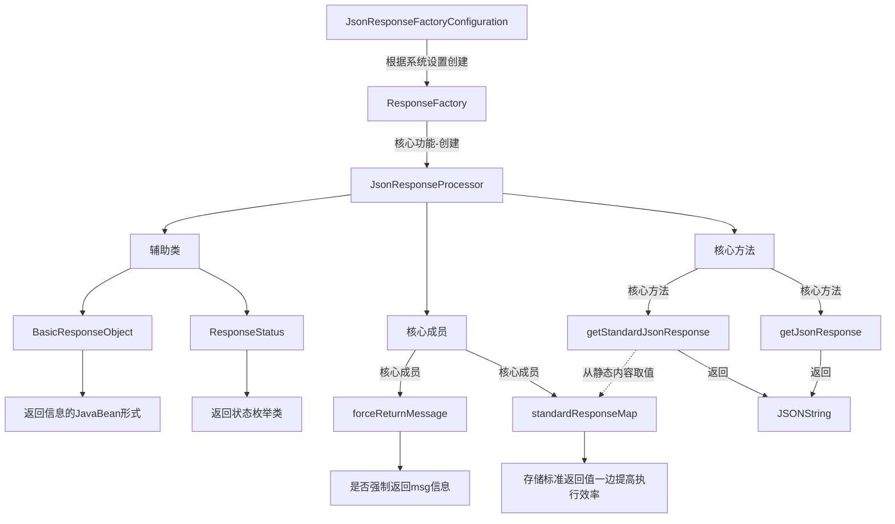
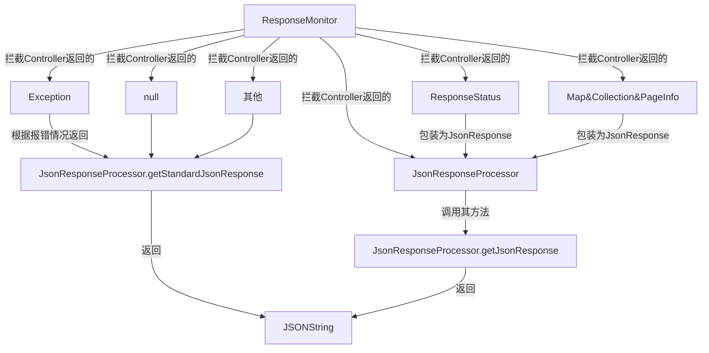
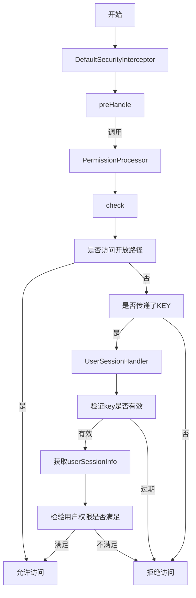
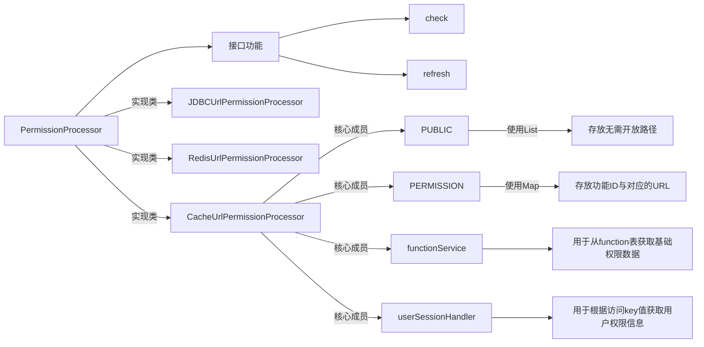
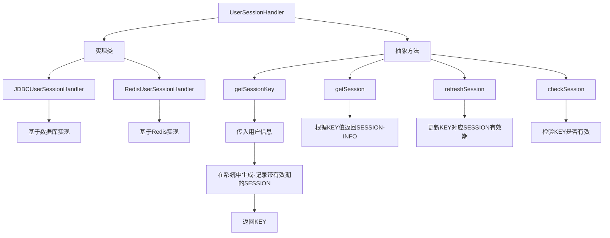

## 返回处理器
> 类架构

> 在项目中的运行原理

## Controller返回值拦截器

## 权限验证体系

> 验证流程 : 由DefaultSecurityInterceptor的preHandler控制整个流程

> PermissionProcessor

> UserSessionHandler

UserSessionHandler 依赖 [权限体系数据库结构](./10.权限体系.md)