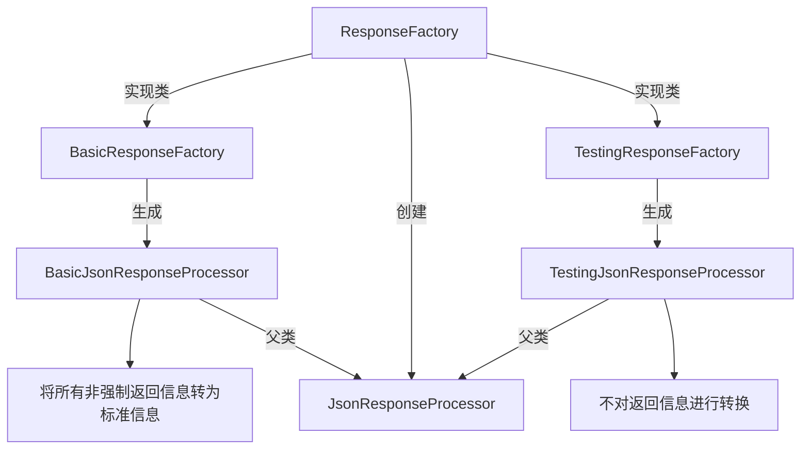
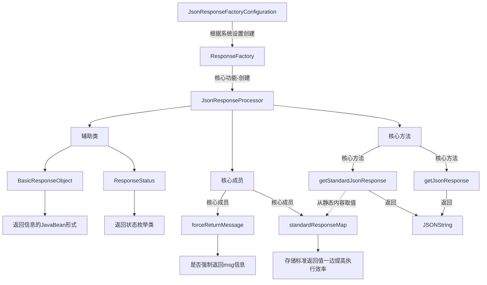
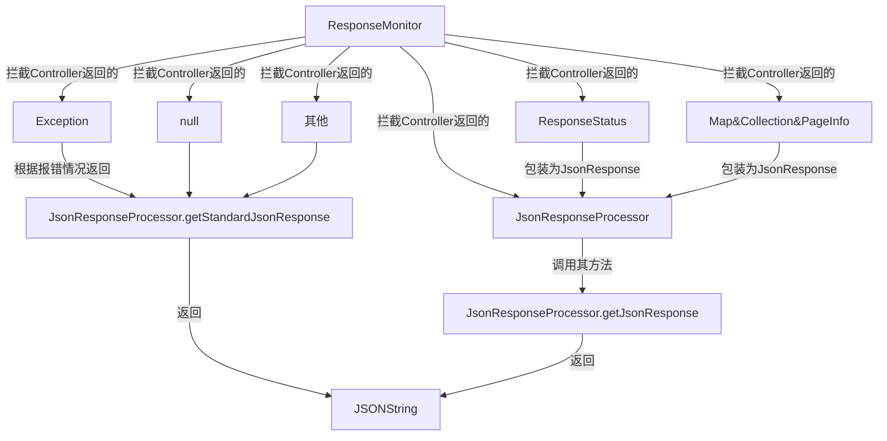
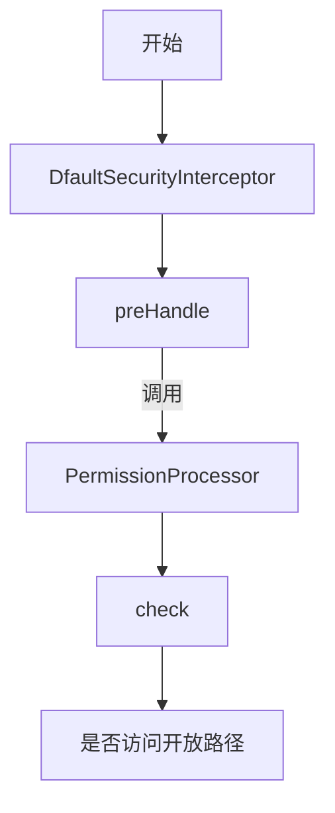

## 返回处理器
> 类架构

```mermaid
graph TD;
ResponseFactory-->|实现类|BasicResponseFactory
BasicResponseFactory-->|生成|BasicJsonResponseProcessor
BasicJsonResponseProcessor-->将所有非强制返回信息转为标准信息
BasicJsonResponseProcessor-->|父类|JsonResponseProcessor

ResponseFactory-->|实现类|TestingResponseFactory
TestingResponseFactory-->|生成|TestingJsonResponseProcessor
TestingJsonResponseProcessor-->不对返回信息进行转换

ResponseFactory-->|创建|JsonResponseProcessor

TestingJsonResponseProcessor-->|父类|JsonResponseProcessor
```

> 在项目中的运行原理

```mermaid
graph TD;
JsonResponseFactoryConfiguration-->|根据系统设置创建|ResponseFactory
ResponseFactory-->|核心功能-创建|JsonResponseProcessor
JsonResponseProcessor-->辅助类
JsonResponseProcessor-->核心成员
JsonResponseProcessor-->核心方法
辅助类-->BasicResponseObject
BasicResponseObject-->返回信息的JavaBean形式
辅助类-->ResponseStatus
ResponseStatus-->返回状态枚举类

核心成员-->|核心成员|forceReturnMessage
forceReturnMessage-->是否强制返回msg信息
核心成员-->|核心成员|standardResponseMap
standardResponseMap-->存储标准返回值一边提高执行效率

核心方法-->|核心方法|getStandardJsonResponse
getStandardJsonResponse-.->|从静态内容取值|standardResponseMap
getStandardJsonResponse-->|返回|JSONString

核心方法-->|核心方法|getJsonResponse
getJsonResponse-->|返回|JSONString
```
## Controller返回值拦截器

```mermaid
graph TD;
ResponseMonitor-->|拦截Controller返回的|Exception
ResponseMonitor-->|拦截Controller返回的|JsonResponseProcessor
ResponseMonitor-->|拦截Controller返回的|ResponseStatus
ResponseMonitor-->|拦截Controller返回的|Map&Collection&PageInfo
ResponseMonitor-->|拦截Controller返回的|null
ResponseMonitor-->|拦截Controller返回的|其他
Exception-->|根据报错情况返回|JsonResponseProcessor.getStandardJsonResponse
JsonResponseProcessor-->|调用其方法|JsonResponseProcessor.getJsonResponse
ResponseStatus-->|包装为JsonResponse|JsonResponseProcessor
Map&Collection&PageInfo-->|包装为JsonResponse|JsonResponseProcessor
null-->JsonResponseProcessor.getStandardJsonResponse
其他-->JsonResponseProcessor.getStandardJsonResponse
JsonResponseProcessor.getStandardJsonResponse-->|返回|JSONString
JsonResponseProcessor.getJsonResponse-->|返回|JSONString
```

## 权限验证体系

- DefaultSecurityInterceptor
- PermissionProcessor
- UserSessionHandler

```mermaid
graph TD;
开始-->DfaultSecurityInterceptor
DfaultSecurityInterceptor-->preHandle
preHandle-->|调用|PermissionProcessor
PermissionProcessor-->check
check-->是否访问开放路径
```
