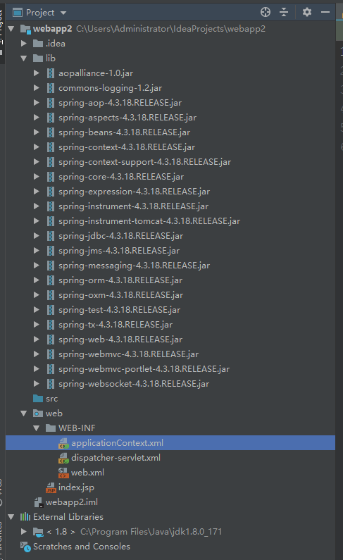

# IDEA 创建项目

## 折腾目录

- 使用maven-archetype-webapp创建项目
  - 展示了一个最普通的 web怎么写，没用任何框架
  - 展示了一下怎么配置服务，怎么配置项目结构
  - 标记 resource 和 标记 source 之后，在打包成web项目的时候会怎么阳
- 使用SpringMVC + WebApplication创建项目
  - 一大堆报错
  - 算是对学习SpringMVC的一个引子
    - DispatcherServlet
    - ContextListener
    - 注解
    - 配置文件
- 两次折腾留下的项目我也放到旁边的文件夹存起来了

> 加深一下对WEB项目的理解，做点没格调的事情

## 1.IDEA 新建Maven项目 使用 maven-archetype-webapp

因为是测试，没有他多要配置的，一路下一步，然后等待maven把项目初始化好

项目结构是这个样子的


- 添加Tomcat服务器
  - 我本第已经有了


- 选择 artifact 然后有两个选项
  - war 项目部署
  - war explored 项目热部署（开发时候用这个）

> 社区版的idea貌似没有artifact这个选项

现在这个项目启动，我们就可以看到 HelloWorld静态页面了

- 下面来做一个动态的JSON数据形式的HelloWorld

> 先配置一点东西

初始状态下 我们在 project structure里面看到的项目结构是这样的


修改成这个样子


这样我们就可以开始写java servlet了

1. pom 文件里面引入
```xml
    <!-- 我们实际开发是 servlet 这是必须引入的 -->
    <dependency>
      <groupId>javax.servlet</groupId>
      <artifactId>javax.servlet-api</artifactId>
      <version>3.1.0</version>
    </dependency>
```

2. 写一个helloworld
```java
public class HelloWorld extends HttpServlet {
    @Override
    protected void doGet(HttpServletRequest request, HttpServletResponse response) throws IOException {
        response.setContentType("application/json; charset=utf-8");
        response.getWriter().write("hello");
    }
    @Override
    protected void doPost(HttpServletRequest request,HttpServletResponse response) throws IOException {
        doGet(request,response);
    }
}
```
3. 配置 web.xml

```xml
<!DOCTYPE web-app PUBLIC
 "-//Sun Microsystems, Inc.//DTD Web Application 2.3//EN"
 "http://java.sun.com/dtd/web-app_2_3.dtd" >

<web-app>
  <display-name>Archetype Created Web Application</display-name>
  <servlet>
    <servlet-name>HelloWorld</servlet-name>
    <servlet-class>HelloWorld</servlet-class>
  </servlet>
  <servlet-mapping>
    <servlet-name>HelloWorld</servlet-name>
    <url-pattern>/hello</url-pattern>
  </servlet-mapping>
</web-app>
```

3.重启项目，访问一下

问题： 直接访问 localhost:8080/hello 提示找不到资源，然后我看了一下浏览器自动启动项目的时候，浏览器的路径是： http://localhost:8080/webapp1_war_exploded

所以我把路径改成 http://localhost:8080/webapp1_war_exploded/hello 果然这次成功了

解决：查找一下 webapp1_war_exploded 是什么

在配置中找到了这样一个东西：


红框里之前写的就是 /webapp1_war_exploded 把这个改成空，重启项目

这样就可以用 http://localhost:8080/hello  访问我们写的内容了

- 解释
  - application context 应用上下文
  - 如果不写相当于把这里面的内容放在 tomcat 的 root下，可以直接访问。
  - 如果写了（默认是项目名称）

> 以上一个最简单的demo就出来了，但是我想要记录的内容不止如此

回顾以下上面的设置项目结构，添加的 resource 目录 和 java 目录，他们到底是怎么用的，如何生效的，答案就在 out 文件里面（我们的resources目录里面还没有啥东西，现在添加一个）

效果如下：


不解释了，看图即可，其中 webapp1 里面的结果应该非常熟悉：tomcat标准结构

## 尝试以下不使用Maven

算了，不试了，浪费时间

## SpringMVC项目

idea 创建新项目

创建的时候选择

Spring - SpringMVC

这时候WebApplication会自动选择上

先看一下自动生成的项目的结构



还有重要的一点，看看自动生成的 xml

- web.xml
```xml
<?xml version="1.0" encoding="UTF-8"?>
<web-app xmlns="http://xmlns.jcp.org/xml/ns/javaee"
         xmlns:xsi="http://www.w3.org/2001/XMLSchema-instance"
         xsi:schemaLocation="http://xmlns.jcp.org/xml/ns/javaee http://xmlns.jcp.org/xml/ns/javaee/web-app_4_0.xsd"
         version="4.0">
    <context-param>
        <param-name>contextConfigLocation</param-name>
        <param-value>/WEB-INF/applicationContext.xml</param-value>
    </context-param>
    <listener>
        <listener-class>org.springframework.web.context.ContextLoaderListener</listener-class>
    </listener>
    <servlet>
        <servlet-name>dispatcher</servlet-name>
        <servlet-class>org.springframework.web.servlet.DispatcherServlet</servlet-class>
        <load-on-startup>1</load-on-startup>
    </servlet>
    <servlet-mapping>
        <servlet-name>dispatcher</servlet-name>
        <url-pattern>*.form</url-pattern>
    </servlet-mapping>
</web-app>
```

- applicationContext.xml
```xml
<?xml version="1.0" encoding="UTF-8"?>
<beans xmlns="http://www.springframework.org/schema/beans"
       xmlns:xsi="http://www.w3.org/2001/XMLSchema-instance"
       xsi:schemaLocation="http://www.springframework.org/schema/beans http://www.springframework.org/schema/beans/spring-beans.xsd">

</beans>
```
- dispatcher-servlet.xml
```xml
<?xml version="1.0" encoding="UTF-8"?>
<beans xmlns="http://www.springframework.org/schema/beans"
       xmlns:xsi="http://www.w3.org/2001/XMLSchema-instance"
       xsi:schemaLocation="http://www.springframework.org/schema/beans http://www.springframework.org/schema/beans/spring-beans.xsd">

</beans>
```

> 先尝试问候以下

- 配置上 Tomcat

- 访问：结果不成功。

报错
### 问题一
```note
org.apache.catalina.core.StandardContext.listenerStart Error configuring application listener of class [org.springframework.web.context.ContextLoaderListener]
 java.lang.ClassNotFoundException: org.springframework.web.context.ContextLoaderListener
```
分析：找不到ContextLoderListener

原因很明显，写代码的时候我们引用了Spring系列，但是运行的时候，idea调用起本地Tomcat，此时没有相关的jar包可以用。有Maven的时候，maven会把引用的依赖包都打进去，但是现在没有maven帮助

解决方法:把这一系列包放到本地tomcat的lib里面就可以了

### 问题二
当我们的代码为这个样子
```java
@Controller
//@ResponseBody
//@RequestMapping("/a")
public class HelloWorld {
    @RequestMapping("/he")
    @ResponseBody
    public Object hello(){
        return "heeeeello";
    }
}
```
前端访问接口： localhost:8080/he

The origin server did not find a current representation for the target resource or is not willing to disclose that one exists.

分析：之前用SpringBoot的时候项目是KingLeading调整好的，并且SpringBoot写出来就是方便开发的，把配置都省了。

这里提示没有这个资源（前端看到 404），通常我们可以去web.xml里面看路径配置，但是现在 web.xml 只配置了 Spring的ContextListener 和 DispatcherServlet

这时候我注意到了一点

```xml
    <servlet>
        <servlet-name>dispatcher</servlet-name>
        <servlet-class>org.springframework.web.servlet.DispatcherServlet</servlet-class>
        <load-on-startup>1</load-on-startup>
    </servlet>
    <servlet-mapping>
        <servlet-name>dispatcher</servlet-name>
        <url-pattern>*.form</url-pattern>
    </servlet-mapping>
```

对于Tomcat服务器来说， DispatcherServlet就是一个正常的Servlet，那么404就很明显了， 对应的 url-pattern 映射不到我们访问的路径上

处理方法
```xml
    <servlet>
        <servlet-name>dispatcher</servlet-name>
        <servlet-class>org.springframework.web.servlet.DispatcherServlet</servlet-class>
        <load-on-startup>1</load-on-startup>
    </servlet>
    <servlet-mapping>
        <servlet-name>dispatcher</servlet-name>
        <url-pattern>*.form</url-pattern>
        <url-pattern>/a/*</url-pattern>
    </servlet-mapping>
```

我们把 url-pattern 写成匹配 /a/* ，然后再Controller那边做对应的改动
```java
@Controller
@RequestMapping("/a")
public class HelloWorld {
    @RequestMapping("/he")
    @ResponseBody
    public Object hello(){
        return "heeeeello";
    }
}

```

### 问题三
前端报错：
The origin server did not find a current representation for the target resource or is not willing to disclose that one exists.

后端报错：org.springframework.web.servlet.PageNotFound.noHandlerFound No mapping found for HTTP request with URI [我们的路径] in DispatcherServlet with name 'dispatcher'

这里说一下我在调试错误的时候总结出来的 url匹配规则，为了自己以后会看这里没有疑问，我来尝试一下 配置两个 dispatcherServlet

为了能看的清楚，这里写以下完整的配置
```xml
    <context-param>
        <param-name>contextConfigLocation</param-name>
        <param-value>/WEB-INF/applicationContext.xml</param-value>
    </context-param>
    <listener>
        <listener-class>org.springframework.web.context.ContextLoaderListener</listener-class>
    </listener>
    <servlet>
    <!-- 这个是创建项目自动生成的，没有配置 init-param，会自动查找 dispatcher-servlet2.xml 作为配置文件 -->
        <servlet-name>dispatcher</servlet-name>
        <servlet-class>org.springframework.web.servlet.DispatcherServlet</servlet-class>
        <load-on-startup>1</load-on-startup>
    </servlet>
    <servlet-mapping>
        <servlet-name>dispatcher</servlet-name>
        <url-pattern>*.form</url-pattern>
        <url-pattern>/a/*</url-pattern>
    </servlet-mapping>
    <servlet>
    <!-- 这里是我自己后来加的，并指定配置文件 -->
        <servlet-name>dispatcher2</servlet-name>
        <servlet-class>org.springframework.web.servlet.DispatcherServlet</servlet-class>
        <init-param>
            <param-name>contextConfigLocation</param-name>
            <param-value>/WEB-INF/dispatcher-servlet2.xml</param-value>
        </init-param>
        <load-on-startup>2</load-on-startup>
    </servlet>
    <servlet-mapping>
        <servlet-name>dispatcher2</servlet-name>
        <url-pattern>/b/*</url-pattern>
    </servlet-mapping>
```
两份配置文件
```xml
<!-- 这一部分是 默认的，配置扫描包 controller  -->
<?xml version="1.0" encoding="UTF-8"?>
<beans xmlns="http://www.springframework.org/schema/beans"
       xmlns:xsi="http://www.w3.org/2001/XMLSchema-instance"
       xmlns:context="http://www.springframework.org/schema/context"
       xmlns:mvc="http://www.springframework.org/schema/mvc"
       xsi:schemaLocation="http://www.springframework.org/schema/beans http://www.springframework.org/schema/beans/spring-beans.xsd http://www.springframework.org/schema/context http://www.springframework.org/schema/context/spring-context.xsd http://www.springframework.org/schema/mvc http://www.springframework.org/schema/mvc/spring-mvc.xsd">
    <context:component-scan base-package="controller"/>
    <!--<mvc:annotation-driven/>-->
</beans>
<!-- 下面这个是新建的，配置扫描包 controller2 -->
<?xml version="1.0" encoding="UTF-8"?>
<beans xmlns="http://www.springframework.org/schema/beans"
       xmlns:xsi="http://www.w3.org/2001/XMLSchema-instance"
       xmlns:context="http://www.springframework.org/schema/context"
       xmlns:mvc="http://www.springframework.org/schema/mvc"
       xsi:schemaLocation="http://www.springframework.org/schema/beans http://www.springframework.org/schema/beans/spring-beans.xsd http://www.springframework.org/schema/context http://www.springframework.org/schema/context/spring-context.xsd http://www.springframework.org/schema/mvc http://www.springframework.org/schema/mvc/spring-mvc.xsd">
    <context:component-scan base-package="controller2"/>
    <!--<mvc:annotation-driven/>-->
</beans>
```
Java代码
```java
//  controller 下面的 class
@Controller
@RequestMapping("/c")
public class HelloWorld {
    @RequestMapping("/he")
    @ResponseBody
    public Object hello(){
        return "heeeeello";
    }
}
// controller2 下面的class
@Controller
@RequestMapping("/c2")
public class HelloWorld2 {
    @RequestMapping("/he")
    @ResponseBody
    public Object hello(){
        return "heeeeello2";
    }
}
```

测试结果
|url|返回|
|-|-|
|/a/c/he|heeeeello|
|/a/c2/he|报错|
|/b/c/he|报错|
|/b/c2/he|heeeeello2|
|/c/he|报错|

> 总结 url-pattern 在写为 /a/* 的时候 /a 这个级别会自动添加到当前dispatcherServlet所代理的url的前缀位置，在没有设置的时候，会自动加载 dispatcher-servlet.xml作为参数xml文件并读取里面的设置。如果自己配置了，那么就不会再加载默认项目了

补充一点，dispatcher-servlet.xml可以配置多个包，多个dispatcherServlet代理重叠的包是没有问题的，也就是现在的两个dispatcherServlet可以都操作 controller 或者 controller2 包

### 问题四

之前在SpringBoot项目中，很自然的把 @RestController 写在类是，但是在SpringMVC中，没有那么自然，需要在 dispatcher-servlet.xml中加上

```xml
<mvc:annotation-driven/>
```

才能正确识别卸载类上的 @RestController 或者 @ResponseBody

### 问题五

这确实是一个机缘巧合的错误

参考问题四，我再没有对四做改动的情况下，有一次测试，代码是这个样子：
```java
    @RequestMapping("/hello")
    public Object hello(){
        return "hello";
    }
```
请求访问到 hello这里的时候，返回 “hello” ， 因为问题四所述的情况，这里被认为返回的是一个 view，而这view的名字为 hello，恰巧hello有是当前的 requestMapping，这样就陷入了 死循环，被 Spring发现之后，后端报错。

## 