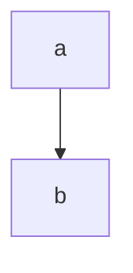

# 语法

- 用关键字graph表示一个流程图的开始，同时指定该图的方向
  - TB（ top bottom）表示从上到下
  - BT（bottom top）表示从下到上
  - RL（right left）表示从右到左
  - LR（left right）表示从左到右
  - TD与TB一样表示从上到下
- 有以下几种节点和形状：
  - 默认节点 A
  - 文本节点 B[b的名称]
  - 圆角节点 C(c的名称)
  - 圆形节点 D((d的名称))
  - 非对称节点 E>e的名称]
  - 菱形节点 F{f的名称}
  - 以上大写字母表示节点，大写字母后面文字表示它的名称，默认节点的A同时表示该节点和它的名称：

- 节点间的连接线有多种形状，而且可以在连接线中加入标签：
  - 箭头连接 A1–>B1
  - 开放连接 A2—B2
  - 标签连接 A3–text—B3 或者 A3—|text|B3
  - 箭头标签连接 A4–text -->B4 或者 A4–>|text|B4
  - 虚线开放连接 A5.-B5 或者 A5-.-B5 或者 A5…-B5
  - 虚线箭头连接 A6.->B6 或者 A6-.->B6
  - 标签虚线连接 A7-.text.-B7
  - 标签虚线箭头连接 A8-.text.->B8
  - 粗线开放连接 A9=B9
  - 粗线箭头连接 A10>B10
  - 标签粗线开放连接 A11text=B11
  - 标签粗线箭头连接 A12text>B12
