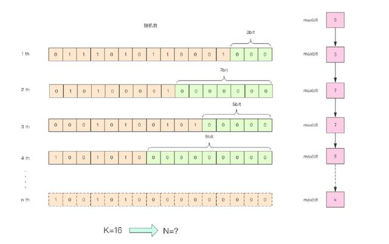

# 

参考 https://baijiahao.baidu.com/s?id=1611726471431642966&wfr=spider&for=pc

在开始这一节之前，我们先思考一个常见的业务问题：如果你负责开发维护一个大型的网站，有一天老板找产品经理要网站每个网页每天的 UV 数据，然后让你来开发这个统计模块，你会如何实现？


如果统计 PV 那非常好办，给每个网页一个独立的 Redis 计数器就可以了，这个计数器的 key 后缀加上当天的日期。这样来一个请求，incrby 一次，最终就可以统计出所有的 PV 数据。

但是 UV 不一样，它要去重，同一个用户一天之内的多次访问请求只能计数一次。这就要求每一个网页请求都需要带上用户的 ID，无论是登陆用户还是未登陆用户都需要一个唯一 ID 来标识。

你也许已经想到了一个简单的方案，那就是为每一个页面一个独立的 set 集合来存储所有当天访问过此页面的用户 ID。当一个请求过来时，我们使用 sadd 将用户 ID 塞进去就可以了。通过 scard 可以取出这个集合的大小，这个数字就是这个页面的 UV 数据。没错，这是一个非常简单的方案。

PV
- 每个网页一个计数器，访问一次就添加一次

UV
- 要对用户去重，每个页面一个set，set里面放今日用户id，每天统计每个set数据量就可以了


但是，如果你的页面访问量非常大，比如一个爆款页面几千万的 UV，你需要一个很大的 set 集合来统计，这就非常浪费空间。如果这样的页面很多，那所需要的存储空间是惊人的。为这样一个去重功能就耗费这样多的存储空间，值得么？其实老板需要的数据又不需要太精确，105w 和 106w 这两个数字对于老板们来说并没有多大区别，So，有没有更好的解决方案呢？

这就是本节要引入的一个解决方案，Redis 提供了 HyperLogLog 数据结构就是用来解决这种统计问题的。HyperLogLog 提供不精确的去重计数方案，虽然不精确但是也不是非常不精确，标准误差是 0.81%，这样的精确度已经可以满足上面的 UV 统计需求了。

HyperLogLog 数据结构是 Redis 的高级数据结构，它非常有用，但是令人感到意外的是，使用过它的人非常少。

使用方法

HyperLogLog 提供了两个指令 pfadd 和 pfcount，根据字面意义很好理解，一个是增加计数，一个是获取计数。pfadd 用法和 set 集合的 sadd 是一样的，来一个用户 ID，就将用户 ID 塞进去就是。pfcount 和 scard 用法是一样的，直接获取计数值。

- pfadd xxHyperLogLog user1  这样就可以了，排重的
- pfcount xxHyperLogLog 可以获取数值


- 一个数据插入测试的结果 10W条

差了 277 个，按百分比是 0.277%，对于上面的 UV 统计需求来说，误差率也不算高。然后我们把上面的脚本再跑一边，也就相当于将数据重复加入一边，查看输出，可以发现，pfcount 的结果没有任何改变，还是 99723，说明它确实具备去重功能。

> pfadd 这个 pf 是什么意思？

它是 HyperLogLog 这个数据结构的发明人 Philippe Flajolet 的首字母缩写，老师觉得他发型很酷，看起来是个佛系教授。


> pfmerge 适合什么场合用？

HyperLogLog 除了上面的 pfadd 和 pfcount 之外，还提供了第三个指令 pfmerge，用于将多个 pf 计数值累加在一起形成一个新的 pf 值。

比如在网站中我们有两个内容差不多的页面，运营说需要这两个页面的数据进行合并。其中页面的 UV 访问量也需要合并，那这个时候 pfmerge 就可以派上用场了。

> 注意事项

HyperLogLog 这个数据结构不是免费的，不是说使用这个数据结构要花钱，它需要占据一定 12k 的存储空间，所以它不适合统计单个用户相关的数据。如果你的用户上亿，可以算算，这个空间成本是非常惊人的。但是相比 set 存储方案，HyperLogLog 所使用的空间那真是可以使用千斤对比四两来形容了。

不过你也不必过于担心，因为 Redis 对 HyperLogLog 的存储进行了优化，在计数比较小时，它的存储空间采用稀疏矩阵存储，空间占用很小，仅仅在计数慢慢变大，稀疏矩阵占用空间渐渐超过了阈值时才会一次性转变成稠密矩阵，才会占用 12k 的空间。

> HyperLogLog 实现原理

HyperLogLog 的使用非常简单，但是实现原理比较复杂，如果读者没有特别的兴趣，下面的内容暂时可以跳过不看。

为了方便理解 HyperLogLog 的内部实现原理，我画了下面这张图



这张图的意思是，给定一系列的随机整数，我们记录下低位连续零位的最大长度 k，通过这个 k 值可以估算出随机数的数量。首先不问为什么，我们编写代码做一个实验，观察一下随机整数的数量和 k 值的关系。


```java
package com.lms.algorithms.HyperLogLog;

import java.util.concurrent.ThreadLocalRandom;

/**
 * @description: HyperLogLog 实现原理 的 一点简单测试
 * @author: Mission Lee
 * @create: 2019-08-05 18:49
 */
public class PfTest {
    static class BitKeeper {
        private int maxbits;

        public void random() {
            long value = ThreadLocalRandom.current().nextLong(2L << 32);
            int bits = lowZero(value);
            if (bits > this.maxbits) {
                this.maxbits = bits;
            }
        }

        private int lowZero(long value) {
            int i = 1;
            for(;i<32;i++){
                if(value>>i<<i !=value){
                    break;
                }
            }
            return i-1;
        }
    }
    static class Experiment{
        private int n;
        private BitKeeper keeper;
        public Experiment(int n){
            this.n = n;
            this.keeper = new BitKeeper();
        }
        public void work(){
            for (int i = 0; i < n; i++) {
                this.keeper.random();
            }
        }
        public void debug(){
            System.out.printf("%d %.2f %d\n",this.n,Math.log(this.n)/Math.log(2),this.keeper.maxbits);
        }
    }

    public static void main(String[] args) {
        for (int i = 1000; i < 10000; i+=1000) {
            Experiment experiment = new Experiment(i);
            experiment.work();
            experiment.debug();
        }
    }
}
```
调整一下参数 i的范围,这里为了方便,i给的范围很小

观察输出
```note
1000 9.97 13
2000 10.97 10
3000 11.55 13
4000 11.97 10
5000 12.29 12
6000 12.55 13
7000 12.77 16
8000 12.97 14
9000 13.14 13
```
通过这实验可以发现 K 和 N 的对数之间存在显著的线性相关性：

> N ~= 2^K

如果 N 介于 2^K 和 2^(K+1) 之间，用这种方式估计的值都等于 2^K，这明显是不合理的。这里可以采用多个 BitKeeper，然后进行加权估计，就可以得到一个比较准确的值。


> ⭐ 原文里面的方法执行起来有问题,就不贴在这里了


代码中分了 1024 个桶，计算平均数使用了调和平均 (倒数的平均)。普通的平均法可能因为个别离群值对平均结果产生较大的影响，调和平均可以有效平滑离群值的影响。


真实的 HyperLogLog 要比上面的示例代码更加复杂一些，也更加精确一些。上面的这个算法在随机次数很少的情况下会出现除零错误，因为 maxbits=0 是不可以求倒数的。

> pf 的内存占用为什么是 12k？

我们在上面的算法中使用了 1024 个桶进行独立计数，不过在 Redis 的 HyperLogLog 实现中用到的是 16384 个桶，也就是 2^14，每个桶的 maxbits 需要 6 个 bits 来存储，最大可以表示 maxbits=63，于是总共占用内存就是2^14 * 6 / 8 = 12k字节。

思考 & 作业

尝试将一堆数据进行分组，分别进行计数，再使用 pfmerge 合并到一起，观察 pfcount 计数值，与不分组的情况下的统计结果进行比较，观察有没有差异。

扩展阅读

HyperLogLog 复杂的公式推导请阅读 Count-Distinct Problem，如果你的概率论基础不好，那就建议不要看了（另，这个 PPT 需要翻墙观看）。