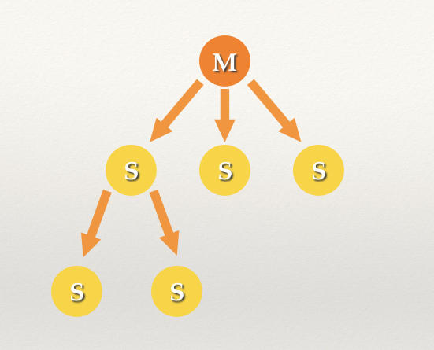
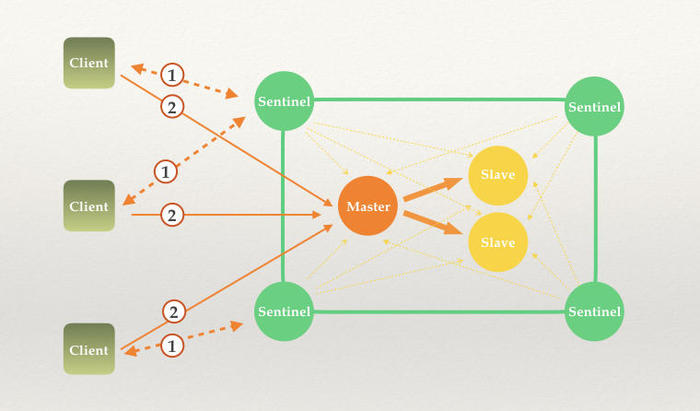
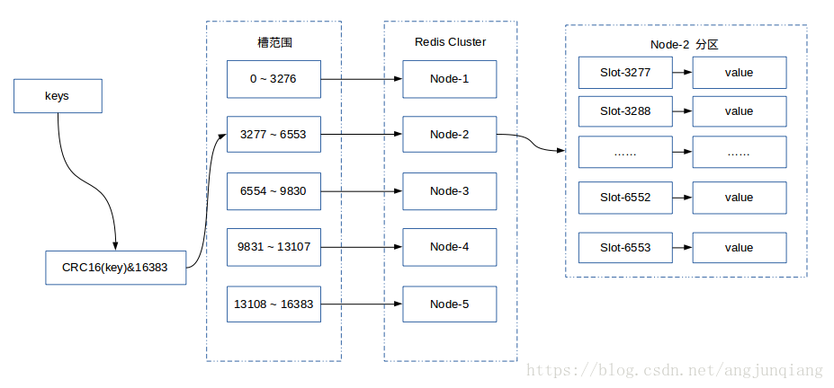
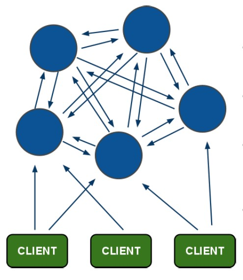

## 一、前言


原文：https://blog.csdn.net/angjunqiang/article/details/81190562 


互联网高速发展的今天，对应用系统的抗压能力要求越来越高，传统的应用层+数据库已经不能满足当前的需要。所以一大批内存式数据库和Nosql数据库应运而生，其中redis,memcache,mongodb,hbase等被广泛的使用来提高系统的吞吐性，所以如何正确使用cache是作为开发的一项基技能。本文主要介绍Redis Sentinel 及 Redis Cluster的区别及用法，Redis的基本操作可以自行去参看其官方文档 。 其他几种cache有兴趣的可自行找资料去学习。

## 二、Redis Sentinel 及 Redis Cluster 简介

### 1、Redis Sentinel

 Redis-Sentinel(哨兵模式)是Redis官方推荐的高可用性(HA)解决方案，当用Redis做Master-slave的高可用方案时，假如master宕机了，Redis本身(包括它的很多客户端)都没有实现自动进行主备切换，而Redis-sentinel本身也是一个独立运行的进程，它能监控多个master-slave集群，发现master宕机后能进行自懂切换。它的主要功能有以下几点：

不时地监控redis是否按照预期良好地运行;
如果发现某个redis节点运行出现状况，能够通知另外一个进程(例如它的客户端);
能够进行自动切换。当一个master节点不可用时，能够选举出master的多个slave(如果有超过一个slave的话)中的一个来作为新的master,其它的slave节点会将它所追随的master的地址改为被提升为master的slave的新地址。
       Redis master-slave 模式如下图：



从上图片中可以看到，一个master 节点可以挂多个slave  ，Redis Sentinel 管理Redis 节点结构如下：



从上图中可以得出Sentinel其实就是Client和Redis之间的桥梁，所有的客户端都通过Sentinel程序获取Redis的Master服务。首先Sentinel是集群部署的，Client可以链接任何一个Sentinel服务所获的结果都是一致的。其次，所有的Sentinel服务都会对Redis的主从服务进行监控，当监控到Master服务无响应的时候，Sentinel内部进行仲裁，从所有的 Slave选举出一个做为新的Master。并且把其他的slave作为新的Master的Slave。最后通知所有的客户端新的Master服务地址。如果旧的Master服务地址重新启动，这个时候，它将被设置为Slave服务。

Sentinel 可以管理master-slave节点，看似Redis的稳定性得到一个比较好的保障。但是如果Sentinel是单节点的话，如果Sentinel宕机了，那master-slave这种模式就不能发挥其作用了。幸好Sentinel也支持集群模式，Sentinel的集群模式主要有以下几个好处：

- 即使有一些sentinel进程宕掉了，依然可以进行redis集群的主备切换；
- 如果只有一个sentinel进程，如果这个进程运行出错，或者是网络堵塞，那么将无法实现redis集群的主备切换（单点问题）;
- 如果有多个sentinel，redis的客户端可以随意地连接任意一个sentinel来获得关于redis集群中的信息。

     Redis Sentinel 集群模式可以增强整个Redis集群的稳定性与可靠性，但是当某个节点的master节点挂了要重新选取出新的master节点时，Redis Sentinel的集群模式选取的复杂度显然高于单点的Redis Sentinel 模式，此时需要一个比较靠谱的选取算法。下面就来介绍Redis Sentinel 集群模式的 “仲裁会”(多个Redis Sentinel共同商量谁是Redis 的 master节点)

#### 1.1、Redis Sentinel 集群模式的 “仲裁会”

 当一个master被sentinel集群监控时，需要为它指定一个参数，这个参数指定了当需要判决master为不可用，并且进行failover时，所需要的sentinel数量，本文中我们暂时称这个参数为票数,不过，当failover主备切换真正被触发后，failover并不会马上进行，还需要sentinel中的大多数sentinel授权后才可以进行failover。当ODOWN时，failover被触发。failover一旦被触发，尝试去进行failover的sentinel会去获得“大多数”sentinel的授权（如果票数比大多数还要大的时候，则询问更多的sentinel)这个区别看起来很微妙，但是很容易理解和使用。例如，集群中有5个sentinel，票数被设置为2，当2个sentinel认为一个master已经不可用了以后，将会触发failover，但是，进行failover的那个sentinel必须先获得至少3个sentinel的授权才可以实行failover。如果票数被设置为5，要达到ODOWN状态，必须所有5个sentinel都主观认为master为不可用，要进行failover，那么得获得所有5个sentinel的授权。

### 2、Redis Cluster

使用Redis Sentinel 模式架构的缓存体系，在使用的过程中，随着业务的增加不可避免的要对Redis进行扩容，熟知的扩容方式有两种，一种是垂直扩容，一种是水平扩容。垂直扩容表示通过加内存方式来增加整个缓存体系的容量比如将缓存大小由2G调整到4G,这种扩容不需要应用程序支持；水平扩容表示表示通过增加节点的方式来增加整个缓存体系的容量比如本来有1个节点变成2个节点，这种扩容方式需要应用程序支持。垂直扩容看似最便捷的扩容，但是受到机器的限制，一个机器的内存是有限的，所以垂直扩容到一定阶段不可避免的要进行水平扩容，如果预留出很多节点感觉又是对资源的一种浪费因为对业务的发展趋势很快预测。Redis Sentinel 水平扩容一直都是程序猿心中的痛点，因为水平扩容牵涉到数据的迁移。迁移过程一方面要保证自己的业务是可用的，一方面要保证尽量不丢失数据所以数据能不迁移就尽量不迁移。针对这个问题，Redis Cluster就应运而生了，下面简单介绍一下RedisCluster。

Redis Cluster是Redis的分布式解决方案，在Redis 3.0版本正式推出的，有效解决了Redis分布式方面的需求。当遇到单机内存、并发、流量等瓶颈时，可以采用Cluster架构达到负载均衡的目的。分布式集群首要解决把整个数据集按照分区规则映射到多个节点的问题，即把数据集划分到多个节点上，每个节点负责整个数据的一个子集。Redis Cluster采用哈希分区规则中的虚拟槽分区。虚拟槽分区巧妙地使用了哈希空间，使用分散度良好的哈希函数把所有的数据映射到一个固定范围内的整数集合，整数定义为槽（slot）。Redis Cluster槽的范围是0 ～ 16383。槽是集群内数据管理和迁移的基本单位。采用大范围的槽的主要目的是为了方便数据的拆分和集群的扩展，每个节点负责一定数量的槽。Redis Cluster采用虚拟槽分区，所有的键根据哈希函数映射到0 ～ 16383，计算公式：slot = CRC16(key)&16383。每一个实节点负责维护一部分槽以及槽所映射的键值数据。下图展现一个五个节点构成的集群，每个节点平均大约负责3276个槽，以及通过计算公式映射到对应节点的对应槽的过程。



Redis Cluster节点相互之前的关系如下图所示：



## 三、Redis Sentinel 及Redis Cluster 实践
Redis Sentinel 与Redis Cluster 使用需要引入如下jar包
```xml
<!-- 我这边现在项目里面 直接用的 spring-data-redis了 -->
<dependency>
    <groupId>redis.clients</groupId>
    <artifactId>jedis</artifactId>
    <version>2.9.0</version>
</dependency>
 
<dependency>
    <groupId>org.apache.commons</groupId>
    <artifactId>commons-pool2</artifactId>
    <version>2.5.0</version>
</dependency>
```
1、Redis Sentinel 使用
```java
package com.knowledge.cache.redis;
 
import redis.clients.jedis.Jedis;
import redis.clients.jedis.JedisSentinelPool;
import redis.clients.jedis.exceptions.JedisConnectionException;
 
import org.apache.commons.lang3.StringUtils;
import org.apache.commons.pool2.impl.GenericObjectPoolConfig;
import java.util.Arrays;
import java.util.HashSet;
import java.util.Set;
 
/**
 * @author hzwangjunqiang1@corp.netease.com
 * @desc redis sentinel 使用
 */
public class RedisSentinelClient {
    private static JedisSentinelPool pool = null;
    private static String redisHosts = "127.0.0.1:26378;127.0.0.1:26379;127.0.0.1:26380";
    private static String redisMaster = "";//master name
    private static String password = "";//密码,可选
    private static final int MAX_IDLE = 200;//最大空闲数
    private static final int MAX_TOTAL = 400;//最大连接数
    private static final int MIN_IDLE = 200;//最小空闲数
 
    static {
        //redis 连接池配置
        GenericObjectPoolConfig poolConfig = new GenericObjectPoolConfig();
        poolConfig.setMaxIdle(MAX_IDLE);
        poolConfig.setMaxTotal(MAX_TOTAL);
        poolConfig.setMinIdle(MIN_IDLE);
        poolConfig.setTestOnBorrow(true);
        poolConfig.setTestOnReturn(true);
        Set<String> hosts = new HashSet<String>(Arrays.asList(redisHosts.split(";")));
        if (StringUtils.isBlank(password)) {
            pool = new JedisSentinelPool(redisMaster, hosts, poolConfig);
        } else {
            pool = new JedisSentinelPool(redisMaster, hosts, poolConfig, password);
        }
    }
 
    public String get(String key) throws JedisConnectionException {
        Jedis jedis = pool.getResource();
        try {
            return jedis.get(key);
        } catch (JedisConnectionException e) {
            throw e;
        } finally {
            jedis.close();
        }
    }
}
```
2、Redis Cluster 使用
```java
package com.knowledge.cache.redis;
 
import redis.clients.jedis.HostAndPort;
import redis.clients.jedis.JedisCluster;
import redis.clients.jedis.exceptions.JedisConnectionException;
 
import org.apache.commons.lang3.StringUtils;
import org.apache.commons.pool2.impl.GenericObjectPoolConfig;
import java.util.Arrays;
import java.util.HashSet;
import java.util.LinkedHashSet;
import java.util.Set;
 
/**
 * @author hzwangjunqiang1@corp.netease.com
 * @desc Redis cluster 使用
 */
public class RedisClusterClient {
    private static JedisCluster jedisCluster = null;
    private static String redisHosts = "127.0.0.1:6378;127.0.0.1:6379;127.0.0.1:6380"; //如:127.0.0.1:26379;127.0.0.1:26378
    private static String password = "";//密码,可选
    private static final int CONNECT_TIMEOUT = 1000;//连接超时时间
    private static final int SO_TIMEOUT = 1000;//响应超时时间
    private static final int MAX_ATTEMPTS = 5;//最大尝试次数
    private static final int MAX_IDLE = 200;//最大空闲数
    private static final int MAX_TOTAL = 400;//最大连接数
    private static final int MIN_IDLE = 200;//最小空闲数
 
    static {
        //连接池配置
        GenericObjectPoolConfig poolConfig = new GenericObjectPoolConfig();
        poolConfig.setMaxIdle(MAX_IDLE);
        poolConfig.setMaxTotal(MAX_TOTAL);
        poolConfig.setMinIdle(MIN_IDLE);
        poolConfig.setTestOnBorrow(true);
        poolConfig.setTestOnReturn(true);
        //Redis Cluster 初始化
        Set<String> hosts = new HashSet<String>(Arrays.asList(redisHosts.split(";")));
        Set<HostAndPort> nodes = new LinkedHashSet<HostAndPort>();
        for (String host : hosts) {
            HostAndPort hostAndPort = new HostAndPort(host.split(":")[0], Integer.parseInt(host.split(":")[1]));
            nodes.add(hostAndPort);
        }
 
        if (StringUtils.isBlank(password)) {
            jedisCluster = new JedisCluster(nodes, CONNECT_TIMEOUT, SO_TIMEOUT, MAX_ATTEMPTS, poolConfig);
        } else {
            jedisCluster = new JedisCluster(nodes, CONNECT_TIMEOUT, SO_TIMEOUT, MAX_ATTEMPTS, password, poolConfig);
        }
    }
 
    /**
     * @param key
     * @return
     * @throws JedisConnectionException
     */
    public String get(String key) throws JedisConnectionException {
        try {
            return jedisCluster.get(key);
        } catch (JedisConnectionException e) {
            throw e;
        }
    }
 
    /**
     * @param key
     * @param value
     * @return
     * @throws JedisConnectionException
     */
    public String set(String key, String value) throws JedisConnectionException {
 
        try {
            return jedisCluster.set(key, value);
        } catch (JedisConnectionException e) {
            throw e;
        }
    }
}
```
以上介绍了Redis Sentinel 及 Redis Cluster的初始化过程及简单的使用，其他比较复杂的应用可以参考Redis 的官方API

## 四、Redis的过期淘汰策略
- 1、定时删除

含义:在设置key的过期时间的同时，为该key创建一个定时器，让定时器在key的过期时间来临时，对key进行删除
优点:保证内存被尽快释放
缺点:1)若过期key很多，删除这些key会占用很多的CPU时间，在CPU时间紧张的情况下，CPU不能把所有的时间用来做要紧的事儿，还需要去花时间删除这些key;2)定时器的创建耗时,若为每一个设置过期时间的key创建一个定时器（将会有大量的定时器产生），性能影响严重
- 2、懒汉式删除

含义:key过期的时候不删除，每次通过key获取值的时候去检查是否过期，若过期，则删除，返回null。
优点:删除操作只发生在通过key取值的时候发生，而且只删除当前key，所以对CPU时间的占用是比较少的，而且此时的删除是已经到了非做不可的地步（如果此时还不删除的话，我们就会获取到了已经过期的key了
缺点:若大量的key在超出超时时间后，很久一段时间内，都没有被获取过，那么可能发生内存泄露（无用的垃圾占用了大量的内存）
- 3、定期删除

含义:每隔一段时间执行一次删除过期key操作
优点:1)通过限制删除操作的时长和频率，来减少删除操作对CPU时间的占用--处理"定时删除"的缺点;2)定期删除过期key--处理"懒汉式删除"的缺点
缺点:1)在内存友好方面，不如"定时删除"（会造成一定的内存占用，但是没有懒汉式那么占用内存）;2)在CPU时间友好方面，不如"懒汉式删除"（会定期的去进行比较和删除操作，cpu方面不如懒汉式，但是比定时好）
难点:1)合理设置删除操作的执行时长（每次删除执行多长时间）和执行频率（每隔多长时间做一次删除）（这个要根据服务器运行情况来定了），每次执行时间太长，或者执行频率太高对cpu都是一种压力;2) 每次进行定期删除操作执行之后，需要记录遍历循环到了哪个标志位，以便下一次定期时间来时，从上次位置开始进行循环遍历
memcached只是用了惰性删除，而redis同时使用了惰性删除与定期删除，这也是二者的一个不同点（可以看做是redis优于memcached的一点）;

 

## 五、Redis 使用过程中踩过的坑
- 1、在生产环境中一定要配置GenericObjectPoolConfig中的 maxIdle、maxTotal、minIdle.因为里面默认值太低了，如果生产环境中流量比较大的话，就会出现等待redis的连接的情况。

- 2、使用Redis Sentinel 一定要在最后执行jedis.close方法来释放资源，这个close方法是表示将正常的连接放回去连接池中，将不正常的连接给关闭。之前jedis低版本中都是调用returnResource方法来释放资源，如果连接不正常了会被重复使用，这时会出现很诡异的异常。所以建议使用比较高版本的jedis

- 3、为了更好的使用redis 连接池，建议采用 JedisPoolConfig来替代GenericObjectPoolConfig。JedisPoolConfig里面有一些默认的参数

- 4、maxIdle，maxTotal 最佳实践为 maxIdle = maxTotal
