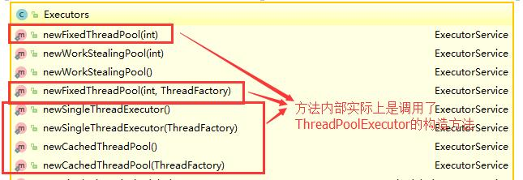
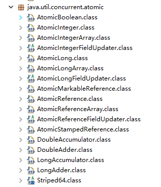
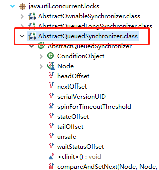

- 剖析面试最常见问题之Java 并发知识进阶(下)
  - \1. 线程池
    - [1.1. 为什么要用线程池？]()
    - [1.2. 实现 Runnable 接口和 Callable 接口的区别]()
    - [1.3. 执行 execute() 方法和 submit() 方法的区别是什么呢？]()
    - [1.4. 如何创建线程池]()
  - \2. Atomic 原子类
    - [2.1. 介绍一下 Atomic 原子类]()
    - [2.2. JUC 包中的原子类是哪 4 类?]()
    - [2.3. 讲讲 AtomicInteger 的使用]()
    - [2.4. 能不能给我简单介绍一下 AtomicInteger 类的原理]()
  - \3. AQS
    - [3.1. AQS 介绍]()
    - 3.2. AQS 原理分析
      - [3.2.1. AQS 原理概览]()
      - [3.2.2. AQS 对资源的共享方式]()
      - [3.2.3. AQS 底层使用了模板方法模式]()
    - [3.3. AQS 组件总结]()


# 剖析面试最常见问题之Java 并发知识进阶(下)

## 1. 线程池

### 1.1. 为什么要用线程池？

线程池提供了一种限制和管理资源（包括执行一个任务）。 每个线程池还维护一些基本统计信息，例如已完成任务的数量。

这里借用《Java 并发编程的艺术》提到的来说一下使用线程池的好处：

- **降低资源消耗。** 通过重复利用已创建的线程降低线程创建和销毁造成的消耗。
- **提高响应速度。** 当任务到达时，任务可以不需要的等到线程创建就能立即执行。
- **提高线程的可管理性。** 线程是稀缺资源，如果无限制的创建，不仅会消耗系统资源，还会降低系统的稳定性，使用线程池可以进行统一的分配，调优和监控。

### 1.2. 实现 Runnable 接口和 Callable 接口的区别

如果想让线程池执行任务的话需要实现的 Runnable 接口或 Callable 接口。 Runnable 接口或 Callable 接口实现类都可以被 ThreadPoolExecutor 或 ScheduledThreadPoolExecutor 执行。两者的区别在于 Runnable 接口不会返回结果但是 Callable 接口可以返回结果。

**备注：** 工具类`Executors`可以实现`Runnable`对象和`Callable`对象之间的相互转换。（`Executors.callable（Runnable task）`或`Executors.callable（Runnable task，Object resule）`）。

### 1.3. 执行 execute() 方法和 submit() 方法的区别是什么呢？

1)**execute() 方法用于提交不需要返回值的任务，所以无法判断任务是否被线程池执行成功与否；**

2)**submit() 方法用于提交需要返回值的任务。线程池会返回一个 Future 类型的对象，通过这个 Future 对象可以判断任务是否执行成功**，并且可以通过 future 的 get() 方法来获取返回值，get() 方法会阻塞当前线程直到任务完成，而使用 `get（long timeout，TimeUnit unit）`方法则会阻塞当前线程一段时间后立即返回，这时候有可能任务没有执行完。

### 1.4. 如何创建线程池

《阿里巴巴 Java 开发手册》中强制线程池不允许使用 Executors 去创建，而是通过 ThreadPoolExecutor 的方式，这样的处理方式让写的同学更加明确线程池的运行规则，规避资源耗尽的风险

> Executors 返回线程池对象的弊端如下：
>
> - **FixedThreadPool 和 SingleThreadExecutor** ： 允许请求的队列长度为 Integer.MAX_VALUE ，可能堆积大量的请求，从而导致 OOM。
> - **CachedThreadPool 和 ScheduledThreadPool** ： 允许创建的线程数量为 Integer.MAX_VALUE ，可能会创建大量线程，从而导致 OOM。

**方式一：通过构造方法实现**

```java
    public ThreadPoolExecutor(int corePoolSize,
                              int maximumPoolSize,
                              long keepAliveTime,
                              TimeUnit unit,
                              BlockingQueue<Runnable> workQueue,
                              ThreadFactory threadFactory,
                              RejectedExecutionHandler handler) {
        if (corePoolSize < 0 ||
            maximumPoolSize <= 0 ||
            maximumPoolSize < corePoolSize ||
            keepAliveTime < 0)
            throw new IllegalArgumentException();
        if (workQueue == null || threadFactory == null || handler == null)
            throw new NullPointerException();
        this.acc = System.getSecurityManager() == null ?
                null :
                AccessController.getContext();
        this.corePoolSize = corePoolSize;
        this.maximumPoolSize = maximumPoolSize;
        this.workQueue = workQueue;
        this.keepAliveTime = unit.toNanos(keepAliveTime);
        this.threadFactory = threadFactory;
        this.handler = handler;
    }
```
通过构造方法实现


**方式二：通过 Executor 框架的工具类 Executors 来实现**
我们可以创建三种类型的 ThreadPoolExecutor：

- **FixedThreadPool** ： 该方法返回一个固定线程数量的线程池。该线程池中的线程数量始终不变。当有一个新的任务提交时，线程池中若有空闲线程，则立即执行。若没有，则新的任务会被暂存在一个任务队列中，待有线程空闲时，便处理在任务队列中的任务。
- **SingleThreadExecutor：** 方法返回一个只有一个线程的线程池。若多余一个任务被提交到该线程池，任务会被保存在一个任务队列中，待线程空闲，按先入先出的顺序执行队列中的任务。
- **CachedThreadPool：** 该方法返回一个可根据实际情况调整线程数量的线程池。线程池的线程数量不确定，但若有空闲线程可以复用，则会优先使用可复用的线程。若所有线程均在工作，又有新的任务提交，则会创建新的线程处理任务。所有线程在当前任务执行完毕后，将返回线程池进行复用。

对应 Executors 工具类中的方法如图所示：



通过 Executor 框架的工具类 Executors 来实现


## 2. Atomic 原子类

### 2.1. 介绍一下 Atomic 原子类

Atomic 翻译成中文是原子的意思。在化学上，我们知道原子是构成一般物质的最小单位，在化学反应中是不可分割的。在我们这里 Atomic 是指一个操作是不可中断的。即使是在多个线程一起执行的时候，一个操作一旦开始，就不会被其他线程干扰。

所以，所谓原子类说简单点就是具有原子/原子操作特征的类。

并发包 `java.util.concurrent` 的原子类都存放在`java.util.concurrent.atomic`下,如下图所示。



JUC 原子类概览


### 2.2. JUC 包中的原子类是哪 4 类?

**基本类型**

使用原子的方式更新基本类型

- AtomicInteger：整形原子类
- AtomicLong：长整型原子类
- AtomicBoolean：布尔型原子类

**数组类型**

使用原子的方式更新数组里的某个元素

- AtomicIntegerArray：整形数组原子类
- AtomicLongArray：长整形数组原子类
- AtomicReferenceArray：引用类型数组原子类

**引用类型**

- AtomicReference：引用类型原子类
- AtomicStampedRerence：原子更新引用类型里的字段原子类
- AtomicMarkableReference ：原子更新带有标记位的引用类型

**对象的属性修改类型**

- AtomicIntegerFieldUpdater：原子更新整形字段的更新器
- AtomicLongFieldUpdater：原子更新长整形字段的更新器
- AtomicStampedReference：原子更新带有版本号的引用类型。该类将整数值与引用关联起来，可用于解决原子的更新数据和数据的版本号，可以解决使用 CAS 进行原子更新时可能出现的 ABA 问题。

### 2.3. 讲讲 AtomicInteger 的使用

**AtomicInteger 类常用方法**

```java
public final int get() //获取当前的值
public final int getAndSet(int newValue)//获取当前的值，并设置新的值
public final int getAndIncrement()//获取当前的值，并自增
public final int getAndDecrement() //获取当前的值，并自减
public final int getAndAdd(int delta) //获取当前的值，并加上预期的值
boolean compareAndSet(int expect, int update) //如果输入的数值等于预期值，则以原子方式将该值设置为输入值（update）
public final void lazySet(int newValue)//最终设置为 newValue,使用 lazySet 设置之后可能导致其他线程在之后的一小段时间内还是可以读到旧的值。
```

**AtomicInteger 类的使用示例**

使用 AtomicInteger 之后，不用对 increment() 方法加锁也可以保证线程安全。

```java
class AtomicIntegerTest {
        private AtomicInteger count = new AtomicInteger();
      //使用 AtomicInteger 之后，不需要对该方法加锁，也可以实现线程安全。
        public void increment() {
                  count.incrementAndGet();
        }

       public int getCount() {
                return count.get();
        }
}
```

### 2.4. 能不能给我简单介绍一下 AtomicInteger 类的原理

AtomicInteger 线程安全原理简单分析

AtomicInteger 类的部分源码：

```java
    // setup to use Unsafe.compareAndSwapInt for updates（更新操作时提供“比较并替换”的作用）
    private static final Unsafe unsafe = Unsafe.getUnsafe();
    private static final long valueOffset;

    static {
        try {
            valueOffset = unsafe.objectFieldOffset
                (AtomicInteger.class.getDeclaredField("value"));
        } catch (Exception ex) { throw new Error(ex); }
    }

    private volatile int value;
```

AtomicInteger 类主要利用 CAS (compare and swap) + volatile 和 native 方法来保证原子操作，从而避免 synchronized 的高开销，执行效率大为提升。

CAS 的原理是拿期望的值和原本的一个值作比较，如果相同则更新成新的值。UnSafe 类的 objectFieldOffset() 方法是一个本地方法，这个方法是用来拿到“原来的值”的内存地址，返回值是 valueOffset。另外 value 是一个 volatile 变量，在内存中可见，因此 JVM 可以保证任何时刻任何线程总能拿到该变量的最新值。

关于 Atomic 原子类这部分更多内容可以查看我的这篇文章：并发编程面试必备：[JUC 中的 Atomic 原子类总结](https://mp.weixin.qq.com/s/joa-yOiTrYF67bElj8xqvg)

## 3. AQS

### 3.1. AQS 介绍

AQS 的全称为（AbstractQueuedSynchronizer），这个类在 java.util.concurrent.locks 包下面。



AQS


AQS 是一个用来构建锁和同步器的框架，使用 AQS 能简单且高效地构造出应用广泛的大量的同步器，比如我们提到的 ReentrantLock，Semaphore，其他的诸如 ReentrantReadWriteLock，SynchronousQueue，FutureTask 等等皆是基于 AQS 的。当然，我们自己也能利用 AQS 非常轻松容易地构造出符合我们自己需求的同步器。

### 3.2. AQS 原理分析

AQS 原理这部分参考了部分博客，在 5.2 节末尾放了链接。

> 在面试中被问到并发知识的时候，大多都会被问到“请你说一下自己对于 AQS 原理的理解”。下面给大家一个示例供大家参加，面试不是背题，大家一定要假如自己的思想，即使加入不了自己的思想也要保证自己能够通俗的讲出来而不是背出来。

下面大部分内容其实在 AQS 类注释上已经给出了，不过是英语看着比较吃力一点，感兴趣的话可以看看源码。

#### 3.2.1. AQS 原理概览

**AQS 核心思想是，如果被请求的共享资源空闲，则将当前请求资源的线程设置为有效的工作线程，并且将共享资源设置为锁定状态。如果被请求的共享资源被占用，那么就需要一套线程阻塞等待以及被唤醒时锁分配的机制，这个机制 AQS 是用 CLH 队列锁实现的，即将暂时获取不到锁的线程加入到队列中。**

> CLH(Craig,Landin,and Hagersten) 队列是一个虚拟的双向队列（虚拟的双向队列即不存在队列实例，仅存在结点之间的关联关系）。AQS 是将每条请求共享资源的线程封装成一个 CLH 锁队列的一个结点（Node）来实现锁的分配。

看个 AQS(AbstractQueuedSynchronizer) 原理图：


AQS原理图


AQS 使用一个 int 成员变量来表示同步状态，通过内置的 FIFO 队列来完成获取资源线程的排队工作。AQS 使用 CAS 对该同步状态进行原子操作实现对其值的修改。

```java
private volatile int state;//共享变量，使用 volatile 修饰保证线程可见性
```

状态信息通过 protected 类型的 getState，setState，compareAndSetState 进行操作

```java
//返回同步状态的当前值
protected final int getState() {  
        return state;
}
 // 设置同步状态的值
protected final void setState(int newState) { 
        state = newState;
}
//原子地（CAS 操作）将同步状态值设置为给定值 update 如果当前同步状态的值等于 expect（期望值）
protected final boolean compareAndSetState(int expect, int update) {
        return unsafe.compareAndSwapInt(this, stateOffset, expect, update);
}
```

#### 3.2.2. AQS 对资源的共享方式

**AQS 定义两种资源共享方式**

- Exclusive

  （独占）：只有一个线程能执行，如 ReentrantLock。又可分为公平锁和非公平锁：

  - 公平锁：按照线程在队列中的排队顺序，先到者先拿到锁
  - 非公平锁：当线程要获取锁时，无视队列顺序直接去抢锁，谁抢到就是谁的

- **Share**（共享）：多个线程可同时执行，如 Semaphore/CountDownLatch。Semaphore、CountDownLatch、 CyclicBarrier、ReadWriteLock 我们都会在后面讲到。

ReentrantReadWriteLock 可以看成是组合式，因为 ReentrantReadWriteLock 也就是读写锁允许多个线程同时对某一资源进行读。

不同的自定义同步器争用共享资源的方式也不同。自定义同步器在实现时只需要实现共享资源 state 的获取与释放方式即可，至于具体线程等待队列的维护（如获取资源失败入队/唤醒出队等），AQS 已经在顶层实现好了。

#### 3.2.3. AQS 底层使用了模板方法模式

同步器的设计是基于模板方法模式的，如果需要自定义同步器一般的方式是这样（模板方法模式很经典的一个应用）：

1. 使用者继承 AbstractQueuedSynchronizer 并重写指定的方法。（这些重写方法很简单，无非是对于共享资源 state 的获取和释放）
2. 将 AQS 组合在自定义同步组件的实现中，并调用其模板方法，而这些模板方法会调用使用者重写的方法。

这和我们以往通过实现接口的方式有很大区别，这是模板方法模式很经典的一个运用。

**AQS 使用了模板方法模式，自定义同步器时需要重写下面几个 AQS 提供的模板方法：**

```java
isHeldExclusively()//该线程是否正在独占资源。只有用到 condition 才需要去实现它。
tryAcquire(int)//独占方式。尝试获取资源，成功则返回 true，失败则返回 false。
tryRelease(int)//独占方式。尝试释放资源，成功则返回 true，失败则返回 false。
tryAcquireShared(int)//共享方式。尝试获取资源。负数表示失败；0 表示成功，但没有剩余可用资源；正数表示成功，且有剩余资源。
tryReleaseShared(int)//共享方式。尝试释放资源，成功则返回 true，失败则返回 false。
```

默认情况下，每个方法都抛出 `UnsupportedOperationException`。 这些方法的实现必须是内部线程安全的，并且通常应该简短而不是阻塞。AQS 类中的其他方法都是 final ，所以无法被其他类使用，只有这几个方法可以被其他类使用。

以 ReentrantLock 为例，state 初始化为 0，表示未锁定状态。A 线程 lock() 时，会调用 tryAcquire() 独占该锁并将 state+1。此后，其他线程再 tryAcquire() 时就会失败，直到 A 线程 unlock() 到 state=0（即释放锁）为止，其它线程才有机会获取该锁。当然，释放锁之前，A 线程自己是可以重复获取此锁的（state 会累加），这就是可重入的概念。但要注意，获取多少次就要释放多么次，这样才能保证 state 是能回到零态的。

再以 CountDownLatch 以例，任务分为 N 个子线程去执行，state 也初始化为 N（注意 N 要与线程个数一致）。这 N 个子线程是并行执行的，每个子线程执行完后 countDown() 一次，state 会 CAS(Compare and Swap) 减 1。等到所有子线程都执行完后 (即 state=0)，会 unpark() 主调用线程，然后主调用线程就会从 await() 函数返回，继续后余动作。

一般来说，自定义同步器要么是独占方法，要么是共享方式，他们也只需实现`tryAcquire-tryRelease`、`tryAcquireShared-tryReleaseShared`中的一种即可。但 AQS 也支持自定义同步器同时实现独占和共享两种方式，如`ReentrantReadWriteLock`。

推荐两篇 AQS 原理和相关源码分析的文章：

- http://www.cnblogs.com/waterystone/p/4920797.html
- https://www.cnblogs.com/chengxiao/archive/2017/07/24/714116html

### 3.3. AQS 组件总结

- **Semaphore(信号量)-允许多个线程同时访问：** synchronized 和 ReentrantLock 都是一次只允许一个线程访问某个资源，Semaphore(信号量) 可以指定多个线程同时访问某个资源。
- **CountDownLatch （倒计时器）：** CountDownLatch 是一个同步工具类，用来协调多个线程之间的同步。这个工具通常用来控制线程等待，它可以让某一个线程等待直到倒计时结束，再开始执行。
- **CyclicBarrier(循环栅栏)：** CyclicBarrier 和 CountDownLatch 非常类似，它也可以实现线程间的技术等待，但是它的功能比 CountDownLatch 更加复杂和强大。主要应用场景和 CountDownLatch 类似。CyclicBarrier 的字面意思是可循环使用（Cyclic）的屏障（Barrier）。它要做的事情是，让一组线程到达一个屏障（也可以叫同步点）时被阻塞，直到最后一个线程到达屏障时，屏障才会开门，所有被屏障拦截的线程才会继续干活。CyclicBarrier 默认的构造方法是 CyclicBarrier(int parties)，其参数表示屏障拦截的线程数量，每个线程调用 await() 方法告诉 CyclicBarrier 我已经到达了屏障，然后当前线程被阻塞。

关于 AQS 这部分的更多内容可以查看我的这篇文章：[并发编程面试必备：AQS 原理以及 AQS 同步组件总结](https://mp.weixin.qq.com/s/joa-yOiTrYF67bElj8xqvg)