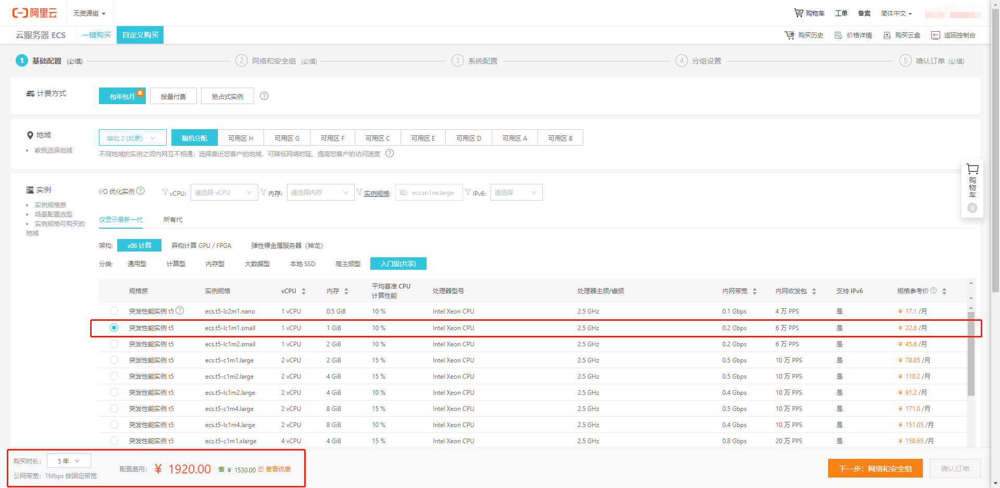

# 个人站点 建站全流程

> 这不是一个详尽到可以对着复制粘贴命令的攻略，如果看到这篇文章的您是一位基础较为薄弱的开发者也不用担心，我会在需要的地方写下百度关键词

个人站点我打算使用的技术是 ： vue.js + spring-mvc + mybatis

需要的服务/组件： nginx + mysql + tomcat/spring-boot-web(可选) + node(可选) + maven + git

> 实际上我还弄了一些其他的东西，但是与主体无关，就不写在这里了

## 租一台服务器

个人站点，自娱自乐使用，自然不需要太多资源，并且用最少量的资源保证自己的服务器正常运行是一个开发者必须要做的事情。简单看了一下各大云服务商提供的资源，大概找了两套配置

- 阿里： 1CPU/2.5G * 10% , 1G 内存, 1MB带宽, 40G系统盘 5年 2025
- 腾讯： 1Cpu/2.0G * 100%, 1G 内存, 1MB带宽, 50G系统盘 5年 2835

我选择了阿里的, 阿里云介绍的所谓的 cpu * 10% ，大概意思是当cpu使用低于 10%，会给账户累加积分，高于10%减低积分，没有积分时候如果高于10%，会被限制到10%，(我登录了公司的一个当前时段比较清闲的web服务器，top一下，双核cpu占用1%，然后登录自己公司的网站请求了一些分析统计数据，每秒两三次请求，这个时间段应该没有别人使用站点，cpu占用率两核心，每个都在5%，Cpu核心频率 2.1G)

我估算个人站点的计算量肯定是没有刚刚触发的这几个请求cpu使用量大的，并且估计 99.95% 的时间段，我的个人站点应该也没人访问。我就不浪费资源能源了，阿里走起。

下面是我使用的具体资源配置(后面修改了一些配置，总价格多了一点)



后面傻瓜操作的各个步骤就不写了，一些要设置的内容如果你是一位新人不懂就是用默认设置，最重要的一步是付钱。

系统部署完成后，可以在云厂商的控制台页面看到自己服务器的公网ip地址，可以使用ssh登录

# 目录规划

统一管理，所有自己安装的内容都放在了 /home 目录下

我在 /home下创建了三个文件夹 
- source 临时仓库，有很多我用自己机器下载传到服务器上的文件都放在这里
- service 我打算把 nginx mysql jdk 等等都放在这里（如果你的成长方向是软硬件运维，请务必记住这不是一个好的选择）
- project 自己编写的源代码

## 基础构建

安装一个 xftp ，用于自己开发机器和服务器传递文件

> 以下各个组件的安装使用，请自行baidu，个别能够帮助“省钱”的内容，我会说明一下

- jdk  百度： centos7 安装jdk
- nginx 百度： centos7 安装nginx
- mysql 百度： centos7 安装 mysql 5.7
- tomcat（可用可不用） 百度： centos7 安装tomcat （实际上我没安装，我要节省资源）
- node.js (可装可不装) 百度： centos7 安装nodejs
- maven 百度： centos7 安装maven
- git 百度： centos7 安装git
- redis 百度： centos7 安装redis
  - 攻略里面一般都会教你配置外网访问权限什么的
  - 我租用的资源这么少，配置的时候我就只允许本机访问

公司限制了每个人的网速500K，好在上行也是这么多，但是jdk已经接近200MB大小， MySQL 5.7版本 我用的bundle包有500MB大小，其他的也是大小不一

## 关于nginx

从百度搜索nginx安装，搜索出的主要内容都相同，不过nginx支持插件，所以除了基础安装，每份nginx安装攻略都会有或大或小一些出入

```bash
./configure \
--prefix=/home/service/nginx-1.17.2 \
--lock-path=/var/lock/nginx.lock \
--with-http_ssl_module \
--with-http_v2_module \
--with-http_dav_module \
--with-http_flv_module \
--with-http_realip_module \
--with-http_addition_module \
--with-http_xslt_module \
--with-http_stub_status_module \
--with-http_sub_module \
--with-http_random_index_module \
--with-http_degradation_module \
--with-http_secure_link_module \
--with-http_gzip_static_module \
--with-http_perl_module \
--add-module=/home/service/nginx-third-module/nginx-goodies-nginx-sticky-module-ng-08a395c66e42 \
--add-module=/home/service/nginx-third-module/nginx_upstream_check_module-master \
--with-pcre=/home/service/nginx-third-module/pcre-8.42 \
--with-zlib=/home/service/nginx-third-module/zlib-1.2.11 \
--with-openssl=/home/service/nginx-third-module/openssl-1.1.1-pre8 \
--with-file-aio \
--with-mail \
--with-mail_ssl_module \
--http-client-body-temp-path=/var/tmp/nginx/client_body \
--http-proxy-temp-path=/var/tmp/nginx/proxy \
--http-fastcgi-temp-path=/var/tmp/nginx/fastcgi \
--http-uwsgi-temp-path=/var/tmp/nginx/uwsgi \
--http-scgi-temp-path=/var/tmp/nginx/scgi \
--with-stream \
--with-ld-opt="-Wl,-E"
```


## 

前端流程

vue init webpack blog_f

npm install

- 写了一些代码

npm run dev : 这里出了一点问题，我使用了 scss

需要加载两个loader

npm install node-sass --save-dev

npm install sass-loader --save-dev


尝试自己写各种前端组件，还是觉得麻烦，不自己写了，引入 element-ui

为了缩小体积，打算按需引入 element-ui的组件

npm i element-ui -S

借助 babel-plugin-component，我们可以只引入需要的组件，以达到减小项目体积的目的（）：

npm install babel-plugin-component -D

具体在 https://element.eleme.cn/#/zh-CN/component/quickstart 有说明为什么这样做，包括 修改 babelrc里面的参数

另外： Vue.use 和 Vue.component : Vue.use 会调用入参的 install 方法，如果 对于组件，他们的install方法其实就是调用了 Vue.component 所以两者效果看起来一样


-- 停以下，配置了以下 免密码登录

免密码登录要义： 把自己机器的 pub key写到 服务器的 authorized_keys 里面

我的win客户端用的 powershell  ssh生成key的位置在 C:\Users\XXUser\.ssh 里面，找到 pub，上传到服务器，然后用  cat xx.pub >> authorized_keys 然后就可以了。

注意的一点是，win用户名是 missionlee，想要登陆的server账号是 root，所以 ssh 还是要加上root用户名 ssh root@ip   然后我在自己的 hosts文件里面 把我的服务器地址映射成  myserver  就可以用：  ssh root@myserver  这个比较好记的名字登录了

## 2019 08 13 

这里想用vue/cli 3 版本重新弄一下项目

npm uninstall vue-cli -g

npm install -g @vue/cli

这里出了一点问题， npm 下载报错

npm install -g cnpm --registry=https://registry.npm.taobao.org 下载了cnpm，然后用cnpm下载 

cnpm install -g @vue/cli

然后 vue --version 报错： vue : 无法加载文件 C:\Users\MissionLee\AppData\Roaming\npm\vue.ps1，因为在此系统上禁止运行脚本

处理方法： 管理员运行powershell set-executionpolicy remotesigned  选择 Y