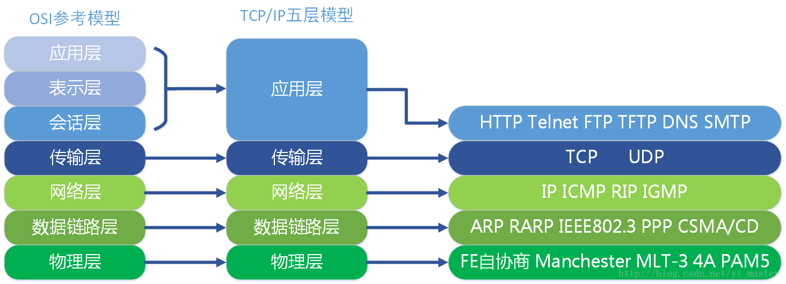
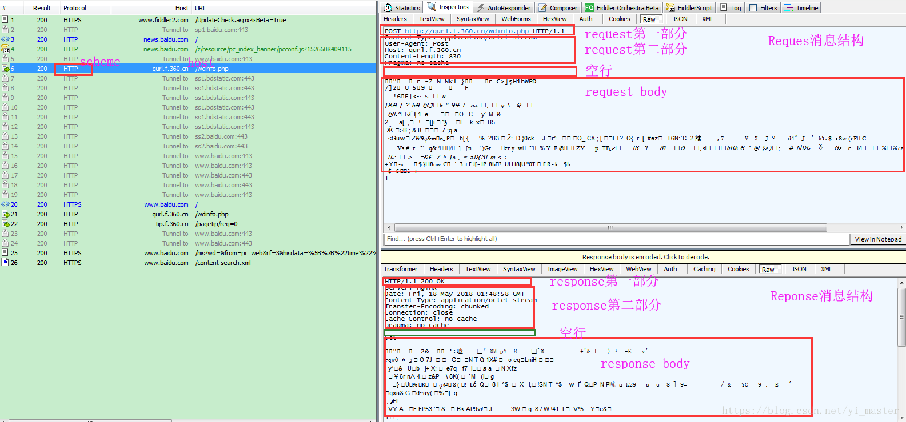

# 基础

作者：yi_master 
来源：CSDN 
原文：https://blog.csdn.net/yi_master/article/details/79358920 

MissionLee ： 自己做了增添

## 1）HTTP协议 

超文本传输协议(HTTP)是一种通信协议，归属于应用层协议，主要解决如何包装数据。它允许将超文本标记语言(HTML)文档从Web服务器传送到客户端的浏览器。http协议是无状态的，同一个客户端的这次请求和上次请求是没有对应关系，对http服务器来说，它并不知道这两个请求来自同一个客户端。 为了解决这个问题， Web程序引入了Cookie机制来维护状态.

## 2)什么是TCP/IP

TCP/IP是一个协议族，由底层的IP协议和TCP协议组成的；其全称为（Transmission Control Protocol/Internet Protocol）即传输控制协议/网间协议。 
TCP协议：是一种面向连接的、可靠的、基于字节流的传输层通信协议； 
IP协议：将多个包交换网络连接起来，它在源地址和目的地址之间传送一种称之为数据包的东西，它还提供对数据大小的重新组装功能，以适应不同网络对包大小的要求。 
IP不提供可靠的传输服务，它不提供端到端的或（路由）结点到（路由）结点的确认，对数据没有差错控制，它只使用报头的校验码，它不提供重发和流量控制；

## 3)什么是OSI

OSI（Open System Interconnect），即开放式系统互联。 一般都叫OSI参考模型，是ISO（国际标准化组织）组织在1985年研究的网络互连模型

OSI参考模型和TCP/IP网络模型 

## 4)什么是HTTP/2

HTTP/2 （原名HTTP/2.0）即超文本传输协议 2.0，是下一代HTTP协议。在开放互联网上HTTP 2.0将只用于https://网址，而 http://网址 将继续使用HTTP/1

## 5)URL详解

基本格式如下

>schema://host[:port#]/path/…/[?query-string][#anchor]

  - scheme 指定低层使用的协议(例如：http, https, ftp) 
  - host HTTP服务器的IP地址或者域名 
  - port# HTTP服务器的默认端口是80，这种情况下端口号可以省略。如果使用了别的端口，必须指明 
  - path 访问资源的路径 
  - query-string 发送给http服务器的数据 
  - anchor- 锚

- 5.1）从上面的URL中可以看出这是一个典型的Get请求的样例，其中scheme即指httpclient,asynchttpclient中的Scheme.java，他表示请求使用的协议，同时我们也会使用到SchemeRegistry.java，该类里面有一个Map型变量registeredSchemes用于添加scheme 

- 5.2）host的使用我们会在httpclient,asynchttpclient中的HttpHost.java中得到体现

## 6）request消息结构和respone消息结构 

Request消息分为3部分，第一部分叫Request line, 第二部分叫Request header, 第三部分是body. header和body之间有个空行； 
respone消息分为3部分，第一部分叫Response line, 第二部分叫Response header，第三部分是body. header和body之间也有个空行 

## 7）HTTP协议是无状态的和Connection: keep-alive的区别 

无状态是指协议对于事务处理没有记忆能力，同一个客户端的这次请求和上次请求是没有对应关系，对http服务器来说，它并不知道这两个请求来自同一个客户端； 
无状态不代表HTTP不能保持TCP连接，更不能代表HTTP使用的是UDP协议（无连接）

从HTTP/1.1起，默认都开启了Keep-Alive，保持连接特性，简单地说，当一个网页打开完成后，客户端和服务器之间用于传输HTTP数据的TCP连接不会关闭，如果客户端再次访问这个服务器上的网页，会继续使用这一条已经建立的连接 
Keep-Alive不会永久保持连接，它有一个保持时间，可以在不同的服务器软件（如Apache）中设定这个时间
