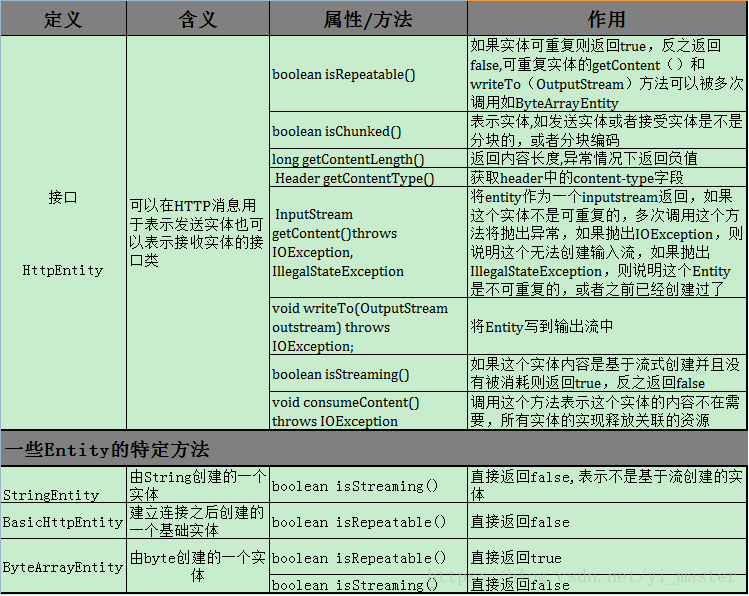
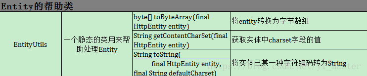

# HttpClient

接上面的基础知识，这篇主要介绍下Apache中的HttpClient，通过这篇你可以对DefaultHttpClient用到的各种知识有一个更好的了解

## 1）先解释下何为HttpClient 
HttpClient 是Apache Jakarta Common 下的子项目，他是一个第三方库，开发者可以使用这个库提供的API方便进行HTTP请求，HttpClient是基于HttpCore来实现的一个库； 
[HttpClient主页](http://hc.apache.org/httpcomponents-client-ga/index.html)

## 2）何为HttpCore 
HttpCore是一组Http传输组件，可以说HttpClient进行的Http请求都是由HttpCore来进行的； 
[HttpCore主页](http://hc.apache.org/httpcomponents-core-ga/)

## 3)HttpClient详解 
- 3.0)特征 
  - 基于java，实现了http 1.0和1.1 
  - 实现了所有的HTTP方法 
  - 支持HTTPS 
  - 支持COOKIE处理 
  - 支持HTTP1.1的响应缓存

- 3.1）范围 
  - 基于httpcore而实现的第三方库 
  - 基于阻塞I/0

- 3.2）部分样例代码 
 - 返回消息对头信息的处理，HttpClient提供取回，添加，移除，枚举头的方法
```java
HttpResponse response = new BasicHttpResponse(HttpVersion.HTTP_1_1, 
    HttpStatus.SC_OK, "OK");
response.addHeader("Set-Cookie", 
    "c1=a; path=/; domain=localhost");
response.addHeader("Set-Cookie", 
    "c2=b; path=\"/\", c3=c; domain=\"localhost\"");
Header h1 = response.getFirstHeader("Set-Cookie");
Header h2 = response.getLastHeader("Set-Cookie");
Header[] hs = response.getHeaders("Set-Cookie");
```

最有效的获取全部Header的方法是使用HeaderIterator 接口
```java
HttpResponse response = new BasicHttpResponse(HttpVersion.HTTP_1_1, 
    HttpStatus.SC_OK, "OK");
response.addHeader("Set-Cookie", 
    "c1=a; path=/; domain=localhost");
response.addHeader("Set-Cookie", 
    "c2=b; path=\"/\", c3=c; domain=\"localhost\"");
HeaderIterator it = response.headerIterator("Set-Cookie");
while (it.hasNext()) {
    System.out.println(it.next());
}
```

在使用HeaderIterator接口的时候，我们也可以通过HeaderElement获取Header的key value值
```java
HttpResponse response = new BasicHttpResponse(HttpVersion.HTTP_1_1, 
    HttpStatus.SC_OK, "OK");
HeaderElementIterator it = new BasicHeaderElementIterator(
    response.headerIterator("Set-Cookie"));
while (it.hasNext()) {
    HeaderElement elem = it.nextElement(); 
    System.out.println(elem.getName() + " = " + elem.getValue());
    NameValuePair[] params = elem.getParameters();
    for (int i = 0; i < params.length; i++) {
        System.out.println(" " + params[i]);
    }
}
```

-终止请求只要调用

> HttpUriRequest#abort()

即可，该方法是线程安全的，调用之后会抛出InterruptedIOException

## 3.3）Http Entity实体 

Http Entity即可以表示请求里面的请求实体，也可以是响应中的响应实体，Http Entity可以分为如下几类 
- 1)代表底层流的基本实体：通常是在http报文中获取的实体。他只有一个空参的构造方法。刚创建时没有内容，长度为负值。需要通过两个方法，把值赋进去。 
- 2)自我包含的，可重复获得使用的实体 
- 3)流式不可以重复的实体

其中代表底层流的基本实体的类有 

- 1.1）BasicHttpEntity
```java
InputStream is = null;  
//BasicHttpEntity这类就是一个输入流的内容包装类，包装内容的相关的编码格式，长度等  
BasicHttpEntity entity = new BasicHttpEntity();  
//设置内容  
entity.setContent(is);  
//设置长度  
entity.setContentLength(is.available());  
```

其中代表自我包含的，可重复获得使用的实体类有 

- 2.1）ByteArrayEntity：从指定的字节数组中取出内容的实体
```java
 ByteArrayEntity entity = new ByteArrayEntity("内容".getBytes());  
 ByteArrayInputStream is = (ByteArrayInputStream) entity.getContent(); 
```
- 2.2）StringEntity：通过String创建的实体
```java
String content = "测试StringEntity";
StringEntity entity = new StringEntity(content);  
//创建带字符创参数和字符编码的  
StringEntity entity2 = new StringEntity(content, "UTF-8");
```

- 2.3)FileEntity:通过文件构建的Entity，参数传入文件和文件类型
```java
FileEntity entity = new FileEntity(new File(""), "application/java-achive");
```

其中代表是流式不可以重复的实体类有 

- 3.1)InputreamEntity:构造方法是InputStream 和内容长度，内容长度是输入流的长度
```java
InputStream is = null;  
//InputStreamEntity严格是对内容和长度相匹配的。用法和BasicHttpEntity类似  
InputStreamEntity entity = new InputStreamEntity(is, is.available()); 
```

综述：各种Entity，比如FileEntity，StringEntity等，这些都是实现了HttpEntity接口，同时实现自己的一些方法罢了；上面的实体的类型，如代表底层流的实体他们只是在构造上不同罢了，不同的创建方式决定这个Entity是不是可重用，是不是一块一块的等等；还有一些类如HttpEntityWrapper，BufferedHttpEntity，这些都是对各种Entity的包装；下图列明了各种Entity的含义

 

 

在我们使用实体之后，我们还需要对实体进行管理，在httpclient中，有一个EntityUtils的类，他是一个静态的对象用来我们处理Entity 
 

这个类在使用的时候，我们应该注意下，在Android使用的HttpClient中他没有consume方法，因此在使用完entity的时候，需要注意的entity的释放

- 释放资源 

正确释放系统资源，我们应该做到释放response本身和响应实体本身的流，关闭内容流和关闭响应的区别在于，前者会尝试通过消耗实体内容来保持底层连接的活动状态，而后者会立即关闭并丢弃连接。
```java
CloseableHttpClient httpclient = HttpClients.createDefault();
HttpGet httpget = new HttpGet("http://localhost/");
CloseableHttpResponse response = httpclient.execute(httpget);
try {
    HttpEntity entity = response.getEntity();
    if (entity != null) {
        InputStream instream = entity.getContent();
        try {
            // do something useful
        } finally {
            instream.close();
        }
    }
} finally {
    response.close();
}
```

而有的时候，我们可能需要不止一次阅读实体内容。 在这种情况下，实体内容必须以某种方式进行缓冲，无论是在内存中还是在磁盘上。 最简单的方法是用BufferedHttpEntity类包装原始实体。 这会导致原始实体的内容被读入内存缓冲区。
```java
CloseableHttpResponse response = <...>
HttpEntity entity = response.getEntity();
if (entity != null) {
    entity = new BufferedHttpEntity(entity);
}
```

- 3.4）HttpClient的线程安全 

建议使用同一个HttpClient的实例来确保线程安全

- 3.5）HttpContext 

这是一个Http请求上下文类，如果是同一个上下文，则两次请求间可以共享这个上线文保存的信息。有的同学会问，通一个httpclient本身就具备维护cookies的功能，为什么要用HttpContext？其实HttpContext的妙用就是在于`多个httpclient实例之间可以共享httpcontext`。

HttpContext和Map很相似，通过key值来完成多个会话之间的数据共享；通过HttpContext封装信息之后，如果代表一个逻辑相关的会话中的多个请求序列被同一个HttpContext实例执行，则请求之间会话上下文和状态信息可以自动传输。
```java
/*演示使用同一个httpcontext，设置请求参数，多个请求之间共享这个参数设置,即httpget1和httpget2共享了requestConfig，因为此处他们使用的是同一个context*/
CloseableHttpClient httpclient = HttpClients.createDefault();
RequestConfig requestConfig = RequestConfig.custom()
        .setSocketTimeout(1000)
        .setConnectTimeout(1000)
        .build();
HttpGet httpget1 = new HttpGet("http://localhost/1");
httpget1.setConfig(requestConfig);
CloseableHttpResponse response1 = httpclient.execute(httpget1, context);
try {
    HttpEntity entity1 = response1.getEntity();
} finally {
    response1.close();
}
HttpGet httpget2 = new HttpGet("http://localhost/2");
CloseableHttpResponse response2 = httpclient.execute(httpget2, context);
try {
    HttpEntity entity2 = response2.getEntity();
} finally {
    response2.close();
}
```
这里我们配置了请求参数，同理你也可以配置其他参数，如下
```java
        CloseableHttpClient httpClient = HttpClients.createDefault();
        try {
            List<NameValuePair> params = new ArrayList<NameValuePair>();
            params.add(new BasicNameValuePair("username", "**"));
            UrlEncodedFormEntity entity = new UrlEncodedFormEntity(params,"UTF-8");
            HttpPost httpPost = new HttpPost("url");
            httpPost.setEntity(entity);
            CloseableHttpResponse response = httpClient.execute(httpPost,context);
            HttpEntity responseEntity = response.getEntity();
        }
        finally {
            httpClient.close();
            response.close();
        }
        CloseableHttpClient httpClient2 = HttpClients.createDefault();
        try {
            HttpGet httpGet = new HttpGet("url");
            CloseableHttpResponse response = httpClient2.execute(httpGet,context);
            HttpEntity entity = response.getEntity();
        } finally {
            httpClient2.close();
            response.close();
        }
```

- 3.6）HTTP 拦截器 
这个拦截器可以设置在请求发送之前，也可以设置在获取到响应实体之后，在android中我们可以通过继承AbstractHttpClient类，并实现addRequestInterceptor和addResponseInterceptor两个方法实现目的
```java
public class Client extends DefaultHttpClient {

private static ClientConnectionManager mClientConnectionManager;

    public Client(Handler handler) {
        super(makeClientConnectionManager(), new BasicHttpParams());
        // gzip stream support，添加请求拦截
        addRequestInterceptor(new HttpRequestInterceptor() {
            public void process(final HttpRequest request, final HttpContext context)
                    throws HttpException, IOException {
                if (!request.containsHeader("Accept-Encoding")) {
                    request.addHeader("Accept-Encoding", "gzip");
                }
            }
        });
        //响应拦截
        addResponseInterceptor(new HttpResponseInterceptor() {
            public void process(final HttpResponse response, final HttpContext context)
                    throws HttpException, IOException {
                HttpEntity entity = response.getEntity();
                if (entity != null) {
                    Header ceheader = entity.getContentEncoding();
                    if (ceheader != null) {
                        HeaderElement[] codecs = ceheader.getElements();
                        if (codecs != null) {
                            for (int i = 0; i < codecs.length; i++) {
                                if (codecs[i].getName().equalsIgnoreCase("gzip")) {
                                    response.setEntity(new GzipDecompressingEntity(response.getEntity()));
                                    return;
                                }
                            }
                        }
                    }
                }
            }
        });
    }
}

static final ClientConnectionManager makeClientConnectionManager() {
        SchemeRegistry schemeRegistry = new SchemeRegistry();
        schemeRegistry.register(new Scheme("http", PlainSocketFactory.getSocketFactory(), 80));
        schemeRegistry.register(new Scheme("https", SSLSocketFactory.getSocketFactory(), 443));
        mClientConnectionManager = new ThreadSafeClientConnManager(new BasicHttpParams(), schemeRegistry);
        return mClientConnectionManager;
    }
```

- 3.7）HTTP的安全性和幂等性 
安全性仅指该方法的多次调用不会产生副作用，不涉及传统意义上的“安全”，这里的副作用是指资源状态。即，安全的方法不会修改资源状态，尽管多次调用的返回值可能不一样(被其他非安全方法修改过)。幂等性，是指该方法多次调用返回的效果(形式)一致，客户端可以重复调用并且期望同样的结果 


- 3.8）Http的异常恢复机制 
默认情况下，HttpClient会尝试从I / O异常中自动恢复。 默认的自动恢复机制仅限于少数已知安全的例外。 
  - 3.8.1）HttpClient不会尝试从任何逻辑或HTTP协议错误（从HttpException类派生的错误）中恢复。 
  - 3.8.2）HttpClient会自动重试那些被认为是幂等的方法。 
  - 3.8.3）当HTTP请求仍然被传送到目标服务器时（即请求没有完全传送到服务器），HttpClient会自动重试那些传送异常失败的方法。

我们可以使用如下代码进行异常恢复
```java
HttpRequestRetryHandler myRetryHandler = new HttpRequestRetryHandler() {

    public boolean retryRequest(
            IOException exception,
            int executionCount,
            HttpContext context) {
        if (executionCount >= 5) {
            // Do not retry if over max retry count
            return false;
        }
        if (exception instanceof InterruptedIOException) {
            // Timeout
            return false;
        }
        if (exception instanceof UnknownHostException) {
            // Unknown host
            return false;
        }
        if (exception instanceof ConnectTimeoutException) {
            // Connection refused
            return false;
        }
        if (exception instanceof SSLException) {
            // SSL handshake exception
            return false;
        }
        HttpClientContext clientContext = HttpClientContext.adapt(context);
        HttpRequest request = clientContext.getRequest();
        boolean idempotent = !(request instanceof HttpEntityEnclosingRequest);
        if (idempotent) {
            // Retry if the request is considered idempotent
            return true;
        }
        return false;
    }

};
CloseableHttpClient httpclient = HttpClients.custom()
        .setRetryHandler(myRetryHandler)
        .build();
```

同时我们可以使用StandardHttpRequestRetryHandler替代默认的HttpRequestRetryHandler，以便将那些被RFC-2616定义为幂等的请求方法视为安全自动重试：GET，HEAD，PUT，DELETE，OPTIONS和TRACE

--------------------- 
作者：yi_master 
来源：CSDN 
原文：https://blog.csdn.net/yi_master/article/details/80361809 
版权声明：本文为博主原创文章，转载请附上博文链接！